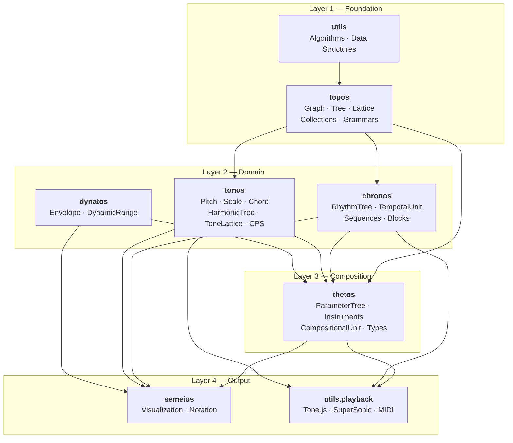

# Klotho Architecture Overview

> **Klotho** (from Ancient Greek *κλωθώ*, "to spin") is an open-source
> computer-assisted composition toolkit in Python. It models musical
> structures as graph-theoretic objects—trees, lattices, and
> collections—then layers temporal, tonal, dynamic, and parametric
> semantics on top to produce playable, visualizable compositions.

## Package at a Glance

| Field | Value |
|---|---|
| **PyPI name** | `klotho-cac` |
| **Python** | ≥ 3.11 |
| **License** | CC-BY-SA-4.0 |
| **Graph backend** | RustworkX (`rx`) |
| **Version** | see `klotho/__init__.py` |

---

## Layered Architecture

Klotho is organized into four conceptual layers.  Each layer depends
only on the layers beneath it.



### Layer 1 — Foundation (`topos`, `utils`)

Abstract mathematical and structural primitives with no musical
semantics. `Graph`, `Tree`, `Lattice`, collection types (`Pattern`,
`CombinationSet`, `PartitionSet`), formal grammars, and pure-math
algorithms (prime factorization, cost matrices, graph traversals).

### Layer 2 — Domain (`chronos`, `tonos`, `dynatos`)

Musical domains built on topos structures:

- **chronos** — time and rhythm.  `RhythmTree` extends `Tree`.
- **tonos** — pitch and harmony.  `HarmonicTree` extends `Tree`;
  `ToneLattice` extends `Lattice`; `CombinationProductSet` extends
  `Graph`.
- **dynatos** — dynamics and envelopes (standalone; no graph
  inheritance).

### Layer 3 — Composition (`thetos`)

Bridges every domain layer into a unified composition object.
`ParameterTree` (extends `Tree`) mirrors a `RhythmTree` and stores
per-node musical parameters.  `CompositionalUnit` (extends
`TemporalUnit`) wires a `ParameterTree` to a rhythm, yielding
`Parametron` events that carry both temporal and parametric data.
Instrument definitions (`SynthDefInstrument`, `MidiInstrument`,
`ToneInstrument`) live here.  Typed unit wrappers (`frequency`, `midi`,
`amplitude`, etc.) ensure dimensional correctness.

### Layer 4 — Output (`semeios`, `utils.playback`)

Rendering and display.  `semeios` dispatches to SVG/Plotly/Three.js
renderers for visualization and provides `KlothoPlot` with integrated
animation and audio.  `utils.playback` converts Klotho objects to event
payloads for two browser-based audio engines (Tone.js, SuperSonic) and
supports MIDI file export.

---

## Subpackage Summary

| Subpackage | Greek root | Domain | Key classes |
|---|---|---|---|
| `topos` | τόπος — "place" | Abstract structure | `Graph`, `Tree`, `Lattice`, `Group`, `Pattern`, `CombinationSet`, `PartitionSet`, `Sieve`, `GenCol` |
| `chronos` | χρόνος — "time" | Rhythm & time | `RhythmTree`, `Meas`, `RhythmPair`, `TemporalUnit`, `TemporalUnitSequence`, `TemporalBlock`, `Chronon` |
| `tonos` | τόνος — "tone" | Pitch & harmony | `Pitch`, `Scale`, `Chord`, `Voicing`, `ChordSequence`, `Contour`, `HarmonicTree`, `Spectrum`, `ToneLattice`, `CombinationProductSet`, `MasterSet` |
| `dynatos` | δυνατός — "powerful" | Dynamics & expression | `Dynamic`, `DynamicRange`, `Envelope` |
| `thetos` | θέτος — "placed" | Composition & params | `ParameterTree`, `ParameterField`, `CompositionalUnit`, `Parametron`, `Instrument`, `SynthDefInstrument`, `MidiInstrument`, `ToneInstrument`, `Unit` subclasses |
| `semeios` | σημεῖον — "sign" | Visualization & notation | `plot()`, `KlothoPlot`, `Scheduler` |
| `utils` | — | Shared utilities | algorithms, data structures, playback engines |

---

## Domain Abbreviations

These short aliases appear frequently in code and discussion:

| Abbreviation | Full name | Subpackage |
|---|---|---|
| **RT** | RhythmTree | chronos |
| **RP** | RhythmPair | chronos |
| **UT** | TemporalUnit | chronos |
| **UTS** | TemporalUnitSequence | chronos |
| **BT** | TemporalBlock | chronos |
| **HT** | HarmonicTree | tonos |
| **TL** | ToneLattice | tonos |
| **CPS** | CombinationProductSet | tonos |
| **MS** | MasterSet | tonos |
| **PT** | ParameterTree | thetos |
| **PF** | ParameterField | thetos |
| **UC** | CompositionalUnit | thetos |
| **PS** | PartitionSet | topos |
| **PC** | PitchCollection | tonos |
| **ST** | ScaleTree | *(planned; not yet implemented)* |

> Some abbreviations (`UT`, `UC`) derive from French terminology—this is
> intentional and consistent with the IRCAM tradition.

---

## Module Count

~120 Python modules across 7 main subpackages, organized in the tree
shown below.

```
klotho/
├── __init__.py
├── chronos/          (4 sub-packages, 11 modules)
├── dynatos/          (2 sub-packages,  7 modules)
├── semeios/          (2 sub-packages, 18 modules)
├── thetos/           (3 sub-packages, 13 modules)
├── tonos/            (5 sub-packages, 19 modules)
├── topos/            (3 sub-packages, 10 modules)
└── utils/            (3 sub-packages, 17 modules)
```

---

## Key External Dependencies

| Dependency | Role |
|---|---|
| **rustworkx** | High-performance graph backend (Rust-based) |
| **numpy** | Numeric arrays, unit wrappers |
| **sympy** | Symbolic math, prime tests |
| **scipy** | Interpolation, distance metrics, dynamics scaling |
| **pandas** | Tabular metadata (spectra, lattice meta) |
| **matplotlib** | Static 2-D plots |
| **plotly** | Interactive 2-D/3-D plots |
| **networkx** | Graph layout algorithms (spring, spectral) |
| **scikit-learn** | MDS / SpectralEmbedding for CPS layouts |
| **mido** | MIDI file I/O |
| **IPython** | Jupyter HTML widgets, `display` |
| **tabulate** | Pretty-printed ASCII tables |

---

## Architecture Documents Index

### Subsystem Reference

| Document | Scope |
|---|---|
| [01_TOPOS.md](01_TOPOS.md) | Foundation: `Graph`, `Tree`, `Lattice`, collections, grammars |
| [02_CHRONOS.md](02_CHRONOS.md) | Time & rhythm: `RhythmTree`, `TemporalUnit`, sequences, blocks |
| [03_TONOS.md](03_TONOS.md) | Pitch & harmony: pitch collections, `HarmonicTree`, `ToneLattice`, CPS |
| [04_DYNATOS.md](04_DYNATOS.md) | Dynamics & expression: `Dynamic`, `Envelope`, amplitude utilities |
| [05_THETOS.md](05_THETOS.md) | Composition: `ParameterTree`, instruments, `CompositionalUnit`, type system |
| [06_SEMEIOS.md](06_SEMEIOS.md) | Visualization: plot dispatch, SVG/Three.js renderers, animation |
| [07_PLAYBACK.md](07_PLAYBACK.md) | Audio: Tone.js engine, SuperSonic engine, MIDI export |
| [09_UTILS.md](09_UTILS.md) | Shared utilities: algorithms, data structures, constants |

### Guides and Cross-Cutting

| Document | Scope |
|---|---|
| [08_DESIGN_PATTERNS.md](08_DESIGN_PATTERNS.md) | Cross-cutting patterns: mutation policy, caching, factories, naming |
| [10_WALKTHROUGH.md](10_WALKTHROUGH.md) | End-to-end walkthrough: tracing a composition through every layer |
| [11_PITCH_COLLECTIONS.md](11_PITCH_COLLECTIONS.md) | Pitch collection decision guide: choosing the right class |
| [12_LIFECYCLE.md](12_LIFECYCLE.md) | Lifecycle and mutation state diagrams for all major objects |
| [13_IMPORT_GRAPH.md](13_IMPORT_GRAPH.md) | Module-level import dependency graph with analysis |
