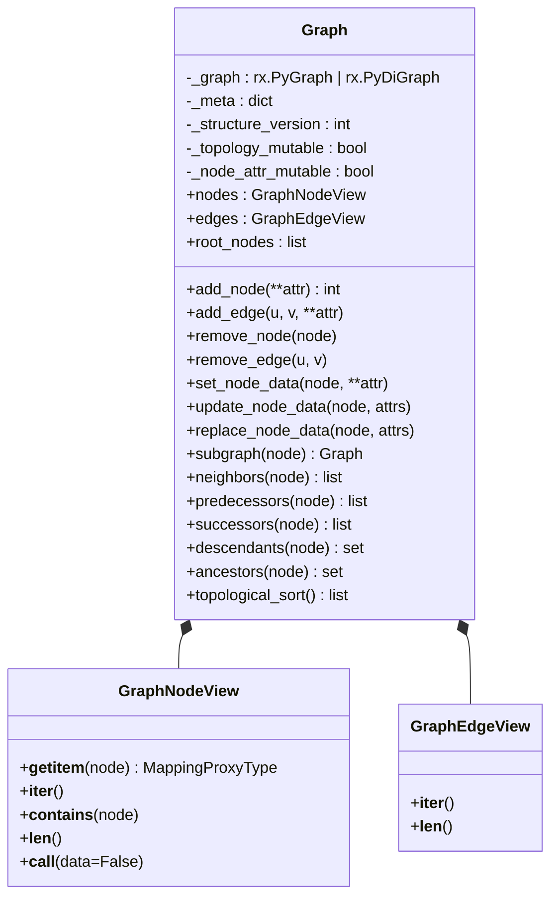
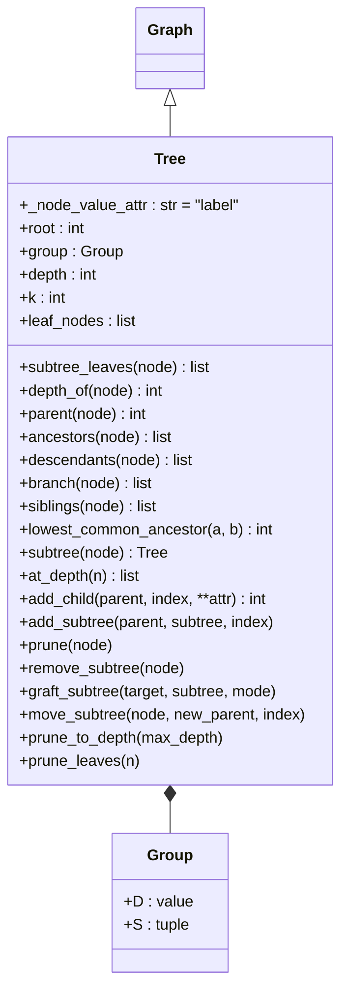
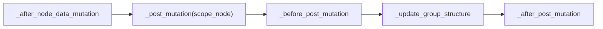
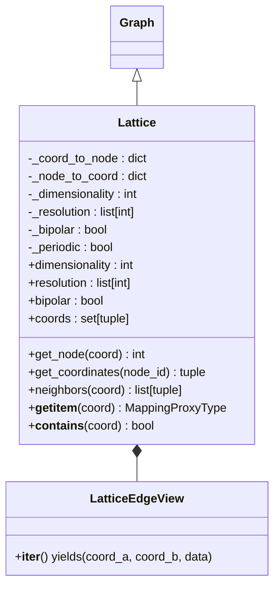
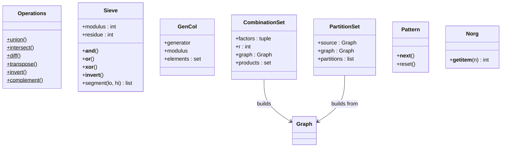
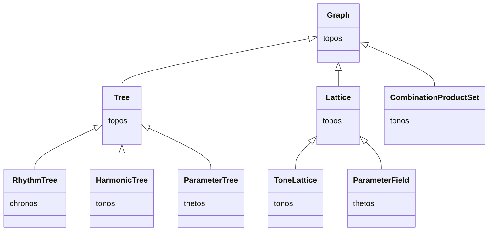

# Topos — Foundation Layer

> *"The name topos has been chosen to communicate a double message…
> to unite philosophical insight with mathematical explicitness."*
> — after Guerino Mazzola, *The Topos of Music*

`klotho.topos` provides the abstract mathematical and structural
primitives on which every other subpackage is built.  Nothing in this
layer has musical semantics—it is pure graph theory, set theory, and
formal grammars.

---

## Module Map

```
topos/
├── __init__.py
├── collections/
│   ├── patterns.py        # permutations, autoref, chaining
│   ├── sequences.py       # Nørgård infinity series, Pattern iterator
│   └── sets.py            # Operations, Sieve, GenCol, CombinationSet, PartitionSet
├── formal_grammars/
│   ├── alphabets.py       # symbolic alphabet enums
│   └── grammars.py        # context-free grammar engine
└── graphs/
    ├── graphs.py          # Graph base class (RustworkX)
    ├── trees/
    │   ├── trees.py       # Tree (rooted DAG)
    │   └── group.py       # Group — immutable (D, S) tuple
    └── lattices/
        ├── lattices.py    # Lattice (n-dimensional grid)
        └── algorithms.py  # lattice-specific algorithms
```

---

## 1. Graph

**File:** `topos/graphs/graphs.py`  
**Backend:** `rustworkx.PyGraph` (undirected) or `rustworkx.PyDiGraph` (directed)

`Graph` is the root class for all graph-based structures in Klotho.
It wraps a RustworkX graph with a consistent Python API, read-only
node/edge views, and a disciplined mutation protocol.

### Class Diagram



### Factory Methods

| Method | Description |
|---|---|
| `from_rustworkx(rx_graph)` | Wrap an existing RustworkX graph |
| `from_networkx(nx_graph)` | Convert from NetworkX |
| `from_nodes_edges(nodes, edges)` | Build from explicit lists |
| `from_edges(edges)` | Infer nodes from edge list |
| `from_cost_matrix(matrix)` | Complete weighted graph |
| `empty_graph(n)` | *n* isolated nodes |
| `path_graph(n)` | Linear chain |
| `cycle_graph(n)` | Ring |
| `star_graph(n)` | Hub-and-spoke |
| `random_graph(n, p)` | Erdős–Rényi random |
| `grid_graph(dims)` | *n*-dimensional grid |
| `complete_graph(n)` | Fully connected |
| `directed()` / `digraph()` | Empty directed graph |

### Mutation Protocol

All node-data writes go through a template-method pipeline:

```mermaid
flowchart LR
    A["set_node_data(node, **attr)"] --> B["_apply_node_data_mutation"]
    B --> C["_normalize_node_attrs"]
    C --> D["_validate_node_attrs"]
    D --> E["_resolve_data_update_scope"]
    E --> F["_before_node_data_mutation"]
    F --> G["write to rx graph"]
    G --> H["_invalidate_caches"]
    H --> I["_after_node_data_mutation"]
```



Each hook is a no-op in `Graph` and overridden by subclasses:

- **`_normalize_node_attrs`** — coerce or rename attributes (e.g.
  `RhythmTree` rejects `'label'`, requires `'proportion'`).
- **`_validate_node_attrs`** — enforce mutable-key whitelist.
- **`_resolve_data_update_scope`** — determine which subtree needs
  recomputation.
- **`_before_node_data_mutation`** / **`_after_node_data_mutation`** —
  pre/post hooks for derived-field recomputation.

### Mutability Policy

```python
graph._set_mutability_policy(
    topology_mutable=True,    # can add/remove nodes and edges
    node_attr_mutable=True    # can modify node data
)
```

- `Tree` allows both during construction, then restricts topology
  mutation to its own structural API (`add_child`, `add_subtree`, etc.).
- `Lattice` locks **both** topology and node attributes after
  construction (fully immutable).

### Cache Invalidation

- `_structure_version` is an integer counter bumped on every structural
  change.
- `@lru_cache` decorates `descendants`, `ancestors`, `successors`,
  `predecessors`; caches are keyed on `_structure_version`.
- `_invalidate_caches()` clears these caches and is called
  automatically by the mutation pipeline.

---

## 2. Tree

**File:** `topos/graphs/trees/trees.py`  
**Inherits:** `Graph` (always directed)

A rooted directed acyclic tree built from nested `(D, S)` tuple
notation, where `D` is a value and `S` is a tuple of children.

### Class Diagram



### Construction from Nested Tuples

Trees are built from a recursive `(D, S)` notation:

```python
Tree(root=4, children=(1, (2, (1, 1)), 1))
```

This produces:

```
       4
      /|\
     1  2  1
       / \
      1   1
```

During `__init__`, `_build_tree` recursively walks the tuple, calling
`add_node` and `add_edge` on the underlying graph.  Once construction
completes, `_building_tree` is set to `False` and raw `add_node` /
`add_edge` raise `NotImplementedError` — structural changes must go
through `add_child`, `add_subtree`, `prune`, etc.

### `_node_value_attr`

Subclasses override this class attribute to use a domain-specific name:

| Subclass | `_node_value_attr` |
|---|---|
| `Tree` | `'label'` |
| `RhythmTree` | `'proportion'` |
| `HarmonicTree` | `'factor'` |
| `ParameterTree` | `'label'` (removed post-init) |

### Post-Mutation Recomputation

When node data changes, `Tree._after_node_data_mutation` triggers:



Subclasses hook into `_after_post_mutation` to recompute derived fields
(e.g. `RhythmTree._evaluate()` recalculates metric durations).

### `from_tree_structure`

A key factory: creates a new tree instance with the **same topology**
as a source tree but **empty node data**.  Used by `ParameterTree` to
clone a `RhythmTree`'s shape.

---

## 3. Group

**File:** `topos/graphs/trees/group.py`  
**Inherits:** `tuple` (immutable)

An immutable `(D, S)` pair representing a duration and its
subdivisions.  Provides `.D` and `.S` properties plus helper functions:

| Function | Purpose |
|---|---|
| `factor_children` | Multiply all children by a factor |
| `refactor_children` | Normalize children to a new sum |
| `get_signs` | Extract the sign of each child |
| `get_abs` | Absolute value of each child |
| `rotate_children` | Cyclic rotation of subdivision list |
| `format_subdivisions` | Pretty-print a subdivision tuple |

---

## 4. Lattice

**File:** `topos/graphs/lattices/lattices.py`  
**Inherits:** `Graph` (undirected)

An *n*-dimensional grid graph with coordinate-based access.

### Class Diagram



### Key Properties

- **`dimensionality`** — number of axes.
- **`resolution`** — points per axis (int or list).
- **`bipolar`** — if `True`, coordinates range `[-res, +res]`;
  otherwise `[0, res]`.
- **`periodic`** — wraps edges at boundaries (torus topology).

### Coordinate ↔ Node Mapping

Externally, lattice nodes are addressed by coordinate tuples
`(x, y, ...)`.  Internally, each coordinate maps to an integer node ID
in the RustworkX graph.  The `Lattice` acts as an adapter between these
two addressing schemes.

### Immutability

After construction, a `Lattice` sets:

```python
self._set_mutability_policy(topology_mutable=False, node_attr_mutable=False)
```

Neither topology nor node data can be changed.  Subclasses that need
writable node data (`ParameterField`) can relax this.

---

## 5. Collections

### 5.1 `Operations` (static set operations)

Pure static methods for mathematical set operations:

`union`, `intersect`, `diff`, `symm_diff`, `is_subset`, `is_superset`,
`invert`, `transpose`, `complement`, `congruent`, `intervals`,
`interval_vector`.

### 5.2 `Sieve`

Implements Xenakis-style sieves — modular-arithmetic pitch/rhythm
filters composed with logical operations (`&`, `|`, `^`, `~`).

### 5.3 `GenCol`

Generated collection: multiplicative construction from a generator
and modulus.

### 5.4 `CombinationSet`

Generates all *r*-combinations from a set of factors, builds a
`Graph` of relationships between combination products.

### 5.5 `PartitionSet`

Generates integer partitions; builds a `Graph` from another `Graph`
to explore partitioning structure.

### 5.6 `Pattern`

Cyclical iterator over nested iterables.  Flattens arbitrarily deep
nesting and loops forever:

```python
p = Pattern([1, [2, 3], 4])
[next(p) for _ in range(6)]  # [1, 2, 3, 4, 1, 2]
```

### 5.7 `Norg` (Nørgård infinity series)

Per Nørgård's self-similar integer sequence, used as a pitch or
rhythm generator.

### Collection Relationships Diagram



---

## 6. Formal Grammars

### `grammars.py`

A context-free grammar engine:

| Function | Purpose |
|---|---|
| `rand_rules(alphabet, max_rhs)` | Generate random production rules |
| `constrain_rules(rules, constraints)` | Filter rules by constraints |
| `apply_rules(string, rules)` | One step of rule application |
| `gen_str(axiom, rules, n)` | Generate string after *n* derivation steps |

### `alphabets.py`

Enum-based symbolic alphabets for grammar terminals:

- `ANCIENT_GREEK`
- `RUNIC`
- `LOGOGRAPHIC`
- `CUNEIFORM`
- `MATHEMATICAL`

Uses `DirectValueEnumMeta` for direct member-value access.

---

## Inheritance Summary



All domain-specific graph structures trace back to `Graph` through
either `Tree` or `Lattice`, inheriting the mutation protocol, caching,
and view system.
