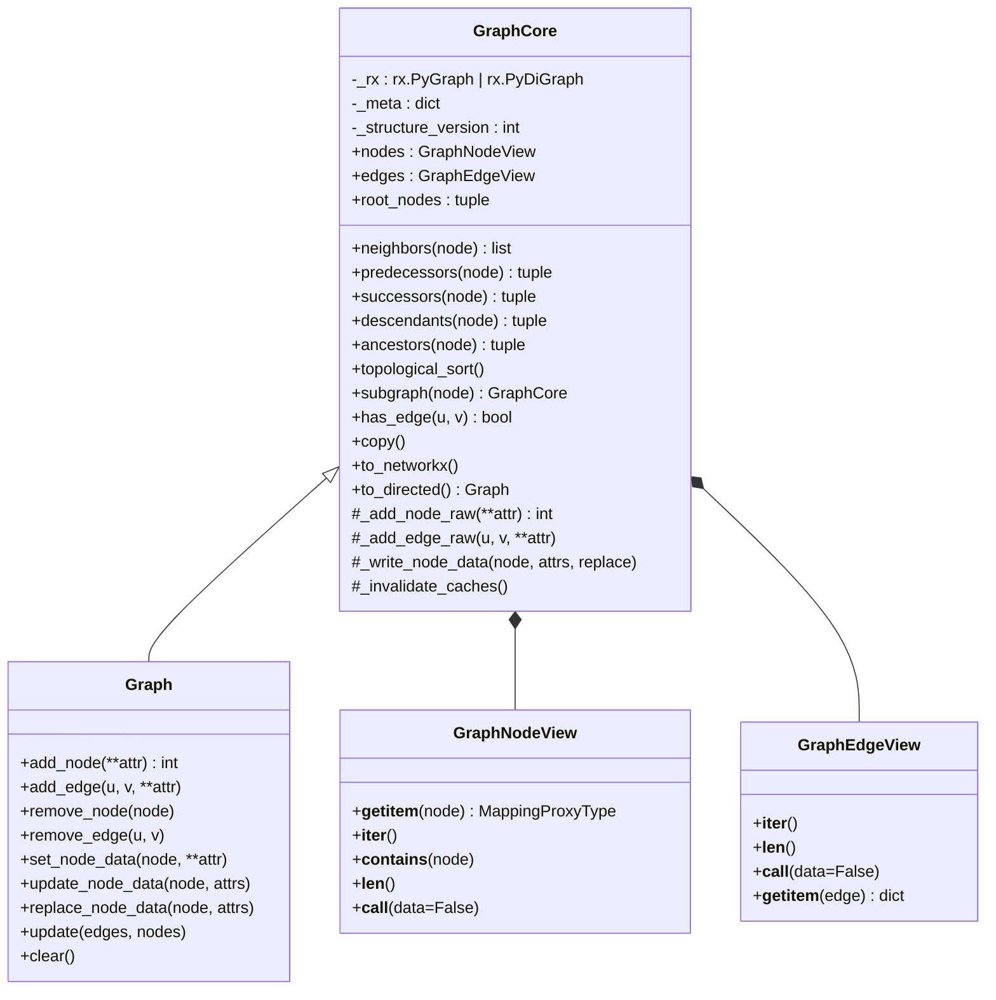
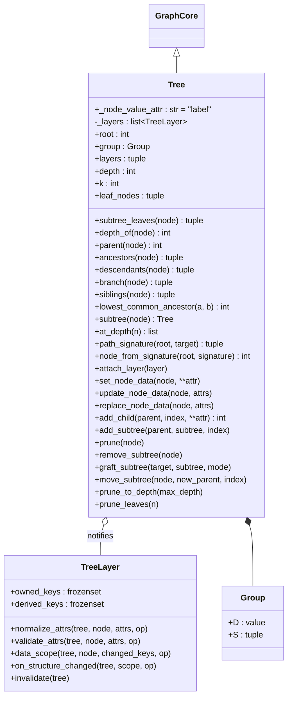
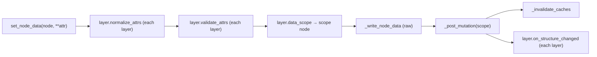
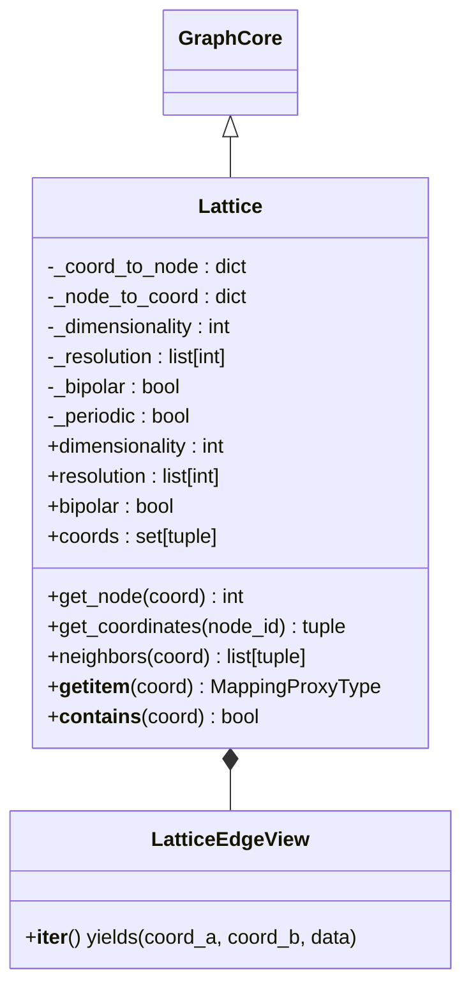
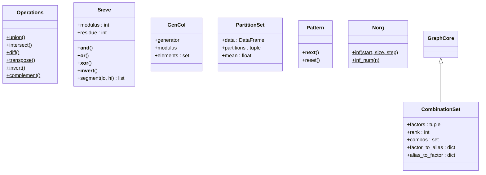
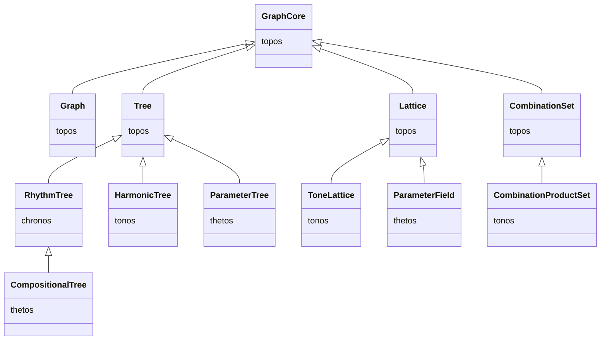

# Topos — Foundation Layer

> *"The name topos has been chosen to communicate a double message…
> to unite philosophical insight with mathematical explicitness."*
> — after Guerino Mazzola, *The Topos of Music*

`klotho.topos` provides the abstract mathematical and structural
primitives on which every other subpackage is built.  Nothing in this
layer has musical semantics—it is pure graph theory, set theory, and
formal grammars.

---

## Module Map

```
topos/
├── __init__.py
├── types.py               # abstract structural types
├── collections/
│   ├── _pattern.py        # Pattern/Cyclic internals
│   ├── patterns.py        # permutations, autoref, chaining
│   ├── sequences.py       # Nørgård infinity series, Pattern iterator
│   └── sets.py            # Operations, Sieve, GenCol, CombinationSet, PartitionSet
├── formal_grammars/
│   └── grammars.py        # context-free grammar engine
└── graphs/
    ├── core.py            # GraphCore — read-only base (RustworkX) + views
    ├── graphs.py          # Graph — mutable general-purpose graph
    ├── generators.py      # module-level topology generators
    ├── trees/
    │   ├── trees.py       # Tree (rooted DAG, layer-aware)
    │   ├── layers.py      # TreeLayer protocol
    │   └── group.py       # Group — immutable (D, S) tuple
    └── lattices/
        ├── lattices.py    # Lattice (n-dimensional grid)
        └── algorithms.py  # lattice-specific algorithms
```

---

## 1. GraphCore and Graph

**Files:** `topos/graphs/core.py` (`GraphCore`), `topos/graphs/graphs.py` (`Graph`)  
**Backend:** `rustworkx.PyGraph` (undirected) or `rustworkx.PyDiGraph` (directed)

`GraphCore` is the **read-only root** of every graph-shaped structure in
Klotho.  It wraps a RustworkX graph (stored as `self._rx`) and exposes
views, traversal, and query operations only — no public mutators.
`Graph(GraphCore)` adds free-form topology and node-data mutation for
general-purpose use.  Everything else (`Tree`, `Lattice`,
`CombinationSet`, …) inherits `GraphCore` directly and exposes either a
disciplined subset of mutators or none at all.

**Immutability is the absence of mutators**, not a runtime flag: an
immutable class like `Lattice` simply never defines `add_node`, so
calling it raises a plain `AttributeError`.

### Class Diagram



### Raw Write Primitives

Subclasses and internal code perform sanctioned writes through the
protected `_*_raw` primitives on `GraphCore` (`_add_node_raw`,
`_add_edge_raw`, `_remove_node_raw`, `_remove_edge_raw`,
`_write_node_data`).  These write directly to `self._rx` and invalidate
caches, but apply **no validation or recomputation policy** — policy
lives in the public mutators of each subclass (`Graph` passes writes
straight through; `Tree` routes them through attached layers, see §2).

### Constructors on `Graph`

| Classmethod | Description |
|---|---|
| `from_rustworkx(rx_graph)` | Wrap an existing RustworkX graph |
| `from_networkx(nx_graph)` | Convert from NetworkX |
| `from_nodes_edges(nodes, edges)` | Build from explicit lists |
| `from_edges(edges)` | Infer nodes from edge list |
| `empty_graph(n)` | *n* isolated nodes |
| `directed()` / `digraph()` | Empty directed graph |

### Topology Generators (module-level)

Topology builders are **module-level functions** in
`topos/graphs/generators.py`, re-exported from `klotho.topos.graphs`.
They were moved out of `Graph` so they are not inherited (and broken)
by subclasses such as `Tree` or `RhythmTree`.  Each returns a mutable
`Graph`:

| Function | Description |
|---|---|
| `path_graph(n_nodes)` | Linear chain |
| `cycle_graph(n_nodes)` | Ring |
| `star_graph(n_nodes, center=0)` | Hub-and-spoke |
| `random_graph(n_nodes, p=0.3)` | Erdős–Rényi random |
| `complete_graph(n_nodes)` | Fully connected |
| `grid_graph(dims, periodic=False)` | *n*-dimensional grid |
| `from_cost_matrix(matrix, items)` | Complete weighted graph |

```python
from klotho.topos.graphs import complete_graph
g = complete_graph(5)          # a mutable Graph
```

### Node-Data Access Is Read-Only

`graph.nodes[n]` and `graph[n]` return a `MappingProxyType` — direct
writes like `graph.nodes[n]['key'] = value` raise `TypeError`.  All
node-data mutation goes through the sanctioned methods
(`set_node_data`, `update_node_data`, `replace_node_data`).

### Cache Invalidation

- `_structure_version` is an integer counter bumped on every structural
  change.
- `@lru_cache` decorates `descendants`, `ancestors`, `successors`,
  `predecessors`; the cached methods read `_structure_version` so stale
  entries are never returned.
- `_invalidate_caches()` clears these caches and is called
  automatically by every raw write primitive.

---

## 2. Tree

**File:** `topos/graphs/trees/trees.py`  
**Inherits:** `GraphCore` (always directed)

A rooted directed acyclic tree built from nested `(D, S)` tuple
notation, where `D` is a value and `S` is a tuple of children.

`Tree` does **not** inherit `Graph`, so it never exposes free-form
`add_node`/`add_edge`.  Structural changes go exclusively through its
sanctioned mutators (`add_child`, `add_subtree`, `prune`,
`graft_subtree`, `move_subtree`, …), and node-data writes are routed
through attached **layers** (see below).

### Class Diagram



### Construction from Nested Tuples

Trees are built from a recursive `(D, S)` notation:

```python
Tree(root=4, children=(1, (2, (1, 1)), 1))
```

This produces:

```
       4
      /|\
     1  2  1
       / \
      1   1
```

During `__init__`, `_build_tree` recursively walks the tuple, using the
protected raw primitives (`_add_node_raw` / `_add_edge_raw`) inherited
from `GraphCore`.  There is no public `add_node`/`add_edge` on `Tree`
at any point — post-construction structural changes must go through
`add_child`, `add_subtree`, `prune`, etc., which always end in
`_post_mutation`.

### Tree Layers

Domain behavior (rhythm, harmony, parameters) lives in `TreeLayer`
objects (`topos/graphs/trees/layers.py`) attached to a tree, not in
subclass method overrides.  A layer owns a set of writable node-data
keys (`owned_keys`), declares the keys it computes (`derived_keys`),
and implements recompute rules.  Subclasses attach their layers in the
`_init_layers` hook:

- **`RhythmLayer`** (chronos) — owns `proportion`/`tied`, derives
  `metric_duration`/`metric_onset`.
- **`HarmonicLayer`** (tonos) — owns `factor`, derives
  `multiple`/`harmonic`/`ratio`.
- **`ParameterLayer`** (thetos) — owns pfield/mfield overrides,
  instruments, and the effective-value cache.

Multiple layers can be attached to a single tree:
`CompositionalTree` carries **both** a rhythm layer and a parameter
layer on one topology, which is how a `CompositionalUnit` avoids
mirroring two trees.

### Node-Data Write Pipeline

Every node-data write (`set_node_data`, `update_node_data`,
`replace_node_data`) is routed through the attached layers:



Structural mutators (`add_child`, `prune`, …) skip the data hooks but
also end in `_post_mutation`, so layers always get a chance to
recompute derived fields (e.g. `RhythmLayer` re-runs the rhythm-tree
evaluation for the affected scope).

### `_node_value_attr`

Subclasses override this class attribute to use a domain-specific name:

| Subclass | `_node_value_attr` |
|---|---|
| `Tree` | `'label'` |
| `RhythmTree` | `'proportion'` |
| `HarmonicTree` | `'factor'` |
| `ParameterTree` | `'label'` (popped from node data after init) |

### `from_tree_structure`

A key factory: creates a new tree instance with the **same topology**
as a source tree but **empty node data**, then re-runs `_init_layers`.
Used to derive parameter-tree snapshots from a rhythm-bearing tree's
shape.

---

## 3. Group

**File:** `topos/graphs/trees/group.py`  
**Inherits:** `tuple` (immutable)

An immutable `(D, S)` pair representing a duration and its
subdivisions.  Provides `.D` and `.S` properties plus helper functions:

| Function | Purpose |
|---|---|
| `factor_children` | Multiply all children by a factor |
| `refactor_children` | Normalize children to a new sum |
| `get_signs` | Extract the sign of each child |
| `get_abs` | Absolute value of each child |
| `rotate_children` | Cyclic rotation of subdivision list |
| `format_subdivisions` | Pretty-print a subdivision tuple |

---

## 4. Lattice

**File:** `topos/graphs/lattices/lattices.py`  
**Inherits:** `GraphCore` (undirected)

An *n*-dimensional grid graph with coordinate-based access.  The grid
itself is produced by the `grid_graph` generator during construction.

### Class Diagram



### Key Properties

- **`dimensionality`** — number of axes.
- **`resolution`** — points per axis (int or list).
- **`bipolar`** — if `True`, coordinates range `[-res, +res]`;
  otherwise `[0, res]`.
- **`periodic`** — wraps edges at boundaries (torus topology).

### Coordinate ↔ Node Mapping

Externally, lattice nodes are addressed by coordinate tuples
`(x, y, ...)`.  Internally, each coordinate maps to an integer node ID
in the RustworkX graph.  The `Lattice` acts as an adapter between these
two addressing schemes.

### Immutability

`Lattice` builds its graph during construction and then exposes **no
mutators** — since it inherits only `GraphCore`, there is no
`add_node`/`set_node_data` to call, and attempting one raises a plain
`AttributeError`.  Subclasses that need writable node data
(`ParameterField`) add their own sanctioned write methods (e.g.
`set_field_value`) on top.

---

## 5. Collections

### 5.1 `Operations` (static set operations)

Pure static methods for mathematical set operations:

`union`, `intersect`, `diff`, `symm_diff`, `is_subset`, `is_superset`,
`invert`, `transpose`, `complement`, `congruent`, `intervals`,
`interval_vector`.

### 5.2 `Sieve`

Implements Xenakis-style sieves — modular-arithmetic pitch/rhythm
filters composed with logical operations (`&`, `|`, `^`, `~`).

### 5.3 `GenCol`

Generated collection: multiplicative construction from a generator
and modulus.

### 5.4 `CombinationSet`

**Inherits:** `GraphCore`

Generates all *r*-combinations from a set of factors and **is itself a
graph**: a complete graph with combinations as nodes, built during
construction into the backing rustworkx handle.  There is no separate
`.graph` property — query the object directly (`cs.nodes`,
`cs.edges`, …).  Key properties: `factors`, `rank`, `combos`,
`factor_to_alias`, `alias_to_factor`.  As with all `GraphCore`-only
classes, it exposes no mutators.  `CombinationProductSet` (tonos)
extends it.

### 5.5 `PartitionSet`

A plain (non-graph) class.  Generates all partitions of an integer *n*
into exactly *k* parts and computes structural features.  Key
properties: `data` (pandas DataFrame with `partition`, `unique_count`,
`span`, `variance` columns), `partitions`, `mean`.

### 5.6 `Pattern`

Cyclical iterator over nested iterables.  Flattens arbitrarily deep
nesting and loops forever:

```python
p = Pattern([1, [2, 3], 4])
[next(p) for _ in range(6)]  # [1, 2, 3, 4, 1, 2]
```

### 5.7 `Norg` (Nørgård infinity series)

Per Nørgård's self-similar integer sequence, used as a pitch or
rhythm generator.

### Collection Relationships Diagram



---

## 6. Formal Grammars

### `grammars.py`

A context-free grammar engine:

| Function | Purpose |
|---|---|
| `rand_rules(symbols, word_length_min=1, word_length_max=3)` | Generate random production rules |
| `constrain_rules(rules, constraints)` | Mutate rules to satisfy constraints |
| `apply_rules(rules={}, axiom='')` | One step of rule application |
| `gen_str(generations=0, axiom='', rules={}, display=False)` | Dict of strings, one per derivation step |

---

## Inheritance Summary



All domain-specific graph structures trace back to **`GraphCore`**
through `Tree`, `Lattice`, or `CombinationSet`, inheriting the views,
traversal/query API, and cache system.  Mutation is opt-in per class:
`Graph` for free-form graphs, `Tree` for structural mutators plus
layer-validated node data, and nothing at all for the immutable
classes.  (`CompositionalTree` additionally mixes in
`ParameterApiMixin` — see the thetos doc.)
