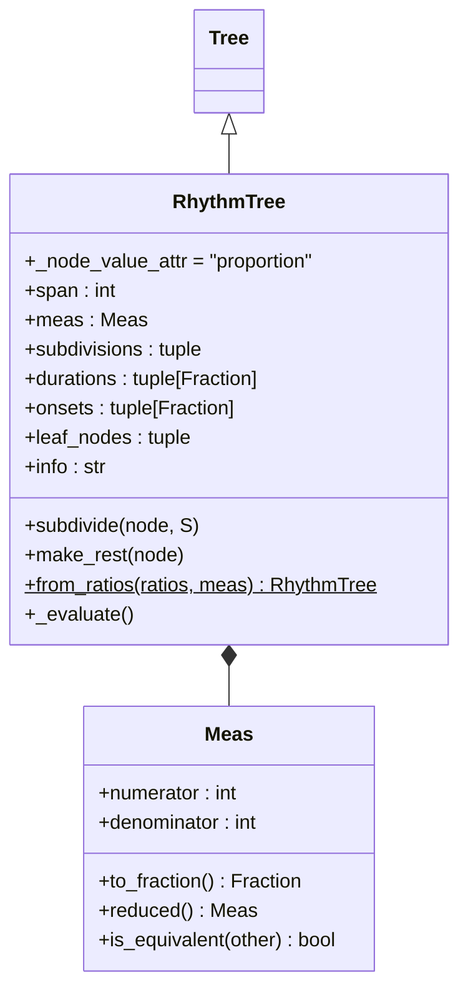
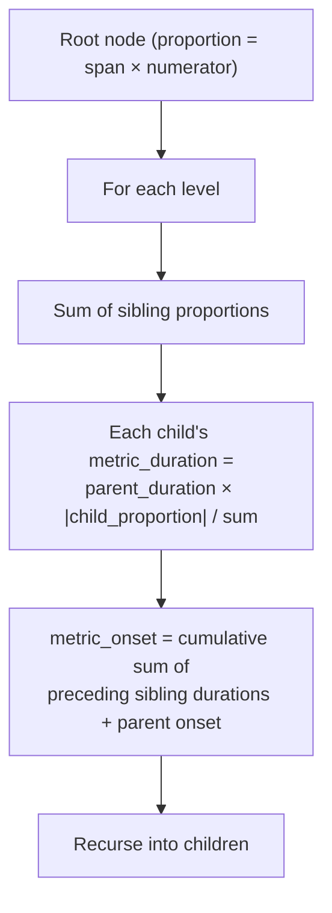
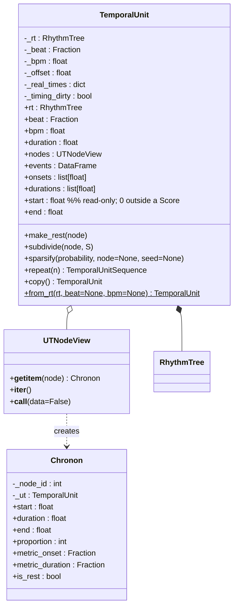
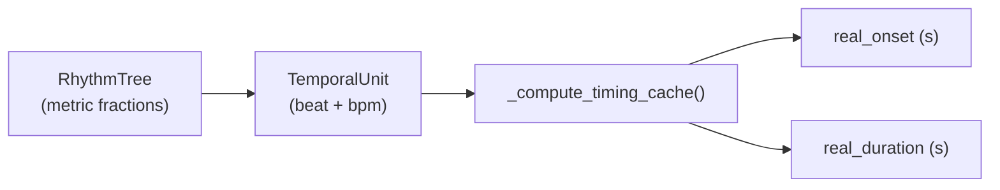
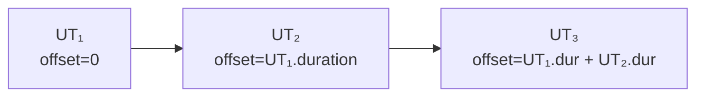
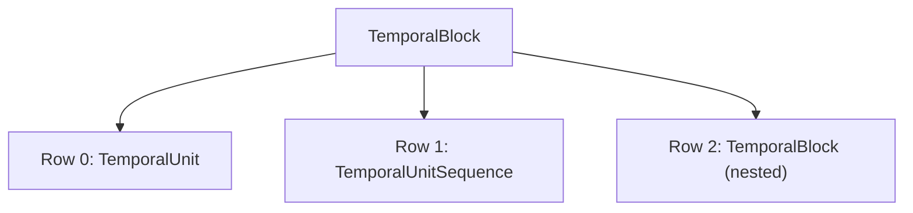
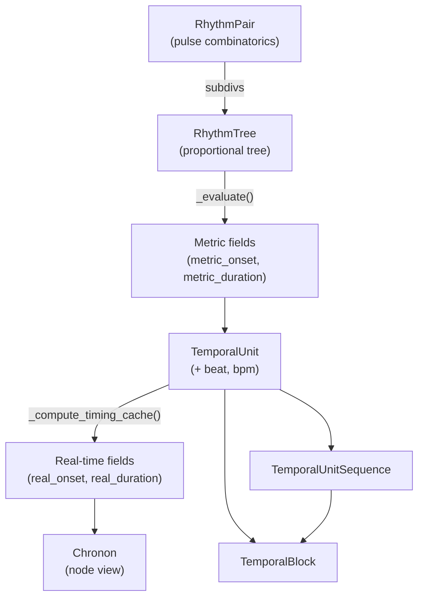

# Chronos — Time and Rhythm

> *χρόνος* (chronos) — "time."  In Greek mythology, Chronos personifies
> the endless passage of time and the cycles of creation and destruction.

`klotho.chronos` models musical time at three levels of abstraction:

1. **Proportional** — `RhythmTree`: a tree of integer proportions that
   defines relative durations within a time signature.
2. **Metric** — `Meas` and the metric fields on RT nodes: onset and
   duration expressed as fractions of a whole note.
3. **Real-time** — `TemporalUnit`: binds a `RhythmTree` to a tempo,
   producing onset times and durations in seconds.

---

## Module Map

```
chronos/
├── __init__.py
├── rhythm_pairs/
│   ├── __init__.py
│   └── rhythm_pair.py         # RhythmPair — pulse-grid combinatorics
├── rhythm_trees/
│   ├── __init__.py
│   ├── rhythm_tree.py         # RhythmTree(Tree)
│   ├── meas.py                # Meas — time signature
│   └── algorithms.py          # decomposition, auto-subdivision, complexity
├── temporal_units/
│   ├── __init__.py
│   ├── temporal.py            # TemporalUnit, TemporalUnitSequence, TemporalBlock, Chronon, selectors
│   └── algorithms.py          # decompose, modulate_tempo, modulate_tempus, convolve
├── types.py                   # typed units (MetricOnset, Bpm, …)
└── utils/
    ├── __init__.py
    ├── beat.py                # beat_duration, calc_onsets, cycles_to_frequency
    ├── tempo.py               # metric_modulation, tempo_for_duration, beat_for_duration
    └── time_conversion.py     # seconds_to_hmsms, hmsms_to_seconds, seconds_to_hmsf
```

---

## 1. RhythmTree

**File:** `chronos/rhythm_trees/rhythm_tree.py`  
**Inherits:** `Tree` (from `topos.graphs`)

### Class Diagram



### Construction

```python
rt = RhythmTree(
    span=1,            # number of measures
    meas='4/4',        # time signature
    subdivisions=(1, (2, (1, 1)), 1)   # proportional tree
)
```

Internally:

1. `meas` is parsed into a `Meas` object.
2. `span * meas.numerator` becomes the root's `proportion`.
3. `subdivisions` is recursively built into the tree via `Tree.__init__`.
4. The attached **`RhythmLayer`** (owning `proportion`/`tied`) runs
   `_evaluate()`, which walks the tree and computes `metric_duration`
   and `metric_onset` on every node.

### Node Data Model

Each node stores:

| Key | Type | Description |
|---|---|---|
| `proportion` | `int` | The proportional weight (negative = rest) |
| `metric_duration` | `Fraction` | Duration as fraction of whole note |
| `metric_onset` | `Fraction` | Onset as fraction of whole note |
| `tied` | `bool` | Whether tied to the next event |

Only `proportion` and `tied` are mutable (they are the
`RhythmLayer`'s owned keys); the metric fields are **derived** by
`_evaluate()` and recomputed automatically after any proportion change
via the layer's `on_structure_changed` hook, scoped to the changed
subtree.

### `_evaluate()` Algorithm



### Rests

Negative proportions represent rests.  `make_rest(node)` negates a
node's proportion; `_evaluate()` still computes the correct duration
(using the absolute value) but playback and notation treat the node as
silent.

### Key Algorithms (`rhythm_trees/algorithms.py`)

| Function | Description |
|---|---|
| `measure_ratios(subdivs)` | Metric ratios from a nested subdivision tuple |
| `reduced_decomposition(lst, meas)` | Reduce ratios relative to a measure |
| `strict_decomposition(lst, meas)` | Decompose preserving proportional structure |
| `ratios_to_subdivs(ratios)` | Convert flat ratios to a subdivision tuple |
| `auto_subdiv(subdivs, n=1)` | Automatic rotation-based re-subdivision |
| `auto_subdiv_matrix(matrix, rotation_offset=1)` | `auto_subdiv` across a matrix of rows |
| `clean_subdivs(subdivs)` | Normalize/clean a subdivision tuple |
| `rhythm_pair(lst, MM=True)` | See RhythmPair below |
| `segment(ratio)` | Split a ratio into an integer proportion pair |
| `sum_proportions(S)` | Sum proportions at the top level |
| `measure_complexity(subdivs)` | `bool` — whether the subdivision is "complex" |

---

## 2. Meas

**File:** `chronos/rhythm_trees/meas.py`

A lightweight time-signature type.  Wraps a `Fraction` with
musical semantics:

```python
m = Meas('7/8')
m.numerator   # 7
m.denominator # 8
m.to_fraction()  # Fraction(7, 8)
```

Supports arithmetic (Meas + Meas, Meas * int) and comparison.

---

## 3. RhythmPair

**File:** `chronos/rhythm_pairs/rhythm_pair.py`

Generates rhythmic patterns from pulse-grid combinatorics.  Given a
set of periods `(n1, n2, …)`, computes the inter-onset intervals of
the union of evenly spaced pulse streams.

| Property/Method | Description |
|---|---|
| `product` | Combined pulse grid |
| `products` | Individual pulse grids |
| `partitions` | Rhythmic partitions from the grid |
| `measures` | Organized into time-signature groups |
| `beats` | Beat-level patterns |
| `subdivs` (constructor flag) | `bool` — controls whether `partitions`/`measures` return subdivision-shaped output |

---

## 4. TemporalUnit

**File:** `chronos/temporal_units/temporal.py`  
**Metaclass:** `TemporalMeta`

A `TemporalUnit` (UT) binds a `RhythmTree` to a specific tempo
context, producing real-time onset and duration values in seconds.

### Class Diagram



### Node Selection and Handles

`TemporalUnit` exposes two node-facing surfaces:

- **`UTNodeSelector`** (`ut.leaves`, `ut.at_depth(...)`,
  `ut.select(...)`) for bulk operations and set algebra.
- **`UTNodeHandle`** when iterating a selection
  (`for node in ut.leaves:`), for direct intrinsic reads (`id`,
  `proportion`, `depth`, `real_duration`, parent/sibling metadata) and
  node-local verbs (`subdivide`, `make_rest`).

(`CompositionalUnit` swaps in `UCNodeSelector`/`UCNodeHandle`, which
add the parameter verbs.)

Use selection `.ids` when you need raw integer IDs. For explicit singleton
selector traversal (advanced chaining), call `.singletons()` / `.selectors()`
on a selection.

### Real-Time Conversion



The formula:

```
beat_dur = 60 / bpm
whole_note_dur = beat_dur / beat  (beat as fraction of whole note)
real_onset = metric_onset × whole_note_dur + _offset
real_duration = |metric_duration| × whole_note_dur
```

The unit's private ``_offset`` is ``0`` outside a
:class:`~klotho.thetos.composition.score.Score`.  Placement within a
timeline is assigned by placement kwargs on
:meth:`~klotho.thetos.composition.score.Score.add` (``at``, ``after``,
``before``).  The public read-only :attr:`start` property exposes this
value.  Duration editing outside a Score is not supported; use
:meth:`~klotho.thetos.composition.score.ScoreItem.set_duration` after
an item has entered a Score.

### Chronon

A lightweight view object (`__slots__`-based) that exposes both
metric and real-time data for a single node.  Created on-the-fly by
`UTNodeView.__getitem__`.  Supports dict-like access
(`chronon['real_onset']`) for backwards compatibility.

---

## 5. TemporalUnitSequence

A linear sequence of `TemporalUnit` objects with cascading offsets:



| Method | Description |
|---|---|
| `append(ut, repeat=1)` | Add to end (optionally repeated) |
| `prepend(ut)` | Add to beginning |
| `insert(i, ut)` | Insert at index |
| `remove(i)` | Remove at index |
| `replace(i, ut)` | Replace at index |
| `extend(other_seq, repeat=1)` | Append another sequence's units |

`TemporalUnit`, `TemporalUnitSequence`, and `TemporalBlock` all mix
in `_RepeatableTemporal` (10.7.0), so `.repeat(n)` is available on
each — on a UT it returns a `TemporalUnitSequence` of *n* copies.

A sequence's total duration is determined by the sum of its members'
durations and is fixed after construction.  To change the duration of a
sequence that lives inside a
:class:`~klotho.thetos.composition.score.Score`, use
:meth:`~klotho.thetos.composition.score.ScoreItem.set_duration` on the
owning :class:`~klotho.thetos.composition.score.ScoreItem`.

---

## 6. TemporalBlock

A parallel container: multiple rows of `TemporalUnit`,
`TemporalUnitSequence`, or nested `TemporalBlock` objects aligned on
a shared time axis.



| Property | Description |
|---|---|
| `axis` | Alignment axis — a float in `[-1, 1]` (`-1` left/start, `0` center, `1` right/end) |
| `rows` | List of temporal objects |
| `duration` | Maximum row duration |

Supports the same `append`/`prepend`/`insert`/`remove`/`replace`/
`extend` API as `TemporalUnitSequence`.

---

## 7. Temporal Algorithms (`temporal_units/algorithms.py`)

| Function | Description |
|---|---|
| `decompose(ut, prolatio=None, depth=None)` | Split a UT into a `TemporalUnitSequence` — per-leaf (with optional replacement prolatio) or at a given tree depth |
| `modulate_tempo(ut, beat, bpm)` | Set a new beat/bpm, adjusting tempus so total duration is preserved |
| `modulate_tempus(ut, span, tempus)` | Change span/time signature |
| `convolve(x, h, beat='1/4', bpm=60)` | Rhythmic convolution of two units/sequences |

---

## 8. Chronos Utilities

### `beat.py`

| Function | Description |
|---|---|
| `beat_duration(ratio, bpm, beat_ratio='1/4')` | Duration in seconds of a metric ratio at a tempo |
| `calc_onsets(durations)` | Cumulative onset list from durations |
| `cycles_to_frequency(cycles, duration)` | Cycles over a duration → Hz |

### `tempo.py`

| Function | Description |
|---|---|
| `metric_modulation(current_tempo, current_beat_value, new_beat_value)` | New BPM after metric modulation |
| `tempo_for_duration(metric_ratio, reference_beat, duration)` | BPM that makes a metric ratio last `duration` seconds |
| `beat_for_duration(metric_ratio, bpm, duration)` | Beat value that makes a metric ratio last `duration` seconds |

### `time_conversion.py`

| Function | Description |
|---|---|
| `seconds_to_hmsms(seconds, as_string=True)` | Convert to `H:M:S.ms` (string or tuple) |
| `hmsms_to_seconds(h, m, s, ms)` | Convert back to seconds |
| `seconds_to_hmsf(seconds, fps=30)` / `hmsf_to_seconds(...)` | Frame-based timecode conversions |

---

## Data Flow Summary


