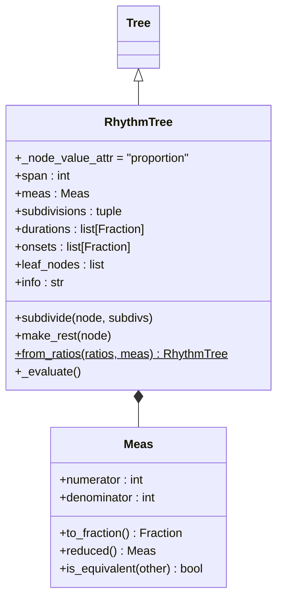
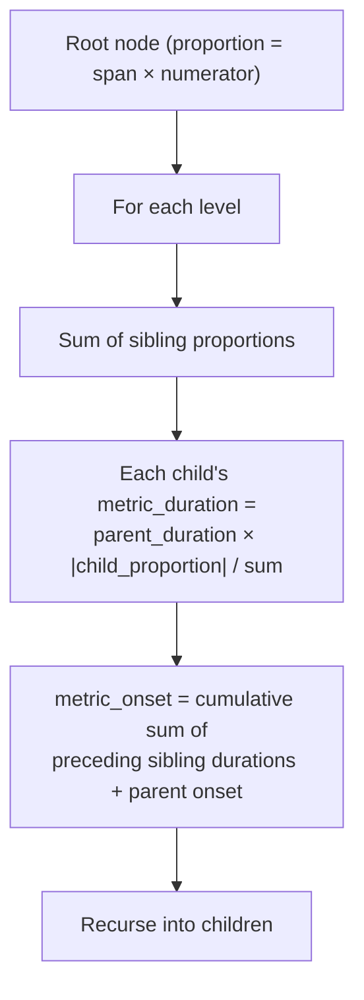
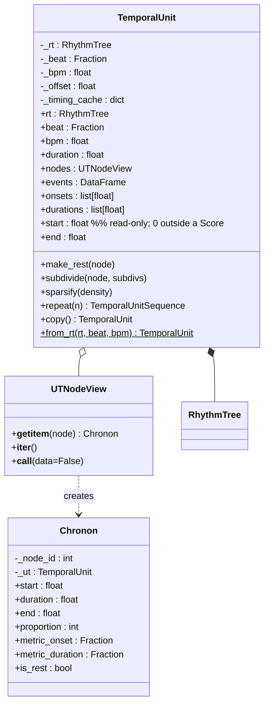
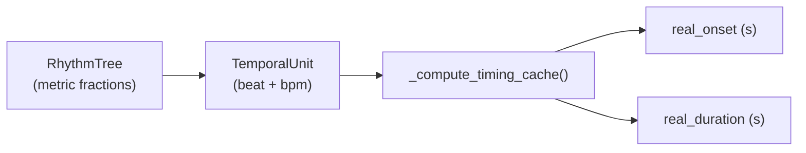
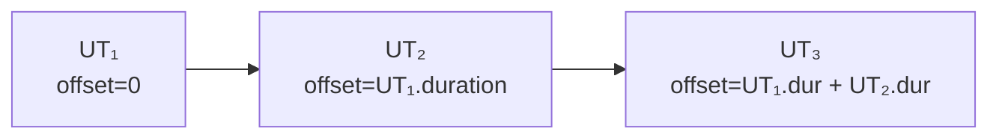
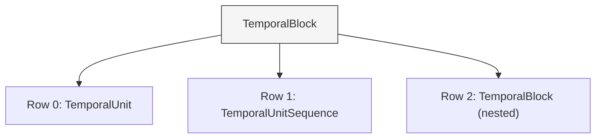
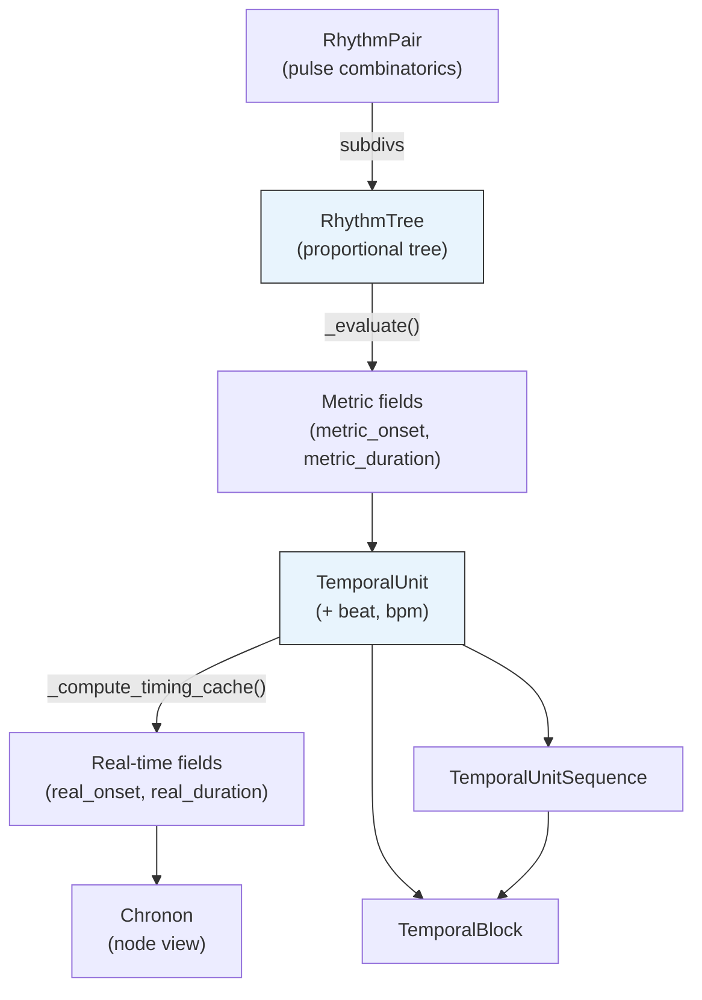

# Chronos — Time and Rhythm

> *χρόνος* (chronos) — "time."  In Greek mythology, Chronos personifies
> the endless passage of time and the cycles of creation and destruction.

`klotho.chronos` models musical time at three levels of abstraction:

1. **Proportional** — `RhythmTree`: a tree of integer proportions that
   defines relative durations within a time signature.
2. **Metric** — `Meas` and the metric fields on RT nodes: onset and
   duration expressed as fractions of a whole note.
3. **Real-time** — `TemporalUnit`: binds a `RhythmTree` to a tempo,
   producing onset times and durations in seconds.

---

## Module Map

```
chronos/
├── __init__.py
├── rhythm_pairs/
│   ├── __init__.py
│   └── rhythm_pair.py         # RhythmPair — pulse-grid combinatorics
├── rhythm_trees/
│   ├── __init__.py
│   ├── rhythm_tree.py         # RhythmTree(Tree)
│   ├── meas.py                # Meas — time signature
│   └── algorithms.py          # decomposition, auto-subdivision, complexity
├── temporal_units/
│   ├── __init__.py
│   ├── temporal.py            # TemporalUnit, TemporalUnitSequence, TemporalBlock, Chronon
│   └── algorithms.py          # decompose, modulate_tempo, convolve
└── utils/
    ├── __init__.py
    ├── beat.py                # beat_duration, calc_onsets
    ├── tempo.py               # metric_modulation, tempo_for_duration, beat_for_duration
    └── time_conversion.py     # seconds_to_hmsms, hmsms_to_seconds, cycles_to_frequency
```

---

## 1. RhythmTree

**File:** `chronos/rhythm_trees/rhythm_tree.py`  
**Inherits:** `Tree` (from `topos.graphs`)

### Class Diagram



### Construction

```python
rt = RhythmTree(
    span=1,            # number of measures
    meas='4/4',        # time signature
    subdivisions=(1, (2, (1, 1)), 1)   # proportional tree
)
```

Internally:

1. `meas` is parsed into a `Meas` object.
2. `span * meas.numerator` becomes the root's `proportion`.
3. `subdivisions` is recursively built into the tree via `Tree.__init__`.
4. `_evaluate()` walks the tree and computes `metric_duration` and
   `metric_onset` on every node.

### Node Data Model

Each node stores:

| Key | Type | Description |
|---|---|---|
| `proportion` | `int` | The proportional weight (negative = rest) |
| `metric_duration` | `Fraction` | Duration as fraction of whole note |
| `metric_onset` | `Fraction` | Onset as fraction of whole note |
| `tied` | `bool` | Whether tied to the next event |

Only `proportion` and `tied` are mutable; the metric fields are
**derived** by `_evaluate()` and recomputed automatically after any
proportion change.

### `_evaluate()` Algorithm



### Rests

Negative proportions represent rests.  `make_rest(node)` negates a
node's proportion; `_evaluate()` still computes the correct duration
(using the absolute value) but playback and notation treat the node as
silent.

### Key Algorithms (`rhythm_trees/algorithms.py`)

| Function | Description |
|---|---|
| `measure_ratios(rt)` | Extract leaf proportions as a ratio list |
| `reduced_decomposition(ratio)` | Simplify a ratio to coprime integers |
| `strict_decomposition(ratio)` | Decompose preserving structure |
| `ratios_to_subdivs(ratios)` | Convert flat ratios to nested `(D, S)` |
| `auto_subdiv(meas, depth)` | Generate canonical subdivisions for a meter |
| `rhythm_pair(…)` | See RhythmPair below |
| `segment(rt, points)` | Segment a tree at given metric points |
| `sum_proportions(subdivs)` | Sum proportions at the top level |
| `measure_complexity(rt)` | Heuristic complexity score |

---

## 2. Meas

**File:** `chronos/rhythm_trees/meas.py`

A lightweight time-signature type.  Wraps a `Fraction` with
musical semantics:

```python
m = Meas('7/8')
m.numerator   # 7
m.denominator # 8
m.to_fraction()  # Fraction(7, 8)
```

Supports arithmetic (Meas + Meas, Meas * int) and comparison.

---

## 3. RhythmPair

**File:** `chronos/rhythm_pairs/rhythm_pair.py`

Generates rhythmic patterns from pulse-grid combinatorics.  Given a
set of periods `(n1, n2, …)`, computes the inter-onset intervals of
the union of evenly spaced pulse streams.

| Property/Method | Description |
|---|---|
| `product` | Combined pulse grid |
| `products` | Individual pulse grids |
| `partitions` | Rhythmic partitions from the grid |
| `measures` | Organized into time-signature groups |
| `beats` | Beat-level patterns |
| `subdivs` | Subdivision tuples suitable for RhythmTree |

---

## 4. TemporalUnit

**File:** `chronos/temporal_units/temporal.py`  
**Metaclass:** `TemporalMeta`

A `TemporalUnit` (UT) binds a `RhythmTree` to a specific tempo
context, producing real-time onset and duration values in seconds.

### Class Diagram



### Real-Time Conversion



The formula:

```
beat_dur = 60 / bpm
whole_note_dur = beat_dur / beat  (beat as fraction of whole note)
real_onset = metric_onset × whole_note_dur + _offset
real_duration = |metric_duration| × whole_note_dur
```

The unit's private ``_offset`` is ``0`` outside a
:class:`~klotho.thetos.composition.score.Score`.  Placement within a
timeline is assigned by placement kwargs on
:meth:`~klotho.thetos.composition.score.Score.add` (``at``, ``after``,
``before``).  The public read-only :attr:`start` property exposes this
value.  Duration editing outside a Score is not supported; use
:meth:`~klotho.thetos.composition.score.ScoreItem.set_duration` after
an item has entered a Score.

### Chronon

A lightweight view object (`__slots__`-based) that exposes both
metric and real-time data for a single node.  Created on-the-fly by
`UTNodeView.__getitem__`.  Supports dict-like access
(`chronon['real_onset']`) for backwards compatibility.

---

## 5. TemporalUnitSequence

A linear sequence of `TemporalUnit` objects with cascading offsets:



| Method | Description |
|---|---|
| `append(ut)` | Add to end |
| `prepend(ut)` | Add to beginning |
| `insert(i, ut)` | Insert at index |
| `remove(i)` | Remove at index |
| `replace(i, ut)` | Replace at index |
| `extend(uts)` | Append multiple |

A sequence's total duration is determined by the sum of its members'
durations and is fixed after construction.  To change the duration of a
sequence that lives inside a
:class:`~klotho.thetos.composition.score.Score`, use
:meth:`~klotho.thetos.composition.score.ScoreItem.set_duration` on the
owning :class:`~klotho.thetos.composition.score.ScoreItem`.

---

## 6. TemporalBlock

A parallel container: multiple rows of `TemporalUnit`,
`TemporalUnitSequence`, or nested `TemporalBlock` objects aligned on
a shared time axis.



| Property | Description |
|---|---|
| `axis` | Alignment axis (`'start'` or `'end'`) |
| `rows` | List of temporal objects |
| `duration` | Maximum row duration |

Supports the same `append`/`prepend`/`insert`/`remove`/`replace`/
`extend` API as `TemporalUnitSequence`.

---

## 7. Temporal Algorithms (`temporal_units/algorithms.py`)

| Function | Description |
|---|---|
| `decompose(ut, points)` | Split a UT at metric time points |
| `modulate_tempo(ut, factor)` | Scale tempo proportionally |
| `modulate_tempus(ut, new_meas)` | Change time signature |
| `convolve(ut1, ut2)` | Rhythmic convolution |

---

## 8. Chronos Utilities

### `beat.py`

| Function | Description |
|---|---|
| `beat_duration(bpm, beat)` | Duration of one beat in seconds |
| `calc_onsets(durations)` | Cumulative onset list from durations |

### `tempo.py`

| Function | Description |
|---|---|
| `metric_modulation(old_bpm, old_beat, new_beat)` | New BPM after metric modulation |
| `tempo_for_duration(target_dur, meas, beat)` | BPM that makes a measure last `target_dur` seconds |
| `beat_for_duration(target_dur, meas, bpm)` | Beat value that makes a measure last `target_dur` |

### `time_conversion.py`

| Function | Description |
|---|---|
| `seconds_to_hmsms(s)` | Convert to `(hours, minutes, seconds, ms)` |
| `hmsms_to_seconds(h, m, s, ms)` | Convert back to seconds |
| `cycles_to_frequency(cycles, period)` | Cycles per period → Hz |

---

## Data Flow Summary


