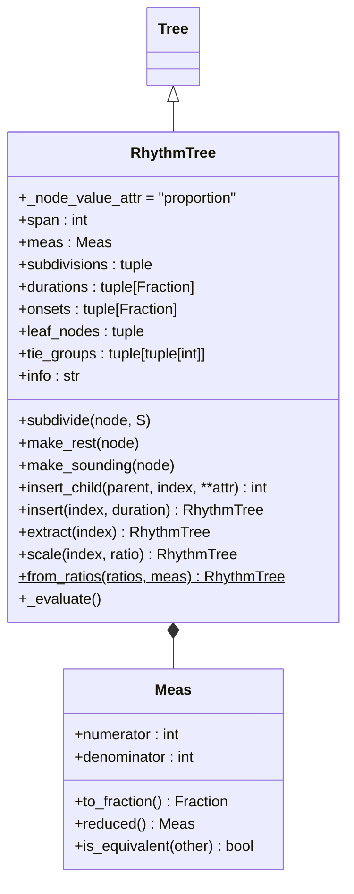
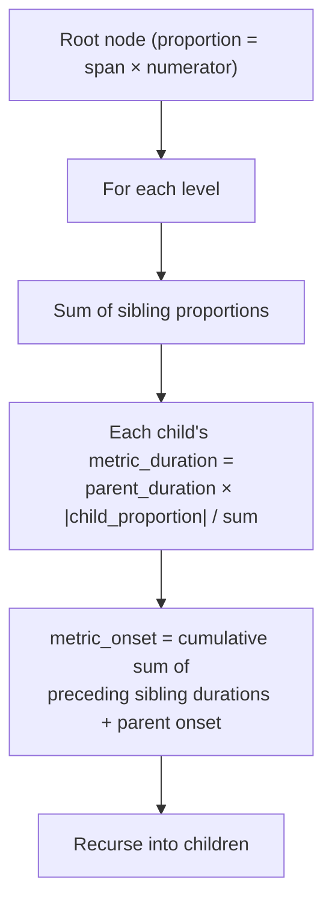
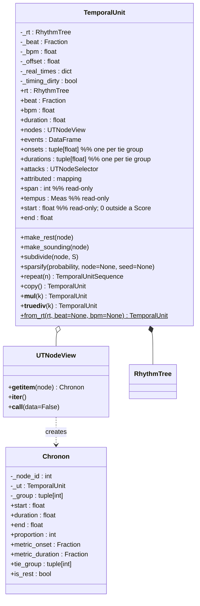
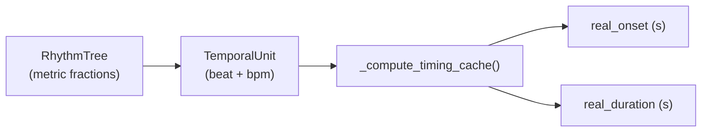
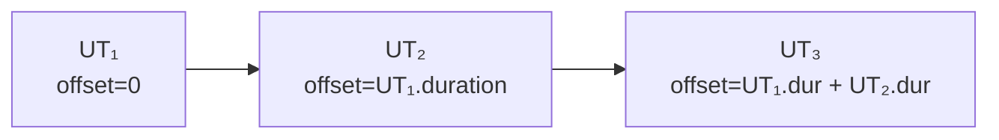
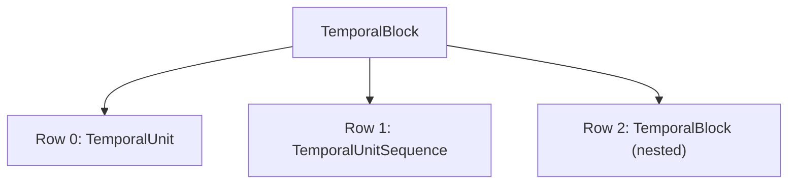
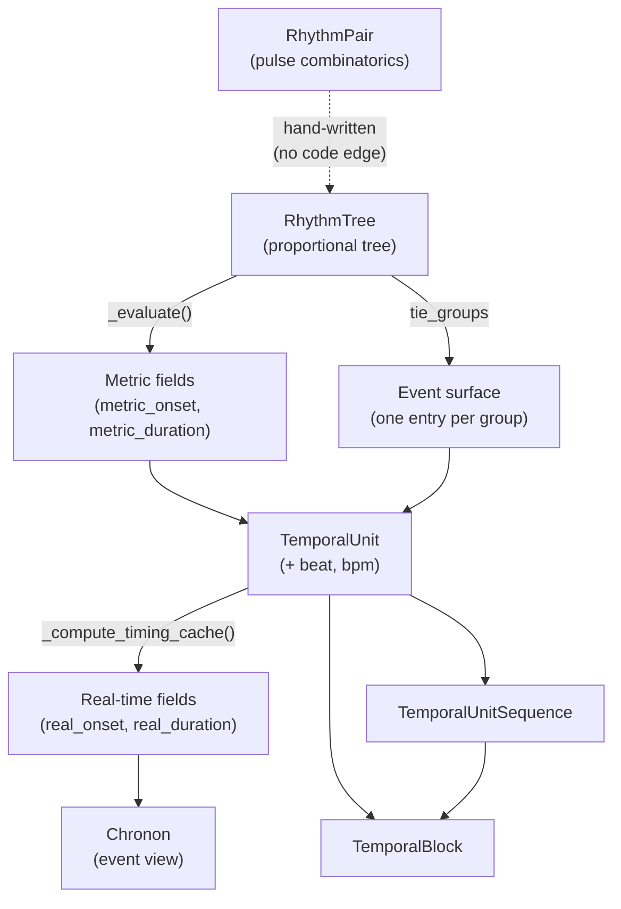

# Chronos — Time and Rhythm

> *χρόνος* (chronos) — "time."  In Greek mythology, Chronos personifies
> the endless passage of time and the cycles of creation and destruction.

`klotho.chronos` models musical time at three levels of abstraction:

1. **Proportional** — `RhythmTree`: a tree of integer proportions that
   defines relative durations within a time signature.
2. **Metric** — `Meas` and the metric fields on RT nodes: onset and
   duration expressed as fractions of a whole note.
3. **Real-time** — `TemporalUnit`: binds a `RhythmTree` to a tempo,
   producing onset times and durations in seconds.

---

## Module Map

```
chronos/
├── __init__.py
├── rhythm_pairs/
│   ├── __init__.py
│   └── rhythm_pair.py         # RhythmPair — pulse-grid combinatorics
├── rhythm_trees/
│   ├── __init__.py
│   ├── rhythm_tree.py         # RhythmTree(Tree), RhythmLayer
│   ├── meas.py                # Meas — time signature
│   └── algorithms.py          # symbolic core (decompose/fuse/flatten), the
│                              # Tempus-following operators, filtrage/evide,
│                              # auto-subdivision, complexity
├── temporal_units/
│   ├── __init__.py
│   ├── temporal.py            # TemporalUnit, TemporalUnitSequence, TemporalBlock, Chronon, selectors
│   └── algorithms.py          # the same verbs lifted to the timed layer,
│                              # plus modulate_tempo/tempus, convolve,
│                              # interleave, iterate
├── types.py                   # typed units (MetricOnset, Bpm, …)
└── utils/
    ├── __init__.py
    ├── beat.py                # beat_duration, calc_onsets, cycles_to_frequency
    ├── tempo.py               # metric_modulation, tempo_for_duration, beat_for_duration
    └── time_conversion.py     # seconds_to_hmsms, hmsms_to_seconds, seconds_to_hmsf
```

---

## 1. RhythmTree

**File:** `chronos/rhythm_trees/rhythm_tree.py`  
**Inherits:** `Tree` (from `topos.graphs`)

### Class Diagram


```mermaid
classDiagram
    Tree <|-- RhythmTree

    class RhythmTree {
        +_node_value_attr = "proportion"
        +span : int
        +meas : Meas
        +subdivisions : tuple
        +durations : tuple[Fraction]
        +onsets : tuple[Fraction]
        +leaf_nodes : tuple
        +tie_groups : tuple[tuple[int]]
        +info : str
        +subdivide(node, S)
        +make_rest(node)
        +make_sounding(node)
        +insert_child(parent, index, **attr) int
        +insert(index, duration) RhythmTree
        +extract(index) RhythmTree
        +scale(index, ratio) RhythmTree
        +from_ratios(ratios, meas) RhythmTree$
        +_evaluate()
    }

    class Meas {
        +numerator : int
        +denominator : int
        +to_fraction() Fraction
        +reduced() Meas
        +is_equivalent(other) bool
    }

    RhythmTree *-- Meas
```

### Construction

```python
rt = RhythmTree(
    span=1,            # number of measures
    meas='4/4',        # time signature
    subdivisions=(1, (2, (1, 1)), 1)   # proportional tree
)
```

Internally:

1. `meas` is parsed into a `Meas` object.
2. `span * meas.numerator` becomes the root's `proportion`.
3. `subdivisions` is recursively built into the tree via `Tree.__init__`.
4. The attached **`RhythmLayer`** (owning `proportion`/`tied`) runs
   `_evaluate()`, which walks the tree and computes `metric_duration`
   and `metric_onset` on every node.

### Node Data Model

Each node stores:

| Key | Type | Description |
|---|---|---|
| `proportion` | `int` | The proportional weight (negative = rest) |
| `metric_duration` | `Fraction` | Duration as fraction of whole note |
| `metric_onset` | `Fraction` | Onset as fraction of whole note |
| `tied` | `bool` | Whether this leaf **continues its predecessor** |

`tied` points **backwards**, not forwards.  `tied=True` on a leaf means
*this* leaf is a continuation of the leaf before it in leaf order — it
does not mean "tied to the next event".  See §1.1.

Only `proportion` and `tied` are mutable (they are the
`RhythmLayer`'s owned keys); the metric fields are **derived** by
`_evaluate()` and recomputed automatically after any proportion change
via the layer's `on_structure_changed` hook, scoped to the changed
subtree.

Writes are policed by **one shared scalar rule**
(`_check_proportion_scalar` in `rhythm_tree.py`): a proportion is a
non-zero `int`, or a whole-valued `float` meaning "that int, tied".
The constructor, `subdivide` and the node-data write path all call that
same rule and then add only their own extra condition — the write path,
for instance, adds "ties are leaf-only and never on rests", which the
scalar rule cannot see because it is not given a position.

### `_evaluate()` Algorithm


```mermaid
flowchart TD
    A["Root node (proportion = span × numerator)"] --> B["For each level"]
    B --> C["Sum of sibling proportions"]
    C --> D["Each child's metric_duration =<br/>parent_duration × |child_proportion| / sum"]
    D --> E["metric_onset = cumulative sum of<br/>preceding sibling durations + parent onset"]
    E --> F["Recurse into children"]
```

### Rests

Negative proportions represent rests.  `make_rest(node)` negates a
node's proportion; `_evaluate()` still computes the correct duration
(using the absolute value) but playback and notation treat the node as
silent.

### 1.1 Ties

A **tie** joins a leaf to the leaf before it, so a run of leaves sounds
as one event.  The flag is stored per node as `tied`, and a tie is
spelled in a subdivision tuple as a **whole-valued float**:
`(1, 1.0, 2)` is three leaves forming two events, because `1.0` marks
its leaf as a continuation of the `1` before it.

Three rules are enforced at every write path:

- **Ties are leaf-only.**  A tie continues a *sound*, and only leaves
  sound.  A float on a group value raises.  (Resolved against
  OpenMusic, where a float group value has no meaning either — OM
  silently rounds it.)
- **Tied rests are illegal.**  A rest continues nothing, so a negative
  float raises.  Use a plain negative int for a rest.
- **Zero is illegal** as a proportion, tied or not: a zero-duration leaf
  breaks strictly-increasing onsets.

A fourth rule is a **repair** rather than a refusal:

- **A tie migrates when its leaf stops being a leaf.**  `tied` has
  meaning only on the leaf surface, so a verb that makes a tied leaf
  interior — `subdivide`, `insert_child` — moves the flag onto the
  group's **first child**, the one lossless landing spot for "continues
  my predecessor".  Both verbs call the same helper,
  `_migrate_tie_to_first_child`, so they cannot drift apart.  Until
  `insert_child` was given the rule, inserting into a tied leaf turned
  two attacks into three with nothing raised.  A tie that lands on a
  rest is then cleared by `_evaluate`, because a tied rest is illegal.

`RhythmTree.tie_groups` derives the groups on every read — nothing is
stored, so a structural edit can never orphan a group; the migration
rule above is what makes that true for the two verbs that could
otherwise.  A group is a maximal run, in **leaf order**, whose members
after the first are tied; the first member is the *head*.  Groups
legitimately span branch boundaries: leaf order, not subtree
containment, is what joins them.
Rests are always singleton groups and break runs.  A tied leaf whose
predecessor is a rest, or which starts the tree, heads its own group — a
*dangling continuation*, which renders as an attack.  On a tie-free tree
there is exactly one group per leaf.

**Leaves remain the structural surface everywhere; groups are the event
surface.**  `rt.durations`, `rt.onsets` and `rt.leaf_nodes` are per-leaf.
The *timed* surfaces on `TemporalUnit` count groups — see §4.1.

### Key Algorithms (`rhythm_trees/algorithms.py`)

| Function | Description |
|---|---|
| `measure_ratios(subdivs)` | Metric ratios from a nested subdivision tuple |
| `reduced_decomposition(lst, meas)` | Reduce ratios relative to a measure |
| `strict_decomposition(lst, meas)` | Decompose preserving proportional structure |
| `ratios_to_subdivs(ratios)` | Convert flat ratios to a subdivision tuple |
| `auto_subdiv(subdivs, n=1)` | Automatic rotation-based re-subdivision |
| `auto_subdiv_matrix(matrix, rotation_offset=1)` | `auto_subdiv` across a matrix of rows |
| `clean_subdivs(subdivs)` | Normalize/clean a subdivision tuple |
| `rhythm_pair(lst, MM=True)` | See RhythmPair below |
| `segment_proportions(ratio)` | Split a ratio strictly between 0 and 1 into the integer proportion pair `(num, den − num)`.  Renamed from `segment` (2026-08-29) because the ⊥ operator took that name |
| `sum_proportions(S)` | Sum the **absolute values** of the top-level proportions |
| `measure_complexity(subdivs)` | `bool` — whether the subdivision is "complex" |

**Symbolic core** — the untimed half of the Chapter-4 verbs.  Each has a
same-named sibling in `temporal_units/algorithms.py` that lifts it to
the timed layer:

| Function | Description |
|---|---|
| `decompose(rt)` | One fundamental tree per *sounding event* — sign-carrying (rests stay rests) and tie-aware (a tie group decomposes to one event) |
| `fuse(rts)` | Haddad's ‖ ("concatenation"): several trees into ONE |
| `flatten(rt)` | The canonical one-level spelling.  The denominator is the lcm of the durations, the choice that makes `flatten` idempotent on an already-canonical tree |
| `segment(rt, factor, tie=False)` | Segmentation ⊥ — divide a tree in two: `T ⊥ f => [T·f | T·(1−f)]`.  `factor` is either a rational strictly between 0 and 1, or a `Meas` read as a Tempus relative to the source's.  Returns exactly two trees.  `tie=True` (Haddad's variant (c)) raises `NotImplementedError` |

**Transformations:**

| Function | Description |
|---|---|
| `filtrage(rt, series)` | Rest the leaves a series walks onto — Haddad's *filtrage* ("filtering") |
| `evide(rt)` | Interchange sounds and rests — Haddad's *rythme évidé* ("hollowed-out rhythm"), after Boulez |

**Tempus-following operators** (see §1.2) — module functions, each
returning a **new** tree:

| Function | Glyph | Description |
|---|---|---|
| `diminish(rt, positions)` | ⊟ | Delete prolationes; the Tempus shrinks to follow |
| `augment(rt, additions, positions)` | ⊞ | Add prolationes; the Tempus grows to follow |
| `scale_tempus(rt, ratios, positions)` | ⊠ | Dilatation/contraction: scale prolationes; the Tempus follows |

### 1.2 The two operator families

Haddad splits the Chapter-4 operators along one axis: whether the Tempus
moves.  His own terms are *« prolationnelle stricte »* ("strictly
prolational") for the family that holds the Tempus, and *« relative »*
("relative") for the family that lets it follow; the English pair
"Tempus-preserving" / "Tempus-following" is Klotho's coinage.  His §4.5.3
heading fixes the glyph mnemonic — *« Dilatation/Contraction (⊠),
Expansion/Compression (⊗) »* ("Dilation/Contraction (⊠),
Expansion/Compression (⊗)"): **box = the Tempus follows, circle = the
Tempus is preserved.**

| Axis | Glyph | Spelling | Add | Remove | Scale |
|---|---|---|---|---|---|
| Tempus **preserved** (circle) | ⊕ ⊖ ⊗ | **methods** on `RhythmTree`, mutate and return `self` | `rt.insert(index, duration)` | `rt.extract(index)` | `rt.scale(index, ratio)` |
| Tempus **follows** (box) | ⊞ ⊟ ⊠ | **module functions**, returning a new tree | `augment(rt, additions, positions)` | `diminish(rt, positions)` | `scale_tempus(rt, ratios, positions)` |

The split in spelling is forced, not stylistic: **`meas` and `span` have
no setters, by design.**  A Tempus-preserving operator can therefore be an
in-place method, because it never needs to write the measure; a
Tempus-following one cannot be spelled that way at all, so it builds and
returns a new tree.

Every operator in both families is *decompose → operate → concatenate*
(§4.5.2, p. 124), so `insert` and `scale` **flatten**: the result is one
level by construction and nesting is not preserved.  Ties do not survive
the round trip either — a tie group decomposes to one event, exactly as
in `flatten`.

**The argument order reverses Haddad's.**  He prints
`⊕((durations), (positions))` — values first, positions second.  Klotho
takes `(index, value)`, matching `list.insert`,
`TemporalUnitSequence.insert` and `TemporalBlock.insert`.  Both orders
run when both arguments are integers, so a figure copied
argument-for-argument off the page is silently wrong.

---

## 2. Meas

**File:** `chronos/rhythm_trees/meas.py`

A lightweight time-signature type.  Wraps a `Fraction` with
musical semantics:

```python
m = Meas('7/8')
m.numerator   # 7
m.denominator # 8
m.to_fraction()  # Fraction(7, 8)
```

Supports arithmetic (`Meas + Meas`, `Meas * int`) and comparison.

**`Meas` is registered as `numbers.Rational` but keeps its numerator and
denominator raw — it does not normalize.**  So `Fraction(Meas('4/4'))` is
`Fraction(4, 4)`, which is `!=` `Fraction(1, 1)`:

```python
>>> from fractions import Fraction
>>> Fraction(Meas('4/4')) == Fraction(1, 1)
False
>>> Meas('4/4').to_fraction() == Fraction(1, 1)   # to_fraction() DOES normalize
True
```

This is deliberate at the domain level — reducing a Tempus changes the
unit's nature (a `6/20` bar is not a `3/10` bar), and the operator
families depend on raw spelling surviving.  But it is a live trap when
comparing measures in tests or user code: **compare `.to_fraction()`, or
use `is_equivalent`, not `Fraction(...)`.**

---

## 3. RhythmPair

**File:** `chronos/rhythm_pairs/rhythm_pair.py`

Generates rhythmic patterns from pulse-grid combinatorics.  Given a
set of periods `(n1, n2, …)`, computes the inter-onset intervals of
the union of evenly spaced pulse streams.

| Property/Method | Description |
|---|---|
| `product` | `int` — the product of every element of the input tuple |
| `products` | `tuple[int]` — the total product divided by each element in turn (the MM grid spacings) |
| `partitions` | Rhythmic partitions from the grid |
| `measures` | Organized into time-signature groups |
| `beats` | Beat-level patterns |
| `subdivs` (constructor flag) | `bool` — controls whether `partitions`/`measures` return subdivision-shaped output |

---

## 4. TemporalUnit

**File:** `chronos/temporal_units/temporal.py`  
**Metaclass:** `TemporalMeta`

A `TemporalUnit` (UT) binds a `RhythmTree` to a specific tempo
context, producing real-time onset and duration values in seconds.

### Class Diagram


```mermaid
classDiagram
    class TemporalUnit {
        -_rt : RhythmTree
        -_beat : Fraction
        -_bpm : float
        -_offset : float
        -_real_times : dict
        -_timing_dirty : bool
        +rt : RhythmTree
        +beat : Fraction
        +bpm : float
        +duration : float
        +nodes : UTNodeView
        +events : DataFrame
        +onsets : tuple[float]   %% one per tie group
        +durations : tuple[float] %% one per tie group
        +attacks : UTNodeSelector
        +attributed : mapping
        +span : int    %% read-only
        +tempus : Meas %% read-only
        +start : float  %% read-only; 0 outside a Score
        +end : float
        +make_rest(node)
        +make_sounding(node)
        +subdivide(node, S)
        +sparsify(probability, node=None, seed=None)
        +repeat(n) TemporalUnitSequence
        +copy() TemporalUnit
        +__mul__(k) TemporalUnit
        +__truediv__(k) TemporalUnit
        +from_rt(rt, beat=None, bpm=None) TemporalUnit$
    }

    class Chronon {
        -_node_id : int
        -_ut : TemporalUnit
        -_group : tuple[int]
        +start : float
        +duration : float
        +end : float
        +proportion : int
        +metric_onset : Fraction
        +metric_duration : Fraction
        +tie_group : tuple[int]
        +is_rest : bool
    }

    class UTNodeView {
        +__getitem__(node) Chronon
        +__iter__()
        +__call__(data=False)
    }

    TemporalUnit *-- RhythmTree
    TemporalUnit o-- UTNodeView
    UTNodeView ..> Chronon : creates
```

### 4.1 The Event Surface Counts Tie Groups

Every *event* surface on a `TemporalUnit` counts **tie groups**, not
leaves.  `len(ut)`, iteration, indexing and slicing, `ut.onsets`,
`ut.durations` and `ut.events` all yield one entry per group, anchored at
the group's head, with the group's member durations summed.  Rests are
present and their duration entries stay signed.  On a tie-free unit this
is identical to the per-leaf reading, so `len(ut) <= len(ut.leaves)`,
with equality exactly when there are no ties.

The **structural** surface is still per-leaf: `ut.leaves`,
`ut.leaves.sounding`, `ut.at_depth(...)`, `rt.durations` and
`rt.leaf_nodes` all count leaves.

`ut.attacks` is the bridge: a selector of the **head of every sounding
tie group** — the leaves that *start* a sound.  Its companion
`ut.leaves.sounding` keeps continuations too, because they do sound.  On
a tie-free unit the two coincide.  `attacks` and the event surface are in
bijection: one attack per sounding event.

A `Chronon` carries its group (`chronon.tie_group`) and reports
`duration` as the sum over the group.

### Node Selection and Handles

`TemporalUnit` exposes two node-facing surfaces:

- **`UTNodeSelector`** (`ut.leaves`, `ut.at_depth(...)`,
  `ut.select(...)`) for bulk operations and set algebra.
- **`UTNodeHandle`** when iterating a selection
  (`for node in ut.leaves:`), for direct intrinsic reads (`id`,
  `proportion`, `depth`, `real_duration`, parent/sibling metadata) and
  node-local verbs (`subdivide`, `make_rest`).

(`CompositionalUnit` swaps in `UCNodeSelector`/`UCNodeHandle`, which
add the parameter verbs.)

Use selection `.ids` when you need raw integer IDs. For explicit singleton
selector traversal (advanced chaining), call `.singletons()` / `.selectors()`
on a selection.

### Real-Time Conversion


```mermaid
flowchart LR
    RT["RhythmTree<br/>(metric fractions)"] --> UT["TemporalUnit<br/>(beat + bpm)"]
    UT --> TC["_compute_timing_cache()"]
    TC --> RO["real_onset (s)"]
    TC --> RD["real_duration (s)"]
```

The formula:

```
beat_dur = 60 / bpm
whole_note_dur = beat_dur / beat  (beat as fraction of whole note)
real_onset = metric_onset × whole_note_dur + _offset
real_duration = |metric_duration| × whole_note_dur
```

The unit's private ``_offset`` is ``0`` outside a
:class:`~klotho.thetos.composition.score.Score`.  Placement within a
timeline is assigned by placement kwargs on
:meth:`~klotho.thetos.composition.score.Score.add` (``at``, ``after``,
``before``).  The public read-only :attr:`start` property exposes this
value.  Duration editing outside a Score is not supported; use
:meth:`~klotho.thetos.composition.score.ScoreItem.set_duration` after
an item has entered a Score.

### Tempo Attribution

The constructor records **which tempo slots were given explicitly**, on
`ut.attributed`.  Only the constructor can know this — `TemporalUnit(bpm=60)`
is attributed *at* the default value, so the flag cannot be reconstructed
afterwards.  `tempus` uses a sentinel default for the same reason:
without it, `TemporalUnit()` and `TemporalUnit(tempus='4/4')` would be
indistinguishable.  The value is inert metadata today; it is the
prerequisite for a future ambient tempo context, where an explicit value
stays sticky and an omitted one follows the ambient dial.

Related: a zero or missing tempo value **raises** rather than being
silently defaulted.

### Magnitude Arithmetic

`ut * k`, `k * ut` and `ut / k` build a unit *k* times as long (or `1/k`
as long) **by rewriting the Tempus**, holding the tempo fixed.  Both the
real duration and the notation move together — rescaling the bpm instead
reaches a byte-identical sound from a different page, and the notation is
what the composer wrote.  Prolationes are carried verbatim, so the event
count never changes; the result always has `span=1`, with the source's
span folded into the tempus numerator.  A bare `int` is refused, and
scaling by 1 is a true no-op on the spelling.

The Tempus is assembled from **raw ints**, never through `Meas.__mul__`,
which gcd-reduces even at identity (`Meas(6, 20) * 1` is `3/10`).
Reducing a Tempus changes the unit's nature, so `modulate_tempo`, `fuse`
and this operator all share that discipline.

### Chronon

A lightweight view object (`__slots__`-based) that exposes both
metric and real-time data for a single node.  Created on-the-fly by
`UTNodeView.__getitem__`.  Supports dict-like access
(`chronon['real_onset']`) for backwards compatibility.

---

## 5. TemporalUnitSequence

A linear sequence of `TemporalUnit` objects with cascading offsets:


```mermaid
flowchart LR
    UT1["UT₁<br/>offset=0"] --> UT2["UT₂<br/>offset=UT₁.duration"]
    UT2 --> UT3["UT₃<br/>offset=UT₁.dur + UT₂.dur"]
```

| Method | Description |
|---|---|
| `append(ut, repeat=1)` | Add to end (optionally repeated) |
| `prepend(ut)` | Add to beginning |
| `insert(i, ut)` | Insert at index |
| `remove(i)` | Remove at index |
| `replace(i, ut)` | Replace at index |
| `extend(other_seq, repeat=1)` | Append another sequence's units |

`TemporalUnit`, `TemporalUnitSequence`, and `TemporalBlock` all mix
in `_RepeatableTemporal` (10.7.0), so `.repeat(n)` is available on
each — on a UT it returns a `TemporalUnitSequence` of *n* copies.

A sequence's total duration is the sum of its members' durations, so
every mutator in the table above changes it — `append` on a one-member
sequence doubles it — and the members after the edit are re-offset.
What is fixed outside a
:class:`~klotho.thetos.composition.score.Score` is the sequence's
**start**: it is time 0, and there is no public offset setter.  There is
no duration setter on the sequence either; to place or re-time a sequence
on a timeline, add it to a Score and use
:meth:`~klotho.thetos.composition.score.ScoreItem.set_duration` on the
owning :class:`~klotho.thetos.composition.score.ScoreItem`.

---

## 6. TemporalBlock

A parallel container: multiple rows of `TemporalUnit`,
`TemporalUnitSequence`, or nested `TemporalBlock` objects aligned on
a shared time axis.


```mermaid
flowchart TD
    TB["TemporalBlock"]
    TB --> R1["Row 0: TemporalUnit"]
    TB --> R2["Row 1: TemporalUnitSequence"]
    TB --> R3["Row 2: TemporalBlock (nested)"]
```

| Property | Description |
|---|---|
| `axis` | Alignment axis — a float in `[-1, 1]` (`-1` left/start, `0` center, `1` right/end) |
| `rows` | List of temporal objects (the **live** list, not a copy) — placement is re-validated on the way out |
| `duration` | Maximum row duration |
| `height` | Number of rows |
| `principal_row` | The row whose end is **latest** |
| `events` | `pandas.DataFrame` of every event in the block, by date |

Supports the same `append`/`prepend`/`insert`/`remove`/`replace`/
`extend` API as `TemporalUnitSequence`.

#### `principal_row`

`None` for an empty block.  The definition is deliberately **axis- and
sort-independent**: it reads the geometry the current axis produced,
instead of assuming `rows[-1]` — which, under the `sort_rows=True`
default, is the *shortest* row and need not end at the block's end at
all.  Ties break toward the **bottom-most** (highest-index) row, which
is the normal case at `axis=1` where every row ends together; the
comparison uses a small relative tolerance, because a shifted row's end
is computed as `offset + (max − d) + d` and can miss by a float ulp.

#### Alignment is lazy

Rows are live objects, so a row mutated through **its own** mutator
(`blk.rows[0].append(...)`) changes the geometry `_align_rows` was
computed from with no block-level mutator running — and it changes the
block's duration, which is therefore not fixed after construction either.
Every reader whose answer depends on alignment — `rows`, `duration`,
`end`, `principal_row`, `events`, `__getitem__`, `__iter__` — first calls
`_ensure_aligned`, which compares the current row durations against the
geometry of the last alignment and re-runs `_align_rows` if they differ.
Alignment is therefore as lazy as `events` already was, and for the same
reason.  Before this was added, a two-row block at `axis=1` whose row 0
had grown reported `end = 6.0` while its events ran to `8.0`, with
nothing raised.  `_align_rows` is idempotent — offsets are assigned
absolutely and the duration sort is stable — so a block nobody mutated
never moves, however many times it is read.

Reading `blk._rows` directly bypasses `_ensure_aligned` and can return
stale offsets.  Outside a `Score` the block's **start** is still fixed at
time 0; only the duration and the rows' internal offsets move.

#### `TemporalBlock.events`

One row per event, flattened across all voices and ordered by `start`
(then by `row`; the sort is stable).  Nesting is flattened too.  Two
identity columns are added to the `TemporalUnit.events` column set:

| Column | Meaning |
|---|---|
| `row` | Index of the **top-level** block row — "voice" in Haddad's sense that row order is voice assignment.  Needed because `node_id` is *not* unique across rows: two structurally identical rows both number their leaves `1, 2, 3`, so `(row, node_id)` is the identifying pair |
| `voice` | Dotted path to the *innermost* block row, as a string: `'1'` for a plain row, `'0.1'` for the second row of a block nested in row 0.  A `TemporalUnitSequence` does **not** extend the path, because its members are successive, not simultaneous |

`start` and `end` are **absolute** seconds — they include the block's own
offset and every row's alignment offset, so the table is directly
comparable across voices under any `axis`.  Events are tie groups, not
leaves.  The table is **computed on every read, not cached**: a correct
cache key would have to recurse over every leaf unit's structure version,
tempo, beat and offset across three container types, and `rows` hands out
the live row list, so a row swapped in place would defeat any
identity-based key.

---

## 7. Temporal Algorithms (`temporal_units/algorithms.py`)

These are the **same verbs** as the symbolic core in
`rhythm_trees/algorithms.py` (the Symbolic core table in §1), lifted to the timed layer.
Each accepts a `TemporalUnit` — and in several cases a `RhythmTree`, in
which case it returns the symbolic result instead.

| Function | Description |
|---|---|
| `decompose(ut, prolatio=None, depth=None)` | Split a UT into a `TemporalUnitSequence` — per-leaf (with optional replacement prolatio) or at a given tree depth.  Sign-carrying and tie-aware: a tie group decomposes to ONE unit |
| `fuse(*operands, reference=None)` | Haddad's ‖, lifted: several units into one.  Tempo is taken from the first operand unless `reference` names another |
| `flatten(obj)` | The canonical one-level spelling of a unit |
| `segment(obj, factor, tie=False)` | Segmentation ⊥ — returns a `TemporalUnitSequence` of **exactly two** units.  Span, beat and bpm carry over, so the two halves together sound exactly as long as the source.  `factor` is a rational in (0, 1), or a `Meas`/`TemporalUnit`/list read as a Tempus relative to the source's.  A `CompositionalUnit` raises: splitting a leaf forces a decision about its parameter state, which is a staged surface |
| `diminish(obj, positions)` | ⊟ — delete prolationes; the Tempus follows |
| `augment(obj, additions, positions)` | ⊞ — add prolationes; the Tempus follows |
| `scale_tempus(obj, ratios, positions)` | ⊠ — scale prolationes; the Tempus follows |
| `interleave(a, b)` | Haddad's *tuilage* ("tiling"): zip a sequence against another's retrograde |
| `iterate(ut, op, start=0, stop=None, *, mode='recursive', include_source=True, index=None)` | Build a whole form by repeated application of one operator (§4.6).  `mode='simple'` applies the operator to the source each time; `mode='recursive'` applies it to the previous result.  Returns a `TemporalUnitSequence` |
| `modulate_tempo(ut, beat, bpm)` | Set a new beat/bpm, adjusting tempus so total duration is preserved |
| `modulate_tempus(ut, span, tempus)` | Change span/time signature, preserving duration |
| `convolve(x, h, reference=None)` | Rhythmic convolution of two units/sequences.  Sign-carrying and tie-aware; zero-length results are deleted rather than emitted |

**None of these are re-exported.**  `klotho.chronos.__all__` lists the
classes only, and both subpackage `__init__.py` files set `__all__ = []`.
Reach them by their module: `from klotho.chronos.temporal_units.algorithms
import iterate`.

---

## 8. Chronos Utilities

### `beat.py`

| Function | Description |
|---|---|
| `beat_duration(ratio, bpm, beat_ratio='1/4')` | Duration in seconds of a metric ratio at a tempo |
| `calc_onsets(durations)` | Cumulative onset list from durations |
| `cycles_to_frequency(cycles, duration)` | Cycles over a duration → Hz |

### `tempo.py`

| Function | Description |
|---|---|
| `metric_modulation(current_tempo, current_beat_value, new_beat_value)` | New BPM after metric modulation |
| `tempo_for_duration(metric_ratio, reference_beat, duration)` | BPM that makes a metric ratio last `duration` seconds |
| `beat_for_duration(metric_ratio, bpm, duration)` | Beat value that makes a metric ratio last `duration` seconds |

### `time_conversion.py`

| Function | Description |
|---|---|
| `seconds_to_hmsms(seconds, as_string=True)` | Convert to `H:M:S.ms` (string or tuple) |
| `hmsms_to_seconds(h, m, s, ms)` | Convert back to seconds |
| `seconds_to_hmsf(seconds, fps=30)` / `hmsf_to_seconds(...)` | Frame-based timecode conversions |

---

## Data Flow Summary


```mermaid
flowchart TD
    RP["RhythmPair<br/>(pulse combinatorics)"] -.->|"hand-written<br/>(no code edge)"| RT
    RT["RhythmTree<br/>(proportional tree)"]
    RT -->|"_evaluate()"| MF["Metric fields<br/>(metric_onset, metric_duration)"]
    RT -->|"tie_groups"| EV["Event surface<br/>(one entry per group)"]
    MF --> UT["TemporalUnit<br/>(+ beat, bpm)"]
    EV --> UT
    UT -->|"_compute_timing_cache()"| RF["Real-time fields<br/>(real_onset, real_duration)"]
    UT --> UTS["TemporalUnitSequence"]
    UT --> TB["TemporalBlock"]
    UTS --> TB

    RF --> Chronon["Chronon<br/>(event view)"]
```

The `RhythmPair` → `RhythmTree` link is **dotted because there is no code
edge**.  `rhythm_pair.py` imports only the `rhythm_pair` helper from
`rhythm_trees.algorithms`; nothing in `RhythmTree` knows `RhythmPair`
exists, and no method converts one to the other.  What is real is a
*user-level* hand-off — `rp.beats` and `rp.measures` are plain integer
tuples and can be passed as `subdivisions`:

```python
rp = RhythmPair((3, 4))
rt = RhythmTree(span=1, meas='4/4', subdivisions=rp.beats)   # (3, 1, 2, 2, 1, 3)
```

---

## Two Structural Invariants

**Child order is ascending rustworkx node index, and nothing else.**
`GraphCore.successors` returns `tuple(sorted(...))`, so *the sort is the
ordering model*.  There is no separate edge-order concept anywhere in the
tree stack.  Rank therefore means index rank, and
`Tree.insert_child(parent, k, …)` shifts the **content** of ranks
`k…n−1` one slot right and writes the new content into the vacated slot.
A consequence: **node identity follows position, not content** — an
external handle to a shifted sibling now denotes a different node.  The
tree's own id-keyed state is not an external handle: instrument
bindings, slurs and the `Bind` memo move with the content they describe,
announced by `Tree._notify_nodes_relocated` (01_TOPOS.md, *Id-Keyed
State Follows Content*).  This is also why no renumbering machinery is
needed; `GraphCore.renumber_nodes` is a no-op stub.

A `RhythmTree` insert carries a **tie** as well.  Inserting into a tied
leaf makes that leaf interior, where `tied` has no meaning, so the flag
migrates onto the new first child (`_migrate_tie_to_first_child`)
instead of being silently dropped — see §1.1.  `insert_child` and
`subdivide` share the one helper so the two verbs cannot drift apart.

**`meas` and `span` have no setters, by design.**  A `RhythmTree`'s
measure is fixed at construction, and so is a `TemporalUnit`'s `tempus`
and `span`.  This is exactly what forces the operator split in §1.2: the
Tempus-preserving operators can be in-place methods because they never
write the measure, and the Tempus-following ones cannot be spelled that
way at all, so they are module functions that build new trees.
