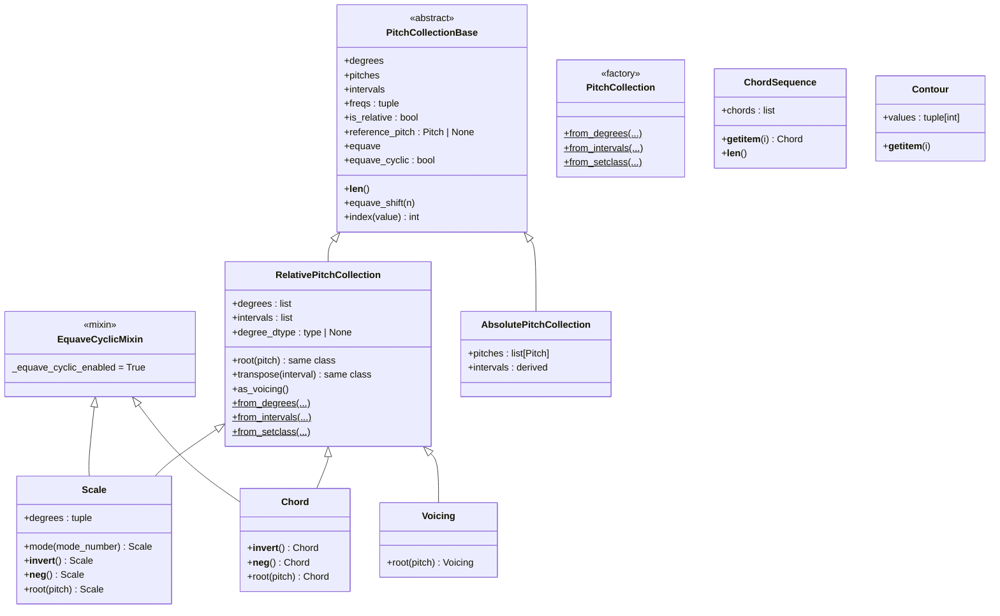
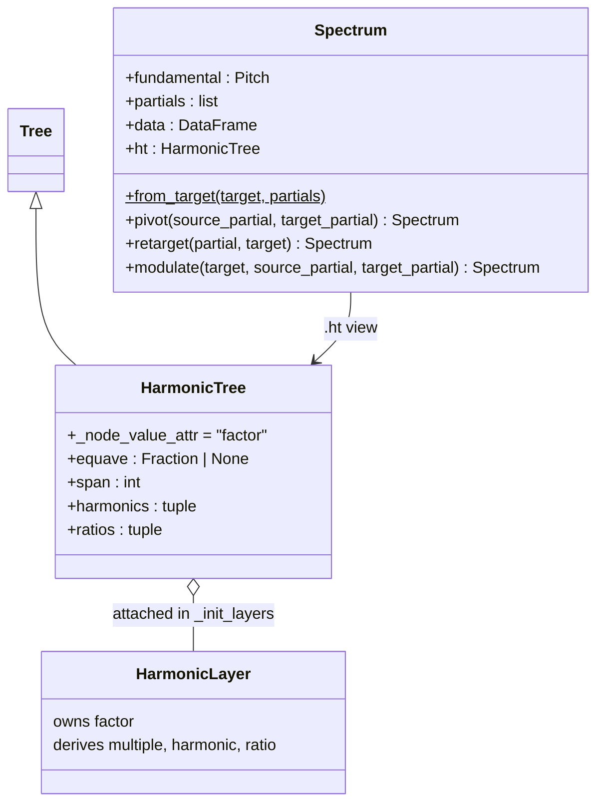
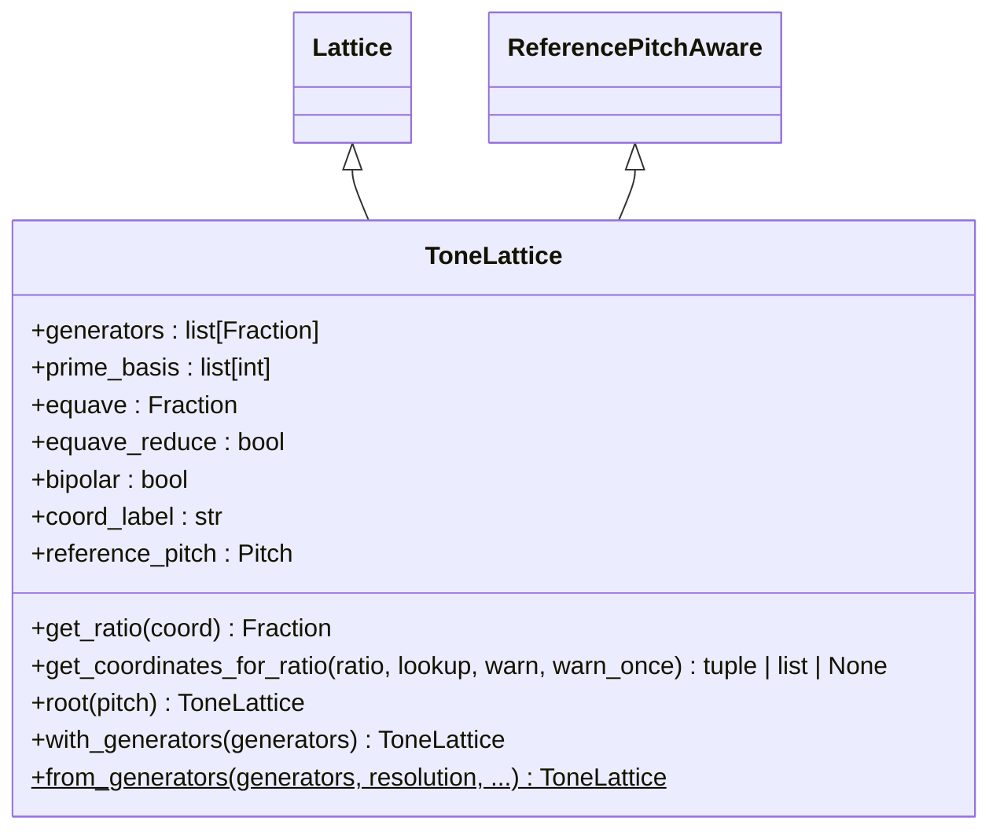
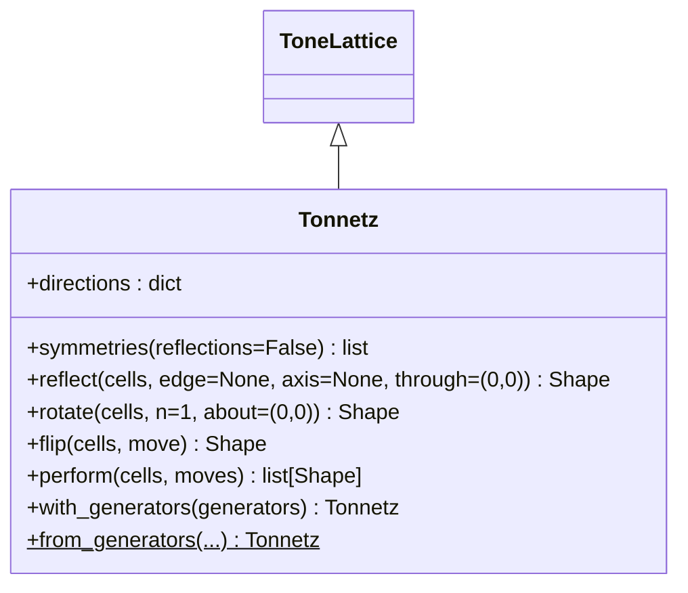
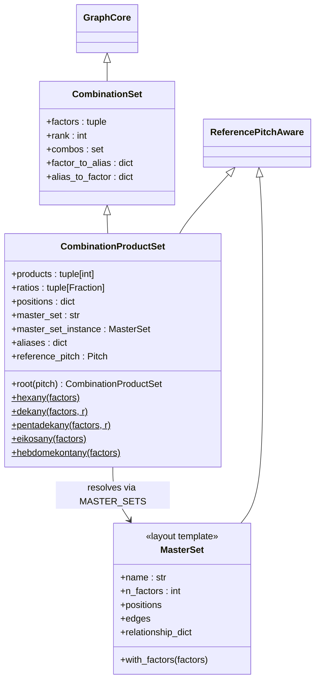
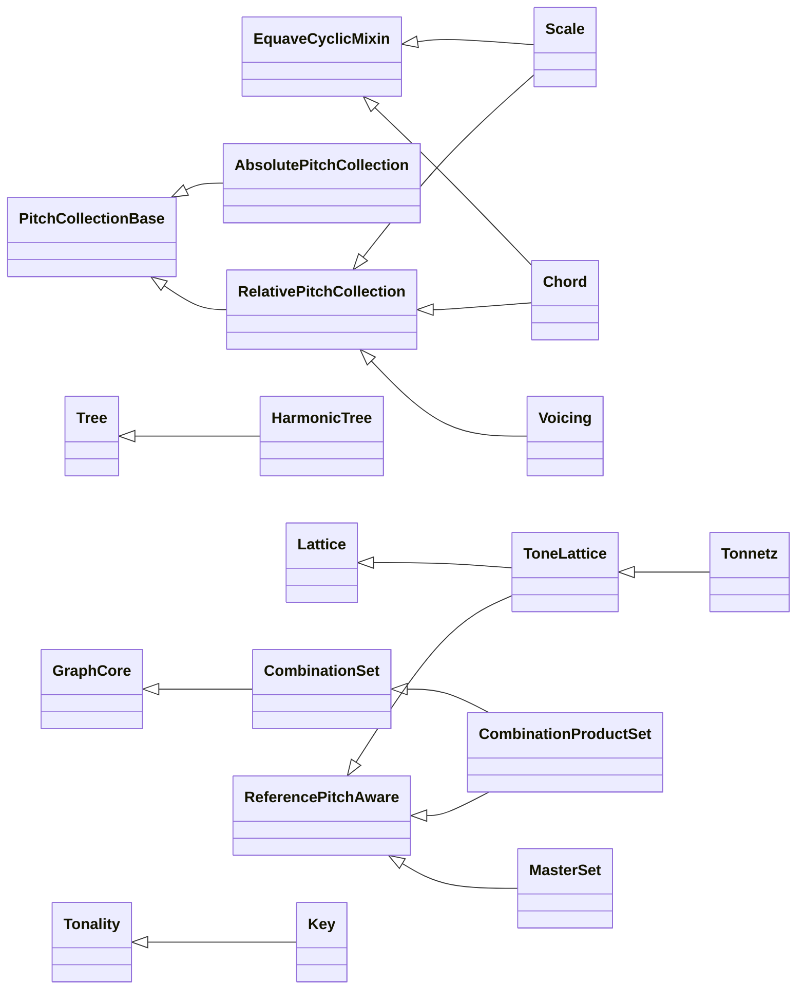

# Tonos — Pitch and Harmony

> *τόνος* (tonos) — "tension," "tone," "pitch."  The origin of the
> word "tone," describing both the phenomenon of pitch and the
> perception of timbre.

`klotho.tonos` models the tonal domain: individual pitches, scales,
chords, voicings, contour, and three graph-based tonal systems—
harmonic trees, tone lattices, and combination product sets.

---

## Module Map

```
tonos/
├── __init__.py
├── tonality.py                # Tonality, Key, tonicize, approach (roman-numeral harmony)
├── types.py                   # Unit wrappers: Frequency, Midi, Midicent, Cent, Ratio, Partial
├── pitch/
│   ├── __init__.py
│   ├── pitch.py               # Pitch
│   ├── pitch_collections.py   # PitchCollectionBase hierarchy + PitchCollection factory
│   ├── reference.py           # ReferencePitchAware mixin (root() for lattice-family)
│   └── contour.py             # Contour (scale-degree index sequence)
├── scales/
│   ├── __init__.py
│   └── scale.py               # Scale
├── chords/
│   ├── __init__.py
│   ├── chord.py               # Chord, Voicing, ChordSequence
│   ├── analysis.py            # root_index, chord_root (JI chord analysis)
│   └── voice_leading.py       # fold, voice_lead
├── systems/
│   ├── __init__.py
│   ├── harmonic_trees/
│   │   ├── __init__.py
│   │   ├── harmonic_tree.py   # HarmonicTree(Tree)
│   │   ├── spectrum.py        # Spectrum (DataFrame view)
│   │   └── algorithms.py      # harmonic evaluation helpers
│   ├── tone_lattices/
│   │   ├── __init__.py
│   │   ├── tone_lattices.py   # ToneLattice(ReferencePitchAware, Lattice)
│   │   └── basis.py           # basis matrix, generator coordinates
│   ├── tonnetz/
│   │   ├── __init__.py
│   │   └── tonnetz.py         # Tonnetz(ToneLattice) — triangular pitch lattice
│   └── combination_product_sets/
│       ├── __init__.py
│       ├── combination_product_sets.py  # CombinationProductSet(ReferencePitchAware, CombinationSet)
│       ├── master_set.py               # MasterSet layout templates + MASTER_SETS registry
│       └── algorithms.py               # match_pattern, sub_cps, classify, faces
└── utils/
    ├── __init__.py
    ├── frequency_conversion.py   # freq ↔ midicent ↔ pitch class
    ├── harmonics.py              # partial_to_fundamental, first_equave
    ├── intervals.py              # ratio_to_cents, interval_cost, n_tet
    └── interval_normalization.py # equave_reduce, fold_interval, reduce_freq
```

---

## 1. Pitch Collection Hierarchy

The core abstraction is a hierarchy of pitch-collection classes, from
abstract to concrete:



`Chord` inversion is spelled with operators (`~chord` / `-chord`),
not an `inversion(n)` method.  `ChordSequence` is a thin ordered
wrapper around a list of chords.  `Contour` holds a sequence of
**scale-degree indices** used to index into pitch collections (see the
pitch-collections doc).

### Key Distinctions

All of `Scale`, `Chord`, and `Voicing` extend `RelativePitchCollection`
directly (`Scale` and `Chord` additionally mix in
`EquaveCyclicMixin`, which turns on equave-cyclic indexing).  They
are **not** subclasses of each other — they are specialized variants
that enforce different constraints on the same interval-based
foundation.

| Class | Inherits from | Defined by | Key behavior |
|---|---|---|---|
| `RelativePitchCollection` | `PitchCollectionBase` | Interval ratios/cents | `.root(pitch)` → rooted copy of the **same class**; `.transpose(interval)` |
| `Scale` | `EquaveCyclicMixin`, `RelativePitchCollection` | Intervals | Enforces unison, sorts, equave-reduces, adds `.mode(n)` |
| `Chord` | `EquaveCyclicMixin`, `RelativePitchCollection` | Intervals | Sorts, equave-reduces, no unison required; inversion via `~chord` / `-chord` |
| `Voicing` | `RelativePitchCollection` | Intervals | **No** equave reduction — preserves multi-octave spacing |
| `AbsolutePitchCollection` | `PitchCollectionBase` | Absolute `Pitch` objects | Stores concrete pitches directly |
| `PitchCollection` | *(factory class)* | — | Unified classmethod constructors (`from_degrees`, `from_intervals`, `from_setclass`, …) dispatching to Relative/Absolute |

### `Pitch`

A single pitch, wrapping a frequency ratio (`Fraction`).  Supports
conversion to/from MIDI, midicents, Hz, and pitch-class names.

### Rooting

There is no separate "rooted" or "instanced" class (the former
`RootedPitchCollection` and `Instanced*` aliases are gone).  Every
collection is anchored to a `reference_pitch` that **defaults to
C4** — pass one at construction or call `.root(pitch)`, which
returns a re-anchored copy of the same class whose `pitches`/`freqs`
resolve to concrete Hz values:

```python
s = Scale([1, '9/8', '5/4', '4/3', '3/2', '5/3', '15/8'])
a = s.root('A4')          # still a Scale; a.pitches[0] == Pitch(A4)
```

The graph-shaped tonal systems get the same idea from the
**`ReferencePitchAware`** mixin (`pitch/reference.py`, 10.7.0):
`CombinationProductSet`, `ToneLattice`, and `MasterSet` carry a
`reference_pitch` (default C4) and a `.root(pitch)` that returns a
re-anchored copy sharing the same immutable graph.

---

## 2. HarmonicTree

**File:** `tonos/systems/harmonic_trees/harmonic_tree.py`  
**Inherits:** `Tree` (from `topos.graphs`)

A tree that models **multiplicative harmonic relationships**.  Each
node carries a `factor`; a leaf's *harmonic* is the product of all
factors along the path from the root.  Domain behavior lives in the
attached **`HarmonicLayer`** (owns `factor`, derives
`multiple`/`harmonic`/`ratio`).

### Class Diagram



### Construction

```python
ht = HarmonicTree(
    root=1,
    children=(3, 5, (7, (11, 13))),
    equave=Fraction(2, 1),
    span=1
)
```

### Node Data Model

| Key | Mutable? | Description |
|---|---|---|
| `factor` | **Yes** | The node's multiplicative factor |
| `harmonic` | No (derived) | Product of factors root → node |
| `multiple` | No (derived) | Absolute harmonic number |
| `ratio` | No (derived) | Equave-reduced ratio (if equave set) |

Only `factor` is writable; writes go through the layer-validated
setters (`set_node_data(node, factor=…)`) since node views are
read-only `MappingProxyType` objects.  All other fields are recomputed
by `_evaluate()`, triggered by `HarmonicLayer.on_structure_changed`
with the changed node as scope.

### `_evaluate()` Algorithm

1. Walk the tree root → leaves.
2. Each node's `harmonic = parent.harmonic × node.factor`.
3. `multiple = harmonic` (absolute partial number).
4. If `equave` is set, `ratio = reduce_interval(harmonic, equave, span)`.

Leaf-level results are exposed as the `harmonics` and `ratios`
properties.

### Spectrum

`Spectrum` (`spectrum.py`) is a **separate class**, constructed from a
fundamental (Hz or `Pitch`) plus a list of partials — there is no
`HarmonicTree.spectrum()` method.  It exposes `fundamental`,
`partials`, `data` (a pandas DataFrame), and an `ht` view
(`HarmonicTree` of the partials), plus retuning operations
(`from_target`, `pivot`, `retarget`, `modulate`).

---

## 3. ToneLattice

**File:** `tonos/systems/tone_lattices/tone_lattices.py`  
**Inherits:** `ReferencePitchAware`, `Lattice` (from `topos.graphs`)

An *n*-dimensional lattice where each coordinate axis corresponds to
a prime (or user-defined generator) and each node represents a
frequency ratio.

### Class Diagram



### Construction

```python
tl = ToneLattice(dimensionality=2, resolution=3)      # default prime basis

tl = ToneLattice.from_generators(
    generators=(Fraction(3, 2), Fraction(5, 4)),      # custom basis
    resolution=3,
)
```

Each coordinate `(a, b)` maps to the ratio
`generator[0]^a × generator[1]^b`, optionally equave-reduced
(`equave_reduce=True` by default).  The reduction window depends on
`bipolar`: `(1/equave, equave)` when bipolar, `[1, equave)` otherwise.

### Coordinate Semantics

The **default** basis uses raw prime generators, one per axis
(skipping the equave prime when reduction is on):
- Axis 0 → powers of 3
- Axis 1 → powers of 5
- Axis 2 → powers of 7, etc.

Stacked-interval bases like `(3/2, 5/4)` are opt-in via
`from_generators`; `with_generators(generators)` re-bases an existing
lattice onto a new generator set over the same board (10.8.0).

Ratio → coordinate lookup (`get_coordinates_for_ratio`) supports
`"first"`, `"unique"`, and `"all"` modes and emits a
`ToneLatticeLookupWarning` for ambiguous matches.  Matching is by
**equave class** in both reduce modes (10.9.3): a target ratio finds
a node whose ratio differs only by equave powers.

The lattice is **immutable** after construction (inherited from
`Lattice` — no mutators exist); `root(pitch)` returns a re-anchored
copy sharing the same graph.

---

## 3b. Tonnetz

**File:** `tonos/systems/tonnetz/tonnetz.py`  
**Inherits:** `ToneLattice` (new in 10.9.0)

A triangular pitch lattice (default fifths-by-thirds) whose cells are
triangles.  Shapes (from `topos.shapes`) move over it with
neo-Riemannian-style operations:



`flip(cells, move)` reflects a triangle across one of its own edges;
the letter moves are named for the default basis — `'P'` (parallel),
`'R'` (relative), `'L'` (leading-tone), `'S'` (slide) — and any other
move is treated as an axis for the edge search.  `perform(cells,
moves)` folds a move sequence into the list of visited shapes.
`plot(tonnetz)` uses the triangular `layout='tonnetz'` rendering (see
the semeios doc).

---

## 4. Combination Product Sets (CPS)

**File:** `tonos/systems/combination_product_sets/combination_product_sets.py`  
**Inherits:** `ReferencePitchAware`, `CombinationSet` (from
`topos.collections.sets`, itself a `GraphCore`)

Erv Wilson's **Combination Product Sets**: given a set of *n*
harmonic factors and a combination size *r*, the CPS is the set of
all products of *r*-element subsets.  The object **is** the graph —
there is no separate `.graph` property.

### Class Diagram



### Construction and Named CPS Types

CPS construction **requires a `master_set`** — a geometric layout
template resolved by name from the `MASTER_SETS` registry (or passed
as a `MasterSet` instance):

```python
cps = CombinationProductSet((1, 3, 5, 7), r=2, master_set='tetrad')
```

The familiar named types are **classmethod factories** (module-level
names like `Hexany` are aliases to these bound classmethods, not
subclasses):

| Factory | Factors (*n*) | Combination (*r*) | Products | Default master set |
|---|---|---|---|---|
| `CombinationProductSet.hexany` | 4 | 2 | 6 | `'tetrad'` |
| `CombinationProductSet.dekany` | 5 | 2 | 10 | `'arrow'` |
| `CombinationProductSet.pentadekany` | 6 | 2 | 15 | `'asterisk'` |
| `CombinationProductSet.eikosany` | 6 | 3 | 20 | `'asterisk'` |
| `CombinationProductSet.hebdomekontany` | 8 | 4 | 70 | `'ogdoad'` |

### MasterSet

`MasterSet` (`master_set.py`) is **not** a CPS subclass — it is a
standalone geometric layout template defining node positions and edge
relationships (angle, distance, elevation, displacement) keyed by
symbolic factor ratios.  Presets live in the `MASTER_SETS` registry.
A CPS resolves its template at construction and uses it to build its
edge structure and normalized node positions (consumed by the
visualization layer).

### Graph Structure

Nodes represent combinations, carrying `combo`, `product`, `ratio`,
and `alias` data.  Edges come from the master set's
`relationship_dict`, keyed by the symbolic ratio between two
combinations' aliases.  The graph is **immutable** after construction
(no mutators — `CombinationSet` inherits only `GraphCore`).

CPS analysis helpers live in `algorithms.py`: `match_pattern`,
`sub_cps`, `classify`, `faces`.

---

## 4b. Tonality and Key

**File:** `tonos/tonality.py` (new in 10.6.0)

`Tonality` maps **chord symbols to sonorities** over any scale and
tuning: a tonic, named "shelf" scales that supply chord roots,
`qualities` that plant a scale-plus-stencil on a root, an explicit
`chords` vocabulary, and weighted `functions`.  `Key(Tonality)` is
the common-practice specialization: case-sensitive roman numerals
over just-intonation modal shelves (`V7/V` recursion, `b`/`#`
prefixes, `7 maj7 ø7 o o7` suffixes).

| Symbol | Purpose |
|---|---|
| `Tonality(tonic, scale=None, shelves=None, qualities=None, chords=None, functions=None, …)` | General symbol → sonority mapping |
| `Key(tonic, mode='major', …)` | Roman-numeral common-practice tonality |
| `tonicize(symbols, probability, dominant='V7', skip=('I','i'), rng=None)` | Stochastically prefix secondary dominants |
| `approach(symbols, probability, with_=('ii7','V7'), tritone=0.0, rng=None)` | Stochastically insert approach chords |

## 4c. Chord Analysis and Voice Leading

**Files:** `tonos/chords/analysis.py`, `tonos/chords/voice_leading.py`

| Function | Purpose |
|---|---|
| `root_index(degrees, equave=2)` | Index of the perceptual root of a JI chord |
| `chord_root(degrees, equave=2)` | The root degree itself |
| `fold(collection, lo=None, hi=None) → Voicing` | Fold a collection's degrees into a register window |
| `voice_lead(chords, lo=None, hi=None) → list[Voicing]` | Minimal-motion voice leading through a chord list |

---

## 5. Tonos Utilities

### `frequency_conversion.py`

| Function | Description |
|---|---|
| `freq_to_midicents(freq)` | Hz → midicents (MIDI × 100) |
| `midicents_to_freq(mc)` | Midicents → Hz |
| `freq_to_pitchclass(freq)` | Hz → pitch class name |
| `midicents_to_pitchclass(mc)` | Midicents → pitch class name |
| `pitchclass_to_freq(name)` | Pitch class name → Hz |

Constants: `A4_Hz = 440.0`, `A4_MIDI = 69`, `PITCH_CLASSES` (dict).

### `intervals.py`

| Function | Description |
|---|---|
| `ratio_to_cents(ratio, round_to=4)` | Frequency ratio → cents |
| `cents_to_ratio(cents)` | Cents → frequency ratio |
| `cents_to_setclass(cent_value, n_tet=12)` | Cents → set-class value in an *n*-TET |
| `ratio_to_setclass(ratio, n_tet=12)` | Ratio → set-class value in an *n*-TET |
| `split_partial(interval, n=2)` | Decompose into equave power + remainder |
| `harmonic_mean(a, b)` | Harmonic mean of two ratios |
| `arithmetic_mean(a, b)` | Arithmetic mean of two ratios |
| `harmonic_distance(ratio)` | Tenney harmonic distance of one ratio |
| `logarithmic_distance(a, b)` | Log-distance between two ratios |
| `interval_cost(a, b, diff_coeff=1.0, prime_coeff=1.0, …)` | Weighted cost between two intervals |
| `n_tet(divisions=12, equave=2, nth_division=1)` | One step ratio of an equal temperament |
| `ratios_n_tet(divisions=12, equave=2)` | All step ratios of an equal temperament |

### `harmonics.py`

| Function | Description |
|---|---|
| `partial_to_fundamental(pitchclass, octave=4, partial=1, cent_offset=0.0)` | `(pitchclass, cents)` of the fundamental implied by a partial |
| `first_equave(harmonic, equave=2, max_equave=None)` | Equave **register number** (int) in which a harmonic first appears |

### `interval_normalization.py`

| Function | Description |
|---|---|
| `equave_reduce(interval, equave=2, n_equaves=1)` | Reduce ratio into `[1, equave)` |
| `reduce_interval(interval, equave=2, n_equaves=1)` | Reduce within *n* equaves |
| `reduce_interval_relative(target, source, equave=2)` | Reduce relative to a reference |
| `reduce_sequence_relative(sequence, equave=2)` | Reduce a sequence preserving contour |
| `fold_interval(interval, lower_thresh, upper_thresh)` | Fold into an explicit `[lower, upper]` window |
| `reduce_freq(freq, lower=27.5, upper=4186, equave=2)` | Reduce Hz into a frequency band |

---

## Class Inheritance Summary



`MasterSet` and the named CPS types (`Hexany`, `Dekany`, …) do not
appear as CPS subclasses: the former is a standalone layout template
(now `ReferencePitchAware`), the latter are aliases to
`CombinationProductSet` classmethods.  The `Unit` wrappers in
`tonos/types.py` (`Frequency`, `Midi`, `Midicent`, `Cent`, `Ratio`,
`Partial`, with factory functions `frequency`, `midi`, `midicent`,
`cent`, `ratio`, `partial`) extend `topos.Unit` and are re-exported
from `klotho.tonos`.
