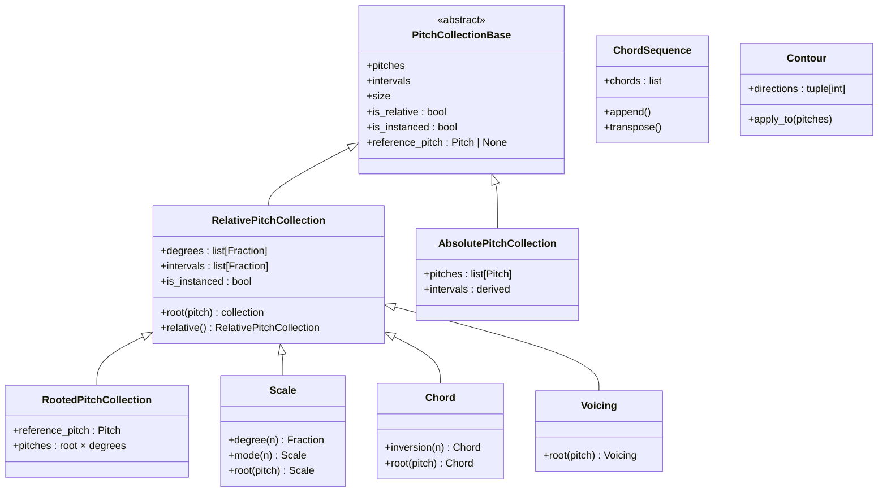
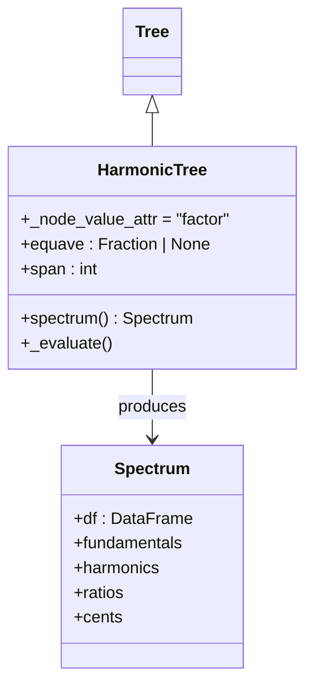
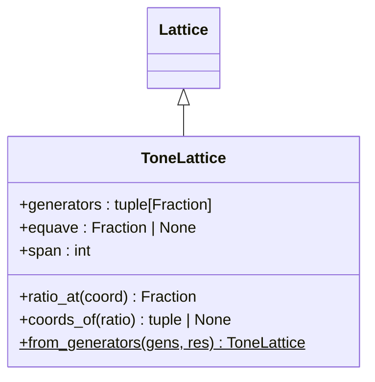
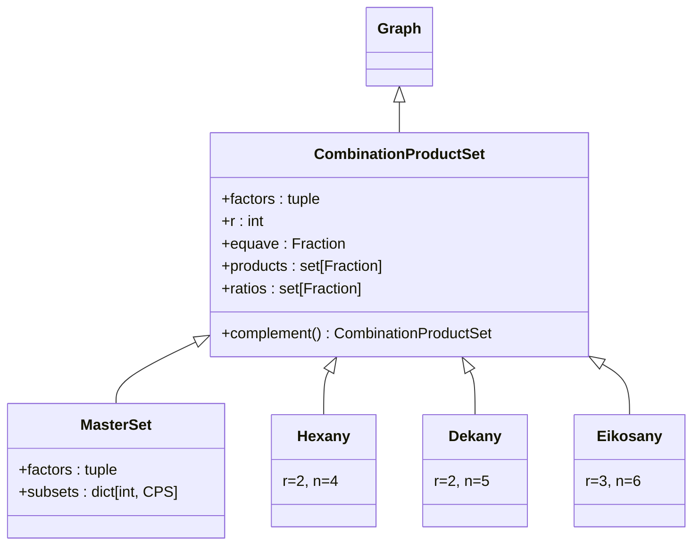
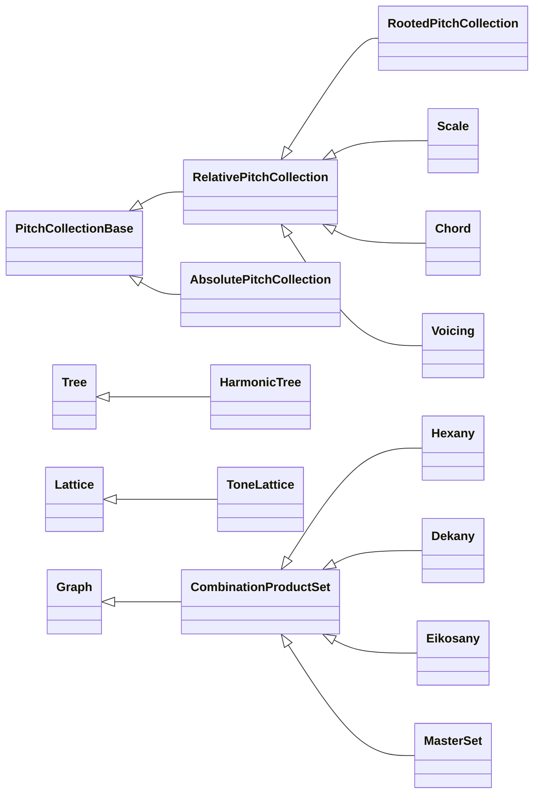

# Tonos — Pitch and Harmony

> *τόνος* (tonos) — "tension," "tone," "pitch."  The origin of the
> word "tone," describing both the phenomenon of pitch and the
> perception of timbre.

`klotho.tonos` models the tonal domain: individual pitches, scales,
chords, voicings, contour, and three graph-based tonal systems—
harmonic trees, tone lattices, and combination product sets.

---

## Module Map

```
tonos/
├── __init__.py
├── pitch/
│   ├── __init__.py
│   ├── pitch.py               # Pitch, PitchCollection hierarchy
│   ├── pitch_collections.py   # RelativePitchCollection, AbsolutePitchCollection, RootedPitchCollection
│   └── contour.py             # Contour (pitch-direction sequence)
├── scales/
│   ├── __init__.py
│   └── scale.py               # Scale, InstancedScale
├── chords/
│   ├── __init__.py
│   └── chord.py               # Chord, Voicing, ChordSequence
├── systems/
│   ├── __init__.py
│   ├── harmonic_trees/
│   │   ├── __init__.py
│   │   ├── harmonic_tree.py   # HarmonicTree(Tree)
│   │   ├── spectrum.py        # Spectrum (DataFrame view)
│   │   └── algorithms.py      # harmonic evaluation helpers
│   ├── tone_lattices/
│   │   ├── __init__.py
│   │   ├── tone_lattices.py   # ToneLattice(Lattice)
│   │   └── basis.py           # basis matrix, generator coordinates
│   └── combination_product_sets/
│       ├── __init__.py
│       ├── combination_product_sets.py  # CombinationProductSet(Graph)
│       ├── master_set.py               # MasterSet(CPS)
│       └── algorithms.py               # CPS graph construction
└── utils/
    ├── __init__.py
    ├── frequency_conversion.py   # freq ↔ midicent ↔ pitch class
    ├── harmonics.py              # partial_to_fundamental, first_equave
    ├── intervals.py              # ratio_to_cents, interval_cost, n_tet
    └── interval_normalization.py # equave_reduce, fold_interval, reduce_freq
```

---

## 1. Pitch Collection Hierarchy

The core abstraction is a hierarchy of pitch-collection classes, from
abstract to concrete:



### Key Distinctions

All of `Scale`, `Chord`, and `Voicing` extend `RelativePitchCollection`
directly.  They are **not** subclasses of each other — they are
specialized variants that enforce different constraints on the same
interval-based foundation.  Any `RelativePitchCollection` can be
given a root via `.root(pitch)` to produce concrete pitches.

| Class | Inherits from | Defined by | Key behavior |
|---|---|---|---|
| `RelativePitchCollection` | `PitchCollectionBase` | Interval ratios/cents | `.root(pitch)` → `RootedPitchCollection`; `.is_instanced` flag |
| `RootedPitchCollection` | `RelativePitchCollection` | Root + intervals | Has `reference_pitch`; produces `Pitch` objects |
| `Scale` | `RelativePitchCollection` | Intervals | Enforces unison, sorts, equave-reduces, adds `.mode(n)` |
| `Chord` | `RelativePitchCollection` | Intervals | Sorts, equave-reduces, no unison required, adds `.inversion(n)` |
| `Voicing` | `RelativePitchCollection` | Intervals | **No** equave reduction — preserves multi-octave spacing |
| `AbsolutePitchCollection` | `PitchCollectionBase` | Absolute `Pitch` objects | Stores concrete pitches directly |

### `Pitch`

A single pitch, wrapping a frequency ratio (`Fraction`).  Supports
conversion to/from MIDI, midicents, Hz, and pitch-class names.

### Instanced Collections

`InstancedScale`, `InstancedChord`, `InstancedVoicing` are type
aliases (not separate classes) — they are simply `Scale`, `Chord`,
and `Voicing` respectively, constructed with a `reference_pitch`.
Any relative collection becomes "instanced" when `.root(pitch)` is
called, producing concrete `Pitch` objects with Hz values.

---

## 2. HarmonicTree

**File:** `tonos/systems/harmonic_trees/harmonic_tree.py`  
**Inherits:** `Tree` (from `topos.graphs`)

A tree that models **multiplicative harmonic relationships**.  Each
node carries a `factor`; a leaf's *harmonic* is the product of all
factors along the path from the root.

### Class Diagram



### Construction

```python
ht = HarmonicTree(
    root=1,
    children=(3, 5, (7, (11, 13))),
    equave=Fraction(2, 1),
    span=1
)
```

### Node Data Model

| Key | Mutable? | Description |
|---|---|---|
| `factor` | **Yes** | The node's multiplicative factor |
| `harmonic` | No (derived) | Product of factors root → node |
| `multiple` | No (derived) | Absolute harmonic number |
| `ratio` | No (derived) | Equave-reduced ratio (if equave set) |

Only `factor` is writable; all other fields are recomputed by
`_evaluate()`.

### `_evaluate()` Algorithm

1. Walk the tree root → leaves.
2. Each node's `harmonic = parent.harmonic × node.factor`.
3. `multiple = harmonic` (absolute partial number).
4. If `equave` is set, `ratio = reduce_interval(harmonic, equave, span)`.

### Spectrum

The `spectrum()` method returns a `Spectrum` object—a pandas DataFrame
view with columns for fundamental, harmonic, ratio, and cents values
for every leaf node.

---

## 3. ToneLattice

**File:** `tonos/systems/tone_lattices/tone_lattices.py`  
**Inherits:** `Lattice` (from `topos.graphs`)

An *n*-dimensional lattice where each coordinate axis corresponds to
a prime (or user-defined generator) and each node represents a
frequency ratio.

### Class Diagram



### Construction

```python
tl = ToneLattice.from_generators(
    generators=(Fraction(3,2), Fraction(5,4)),
    resolution=3
)
```

Each coordinate `(a, b)` maps to the ratio
`generator[0]^a × generator[1]^b`, optionally reduced by an equave.

### Coordinate Semantics

In the default prime-based lattice:
- Axis 0 → powers of 3/2 (perfect fifths)
- Axis 1 → powers of 5/4 (major thirds)
- etc.

The lattice is **immutable** after construction (inherited from
`Lattice`).

---

## 4. Combination Product Sets (CPS)

**File:** `tonos/systems/combination_product_sets/combination_product_sets.py`  
**Inherits:** `Graph` (from `topos.graphs`)

Erv Wilson's **Combination Product Sets**: given a set of *n*
harmonic factors and a combination size *r*, the CPS is the set of
all products of *r*-element subsets.

### Class Diagram



### Named CPS Types

| Class | Factors (*n*) | Combination (*r*) | Products |
|---|---|---|---|
| `Hexany` | 4 | 2 | 6 |
| `Dekany` | 5 | 2 | 10 |
| `Pentadekany` | 6 | 2 | 15 |
| `Eikosany` | 6 | 3 | 20 |
| `Hebdomekontany` | 8 | 4 | 70 |

### MasterSet

The `MasterSet` generates **all** CPS subsets for a given set of
factors (every *r* from 1 to *n*), organized into a single graph
with edges connecting products that share *r-1* factors.

### Graph Structure

Nodes represent products (ratios).  Edges connect products that
differ by exactly one factor.  The graph is **immutable** after
construction.

---

## 5. Tonos Utilities

### `frequency_conversion.py`

| Function | Description |
|---|---|
| `freq_to_midicents(freq)` | Hz → midicents (MIDI × 100) |
| `midicents_to_freq(mc)` | Midicents → Hz |
| `freq_to_pitchclass(freq)` | Hz → pitch class name |
| `midicents_to_pitchclass(mc)` | Midicents → pitch class name |
| `pitchclass_to_freq(name)` | Pitch class name → Hz |

Constants: `A4_Hz = 440.0`, `A4_MIDI = 69`, `PITCH_CLASSES` (dict).

### `intervals.py`

| Function | Description |
|---|---|
| `ratio_to_cents(ratio)` | Frequency ratio → cents |
| `cents_to_ratio(cents)` | Cents → frequency ratio |
| `cents_to_setclass(cents)` | Cents → pitch-class integer |
| `ratio_to_setclass(ratio)` | Ratio → pitch-class integer |
| `split_partial(ratio)` | Decompose into octave + remainder |
| `harmonic_mean(a, b)` | Harmonic mean of two ratios |
| `arithmetic_mean(a, b)` | Arithmetic mean of two ratios |
| `logarithmic_distance(a, b)` | Log-distance between ratios |
| `interval_cost(ratio)` | Tenney height / harmonic distance |
| `n_tet(n)` | Generate *n*-tone equal temperament ratios |
| `ratios_n_tet(ratios, n)` | Map ratios to nearest *n*-TET steps |

### `harmonics.py`

| Function | Description |
|---|---|
| `partial_to_fundamental(partial, n)` | Fundamental from partial number |
| `first_equave(ratio, equave)` | Reduce ratio into first equave |

### `interval_normalization.py`

| Function | Description |
|---|---|
| `equave_reduce(ratio, equave)` | Reduce ratio into `[1, equave)` |
| `reduce_interval(ratio, equave, span)` | Reduce within *span* equaves |
| `reduce_interval_relative(ratio, ref, equave)` | Reduce relative to a reference |
| `reduce_sequence_relative(ratios, equave)` | Reduce a sequence preserving contour |
| `fold_interval(ratio, equave)` | Fold into `[1, √equave]` |
| `reduce_freq(freq, lo, hi)` | Reduce Hz into a frequency band |

---

## Class Inheritance Summary


