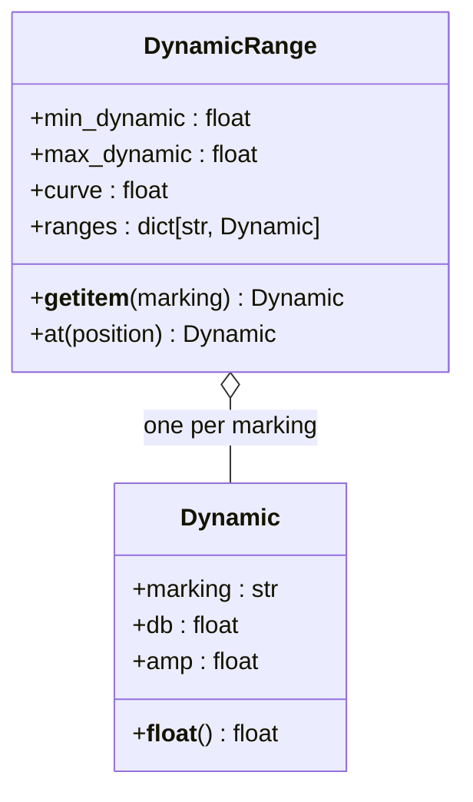
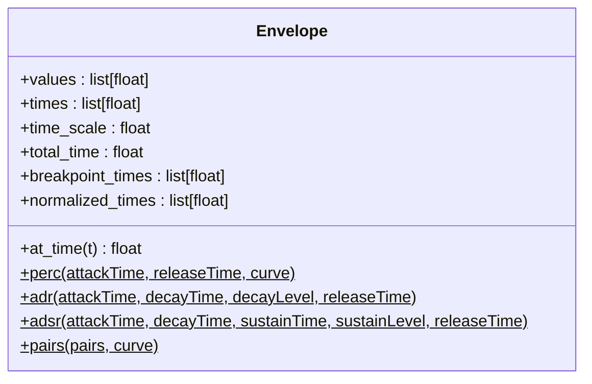
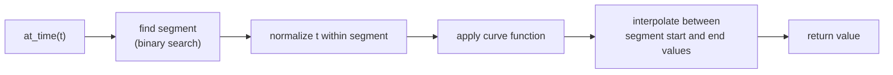
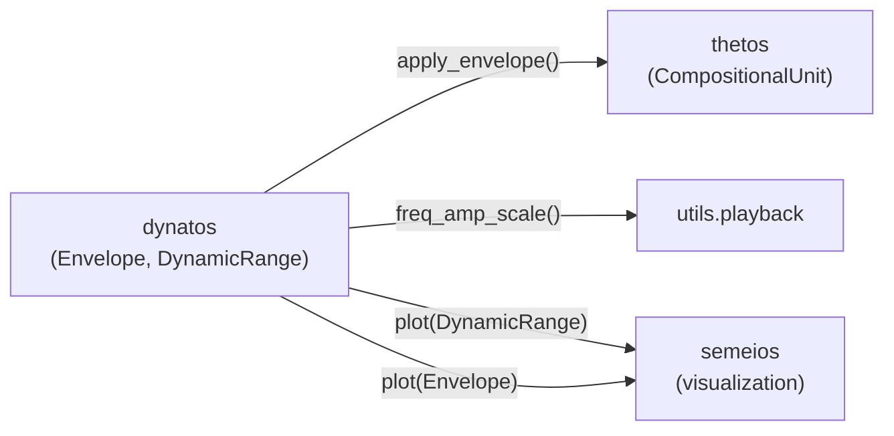

# Dynatos — Dynamics and Expression

> *δυνατός* (dynatos) — "powerful," "capable."  This module deals with
> the expressive aspects of music that shape how we perceive sound.

`klotho.dynatos` is the smallest of the domain subpackages.  It
provides two main abstractions—`Dynamic` / `DynamicRange` for
discrete dynamic levels and `Envelope` for continuous time-varying
parameter control—plus low-level amplitude utilities.

---

## Module Map

```
dynatos/
├── __init__.py
├── types.py                   # Amplitude, Decibel, Velocity unit wrappers
├── dynamics/
│   ├── __init__.py
│   ├── dynamics.py            # Dynamic, DynamicRange
│   └── utils/
│       ├── __init__.py
│       ├── amplitude.py       # amplitude conversion helpers
│       └── scaling.py         # dynamic scaling functions
└── envelopes/
    ├── __init__.py
    ├── envelopes.py           # Envelope
    └── utils/
        ├── __init__.py
        └── curves.py          # curve-shape functions
```

---

## 1. Dynamic and DynamicRange

**File:** `dynatos/dynamics/dynamics.py`

### Dynamic

Represents a single dynamic marking with both symbolic and numeric
representations.



### Built-in Markings

The standard dynamic vocabulary:

```
ppp  pp  p  mp  mf  f  ff  fff
```

Each is mapped to a decibel value.  `Dynamic.amp` converts via
`dbamp()` for linear amplitude.  A `Dynamic` is constructed from both
a `marking` and a `db_value` — normally you get them from a
`DynamicRange` rather than building them directly.

### DynamicRange

Maps a configurable tuple of markings onto a dB range
(`min_dynamic`/`max_dynamic`, default −60 to −3 dB) with optional
`curve` shaping.  Access by marking (`dr['mf']`) or by continuous
interpolation (`dr.at(0.5)` → the midpoint dynamic).

---

## 2. Envelope

**File:** `dynatos/envelopes/envelopes.py`

A flexible breakpoint envelope generator for time-varying parameter
control.  Immutable after construction.

### Class Diagram



### Construction

```python
env = Envelope(
    values=[0, 1, 0.5, 0],     # breakpoint values
    times=[0.1, 0.8, 0.1],     # segment durations
    curve=-3                   # curve shape (all segments)
)

env = Envelope.adsr()          # classic shapes as classmethods
env = Envelope.perc(attackTime=0.01, releaseTime=1.0)
```

The constructor also accepts `normalize_values`, `normalize_times`,
`value_scale`, and `time_scale` options.  (Curve data is internal —
there is no public `curves` property.)

### Curve Shapes

The `curve` parameter controls interpolation between breakpoints:

| Value | Shape |
|---|---|
| `0` | Linear |
| `< 0` | Exponential (fast attack / slow decay) |
| `> 0` | Logarithmic (slow attack / fast release) |

Per-segment curves are supported by passing a list.

### Envelope Evaluation



### Usage in Composition

Envelopes are applied to `CompositionalUnit` leaves via

```python
uc.apply_envelope(env, pfields='amp', node=uc.root)
```

(full signature: `apply_envelope(envelope, pfields, node, offset=0,
take=None, scope="span", control=False, endpoint=True)`), which
distributes sampled envelope values across the selected leaves'
parameter fields — or, with `control=True`, also records a runtime
control-envelope for bus-based automation.

---

## 3. Amplitude Utilities

### `dynamics/utils/amplitude.py`

| Function | Description |
|---|---|
| `ampdb(amp)` | Linear amplitude → decibels |
| `dbamp(db)` | Decibels → linear amplitude |

### `dynamics/utils/scaling.py`

| Function | Description |
|---|---|
| `freq_amp_scale(freq, db_level, min_db=-60)` | Frequency-dependent amplitude scaling (equal-loudness approximation) |

### `envelopes/utils/curves.py`

| Function | Description |
|---|---|
| `line(start, end, n)` | Linear ramp |
| `arch(n, curve)` | Arch-shaped envelope |
| `map_curve(value, curve)` | Apply curve transform to a normalized value |

---

## 4. Exported API

From `klotho.dynatos`:

```python
Dynamic, DynamicRange          # dynamics
ampdb, dbamp, freq_amp_scale   # amplitude utilities
Envelope                       # envelopes
line, arch, map_curve          # curve helpers
amplitude, decibel, velocity   # unit factory functions
```

The unit wrapper classes themselves (`Amplitude`, `Decibel`,
`Velocity`) live in `klotho.dynatos.types`.

These are **not** re-exported from the `klotho` top level — import
them from `klotho.dynatos`:

```python
from klotho.dynatos import Envelope, DynamicRange
```

---

## 5. Relationship to Other Subpackages



- **thetos** uses `Envelope` to shape parameter fields over time via
  `CompositionalUnit.apply_envelope()`.
- **playback** uses `freq_amp_scale()` for frequency-dependent gain
  compensation.
- **semeios** can plot both `DynamicRange` and `Envelope` objects
  through the `plot()` dispatcher.
