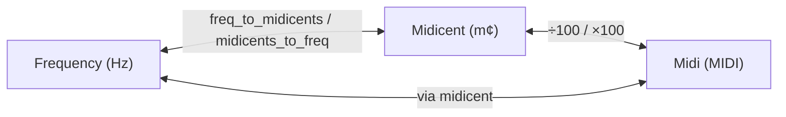
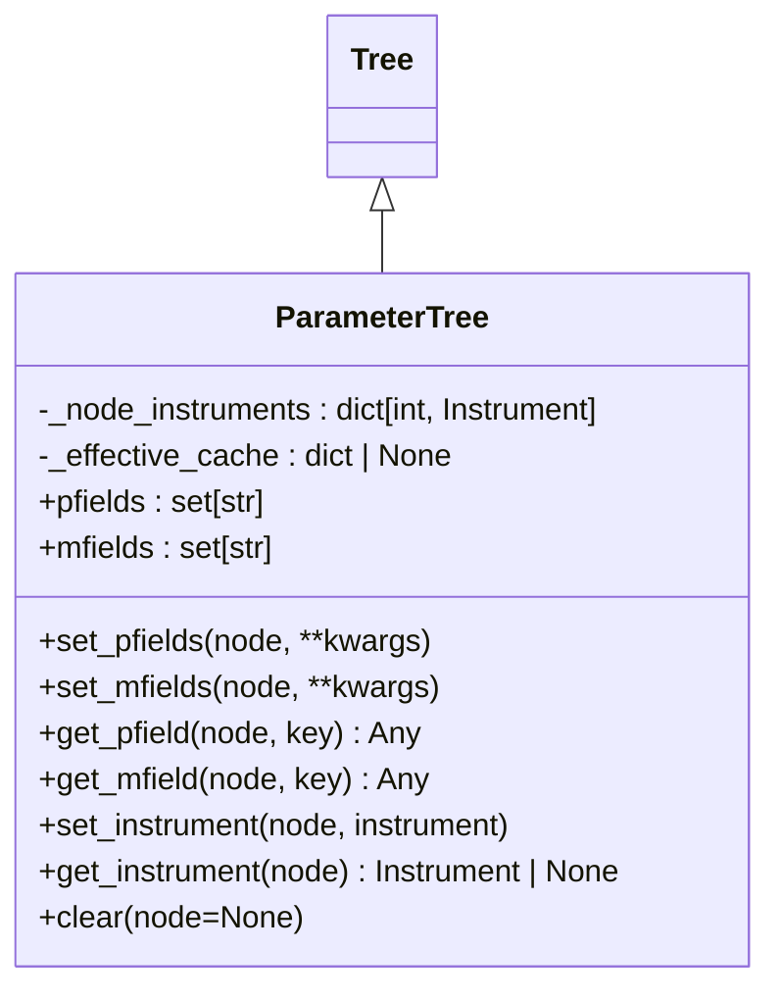
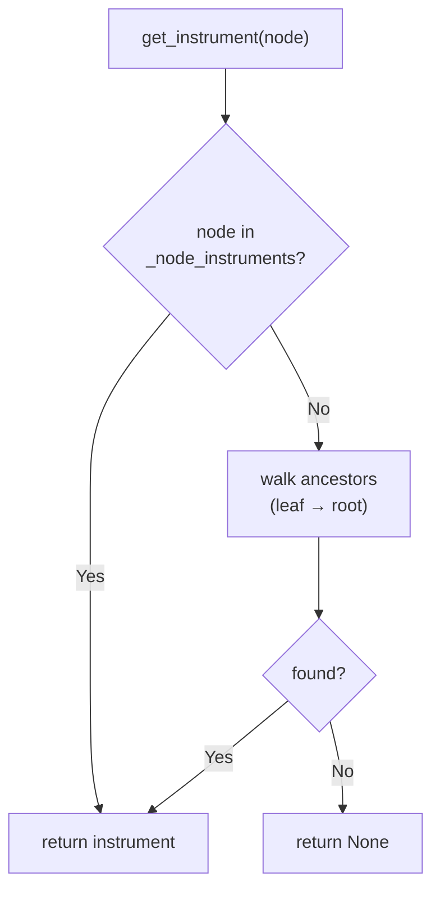
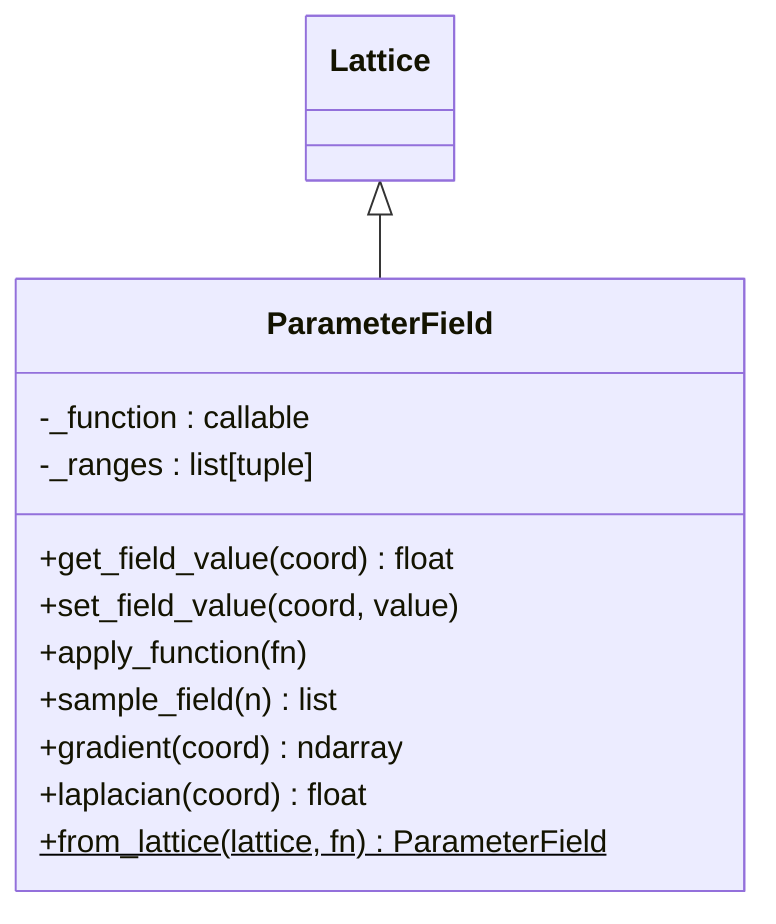
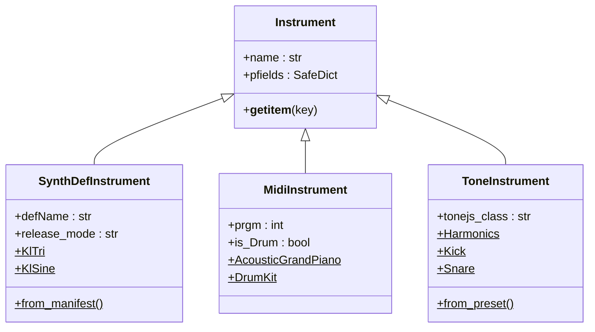
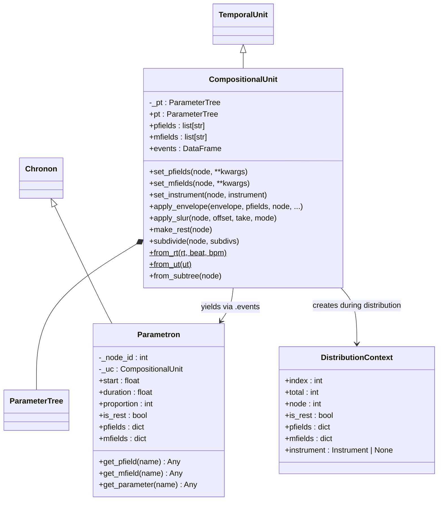
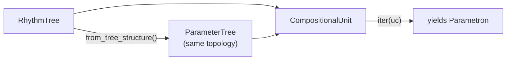
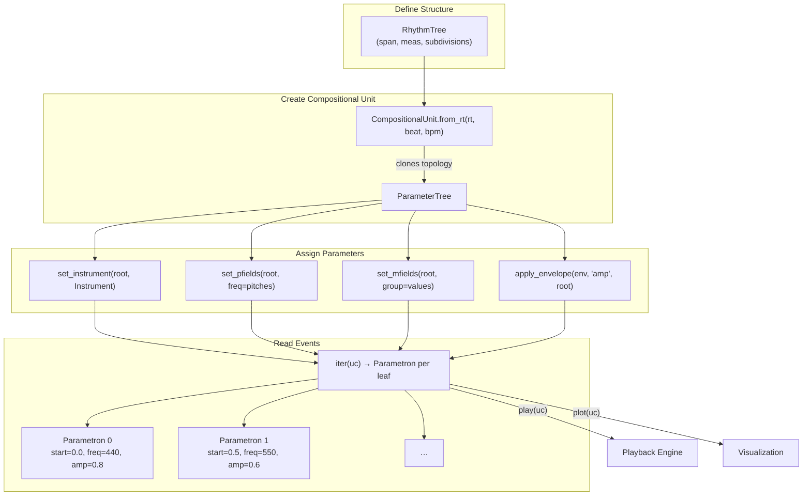

# Thetos — Composition and Parameters

> *θέτος* (thetos) — "placed," "set."  This module deals with the
> placement and configuration of musical parameters and instruments.

`klotho.thetos` is the **composition layer** — the bridge that unifies
time (chronos), pitch (tonos), and dynamics (dynatos) into playable
musical structures.  Its central abstraction is `CompositionalUnit`,
which wires a `ParameterTree` to a `RhythmTree` so that every
temporal event carries frequency, amplitude, instrument, and
arbitrary user-defined parameter data.

---

## Module Map

```
thetos/
├── __init__.py
├── types.py                         # Unit type wrappers (frequency, midi, amplitude…)
├── composition/
│   ├── __init__.py
│   └── compositional.py             # CompositionalUnit, Parametron, DistributionContext
├── instruments/
│   ├── __init__.py
│   ├── base.py                      # Instrument (base)
│   ├── instrument.py                # instrument lookup / registration
│   ├── _shared.py                   # shared constants
│   ├── synthdef.py                  # SynthDefInstrument (SuperCollider)
│   ├── midi.py                      # MidiInstrument (General MIDI)
│   ├── tone.py                      # ToneInstrument (Tone.js)
│   └── presets.py                   # preset definitions
└── parameters/
    ├── __init__.py
    ├── parameter_tree.py            # ParameterTree(Tree)
    └── parameter_fields/
        ├── __init__.py
        ├── parameter_field.py       # ParameterField(Lattice)
        ├── algorithms.py            # field algorithms
        └── functions.py             # built-in field functions
```

---

## 1. Type System

**File:** `thetos/types.py`

Lightweight wrapper classes that carry unit metadata and support
transparent NumPy array operations.

### Class Hierarchy


### Conversions

The pitch-related units form a conversion triangle:



Amplitude ↔ Decibel conversions use `ampdb` / `dbamp` from dynatos.

### Factory Functions

Lowercase convenience constructors exported at the top level:

```python
from klotho import frequency, midi, midicent, cent
from klotho import amplitude, decibel
from klotho import real_onset, real_duration, metric_onset, metric_duration
```

---

## 2. ParameterTree

**File:** `thetos/parameters/parameter_tree.py`  
**Inherits:** `Tree` (from `topos.graphs`)

A tree that mirrors the topology of a `RhythmTree` and stores per-node
parameter values with **automatic inheritance**: setting a value on
a parent propagates to all descendants unless overridden.

### Class Diagram



### Storage Model

- **Overrides** are stored only at the node where explicitly set
  (in the RustworkX node data dict).
- **Effective values** (resolved via ancestor chain) are computed
  on write and cached in `_effective_cache` for O(1) read.
- `_build_effective()` walks root → leaves, merging parent effective
  values with node overrides.
- Any mutation invalidates the cache via `_invalidate_caches()`.

### PFields vs MFields

| Type | Purpose | Examples |
|---|---|---|
| **pfields** (parameter fields) | Musical parameters that produce sound | `freq`, `amp`, `dur`, `pan`, `defName` |
| **mfields** (meta fields) | Metadata that affects rendering behavior | `group`, `slur`, `articulation` |

Both follow the same inheritance model.

### Instrument Resolution

Instruments are stored per-node in `_node_instruments`.  Resolution
walks up the ancestor chain:



### `from_tree_structure`

Creates a `ParameterTree` with the same topology as a source tree
(typically a `RhythmTree`) but **empty node data**.  This is how
`CompositionalUnit` synchronizes its PT with its RT.

---

## 3. ParameterField

**File:** `thetos/parameters/parameter_fields/parameter_field.py`  
**Inherits:** `Lattice` (from `topos.graphs`)

An *n*-dimensional lattice where each coordinate is evaluated through
a callable function, producing a continuous parameter field sampled
at discrete grid points.

### Class Diagram



### Evaluation

Each coordinate maps to a spatial point via `_coordinate_to_spatial_point`,
then the stored function is evaluated at that point:

```
coord → spatial_point → _function(spatial_point) → field_value
```

Unlike `Lattice`, `ParameterField` allows **node attribute writes**
(field values at individual coordinates can be overridden).

---

## 4. Instruments

**File:** `thetos/instruments/`

Three instrument backends, all inheriting from a common `Instrument`
base class.

### Class Hierarchy



### SynthDefInstrument (SuperCollider)

Wraps a SuperCollider synth definition.  Default synthdefs (`KlTri`,
`KlSine`, etc.) are loaded from `.scsyndef` files in
`utils/playback/supersonic/assets/`.

Key property: `release_mode` (`'free'` or `'gate'`) — determines
whether events use `\set + \release` or just `\new` with a fixed
duration.

### MidiInstrument (General MIDI)

Wraps a General MIDI program number.  Factory class methods for all
128 GM instruments plus drum kit.  `is_Drum` routes to MIDI channel
10.

### ToneInstrument (Tone.js)

Wraps a Tone.js synthesis class name and preset parameters.  Factory
presets for common sounds (`Harmonics`, `Kick`, `Snare`, etc.).

---

## 5. CompositionalUnit

**File:** `thetos/composition/compositional.py`  
**Inherits:** `TemporalUnit` (from `chronos`)

The central composition object.  Extends `TemporalUnit` with a
synchronized `ParameterTree` for hierarchical parameter management.

### Class Diagram



### How RT and PT Stay Synchronized



When `CompositionalUnit` is constructed, it creates a `ParameterTree`
that clones the `RhythmTree`'s topology.  Both trees share the same
node IDs, so a node in the RT maps 1:1 to the same node in the PT.

### Parametron

Extends `Chronon` with parameter access.  Each `Parametron`
represents a single event (leaf node) carrying:

- **Temporal data** — `start`, `duration`, `end`, `metric_onset`,
  `metric_duration` (inherited from `Chronon`).
- **Parameter data** — `pfields` dict, `mfields` dict, resolved
  instrument (from the PT).

### DistributionContext

When `set_pfields` distributes a callable or `Pattern` across nodes,
each node receives a `DistributionContext` providing its index,
total count, existing pfield/mfield values, and resolved instrument.
Callables can accept either `(ctx)` or `(index, total)` signatures.

### Envelope Application

```python
uc.apply_envelope(env, pfields='amp', node=uc.root)
```

Full signature:

```python
apply_envelope(envelope, pfields, node, offset=0, take=None, mode="span", endpoint=True)
```

Resolves `node` to its subtree leaves, then samples the `Envelope`
across their real-time span, writing the sampled values to the
specified pfield(s).  Returns a span ID for tracking.

### Slur Marking

```python
uc.apply_slur(node=uc.root, offset=0, take=None, mode="span")
```

Resolves `node` to subtree leaves and marks the selected span with
a slur mfield.  During playback, slurred notes are rendered with
tied gates (SuperSonic) or legato (Tone.js/MIDI).

---

## 6. End-to-End Composition Flow



---

## 7. Exported API

From `klotho.thetos`:

```python
ParameterTree, ParameterField
Instrument, SynthDefInstrument, MidiInstrument, ToneInstrument
CompositionalUnit, Parametron
frequency, cent, midicent, midi, amplitude, decibel
real_onset, real_duration, metric_onset, metric_duration
```

From `klotho` top level — all of the above plus the `types` module.
