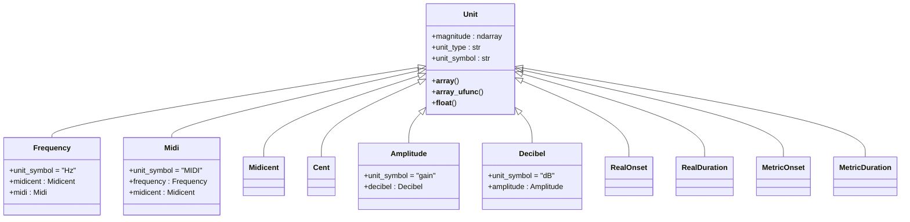
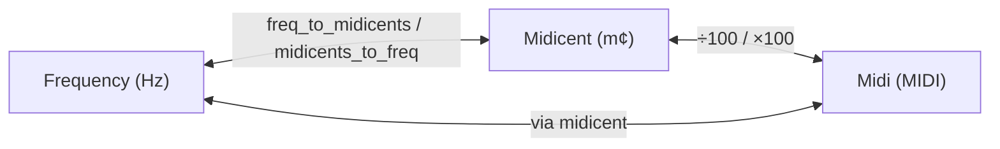
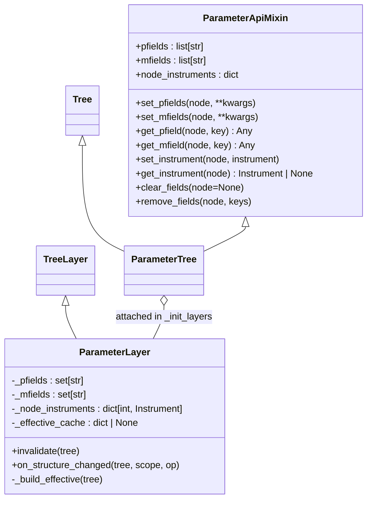
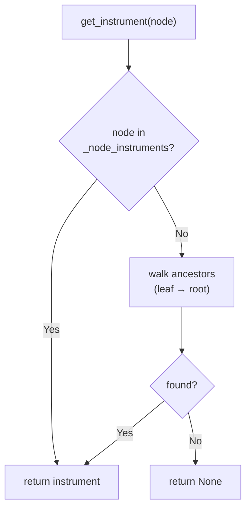
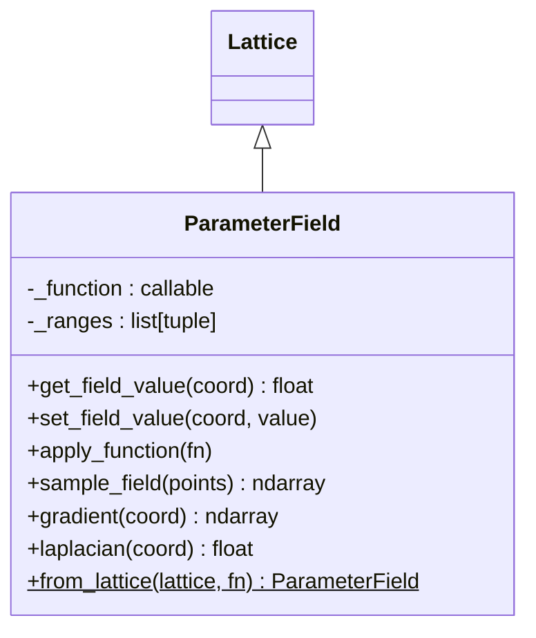
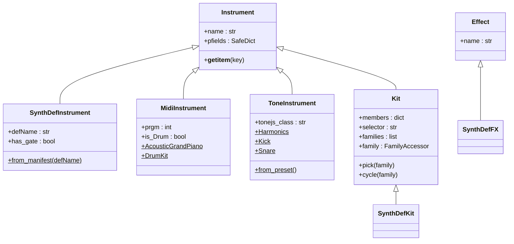
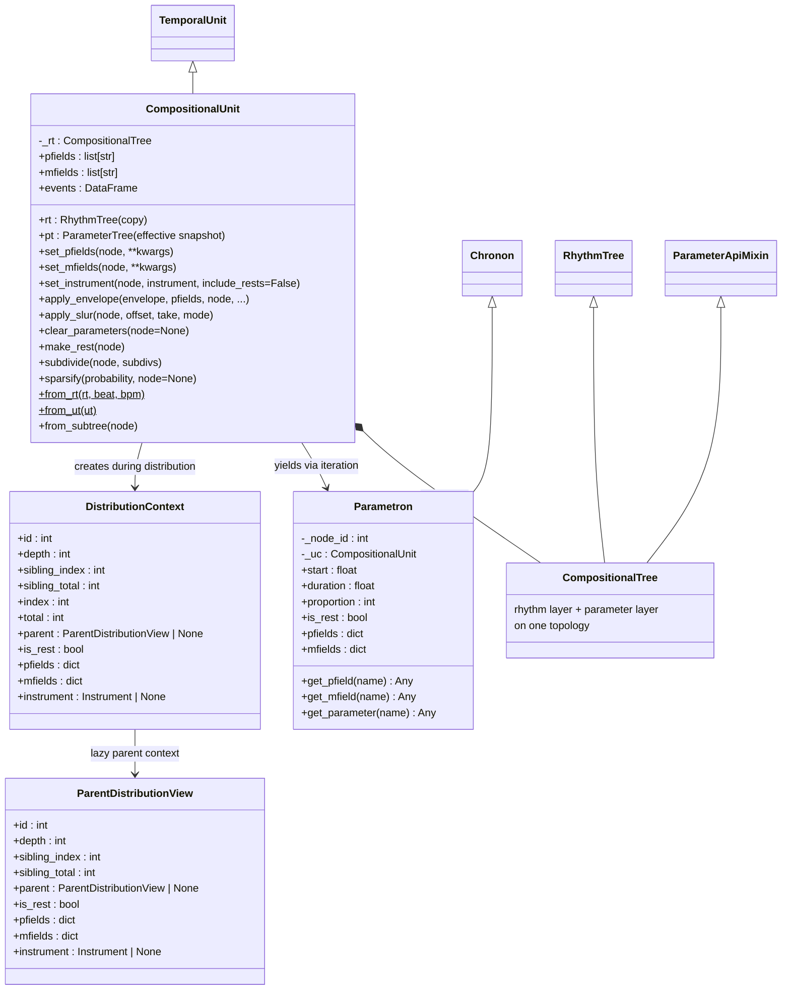
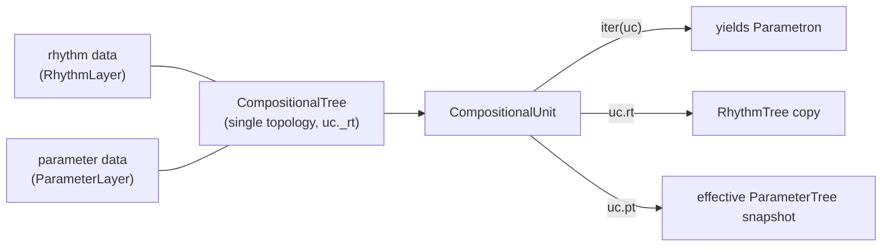
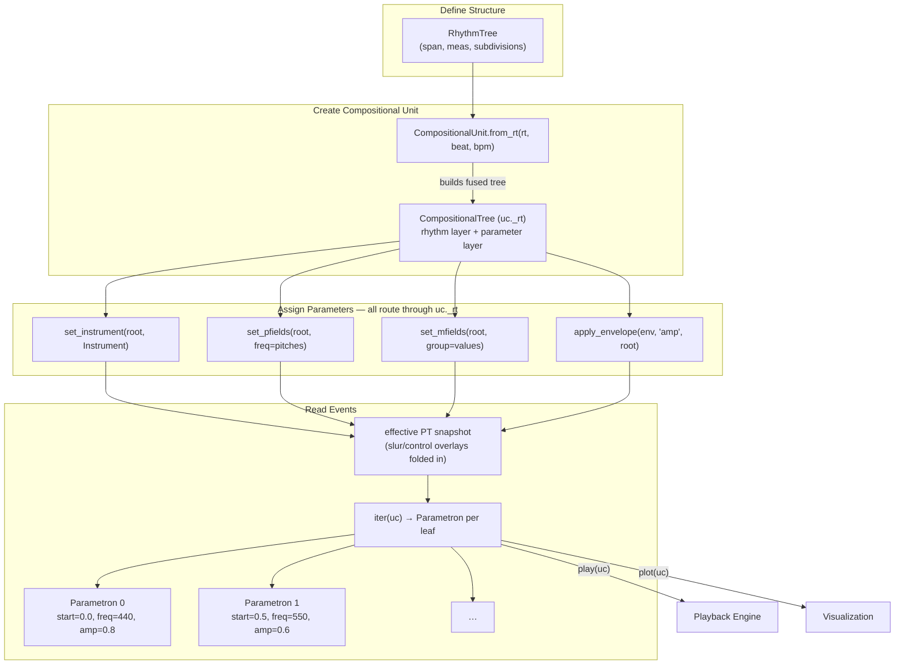

# Thetos — Composition and Parameters

> *θέτος* (thetos) — "placed," "set."  This module deals with the
> placement and configuration of musical parameters and instruments.

`klotho.thetos` is the **composition layer** — the bridge that unifies
time (chronos), pitch (tonos), and dynamics (dynatos) into playable
musical structures.  Its central abstraction is `CompositionalUnit`,
whose internal tree is a **fused `CompositionalTree`** carrying both
rhythm and parameter data on a single topology, so that every temporal
event carries frequency, amplitude, instrument, and arbitrary
user-defined parameter data.  `Score` arranges multiple units on a
shared timeline.

---

## Module Map

```
thetos/
├── __init__.py
├── types.py                         # Unit type wrappers (frequency, midi, amplitude…)
├── composition/
│   ├── __init__.py
│   ├── compositional.py             # CompositionalTree, CompositionalUnit, Parametron, selectors
│   ├── events.py                    # Event — one-shot score events (SetSpec/ReleaseSpec)
│   └── score.py                     # Score, ScoreItem, EventItem — multi-unit timeline
├── instruments/
│   ├── __init__.py
│   ├── base.py                      # Instrument, Kit, Effect (bases)
│   ├── _shared.py                   # shared constants
│   ├── synthdef.py                  # SynthDefInstrument, SynthDefFX, SynthDefKit (SuperCollider)
│   ├── midi.py                      # MidiInstrument (General MIDI)
│   ├── tone.py                      # ToneInstrument (Tone.js)
│   ├── ensemble.py                  # Ensemble — named instrument grouping
│   └── presets.py                   # preset definitions
└── parameters/
    ├── __init__.py
    ├── bind.py                      # Bind — per-node re-evaluated pfield values
    ├── parameter_tree.py            # ParameterLayer, ParameterApiMixin, ParameterTree
    └── parameter_fields/
        ├── __init__.py
        ├── parameter_field.py       # ParameterField(Lattice)
        ├── algorithms.py            # field algorithms
        └── functions.py             # built-in field functions
```

---

## 1. Type System

**File:** `thetos/types.py`

Lightweight wrapper classes that carry unit metadata and support
transparent NumPy array operations.

### Class Hierarchy



### Conversions

The pitch-related units form a conversion triangle:



Amplitude ↔ Decibel conversions use `ampdb` / `dbamp` from dynatos.

### Factory Functions

Lowercase convenience constructors exported at the top level:

```python
from klotho.types import frequency, midi, midicent, cent
from klotho.types import amplitude, decibel
from klotho.types import real_onset, real_duration, metric_onset, metric_duration
```

---

## 2. ParameterTree (and ParameterLayer)

**File:** `thetos/parameters/parameter_tree.py`  
**Inherits:** `ParameterApiMixin, Tree` (from `topos.graphs`)

A tree that stores per-node parameter values with **automatic
inheritance**: setting a value on a parent propagates to all
descendants unless overridden.

The parameter behavior is split into two pieces:

- **`ParameterLayer(TreeLayer)`** — owns the registered pfield/mfield
  key sets, the per-node instrument bindings (`_node_instruments`),
  and the effective-value cache (`_effective_cache`).
- **`ParameterApiMixin`** — exposes the public API (`set_pfields`,
  `set_instrument`, `clear_fields`, …) on any tree that carries a
  `ParameterLayer`.

This is what lets `CompositionalTree` carry parameters on a rhythm
tree's topology without a mirrored tree — it attaches the same layer
and mixes in the same API.

### Class Diagram



### Storage Model

- **Overrides** are stored only at the node where explicitly set
  (in the RustworkX node data dict).
- **Effective values** (resolved via ancestor chain) are computed
  **lazily on read** by `ParameterLayer._build_effective()` and cached
  in `_effective_cache` for O(1) subsequent reads.
- `_build_effective()` walks root → leaves, merging parent effective
  values with node overrides.
- Any write or structural mutation sets `_effective_cache = None`
  (via `layer.invalidate` / `layer.on_structure_changed`).

### PFields vs MFields

| Type | Purpose | Examples |
|---|---|---|
| **pfields** (parameter fields) | Musical parameters that produce sound | `freq`, `amp`, `dur`, `pan`, `defName` |
| **mfields** (meta fields) | Metadata that affects rendering behavior | `group`, `slur`, `articulation` |

Both follow the same inheritance model.

### Bind

`Bind` (`parameters/bind.py`) marks a pfield/mfield value that
**re-evaluates per reading node** instead of being resolved once at
write time — the late-binding escape hatch in the otherwise
store-rich/lower-late parameter model.

### Instrument Resolution

Instruments are stored per-node in the layer's `_node_instruments`.
Resolution walks up the ancestor chain:



### `from_tree_structure`

Creates a `ParameterTree` with the same topology as a source tree but
**empty node data**.  `CompositionalUnit` uses this to derive
**snapshots** — the `uc.pt` property extracts an effective
`ParameterTree` from the fused tree (node ids preserved).  It is not a
live synchronization mechanism; there is nothing to keep in sync.

---

## 3. ParameterField

**File:** `thetos/parameters/parameter_fields/parameter_field.py`  
**Inherits:** `Lattice` (from `topos.graphs`)

An *n*-dimensional lattice where each coordinate is evaluated through
a callable function, producing a continuous parameter field sampled
at discrete grid points.

### Class Diagram



### Evaluation

Each coordinate maps to a spatial point via `_coordinate_to_spatial_point`,
then the stored function is evaluated at that point:

```
coord → spatial_point → _function(spatial_point) → field_value
```

Unlike `Lattice`, `ParameterField` allows **node attribute writes**
(field values at individual coordinates can be overridden).

---

## 4. Instruments

**File:** `thetos/instruments/`

Three instrument backends, all inheriting from a common `Instrument`
base class.

### Class Hierarchy



The instruments package also provides `Ensemble` (`ensemble.py`), a
named grouping of instruments, and effect wrappers (`Effect`,
`SynthDefFX`).

### Kit and Ensemble access grammar

Both classes share one grammar — **dots navigate, brackets look up,
methods act**:

```python
kit['snare']            # member Instrument (str key or wrapping int index)
kit.family['tas']       # KitFamilyView; dot shorthand: kit.tas
kit.pick('tas')         # random selector KEY (pass as voice=)
kit.cycle('tas')        # Pattern of keys, round-robin
kit.tas.pick            # bound method = 0-arg callable: a fresh draw
                        # per sounding leaf in set_pfields(voice=...)

ens['kick']             # member, tagged with its family (auto-routes)
ens.family['drums']     # _FamilyView; dot shorthand: ens.drums
ens.pick('drums')       # random tagged Instrument (pass as inst=)
ens.cycle('drums')      # Pattern of tagged Instruments
```

Kits are driven by the ``voice=`` selector pfield (member key, or an
integer wrapping mod the member count); ``pick``/``cycle`` therefore
speak *keys*.  Ensembles are rosters whose members are full
instruments; their ``pick``/``cycle`` speak *tagged Instruments*.
Kit ``families=`` groupings may overlap; family names are validated
against member keys and class attributes (no reserved-name list).
An unknown string selector raises a ``KeyError`` listing the members
(with a hint when the string names a family) rather than silently
playing the default member.

### SynthDefInstrument (SuperCollider)

Wraps a SuperCollider synth definition, looked up by name in the
SuperSonic manifest:

```python
inst = SynthDefInstrument.from_manifest('kl_tri')
```

Default synthdefs are loaded from `.scsyndef` files in
`utils/playback/supersonic/assets/synthdefs/`.  Additional synthdefs
can be registered at runtime with `klotho.register_synthdef` (see the
playback doc).  `SynthDefKit.from_manifest({...})` builds a multi-member
kit keyed by a selector mfield.

Key property: **`has_gate`** — a derived `bool` (`'gate' in self._pfields`).
If the synthdef has a `gate` control, events emitted for it carry
`releaseAfter:true` and the runtime scheduler fires `gate=0` at
`start + dur` at fire time. There is no separate `release_mode` flag
to keep in sync; to make an instrument "one-shot," omit `gate` from
its pfields. To suppress auto-release on a single event, set
`releaseAfter=False` on that event.

### MidiInstrument (General MIDI)

Wraps a General MIDI program number.  Factory class methods for all
128 GM instruments plus drum kit.  `is_Drum` routes to MIDI channel
10.

### ToneInstrument (Tone.js)

Wraps a Tone.js synthesis class name and preset parameters.  Factory
presets for common sounds (`Harmonics`, `Kick`, `Snare`, etc.).

---

## 5. CompositionalUnit

**File:** `thetos/composition/compositional.py`  
**Inherits:** `TemporalUnit` (from `chronos`)

The central composition object.  `TemporalUnit`'s internal tree class
is pluggable via `_tree_class`; `CompositionalUnit` sets
`_tree_class = CompositionalTree`, where
`CompositionalTree(ParameterApiMixin, RhythmTree)` attaches **both** a
`RhythmLayer` and a `ParameterLayer` to one topology.  The unit's
single fused tree (`uc._rt`) therefore carries rhythm *and*
hierarchical parameters — there is no separate `ParameterTree` member.

### Class Diagram



### One Fused Tree (no RT/PT mirroring)



All parameter operations route through `uc._rt` (e.g. `uc.set_pfields`
calls `self._rt.set_pfields(...)`).  The accessors are derived views:
`uc.rt` returns a **copy** of the rhythm tree; `uc.pt` returns an
effective `ParameterTree` **snapshot** with node ids preserved,
including UC-level overlays (slurs, control envelopes) folded in via
`_build_effective_parameter_tree()`.

### Parametron

Extends `Chronon` with parameter access.  Each `Parametron`
represents a single event (leaf node) carrying:

- **Temporal data** — `start`, `duration`, `end`, `metric_onset`,
  `metric_duration` (inherited from `Chronon`).
- **Parameter data** — `pfields` dict, `mfields` dict, resolved
  instrument (read from the effective parameter snapshot).

Iterating the unit (`for p in uc:`) yields Parametrons; the `events`
property returns a pandas **DataFrame** summary instead.

### DistributionContext

When `set_pfields` distributes a callable or `Pattern` across nodes,
each node receives a `DistributionContext` providing its index,
total count, structural node data (`id`, `depth`, `sibling_index`,
`sibling_total`), existing pfield/mfield values, and resolved
instrument.

Callable distribution supports:

- **1-arg callable**: receives `ctx`
- **0-arg callable**: called with no args

(`(index, total)` is not a supported direct signature; use
`ctx.index` and `ctx.total`.)

`ctx.parent` returns a `ParentDistributionView` with structural and PT
data (`pfields`/`mfields`/`instrument`) for the parent node. Parent
views are not in the current distribution selection, so selection
fields (`index`, `total`) are intentionally absent there.

`set_instrument` accepts the same distribution forms (an
`Instrument`, kit-member key, `Pattern`, or callable) and **skips
rests by default** when distributing — pass `include_rests=True` to
advance the pattern on rests too (10.9.1).

### Selector Surface (UT/UC)

Selector traversal and targeting are now node-handle-first:

- `for branch in uc.at_depth(d): ...` yields node handles
  (`UTNodeHandle` / `UCNodeHandle`)
- raw integer IDs are available via `handle.id` and selection-level `.ids`
- subtree navigation (`.leaves`, `.children`) lives on the node handle
- owner helpers `uc.leaves_of(...)` / `uc.successors(...)` stay singleton-only
  and accept an `int`, `NodeHandle`, or singleton selector
- `uc.select(...)` accepts ints, node handles, selectors, and
  generators/comprehensions
- explicit singleton selector traversal is available via
  `.singletons()` / `.selectors()`

Canonical forms:

```python
for branch in uc.at_depth(1):
    branch.leaves.set_pfields(freq=...)

uc.select(branch.first_leaf for branch in uc.at_depth(1)).set_pfields(accent=1)
for singleton in uc.at_depth(1).singletons():
    singleton.leaves.set_mfields(group='x')

uc.select([3, 3, 7]).set_mfields(group='x')  # duplicates preserved intentionally
```

Invalid (raises):

```python
uc.at_depth(1).leaves        # multi-select is not a subtree anchor
uc.leaves_of(uc.at_depth(1)) # owner helper also requires singleton anchor
```

### Envelope Application

```python
uc.apply_envelope(env, pfields='amp', node=uc.root)
```

Full signature:

```python
apply_envelope(envelope, pfields, node, offset=0, take=None,
               scope="span", control=False, endpoint=True)
```

Resolves `node` to its subtree leaves, then samples the `Envelope`
across their real-time span, writing the sampled values to the
specified pfield(s).  Returns an envelope ID for tracking (a list of
IDs with `scope="per_node"`).  With `control=True`, values are still
baked for inspection but a control-envelope descriptor is also
recorded for runtime bus-based automation (a `__klEnvCtrl` control
synth in SuperSonic).  `remove_envelope(env_id)` undoes an
application.

### Slur Marking

```python
uc.apply_slur(node=uc.root, offset=0, take=None, mode="span")
```

Resolves `node` to subtree leaves and marks the selected span with
a slur mfield.  During playback, slurred notes are rendered with
tied gates (SuperSonic) or legato (Tone.js/MIDI).

---

## 6. Score and ScoreItem

**File:** `thetos/composition/score.py`

`Score` is an ordered collection of temporal units on a shared
timeline; adding a unit wraps it in a **`ScoreItem`** — a named, owned
wrapper that mediates *all* time mutation.  Outside a `Score`, a
temporal unit's time is immutable (no public offset setter, no
`set_duration`).

Key surface:

| API | Purpose |
|---|---|
| `score.add(unit, name=…, at=…/after=…/before=…, track=…)` | Place a unit on the timeline |
| `score.append(...)` / `score.prepend(...)` | Place relative to current extent |
| `score[name]` | Look up a `ScoreItem` by name |
| `score.track(name, inserts=[…])` | Register a named track with insert effects |
| `score.from_ensemble(ensemble)` | Create tracks from an `Ensemble` |
| `score.start` / `score.end` / `score.duration` | Timeline extent |
| `score.write(...)` | Export |
| `item.set_duration(secs, ripple=False)` | Scale the owned unit's bpm to hit a duration |
| `item.stretch(factor, ripple=False)` | Multiply duration |
| `item.freeze()` | Disallow further time mutation |

`ScoreItem` proxies attribute access to the owned unit, so
`score['intro'].set_pfields(...)` works directly.  `play(score)` and
score-aware SuperSonic playback consume the assembled timeline (see
the playback doc).

One-shot score events use **`Event`** (`composition/events.py`, with
`SetSpec`/`ReleaseSpec` action specs); adding one to a score wraps it
in an **`EventItem(ScoreItem)`** rather than a plain `ScoreItem`.

---

## 7. End-to-End Composition Flow



---

## 8. Exported API

`klotho.thetos.__all__`:

```python
ParameterTree, ParameterField, Bind
Instrument, Effect, SynthDefFX, Kit, SynthDefKit, Ensemble
CompositionalUnit, Parametron, Score, ScoreItem, Event, EventItem
frequency, cent, midicent, midi, amplitude, decibel
real_onset, real_duration, metric_onset, metric_duration
```

The backend classes `SynthDefInstrument`, `MidiInstrument`, and
`ToneInstrument` are importable from `klotho.thetos` (via
`klotho.thetos.instruments`) though not listed in `__all__`.  The
type factories are also available via the `klotho.types` module.
