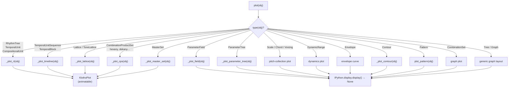
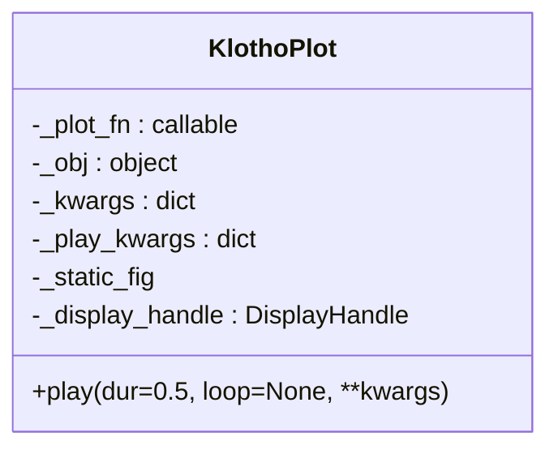
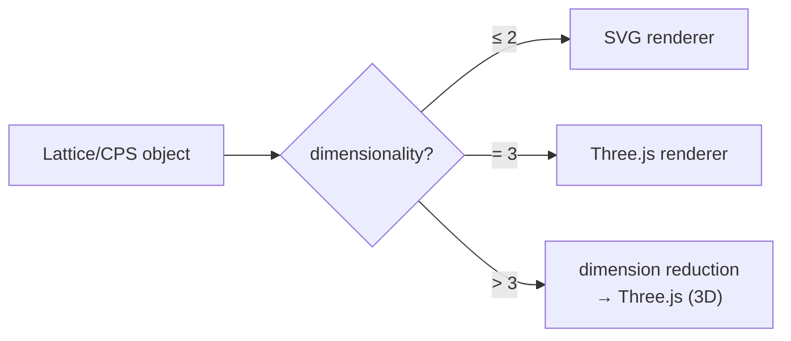
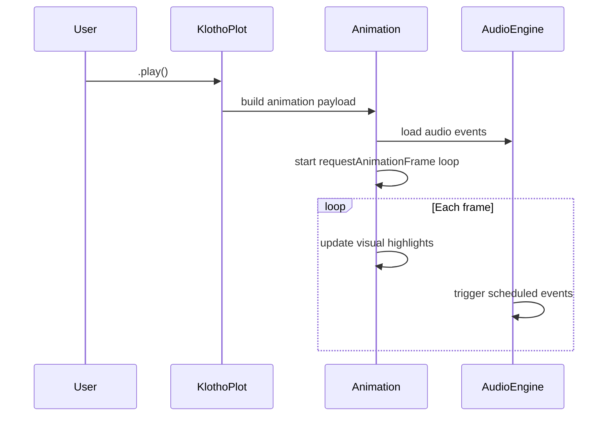

# Semeios — Visualization and Notation

> *σημεῖον* (semeion) — "sign," "mark."  This module provides tools for
> visualizing and notating musical structures.

`klotho.semeios` is the primary output layer for visual representation.
It provides a universal `plot()` dispatcher that routes Klotho objects
to type-specific renderers (SVG, Plotly, Three.js) and wraps animatable
results in `KlothoPlot` objects with integrated animation and audio
playback.  (Note-list export for SuperCollider was removed; audio
output lives in `utils.playback` — see the playback doc.)

---

## Module Map

```
semeios/
├── __init__.py                         # exports plot
└── visualization/
    ├── __init__.py
    ├── plots.py                        # plot() dispatcher + Plotly/matplotlib plotters
    ├── _plot_pattern.py                # Pattern plotting
    ├── _projections.py                 # projection helpers
    ├── _dispatch/
    │   ├── __init__.py
    │   ├── _klotho_plot.py             # KlothoPlot wrapper
    │   ├── plot_rt.py                  # RhythmTree plotting
    │   ├── plot_timeline.py            # UTS / BT multi-lane timeline plotting
    │   ├── plot_lattice.py             # Lattice / ToneLattice plotting
    │   └── plot_cps.py                 # CPS / MasterSet plotting
    ├── _renderers/
    │   ├── __init__.py
    │   ├── svg_rt.py                   # SVG renderer: rhythm trees
    │   ├── svg_timeline.py             # SVG renderer: UTS/BT timelines
    │   ├── svg_lattice.py              # SVG renderer: lattices
    │   ├── svg_cps.py                  # SVG renderer: CPS
    │   ├── svg_master_set.py           # SVG renderer: master sets
    │   ├── threejs_lattice.py          # Three.js renderer: lattices (3D)
    │   ├── threejs_cps.py              # Three.js renderer: CPS (3D)
    │   └── threejs_master_set.py       # Three.js renderer: master sets (3D)
    ├── _animation/
    │   ├── __init__.py
    │   ├── base.py                     # animation base utilities
    │   ├── animated.py                 # Animated*Figure classes (see §4)
    │   ├── _playback.js                # JS for lattice animation audio
    │   └── _shape_playback.js          # JS for CPS/shape animation audio
    └── _shared/
        ├── __init__.py
        ├── audio_ref.py                # reference_freq() for audio playback
        ├── colors.py                   # color scales, palettes
        ├── geometry.py                 # geometric layout helpers
        ├── svg_shared.py               # shared SVG building blocks
        └── svg_utils.py                # SVG utility functions
```

---

## 1. The `plot()` Dispatcher

**File:** `semeios/visualization/plots.py`

The single entry point for all visualization:

```python
from klotho import plot

result = plot(obj, **kwargs)
```

### Dispatch Logic



### Return Values

- **Animatable types** (`RhythmTree`, `Lattice`, `ToneLattice`, CPS,
  `MasterSet`, `TemporalUnit`, `CompositionalUnit`,
  `TemporalUnitSequence`, `TemporalBlock`) → returns a `KlothoPlot`.
- **Non-animatable types** (`Scale`, `Chord`, `Envelope`, `Contour`,
  `ParameterField`, `ParameterTree`, `Pattern`, `CombinationSet`,
  plain graphs, etc.) → displayed immediately via
  `IPython.display.display()`, returns `None`.
- **`PartitionSet`** has no plot branch (it is no longer graph-backed);
  `plot(ps)` raises `TypeError`.

---

## 2. KlothoPlot

**File:** `semeios/visualization/_dispatch/_klotho_plot.py`

A lazy wrapper around a plotting function and its target object that
knows how to trigger animated playback with audio.



### Lifecycle

1. `plot(obj)` wraps the plotting function and object in a
   `KlothoPlot`.
2. `__init__` **eagerly displays** the static figure via
   `IPython.display.display(..., display_id=True)` and keeps the
   display handle.  (`_repr_html_()` returns an empty string, so
   Jupyter's implicit repr does not double-render.)
3. User calls `.play(...)` → the plot function is re-run with
   `animate=True` (booting SuperSonic first) and the animated widget
   **updates the existing display handle in place**, synchronizing
   visual highlights with audio events through the selected playback
   engine.  Playback kwargs (`bpm`, `amp`, `arp`, `strum`, `loop`,
   `ring_time`, …) can be passed to `plot()` up front or to `.play()`.

---

## 3. Renderers

### 3.1 SVG Renderers (`_renderers/svg_*.py`)

Custom SVG generation for precise musical notation-style visuals:

| Renderer | Input types | Output |
|---|---|---|
| `svg_rt` | `RhythmTree`, `TemporalUnit`, `CompositionalUnit` | Proportional-notation timeline |
| `svg_timeline` | `TemporalUnitSequence`, `TemporalBlock` | Multi-lane real-time timeline; nested containers get outline boxes (`outlines=True`) |
| `svg_lattice` | `Lattice`, `ToneLattice` | 2D lattice grid with ratio labels |
| `svg_cps` | `CombinationProductSet` | Polygonal CPS diagram |
| `svg_master_set` | `MasterSet` | Nested CPS subsets |

SVG renderers use shared utilities from `_shared/svg_shared.py` and
`_shared/svg_utils.py` for consistent styling, node shapes, and edge
drawing.

### 3.2 Three.js Renderers (`_renderers/threejs_*.py`)

Interactive 3D visualizations rendered via Three.js in the browser:

| Renderer | Input types | Output |
|---|---|---|
| `threejs_lattice` | `Lattice`, `ToneLattice` (3D+) | Rotating 3D lattice |
| `threejs_cps` | `CombinationProductSet` | 3D CPS polyhedron |
| `threejs_master_set` | `MasterSet` | 3D nested CPS |

Three.js renderers generate HTML/JS widgets embedded in Jupyter cells.
They use `_shared/geometry.py` for coordinate transformations and
`_shared/colors.py` for consistent coloring.

### 3.3 Renderer Selection

The dispatch layer auto-selects SVG (2D) or Three.js (3D) based on
the object's dimensionality:



Lattices with dimensionality > 3, lazy lattices, or very large node
counts go through coordinate reduction before the 3D render
(`plot_lattice.py:379-514`).

---

## 4. Animation System

**File:** `semeios/visualization/_animation/`

### Animated Figure Classes (`animated.py`)

One class per figure family, all following the same
payload-plus-`requestAnimationFrame` pattern:

| Class | Figure |
|---|---|
| `AnimatedLattice3dFigure` | 3D (Three.js) lattice |
| `AnimatedLattice3dSelectFigure` | 3D lattice with node-selection run (`nodes=`) |
| `AnimatedLatticeSvgFigure` | 2D SVG lattice |
| `AnimatedNodeSelectSvgFigure` | 2D SVG lattice with node-selection run |
| `AnimatedRTSvgFigure` | RhythmTree / UT / UC proportional timeline |
| `AnimatedTimelineSvgFigure` | UTS / BT multi-lane timeline |
| `_AnimatedShapeFigureBase` | Shared base for CPS / MasterSet shape figures |

Time-synchronized animation flow:



### JavaScript Playback Modules

- **`_playback.js`** — Audio-visual sync for lattice path animations.
  Highlights nodes as audio events trigger.
- **`_shape_playback.js`** — Audio-visual sync for CPS/shape
  animations.  Highlights facets and vertices.

---

## 5. Layout and Positioning

### CPS Layout (`_dispatch/plot_cps.py`)

CPS nodes are positioned using geometric or dimensional-reduction
techniques:

| Method | When used |
|---|---|
| Polygon vertices | Small CPS (hexany = hexagon, dekany = decagon) |
| MDS (`sklearn.manifold.MDS`) | Larger CPS, distance-based |
| SpectralEmbedding | Alternative for high-dimensional CPS |

`_reduce_positions()` and `_cps_node_positions()` handle the
coordinate computation.

### Lattice Layout

2D lattices use direct coordinate mapping.  3D+ lattices pass
coordinates to Three.js for camera-rotatable rendering.

### RT Layout

Rhythm trees are laid out as proportional timelines — each leaf's
width is proportional to its duration, nested subdivisions are shown
as grouped brackets.

### Timeline Layout (`_renderers/svg_timeline.py`)

`TemporalUnitSequence` / `TemporalBlock` render as multi-lane
real-time timelines.  `_resolve_lanes()` assigns each contained UT/UC
a lane with a deterministic recursive layout — nested containers
stack vertically for blocks and share lanes for sequences — and
`outlines=True` (default) draws outline boxes around nested container
extents.

### Lattice Node Highlighting (`nodes=` / `path=`)

`plot(lattice, nodes=[...])` highlights specific coordinates;
`plot(lattice, path=[...])` highlights a traversal.  `nodes=` also
accepts a `Scale` on lattice-family objects (`_resolve_scale_nodes()`,
`plot_lattice.py:200`): each scale degree is resolved to its lattice
coordinate, and `.play()` runs the scale stepwise up `equaves`
octave-copies (`_scale_nodes_run()`).

Lattice plots also take `layout=` — `'lattice'` (default), `'cells'`
(filled squares/cubes, ≤3D, pairs with `shape=` for polyomino
groups), or `'tonnetz'` (triangular Tonnetz layout) — and `shape=`
(chords, chord sequences, or coordinate groups).

---

## 6. Shared Utilities (`_shared/`)

| Module | Contents |
|---|---|
| `colors.py` | Color scales (ratio-based hue mapping), palettes, opacity functions |
| `geometry.py` | 2D/3D coordinate transforms, polygon generation, edge midpoints |
| `svg_shared.py` | Reusable SVG building blocks (nodes, edges, labels, arrows) |
| `svg_utils.py` | SVG string assembly, viewport calculation, CSS injection |

---

## 7. Supported Plot Types — Full Matrix

| Input type | Renderer | Returns | Animatable |
|---|---|---|---|
| `RhythmTree` | SVG (proportional timeline) | `KlothoPlot` | Yes |
| `TemporalUnit` | SVG (proportional timeline) | `KlothoPlot` | Yes |
| `CompositionalUnit` | SVG (proportional timeline) | `KlothoPlot` | Yes |
| `Lattice` (2D) | SVG grid | `KlothoPlot` | Yes |
| `Lattice` (3D+) | Three.js | `KlothoPlot` | Yes |
| `ToneLattice` | SVG or Three.js | `KlothoPlot` | Yes |
| `CombinationProductSet` | SVG polygon or Three.js | `KlothoPlot` | Yes |
| `MasterSet` | SVG or Three.js | `KlothoPlot` | Yes |
| `ParameterField` | field plot (`_plot_field`) | `None` | No |
| `ParameterTree` | matplotlib tree plot | `None` | No |
| `Scale` / `Chord` / `Voicing` | Plotly | `None` | No |
| `DynamicRange` | Plotly | `None` | No |
| `Envelope` | Plotly curve | `None` | No |
| `Contour` | matplotlib step plot (`_plot_contour`) | `None` | No |
| `Pattern` | pattern plot (`plot_pattern`) | `None` | No |
| `CombinationSet` | graph plot | `None` | No |
| `Tree` / `Graph` | generic graph layout | `None` | No |
| `TemporalUnitSequence` | SVG multi-lane timeline | `KlothoPlot` | Yes |
| `TemporalBlock` | SVG multi-lane timeline | `KlothoPlot` | Yes |
| `PartitionSet` | — | raises `TypeError` (no plot branch) | — |
