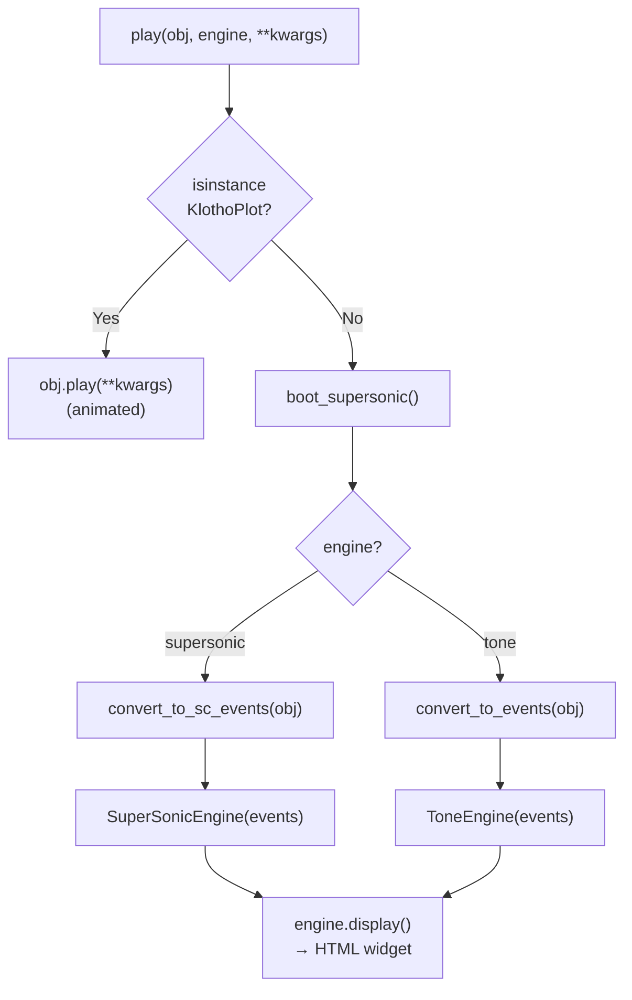
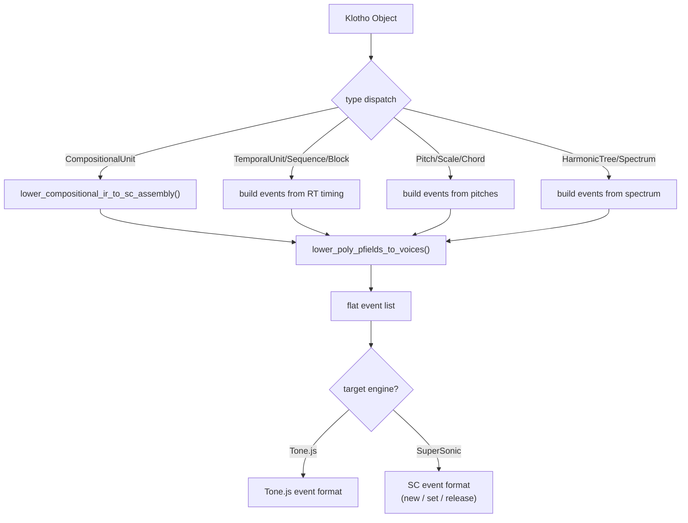
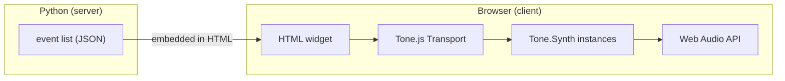
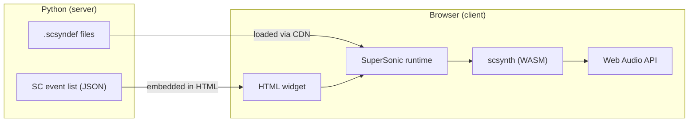
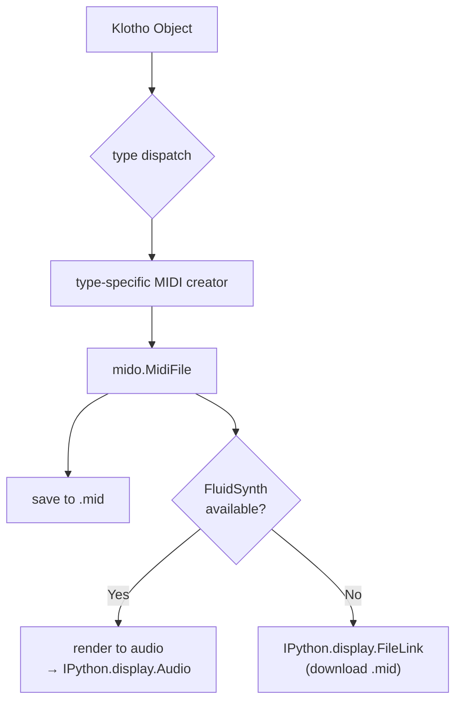
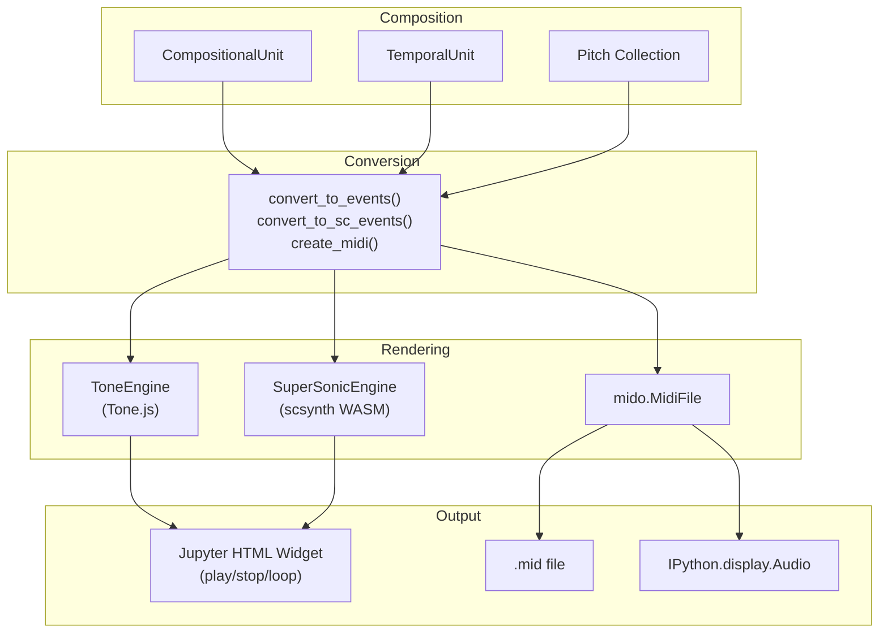

# Playback — Audio Rendering Pipeline

`klotho.utils.playback` converts Klotho musical objects into audible
output within Jupyter notebooks.  It supports two browser-based
synthesis engines (Tone.js and SuperSonic) plus MIDI file export.

---

## Module Map

```
utils/playback/
├── __init__.py
├── player.py                  # play() — top-level dispatcher
├── _config.py                 # set_audio_engine / get_audio_engine
├── _converter_base.py         # shared conversion logic
├── _amplitude.py              # voice amplitude computation
├── _sc_assembly.py            # CompositionalUnit → SC event assembly
├── _session_boot.py           # boot_supersonic() — lazy loader
├── animation_events.py        # events for animated KlothoPlot playback
├── midi_player.py             # play_midi(), create_midi()
├── tonejs/
│   ├── __init__.py
│   ├── engine.py              # ToneEngine — HTML widget
│   ├── converters.py          # convert_to_events()
│   └── cdn.py                 # CDN URLs for Tone.js, Plotly, Three.js
└── supersonic/
    ├── __init__.py
    ├── engine.py              # SuperSonicEngine — HTML widget
    ├── converters.py          # convert_to_sc_events()
    ├── cdn.py                 # SuperSonic CDN URLs
    ├── _vendor/
    │   └── synthdef_parser/   # vendored .scsyndef parser (MIT)
    ├── scripts/
    │   └── regenerate_manifest.py  # rebuilds flat manifest.json from .scsyndef
    └── assets/
        ├── manifest.json      # flat {name: {control: default}} dict
        └── *.scsyndef         # compiled synth definition files
```

---

## 1. Top-Level Entry Point

**File:** `utils/playback/player.py`

```python
from klotho import play

play(obj)                     # uses default engine
play(obj, engine='tone')      # force Tone.js
play(obj, engine='supersonic')  # force SuperSonic
```

### Dispatch Flow



### Engine Configuration

```python
from klotho import set_audio_engine, get_audio_engine

set_audio_engine('supersonic')  # default
set_audio_engine('tone')        # switch to Tone.js
```

The default engine is `'supersonic'` (browser-based scsynth).

---

## 2. Event Conversion Pipeline

Both engines share a common conversion pipeline that transforms Klotho
objects into flat event lists.

### Supported Input Types

| Type | Category |
|---|---|
| `Pitch` | Single pitch |
| `Scale` | Pitch collection |
| `Chord`, `Voicing` | Pitch collection |
| `ChordSequence` | Sequence of chords |
| `Spectrum` | HarmonicTree spectrum |
| `HarmonicTree` | Tonal system |
| `RhythmTree` | Temporal (default pitch) |
| `TemporalUnit` | Temporal (default pitch) |
| `TemporalUnitSequence` | Temporal sequence |
| `TemporalBlock` | Parallel temporal |
| `CompositionalUnit` | Full composition |

### Conversion Architecture



### Shared Converter Base (`_converter_base.py`)

| Function | Purpose |
|---|---|
| `_get_addressed_collection(obj)` | Extract pitch data from any collection type |
| `scale_pitch_sequence(pitches, n)` | Stretch/cycle a pitch list to length *n* |
| `extract_convert_kwargs(kwargs)` | Parse `dur`, `arp`, `strum`, `mode` kwargs |
| `lower_poly_pfields_to_voices(events)` | Expand polyphonic pfields (lists of freqs) into separate voice events |
| `lower_event_ir_to_voice_events(events)` | Flatten intermediate representation to voice events |
| `iter_group_sequence(uc)` | Iterate CompositionalUnit events respecting groups |

### SC Assembly (`_sc_assembly.py`)

Specialized conversion for `CompositionalUnit` → SuperSonic events.
Handles:

- **Gated vs free instruments** — gated instruments use `new` + `set`
  + `release` triplets; free instruments use a single `new`.
- **Slur rendering** — slurred notes sustain across boundaries, with
  `set` messages updating pitch/amp mid-note.
- **Polyphonic voice expansion** — pfields containing lists (e.g.
  chords) are expanded into concurrent voice events.

### Amplitude Computation (`_amplitude.py`)

| Function | Purpose |
|---|---|
| `single_voice_amplitude(freq, n_voices)` | Compute amplitude for one voice in a chord |
| `compute_voice_amplitudes(freqs)` | Frequency-dependent gain balancing |

Uses `freq_amp_scale()` from dynatos for equal-loudness compensation.

---

## 3. Tone.js Engine

**File:** `utils/playback/tonejs/engine.py`

### ToneEngine

Generates an HTML/JS widget that:

1. Loads Tone.js from CDN.
2. Creates synthesizer instances for each instrument.
3. Schedules events on the Tone.js Transport.
4. Renders play/stop/loop controls.



### Event Format (Tone.js)

```json
{
  "start": 0.0,
  "duration": 0.5,
  "instrument": "Harmonics",
  "freq": 440.0,
  "amp": 0.8,
  "pan": 0.0
}
```

---

## 4. SuperSonic Engine

**File:** `utils/playback/supersonic/engine.py`

### SuperSonicEngine

Generates an HTML widget that:

1. Loads SuperSonic (browser-based scsynth) from CDN.
2. Loads compiled `.scsyndef` synth definitions.
3. Schedules `new` / `set` / `release` messages on a timeline.
4. Renders play/stop controls.



### Event Format (SuperSonic)

Three message types:

```json
{"type": "new",     "time": 0.0,  "defName": "kl_tri", "args": {"freq": 440, "amp": 0.8}, "nodeId": 1000}
{"type": "set",     "time": 0.25, "nodeId": 1000, "args": {"freq": 550}}
{"type": "release", "time": 0.5,  "nodeId": 1000}
```

- **`new`** — allocate a synth node with initial parameters.
- **`set`** — update parameters on a running node (used for slurs,
  parameter changes).
- **`release`** — free the node (triggers envelope release).

### Default SynthDefs

| Name | Description |
|---|---|
| `kl_tri` | Triangle wave with filter |
| `kl_sine` | Sine wave |
| `kl_kicktone` | Kick drum tone |

Definitions are compiled `.scsyndef` files in `supersonic/assets/`.
The `manifest.json` lists registered synthdefs as a flat dict
`{synth_name: {control_name: default_value}}`. It is auto-regenerated
from the compiled `.scsyndef` blobs by

```bash
python -m klotho.utils.playback.supersonic.scripts.regenerate_manifest
```

(use `--dry-run` to preview). The script uses a vendored copy of
`synthdef_parser` at `supersonic/_vendor/synthdef_parser/` (no external
install).

### Event-list contract: `dur` + `releaseAfter` (auto-release)

Every `new`/`set` event produced by the lowering layer carries two
top-level fields beyond the legacy `type, id, defName, start, pfields`:

- `dur: number` — the leaf's duration in seconds.
- `releaseAfter: bool` — `true` on the terminal event of each uid's
  chain (the last `set` of a slur, or any single-leaf `new`).

The lowering layer **never emits** explicit `{type:"release", id, start}`
events for normal lifecycle gate-off any more. Instead, the SuperSonic
JS scheduler introspects the manifest at fire time: when it sees
`releaseAfter:true` on a `new`/`set` and `'gate' in manifest[defName]`,
it NTP-schedules a `/n_set <node> gate 0` at `start + dur` alongside
the primary OSC bundle. For non-gated synths (no `gate` control) the
scheduler no-ops, so the lowering layer can emit the same metadata
uniformly without per-instrument branching.

`type:"release"` events are still accepted by the validator and the
schedulers as an explicit override path; only the lowering layer was
updated to stop producing them automatically.

The native SC scheduler (`EventScheduler.sc`) will gain the same
fire-time inspection path in a follow-up using
`SynthDescLib.global.at(name).controlDict.includesKey(\gate)`. Until
that lands, SC scheduling falls back to consuming any explicit
`type:"release"` events as before.

### Session Boot

`boot_supersonic()` is called lazily on first `play()` invocation.
It checks whether SuperSonic is available and pre-loads the CDN
resources.  In Jupyter/Colab environments, it injects the required
`<script>` tags.

---

## 5. MIDI Export

**File:** `utils/playback/midi_player.py`

### `play_midi(obj, …)`

Converts a Klotho object to MIDI events, renders to audio (if
FluidSynth is available), and returns an `IPython.display.Audio`
widget.

### `create_midi(obj, …)`

Returns a `mido.MidiFile` for saving to disk.

### MIDI Conversion Flow



### MIDI Features

- **Multi-port MIDI** — up to 256 channels (16 channels × 16 ports)
  for large orchestrations.
- **Microtonal pitch bend** — sub-semitone pitches are rendered using
  per-note pitch-bend messages.
- **Drum routing** — `MidiInstrument.is_Drum` routes events to MIDI
  channel 10.
- **Program changes** — instruments with `prgm` numbers insert program
  change events.

### Supported Types for MIDI

| Type | MIDI Output |
|---|---|
| `CompositionalUnit` | Full parametric events with instruments |
| `TemporalUnit` / `TemporalUnitSequence` / `TemporalBlock` | Rhythm with default pitch |
| `RhythmTree` | Rhythm with default pitch |
| `ChordSequence` | Chords with timing |
| `Scale` | Ascending scale |
| `Chord` / `Voicing` | Simultaneous pitches |
| Pitch collection types | Arpeggiated or simultaneous |

---

## 6. Animation Events

**File:** `utils/playback/animation_events.py`

Bridges the playback system with the animation system in semeios:

| Function | Purpose |
|---|---|
| `build_path_audio_events(obj, path)` | Audio events for lattice path animation |
| `build_shape_audio_events(obj)` | Audio events for CPS shape animation |
| `normalize_animation_payload_for_engine(payload, engine)` | Convert animation events to engine-specific format |

These functions are called by `KlothoPlot.play()` to synchronize
audio with visual animation.

---

## 7. End-to-End Pipeline Summary


