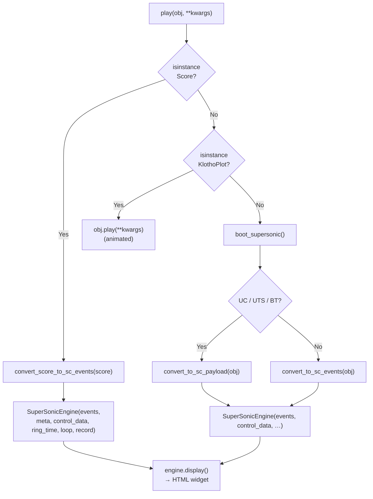
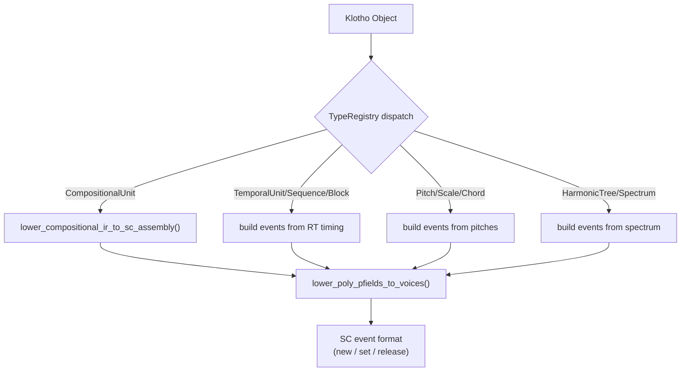
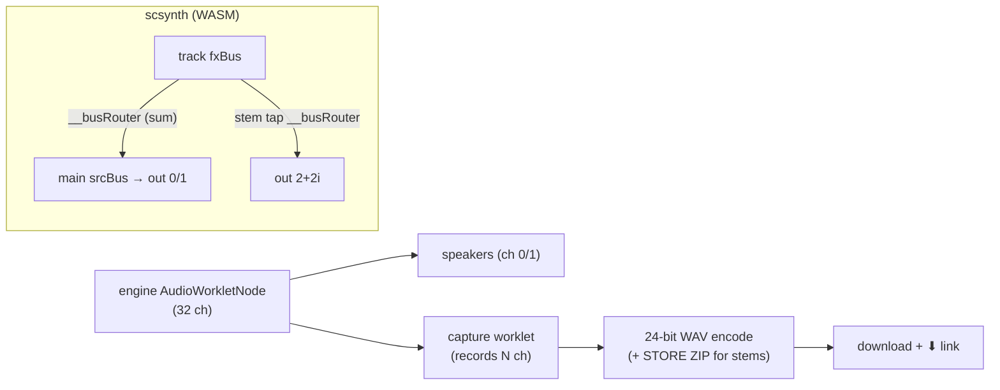
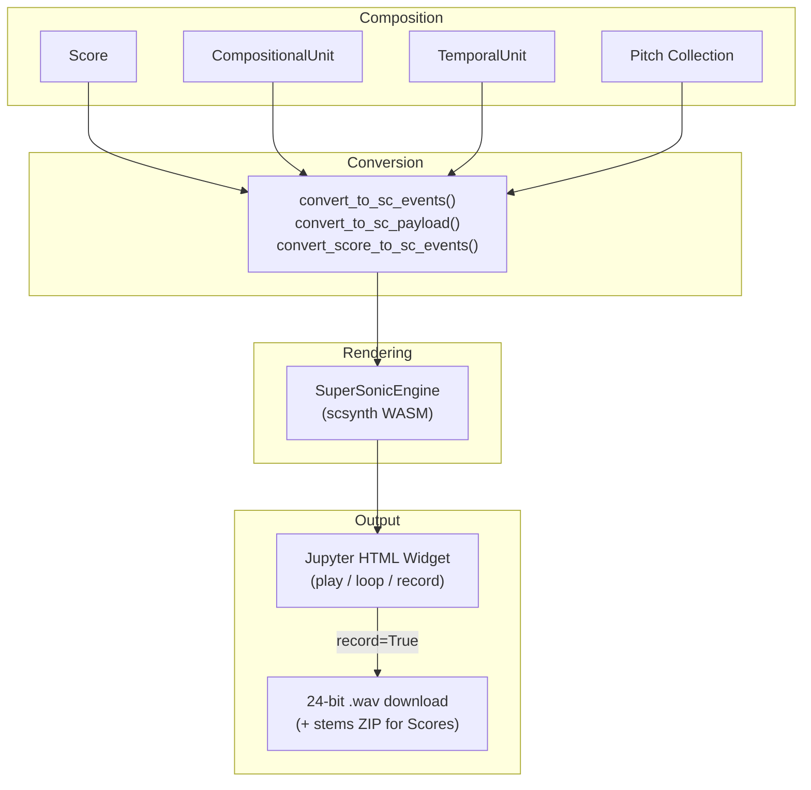

# Playback — Audio Rendering Pipeline

`klotho.utils.playback` converts Klotho musical objects into audible
output within Jupyter notebooks. Playback is **SuperSonic-only**
(browser-based scsynth via WebAssembly); the Tone.js and MIDI engines
were removed in 10.12.0. Widgets can also **record** what they play —
including per-track stems for `Score` — and instruments can be built
from **user-supplied samples** at runtime.

---

## Module Map

```
utils/playback/
├── __init__.py
├── player.py                  # play() — top-level dispatcher
├── _config.py                 # set_audio_engine / get_audio_engine ('supersonic' only)
├── _converter_base.py         # shared conversion logic
├── _amplitude.py              # voice amplitude computation
├── _sc_assembly.py            # CompositionalUnit → SC event assembly
├── _sc_validate.py            # SC event-list validation
├── _helpers.py                # loop-policy helpers + JS fragment loaders
├── _session_boot.py           # boot_supersonic()
├── _animation_bridge.js       # KlothoPlaybackBridge — shared widget/engine bridge
├── _loop_control.js           # KlothoLoopControl + KlothoGateToggle
├── _recorder.js               # KlothoRecorder — capture worklet, WAV/ZIP encoders
├── animation_events.py        # payloads for animated KlothoPlot playback
└── supersonic/
    ├── __init__.py
    ├── engine.py              # SuperSonicEngine — HTML widget
    ├── converters.py          # convert_to_sc_events(), convert_score_to_sc_events(), …
    ├── registry.py            # register_synthdef(), runtime synthdef registry
    ├── samples.py             # bundled-sample manifest + runtime sample registry
    ├── _wav_meta.py           # stdlib RIFF/WAVE header parser
    ├── cdn.py                 # pinned SuperSonic CDN URLs + scsynth boot options
    ├── _js_fragments.py       # control bar + boot/loader JS snippets
    ├── _engine_widget.js      # standalone widget controller
    ├── _lifecycle.js          # KlothoEngineLifecycle — boot/defs/samples loaders
    ├── scheduler_core.js      # core JS scheduler (batching, buses, ring-out)
    ├── scheduler_score.js     # track mixer, insert FX, control envelopes, stem taps
    ├── draw.js                # widget drawing
    ├── _vendor/
    │   └── synthdef_parser/   # vendored .scsyndef parser (MIT)
    ├── scripts/
    │   └── regenerate_manifest.py  # rebuilds flat manifest.json from .scsyndef
    └── assets/
        ├── manifest.json      # flat {name: {control: default}} dict
        ├── kinds.json         # synthdef kind/category metadata
        ├── *.scd              # SC source, one file per family (klotho/edm/lofi/chip/foxdot)
        ├── samples/           # bundled audio samples (beatbox/tabla kits)
        └── synthdefs/         # 183 compiled .scsyndef files
            ├── instruments/   #   playable defs
            ├── effects/       #   insert-FX defs
            └── infra/         #   __klEnvCtrl, __busRouter, … control/routing defs
```

Related, outside this package: `klotho.utils.fetch` provides
`fetch_samples(url, dest)` / `upload_samples(dest)` for getting sample
files onto the notebook runtime (Colab-friendly), both exported at the
top level.

---

## 1. Top-Level Entry Point

**File:** `utils/playback/player.py`

```python
from klotho import play

play(obj)                    # SuperSonic playback widget
play(obj, loop=True)         # loop button pre-armed
play(obj, ring_time=8)       # longer release/reverb tail
play(obj, record=True)       # adds a record button (see §4)
```

### Dispatch Flow


```mermaid
flowchart TD
    P["play(obj, **kwargs)"] --> SCORE{"isinstance<br/>Score?"}
    SCORE -->|Yes| S_CONV["convert_score_to_sc_events(score)"]
    S_CONV --> S_ENG["SuperSonicEngine(events,<br/>meta, control_data, ring_time, loop, record)"]
    S_ENG --> DISP["engine.display()<br/>→ HTML widget"]

    SCORE -->|No| KP{"isinstance<br/>KlothoPlot?"}
    KP -->|Yes| KPLAY["obj.play(**kwargs)<br/>(animated)"]
    KP -->|No| BOOT["boot_supersonic()"]
    BOOT --> UCQ{"UC / UTS / BT?"}
    UCQ -->|Yes| PAYLOAD["convert_to_sc_payload(obj)"]
    UCQ -->|No| SC_CONV["convert_to_sc_events(obj)"]
    PAYLOAD --> SC_ENG["SuperSonicEngine(events, control_data, …)"]
    SC_CONV --> SC_ENG
    SC_ENG --> DISP
```

`Score` playback returns a payload with `events`, track/FX `meta`, and
control-envelope `control_data`; the widget accepts a `ring_time` tail
(default 5 s), a `loop` policy, and `record`.

### Engine Configuration

```python
from klotho import set_audio_engine, get_audio_engine

set_audio_engine('supersonic')  # the default — and only — engine
```

---

## 2. Event Conversion Pipeline

### Supported Input Types

| Type | Category |
|---|---|
| `Pitch` | Single pitch |
| `Scale` | Pitch collection |
| `Chord`, `Voicing` | Pitch collection |
| `ChordSequence` | Sequence of chords |
| `Spectrum` | HarmonicTree spectrum |
| `HarmonicTree` | Tonal system |
| `RhythmTree` | Temporal (default pitch) |
| `TemporalUnit` | Temporal (default pitch) |
| `TemporalUnitSequence` | Temporal sequence |
| `TemporalBlock` | Parallel temporal |
| `CompositionalUnit` | Full composition |
| `Score` | Multi-unit timeline |

Dispatch is an MRO-walking `TypeRegistry`
(`klotho.utils.dispatch_registry`, 10.14.0), shared with `plot()`.

### Conversion Architecture


```mermaid
flowchart TD
    OBJ["Klotho Object"] --> TD{"TypeRegistry dispatch"}

    TD -->|"CompositionalUnit"| UCIR["lower_compositional_ir_to_sc_assembly()"]
    TD -->|"TemporalUnit/Sequence/Block"| UTIR["build events from RT timing"]
    TD -->|"Pitch/Scale/Chord"| PCIR["build events from pitches"]
    TD -->|"HarmonicTree/Spectrum"| HTIR["build events from spectrum"]

    UCIR --> VOICE["lower_poly_pfields_to_voices()"]
    UTIR --> VOICE
    PCIR --> VOICE
    HTIR --> VOICE

    VOICE --> SC["SC event format<br/>(new / set / release)"]
```

### Shared Converter Base (`_converter_base.py`)

| Function | Purpose |
|---|---|
| `dispatch_convert(obj, kwargs, handlers, include_inst=False)` | Type-dispatch an object to the right conversion handler |
| `resolve_instrument(inst)` | Normalize an instrument argument (name, Instrument, Kit) |
| `scale_pitch_sequence(obj, equaves=1)` | Pitch sequence spanning *n* equaves of a collection |
| `extract_convert_kwargs(kwargs)` | Parse `dur`, `arp`, `strum`, `mode` kwargs |
| `lower_poly_pfields_to_voices(pfields)` | Expand polyphonic pfields (tuples) into per-voice pfield dicts |
| `lower_event_ir_to_voice_events(event, step_index=None)` | Flatten one intermediate event to a list of voice events |
| `iter_group_sequence(groups, dur, arp=False, strum=0, direction='u', pause=0.0)` | Iterate grouped pitch material into timed events |

### SC Assembly (`_sc_assembly.py`)

Specialized conversion for `CompositionalUnit` → SuperSonic events.
Handles:

- **Gated vs free instruments** — gated instruments use `new` + `set`
  + auto-release; free instruments use a single `new`.
- **Slur rendering** — slurred notes sustain across boundaries, with
  `set` messages updating pitch/amp mid-note; voice counts are pinned
  per slur group (10.13.1).
- **Polyphonic voice expansion** — tuple pfields expand into concurrent
  voice events.
- **Kit member resolution** — per voice, from the selector pfield (see
  §5, including family round-robin).

### Amplitude Computation (`_amplitude.py`)

| Function | Purpose |
|---|---|
| `single_voice_amplitude(freq, target_amp=None)` | Frequency-compensated amplitude for one voice |
| `compute_voice_amplitudes(freqs, target_amp=None)` | Frequency-dependent gain balancing across voices |

Uses `freq_amp_scale()` from dynatos for equal-loudness compensation.

---

## 3. Widgets and the Shared Bridge

Every playback surface — the standalone `play()` widget and all
animated `plot(...).play()` figures — is a thin controller over the
same page-level modules:

| Module | Global | Role |
|---|---|---|
| `_lifecycle.js` | `KlothoEngineLifecycle` | boot the shared SuperSonic instance, load synthdefs/samples once per page |
| `_animation_bridge.js` | `KlothoPlaybackBridge` | build a per-widget bridge: `ensureReady`, `play`, `stop`, `record`, `preview`, … |
| `_loop_control.js` | `KlothoLoopControl` / `KlothoGateToggle` | loop policy; buttons render disabled/greyed until engine-ready |
| `_recorder.js` | `KlothoRecorder` | capture worklet + WAV/ZIP encoders (only injected when `record=True`) |
| `scheduler_core.js` | `BrowserScheduler` | NTP-timestamped OSC batching against the engine's 512-slot queue |
| `scheduler_score.js` | (extends the scheduler) | track groups/buses, insert FX, control envelopes, stem taps |

Version skew: saved notebook outputs embed their own copies of these
modules, so installs are guarded by **versioned globals**
(`__klothoPlaybackBridgeV3`, `__klothoRecorderV1`, …). Newer builds are
supersets and claim the older guard names too, so stale outputs on the
same page can neither clobber nor be broken by new widgets.

### Engine boot configuration

`cdn.py` pins the SuperSonic version and boots scsynth with
`scsynthOptions: {numOutputBusChannels: 32, numAudioBusChannels: 256}`.
Output channels 0/1 are the audible master pair (the browser clamps the
speaker path to the hardware's channel count); channels 2–31 are
**stem-tap pairs** used only while recording stems. Consequently the JS
schedulers allocate private track/FX buses from `FIRST_PRIVATE_BUS = 48`
(kept in sync across `scheduler_core.js` / `scheduler_score.js`, with a
page-level floor guard against stale pre-10.16 outputs).

---

## 4. Recording (`record=True`)

```python
play(score, record=True)          # widget gains a ● record button
plot(score).play(record=True)     # same, on the animated timeline
```

Pressing record plays the piece exactly like play (the play button
becomes a stop button) while a **capture AudioWorklet** taps the
engine's output node in parallel. When playback finishes — piece
duration + tail pause + `ring_time` — the capture is encoded to
**24-bit PCM WAV** at the page's sample rate and offered as a download:
an automatic download is attempted *and* a persistent `⬇` link is left
in the widget bar (Colab's sandboxed outputs can block programmatic
clicks). Stopping mid-record cancels and discards the capture; the
record pass always runs loop-off.

### Stems

For a `Score` with registered tracks the widget adds a **stems**
checkbox. When enabled, the scheduler places one extra `__busRouter`
per track **after** that track's summing router — reading the track's
post-insert-FX bus and summing it onto a dedicated output-channel pair
(2/3, 4/5, …) — and the capture worklet records all channels in the
same single realtime pass. The result is one ZIP (STORE-only, built in
JS) containing `main.wav` (the full mix from channels 0/1) plus one
time-aligned stereo WAV per track, trimmed so every file starts at the
scheduler's play start: drop them into a DAW and they line up. Up to 15
stems (output-channel budget); the master needs no tap.

This mirrors the native `EventScheduler.sc` stems design (one tap synth
per track after its bus router), with the `DiskOut` half replaced by
the Web Audio capture: the browser build of scsynth has no filesystem,
`/b_write` is a blocked command, and SuperSonic's built-in capture API
is SAB-only and 1-second-capped — hence the worklet tap.


```mermaid
flowchart LR
    subgraph "scsynth (WASM)"
        T1["track fxBus"] -->|"__busRouter (sum)"| MAIN["main srcBus → out 0/1"]
        T1 -->|"stem tap __busRouter"| CH["out 2+2i"]
    end
    NODE["engine AudioWorkletNode<br/>(32 ch)"] --> DEST["speakers (ch 0/1)"]
    NODE --> CAP["capture worklet<br/>(records N ch)"]
    CAP --> ENC["24-bit WAV encode<br/>(+ STORE ZIP for stems)"]
    ENC --> DL["download + ⬇ link"]
```

---

## 5. SuperSonic Engine

**File:** `utils/playback/supersonic/engine.py`

### SuperSonicEngine

Generates an HTML widget that:

1. Loads SuperSonic (browser-based scsynth) from the pinned CDN.
2. Loads compiled `.scsyndef` synth definitions and referenced samples
   (both embedded base64 in the widget HTML).
3. Schedules `new` / `set` / `release` messages on a timeline.
4. Renders play/loop (and optionally record/stems) controls.

### Event Format

Three message types, keyed by a string `id` (uid) with `start` times
and nested `pfields`:

```json
{"type": "new",     "id": "a1…", "start": 0.0,  "defName": "kl_tri", "pfields": {"freq": 440, "amp": 0.8}, "dur": 0.5, "releaseAfter": true}
{"type": "set",     "id": "a1…", "start": 0.25, "pfields": {"freq": 550}}
{"type": "release", "id": "a1…", "start": 0.5}
```

- **`new`** — allocate a synth node with initial parameters.
- **`set`** — update parameters on a running node (used for slurs,
  parameter changes, insert-FX automation).
- **`release`** — free the node explicitly (normally superseded by the
  `dur`/`releaseAfter` auto-release contract below).

Score events additionally carry a top-level `"group"` (track name),
which the score scheduler routes onto that track's bus chain.

### Bundled SynthDefs

**183 compiled synthdefs** ship with the package — the
`kl_*` Klotho family (`kl_tri`, `kl_sine`, `kl_kicktone`, …), a large
`fd_*` FoxDot-derived set, the MAT 111MC `edm_*`/`lofi_*`/`chip_*`
kits, the `tr808_*` drum machine voices (adapted from Yoshinosuke
Horiuchi's SC-808; all non-gated one-shots, `releaseTime` args in real
seconds, exposed via `SynthDefKit.tr808()` and `Ensemble.tr808()`),
and internal control/routing defs
(`__klEnvCtrl`, `__busRouter`, `__chainLimiter`, …).

Family factories build ready-made kits/ensembles from these:
`SynthDefKit.edm_drums/edm_hats/edm_perc/edm_sweeps/edm_wubs`,
`SynthDefKit.lofi_drums/…`, `SynthDefKit.chip_drums/chip_accent`,
`SynthDefKit.tr808()` (all taking `selector='voice'` + overrides), and
`Ensemble.edm/lofi/chip/tr808(name=…, only=…, extras=…)`.

#### Path-style names

Anywhere a SynthDef name string is accepted (`play(inst=...)`,
`SynthDefInstrument.from_manifest`, `SynthDefFX`, kit member dicts),
a path-style spelling is sugar for the underscore name: `'edm/kick'` →
`edm_kick`, `'lofi/tape'` → `lofi_tape`, `'kl/saw'` → `kl_saw`,
`'fd/blip'` → `fd_blip`.  The transform
(`klotho.thetos.instruments._shared.canonical_def_name`) is purely
syntactic — `/` cannot appear in a real def name because the def name
is the `.scsyndef` filename — so there is no alias table to maintain,
and underscore names keep working unchanged.

#### Kit selector resolution

A `Kit` event's member is chosen by its selector pfield (default
`voice`) at lowering time. Valid selector values: a member key, an
integer (wrapping mod the member count), a **family name**, a tuple of
any of these (one synth voice per element), or absent (default member).

A family name selects its members **round-robin** — a family whose
members are variants of one sound (three snare hits) is a rotation
pool, so `voice='snare'` cycles a different variant per hit while
`voice='snare_b'` still pins a specific one. Rotation is deterministic:
tree-based lowering keys the choice on the leaf's position among the
tree's leaves (so display, compose-time defaults, and per-voice
lowering all agree, and replays are bit-identical), and the loose-Event
path uses per-conversion counters that the converter entry points
reset. Random selection stays opt-in via `kit.pick(family)`;
`kit.cycle(family)` returns a `Pattern` of keys for manual placement.
An unknown string raises a `KeyError` listing members and families.

Definitions are compiled `.scsyndef` files in
`supersonic/assets/synthdefs/` (with `.scd` sources in
`supersonic/assets/`).  The `manifest.json` lists registered synthdefs
as a flat dict `{synth_name: {control_name: default_value}}`.  It is
auto-regenerated from the compiled `.scsyndef` blobs by

```bash
python -m klotho.utils.playback.supersonic.scripts.regenerate_manifest
```

(use `--dry-run` to preview). The script uses a vendored copy of
`synthdef_parser` at `supersonic/_vendor/synthdef_parser/` (no external
install).

### Runtime SynthDef Registration (`registry.py`)

Synthdefs can be registered at runtime without touching the bundled
assets, exposed at the top level as `klotho.register_synthdef`:

```python
import klotho

klotho.register_synthdef(my_supriya_synthdef)          # from a supriya SynthDef
inst = SynthDefInstrument.from_manifest('my_synth')    # then usable like any other
```

| Function | Purpose |
|---|---|
| `register_synthdef(supriya_synthdef, name=None, pfields=None)` | Compile-and-register from a supriya `SynthDef` |
| `register_compiled(def_name, compiled_bytes, controls)` | Register pre-compiled bytes |
| `runtime_assets()` / `runtime_controls()` / `runtime_kinds()` | Session-registered blobs / control dicts / kind tags |
| `is_registered(def_name)` | Check the runtime registry |
| `clear_runtime()` | Drop all runtime registrations |

### Samples: bundled + runtime (`samples.py`)

Events reference samples symbolically: a `buf*` pfield carrying a
string is a sample name, resolved to an scsynth bufnum by the widget at
load time (`_lifecycle.js loadSamples`; unresolvable names and decode
failures warn on the console). 22 samples ship bundled (`beatbox`,
`tabla` groups, described by `assets/samples/samples.json`).

**Runtime registry** (10.16.0) — user samples join the same namespace,
so `sampler()`, kits, the engine's sample collection, and the animated
payload builders all see them with no further plumbing:

| Function | Purpose |
|---|---|
| `register_sample(name, source, group='user', replace=False)` | Register a `.wav` (path or bytes); metadata via `_wav_meta.py` |
| `unregister_sample(name)` / `registered_samples()` / `clear_runtime_samples()` | Registry management |
| `sample_names()` / `sample_groups()` / `sample_info()` / `sample_bytes_b64()` | Unified accessors (runtime entries win; claiming a bundled name requires `replace=True`) |

Student-facing entry points (see `05_THETOS.md` for the instrument
side):

```python
Inst.sampler('bb_kick')               # bundled name
Inst.sampler('loops/my_break.wav')    # a path auto-registers under its stem
SynthDefKit.from_folder('my_kit')     # folder → kit (subfolders = families)
klotho.fetch_samples(url)             # download/unpack hosted audio (Colab setup cell)
```

Sample bytes are embedded base64 in every widget that references them
(~4/3× file size, per `play()` call, stored in saved notebook outputs;
Colab renders each cell in its own iframe, so nothing is shared across
cells). The engine warns when one widget embeds more than ~6 MB.

### Event-list contract: `dur` + `releaseAfter` (auto-release)

Every `new`/`set` event produced by the lowering layer carries two
top-level fields beyond the legacy `type, id, defName, start, pfields`:

- `dur: number` — the leaf's duration in seconds.
- `releaseAfter: bool` — `true` on the terminal event of each uid's
  chain (the last `set` of a slur, or any single-leaf `new`).

The lowering layer **never emits** explicit `{type:"release", id, start}`
events for normal lifecycle gate-off any more. Instead, the SuperSonic
JS scheduler introspects the manifest at fire time: when it sees
`releaseAfter:true` on a `new`/`set` and `'gate' in manifest[defName]`,
it NTP-schedules a `/n_set <node> gate 0` at `start + dur` alongside
the primary OSC bundle. For non-gated synths (no `gate` control) the
scheduler no-ops, so the lowering layer can emit the same metadata
uniformly without per-instrument branching.

`type:"release"` events are still accepted by the validator and the
schedulers as an explicit override path; only the lowering layer was
updated to stop producing them automatically.

The native SC scheduler (`EventScheduler.sc`) will gain the same
fire-time inspection path in a follow-up using
`SynthDescLib.global.at(name).controlDict.includesKey(\gate)`. Until
that lands, SC scheduling falls back to consuming any explicit
`type:"release"` events as before.

### Session Boot

`boot_supersonic()` runs at import of `player.py` and again on each
`play()` invocation (it is idempotent). In IPython environments it
displays a `<script>` block that installs the shared engine promise,
the draw scheduler, and the core scheduler; outside IPython it no-ops.

---

## 6. Animation Events

**File:** `utils/playback/animation_events.py`

Payload builders for animated `KlothoPlot` playback (lattice paths,
CPS/shape figures):

| Function | Purpose |
|---|---|
| `build_path_payload(freqs, dur, amp=None, extra_pfields=None, pause=0.0, def_name=None)` | SuperSonic payload for lattice path animation |
| `build_shape_payload(freq_groups, dur, arp=False, strum=0, direction='u', amp=None, extra_pfields=None, pause=0.25, def_name=None)` | SuperSonic payload for CPS shape animation |

---

## 7. End-to-End Pipeline Summary


```mermaid
flowchart TD
    subgraph "Composition"
        SCR["Score"]
        UC["CompositionalUnit"]
        UT["TemporalUnit"]
        PC["Pitch Collection"]
    end

    subgraph "Conversion"
        CONV["convert_to_sc_events()<br/>convert_to_sc_payload()<br/>convert_score_to_sc_events()"]
    end

    subgraph "Rendering"
        SS["SuperSonicEngine<br/>(scsynth WASM)"]
    end

    subgraph "Output"
        WIDGET["Jupyter HTML Widget<br/>(play / loop / record)"]
        WAV["24-bit .wav download<br/>(+ stems ZIP for Scores)"]
    end

    SCR --> CONV
    UC --> CONV
    UT --> CONV
    PC --> CONV

    CONV --> SS
    SS --> WIDGET
    WIDGET -->|"record=True"| WAV
```
