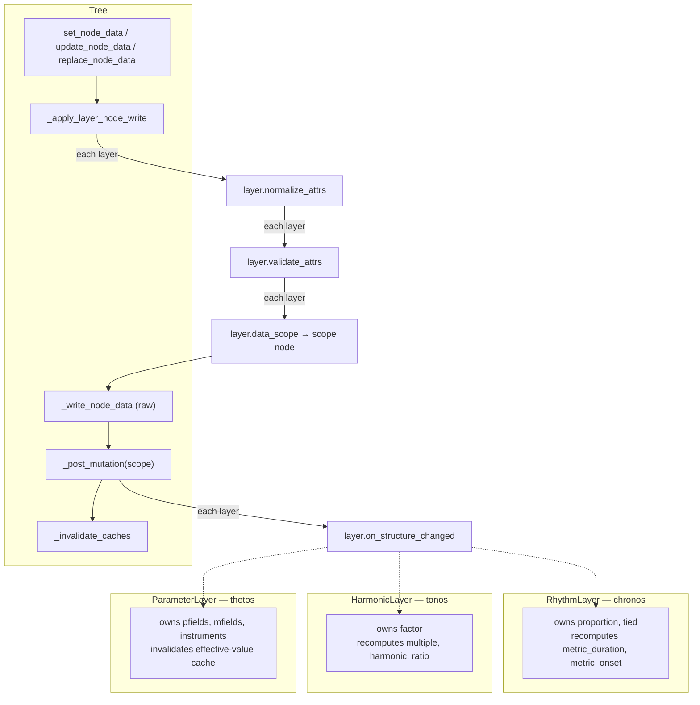
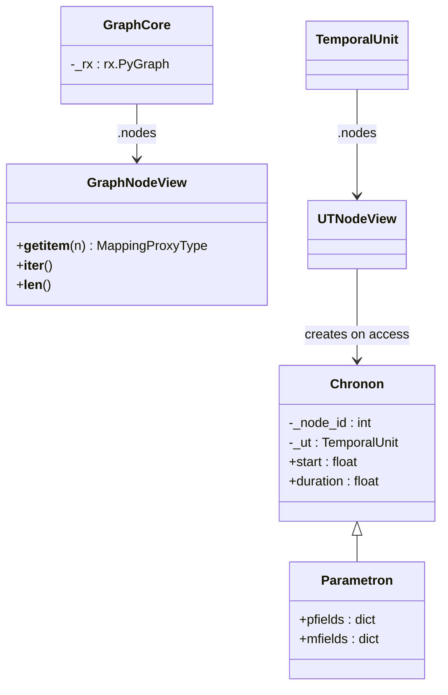
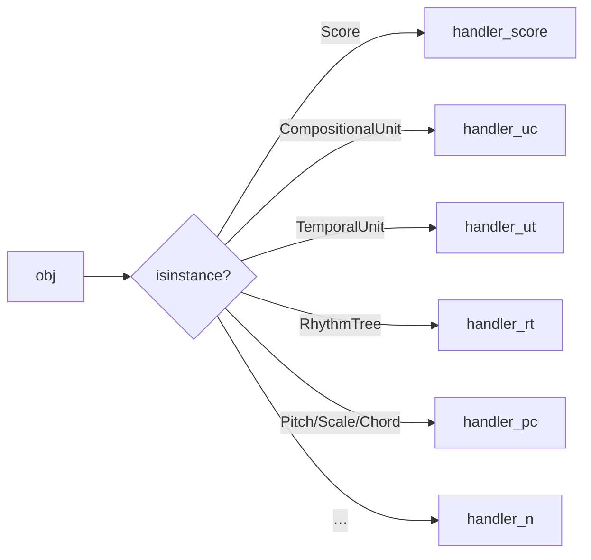
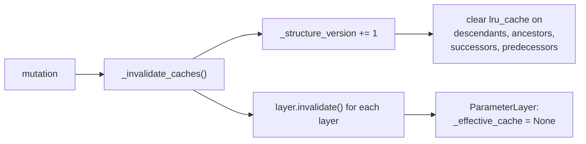
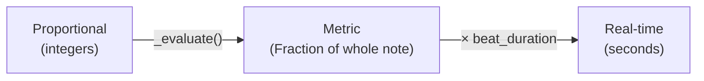
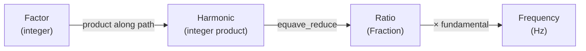

# Design Patterns — Cross-Cutting Architectural Decisions

This document catalogues the recurring design patterns, policies, and
conventions that span multiple subpackages in Klotho.

---

## 1. Pattern Catalogue

### 1.1 Layered Trees — TreeLayer Delegation

**Where:** `Tree` + `TreeLayer` (`topos/graphs/trees/layers.py`) →
`RhythmLayer` / `HarmonicLayer` / `ParameterLayer`

The core extensibility mechanism.  Domain behavior is not implemented
by overriding `Tree` methods — it lives in `TreeLayer` objects attached
to the tree.  A layer owns a set of writable node-data keys
(`owned_keys`), declares the keys it derives (`derived_keys`), and
implements normalization, validation, scoping, and recompute hooks.
The tree notifies **all** attached layers on every mutation.



Facades (`RhythmTree`, `HarmonicTree`, `ParameterTree`) are thin `Tree`
subclasses that attach their layer in the `_init_layers` hook.
Because layers compose, a single tree can carry several synchronized
data domains: `CompositionalTree` attaches **both** a rhythm layer and
a parameter layer to one topology.

**Benefit:** New data domains can be added by writing a layer, without
touching `Tree` code — and multiple domains can share one topology
instead of mirroring trees.

### 1.2 Composite — Trees from Nested Tuples

**Where:** `Tree.__init__`, `Group`, `RhythmTree`, `HarmonicTree`

The `(D, S)` tuple notation is a textual composite pattern: a tree is
either a leaf value or a `(value, children_tuple)` pair.  Construction
recursively decomposes this into nodes and edges.

```
(4, (1, (2, (1, 1)), 1))    ← composite notation
         ↓
       4                      ← Graph with 5 nodes
      /|\
     1  2  1
       / \
      1   1
```

`Group` is the immutable runtime representation of this notation.

### 1.3 Factory Method — Multiple Construction Paths

**Where:** `Graph.from_*`, `Tree.from_tree_structure`, `RhythmTree.from_ratios`,
`CompositionalUnit.from_rt`, `ToneLattice.from_generators`, etc.

Almost every core class provides `classmethod` factories alongside
`__init__`, separating the "what to build" decision from the "how
to build" logic.

| Class | Key Factories |
|---|---|
| `Graph` | `from_rustworkx`, `from_networkx`, `from_nodes_edges`, `from_edges`, `empty_graph`, `directed` |
| *(module-level)* | `path_graph`, `cycle_graph`, `star_graph`, `random_graph`, `complete_graph`, `grid_graph`, `from_cost_matrix` in `topos/graphs/generators.py` |
| `Tree` | `from_tree_structure` (topology clone) |
| `RhythmTree` | `from_ratios` (flat ratio list → tree) |
| `HarmonicTree` | standard `__init__` only |
| `ToneLattice` | `from_generators` (custom generators) |
| `ParameterField` | `from_lattice` (wrap existing lattice) |
| `CompositionalUnit` | `from_rt`, `from_ut`, `from_subtree` |
| `SynthDefInstrument` | `from_manifest('kl_tri')` (manifest lookup) |
| `ToneInstrument` | `from_preset`, named class-method presets |

### 1.4 View / Proxy — Read-Only Access

**Where:** `GraphNodeView`, `GraphEdgeView`, `LatticeEdgeView`,
`UTNodeView`, `Chronon`, `Parametron`, `ParameterNode`

Klotho uses view objects extensively to provide safe, read-only access
to internal data without exposing mutable structures.



Node data is returned as `MappingProxyType` (immutable dict view) to
prevent accidental direct writes.

### 1.5 Adapter — Coordinate ↔ Node ID

**Where:** `Lattice`, `ToneLattice`

`Lattice` adapts between two addressing schemes:
- **External:** coordinate tuples `(x, y, …)`
- **Internal:** integer node IDs in the RustworkX graph

```python
lattice[(0, 1)]              # coordinate access (external)
lattice._coord_to_node[(0,1)]  # maps to node ID 42 (internal)
```

`LatticeEdgeView` translates edge endpoints back to coordinates.

### 1.6 Immutability by Absence of Mutators

**Where:** `GraphCore` and its non-`Graph` subclasses

There are no runtime mutability flags.  `GraphCore` is read-only;
mutation exists only where a class defines mutators.  Calling a
mutator on an immutable class is a plain `AttributeError`:

| Class | Mutation surface |
|---|---|
| `Graph` | Free-form (`add_node`, `add_edge`, `set_node_data`, …) |
| `Tree` | Structural API only (`add_child`, `prune`, …) + layer-validated node data |
| `Lattice` / `ToneLattice` | *(none — built during construction, then frozen)* |
| `CombinationSet` / `CombinationProductSet` | *(none)* |
| `ParameterField` | `set_field_value` at coordinates (its own sanctioned writer) |

### 1.7 Dispatcher — Type-Based Routing

**Where:** `plot()`, `play()`, `convert_to_events()`,
`convert_to_sc_events()`

Multiple functions use `isinstance` chains to route different Klotho
types to specialized handlers:



### 1.8 Builder — Incremental Graph Construction

**Where:** `Tree._build_tree`, `Lattice.__init__`,
`CombinationProductSet.__init__`

Complex graph structures are built incrementally during `__init__`
using the protected raw primitives:

1. Create empty graph core.
2. Add nodes/edges via `_add_node_raw` / `_add_edge_raw`.
3. Build coordinate/index mappings.
4. Evaluate derived fields.
5. Expose no mutators (immutable classes) or only sanctioned ones.

---

## 2. Mutation Policy (Deep Dive)

### The Rule

> Direct `graph.nodes[n]['key'] = value` writes are **illegal**.

All node-data writes must go through `set_node_data`,
`update_node_data`, or `replace_node_data`.  On trees these methods
route through the attached layers, ensuring:

1. Attributes are normalized (renamed, coerced) — `layer.normalize_attrs`.
2. Attributes are validated (owned/derived key check) — `layer.validate_attrs`.
3. The recompute scope is resolved — `layer.data_scope`.
4. Caches are invalidated and derived fields recomputed —
   `layer.on_structure_changed`.

Node views are read-only `MappingProxyType` objects, so a direct write
fails at the language level, not by convention.

### Per-Layer Mutable Keys

| Class (layer) | Writable keys | Derived keys (read-only) |
|---|---|---|
| `Tree` (no layer) | `label` | — |
| `RhythmTree` (`RhythmLayer`) | `proportion`, `tied` | `metric_duration`, `metric_onset` |
| `HarmonicTree` (`HarmonicLayer`) | `factor` | `harmonic`, `multiple`, `ratio` |
| `ParameterTree` (`ParameterLayer`) | any pfield/mfield | effective-value cache |
| `Lattice` | *(none — fully immutable)* | — |
| `ToneLattice` | *(none — fully immutable)* | — |
| `ParameterField` | field value at coord | — |

### Structural Mutation

Tree topology changes (add/remove nodes) are only allowed through
the `Tree` structural API:

| Method | Operation |
|---|---|
| `add_child` | Add a new child to a parent |
| `add_subtree` | Attach a subtree at a parent |
| `subdivide` | Split a node into proportional children (`RhythmTree`) |
| `prune` | Remove a node, promote its children |
| `remove_subtree` | Remove a node and all descendants |
| `graft_subtree` | Replace a leaf with a subtree |
| `move_subtree` | Move a subtree to a new parent |
| `prune_to_depth` | Truncate the tree |
| `prune_leaves` | Remove *n* leaves |

Each of these ends in `_post_mutation`, which invalidates caches
(marking the `Group` representation dirty for lazy rebuild) and
notifies every attached layer via `on_structure_changed`.

---

## 3. Cache Invalidation Strategy

### Version Counter

```python
self._structure_version += 1
```

Every structural or data mutation bumps `_structure_version`.  Cached
methods are decorated with `@lru_cache` and include
`_structure_version` as a cache key, automatically invalidating on
the next access after a mutation.

### Cached Properties

| Class | Cached methods |
|---|---|
| `GraphCore` | `descendants`, `ancestors`, `successors`, `predecessors` |
| `Tree` | `depth`, `k`, `leaf_nodes` (via `@cached_property`), `parent` |
| `ParameterLayer` | `_effective_cache` (dict, cleared via `layer.invalidate`) |

### Invalidation Flow



---

## 4. Inheritance Chains

### Deep Inheritance Path

The deepest inheritance chains in Klotho:

```
CompositionalUnit → TemporalUnit → (uses CompositionalTree → RhythmTree → Tree → GraphCore)
Parametron → Chronon → (metaclass: TemporalMeta)
ToneLattice → Lattice → GraphCore
CombinationProductSet → CombinationSet → GraphCore
```

### Inheritance vs Layers vs Mixins

Most classes have a single inheritance chain, with cross-cutting
behavior achieved through:

- **Layers** (e.g. `RhythmLayer` / `ParameterLayer` attached to one
  tree — the primary composition mechanism, see §1.1).
- **One deliberate mixin**: `ParameterApiMixin` provides the parameter
  API surface (`set_pfields`, `set_instrument`, `clear_fields`, …) to
  both `ParameterTree` and `CompositionalTree(ParameterApiMixin,
  RhythmTree)` — the only multiple-inheritance site in the core.
- **Metaclasses** (`TemporalMeta` for `Chronon` / `TemporalUnit`).
- **Composition**: `CompositionalUnit` *has-a* fused
  `CompositionalTree` (`uc._rt`), carrying rhythm and parameters on a
  single topology.  There is no mirrored `ParameterTree` — `uc.pt` is
  a derived snapshot.

---

## 5. Data Flow Conventions

### Proportional → Metric → Real-Time

All temporal data flows through three representation levels:



### Multiplicative → Ratio → Frequency

All harmonic data flows through three representation levels:



### Override → Effective → Rendered

All parameter data flows through three resolution levels:


---

## 6. Naming Conventions

| Convention | Examples |
|---|---|
| **Leading underscore** for private/internal | `_rx`, `_meta`, `_layers` |
| **Double underscore** never used | (no name mangling) |
| **Verb prefixes** for hooks | `_post_*` (`_post_mutation`), `on_*` (layer hooks) |
| **`from_*`** for factory classmethods | `from_rt`, `from_tree_structure`, `from_generators` |
| **Greek names** for subpackages | topos, chronos, tonos, dynatos, thetos, semeios |
| **Domain abbreviations** in user code | RT, PT, HT, TL, CPS, UT, UC, etc. |
