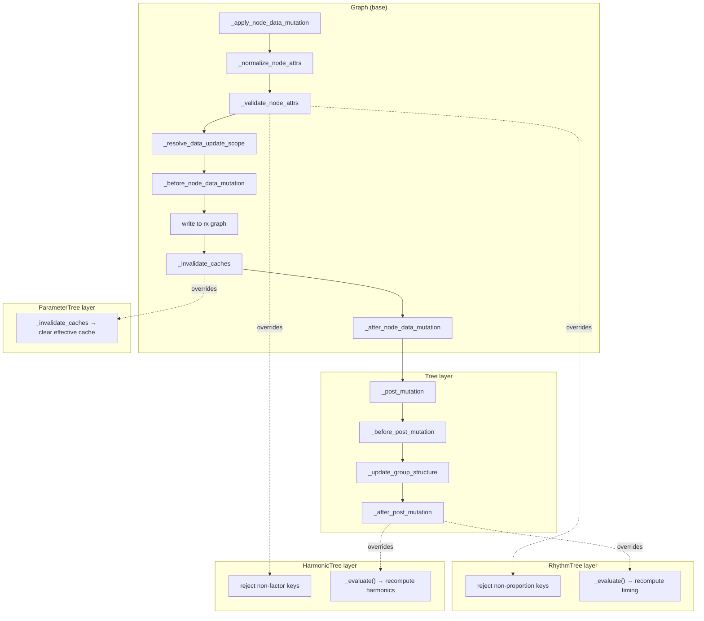
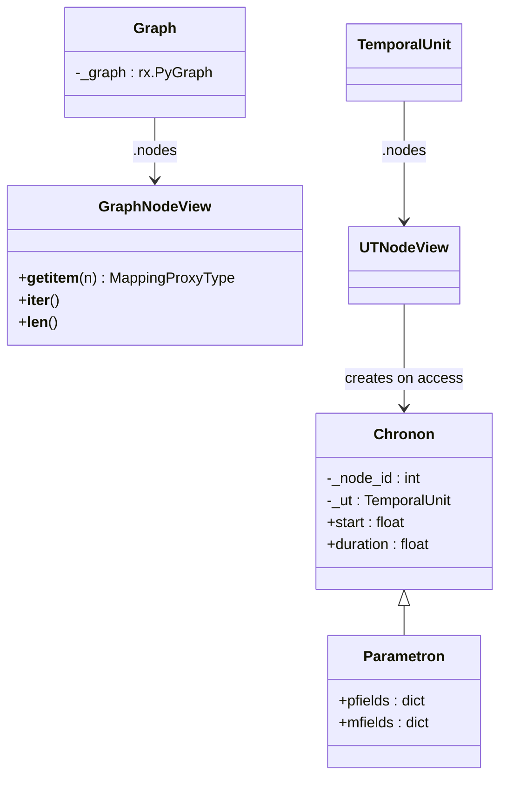
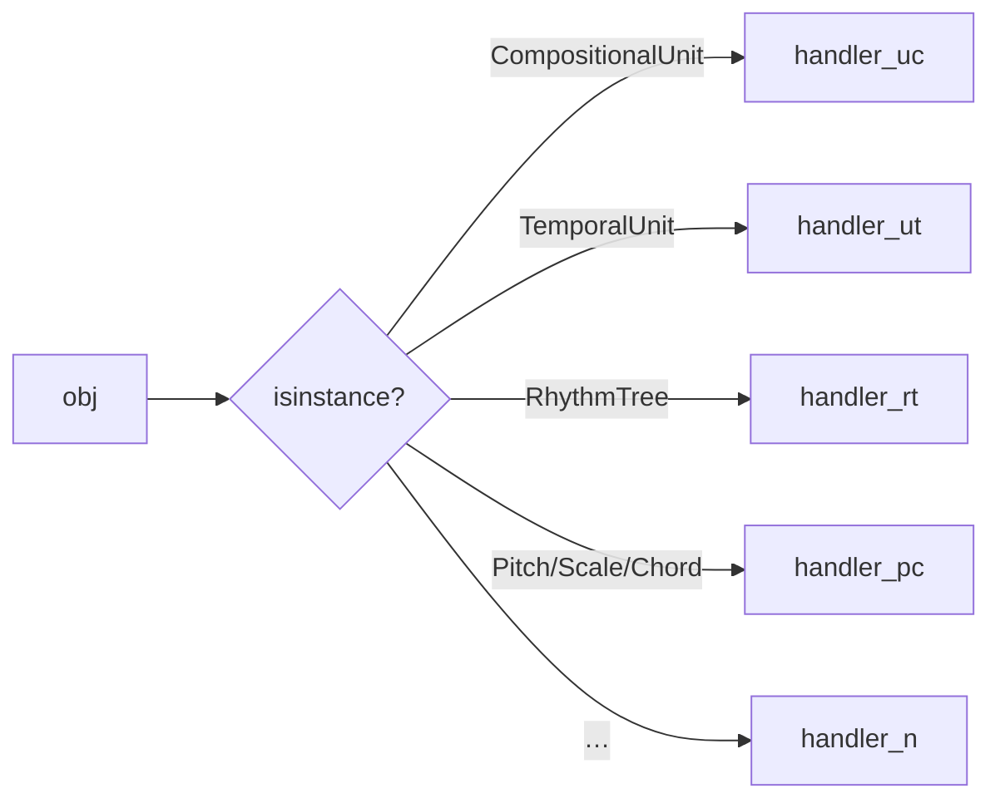
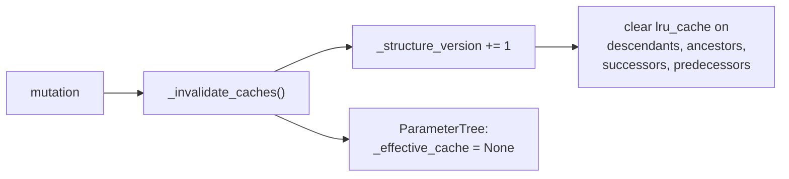
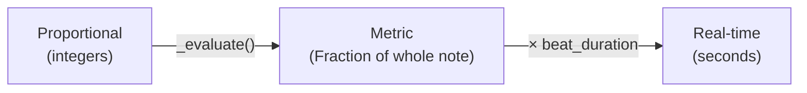
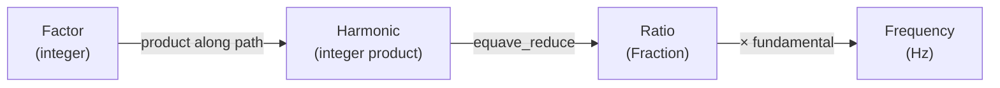
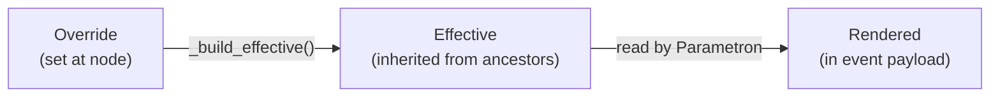

# Design Patterns — Cross-Cutting Architectural Decisions

This document catalogues the recurring design patterns, policies, and
conventions that span multiple subpackages in Klotho.

---

## 1. Pattern Catalogue

### 1.1 Template Method — Mutation Pipeline

**Where:** `Graph._apply_node_data_mutation` → `Tree` → `RhythmTree` /
`HarmonicTree` / `ParameterTree`

The core extensibility mechanism.  `Graph` defines the mutation
pipeline as a sequence of overridable hook methods.  Each subclass
adds domain-specific behavior without modifying the base flow.



**Benefit:** New tree types can be added by overriding 2–3 hooks
without touching `Graph` or `Tree` code.

### 1.2 Composite — Trees from Nested Tuples

**Where:** `Tree.__init__`, `Group`, `RhythmTree`, `HarmonicTree`

The `(D, S)` tuple notation is a textual composite pattern: a tree is
either a leaf value or a `(value, children_tuple)` pair.  Construction
recursively decomposes this into nodes and edges.

```
(4, (1, (2, (1, 1)), 1))    ← composite notation
         ↓
       4                      ← Graph with 5 nodes
      /|\
     1  2  1
       / \
      1   1
```

`Group` is the immutable runtime representation of this notation.

### 1.3 Factory Method — Multiple Construction Paths

**Where:** `Graph.from_*`, `Tree.from_tree_structure`, `RhythmTree.from_ratios`,
`CompositionalUnit.from_rt`, `ToneLattice.from_generators`, etc.

Almost every core class provides `classmethod` factories alongside
`__init__`, separating the "what to build" decision from the "how
to build" logic.

| Class | Key Factories |
|---|---|
| `Graph` | `from_networkx`, `from_edges`, `from_cost_matrix`, `grid_graph`, `random_graph`, … |
| `Tree` | `from_tree_structure` (topology clone) |
| `RhythmTree` | `from_ratios` (flat ratio list → tree) |
| `HarmonicTree` | standard `__init__` only |
| `ToneLattice` | `from_generators` (custom generators) |
| `ParameterField` | `from_lattice` (wrap existing lattice) |
| `CompositionalUnit` | `from_rt`, `from_ut`, `from_subtree` |
| `SynthDefInstrument` | `from_manifest`, named class-method presets |
| `ToneInstrument` | `from_preset`, named class-method presets |

### 1.4 View / Proxy — Read-Only Access

**Where:** `GraphNodeView`, `GraphEdgeView`, `LatticeEdgeView`,
`UTNodeView`, `Chronon`, `Parametron`, `ParameterNode`

Klotho uses view objects extensively to provide safe, read-only access
to internal data without exposing mutable structures.



Node data is returned as `MappingProxyType` (immutable dict view) to
prevent accidental direct writes.

### 1.5 Adapter — Coordinate ↔ Node ID

**Where:** `Lattice`, `ToneLattice`

`Lattice` adapts between two addressing schemes:
- **External:** coordinate tuples `(x, y, …)`
- **Internal:** integer node IDs in the RustworkX graph

```python
lattice[(0, 1)]              # coordinate access (external)
lattice._coord_to_node[(0,1)]  # maps to node ID 42 (internal)
```

`LatticeEdgeView` translates edge endpoints back to coordinates.

### 1.6 Strategy — Mutability Policy

**Where:** `Graph._set_mutability_policy`

Runtime-configurable mutation control using two boolean flags:

| Class | `topology_mutable` | `node_attr_mutable` |
|---|---|---|
| `Graph` (default) | `True` | `True` |
| `Tree` (post-build) | via API only | `True` |
| `Lattice` | `False` | `False` |
| `ToneLattice` | `False` | `False` |
| `CombinationProductSet` | `False` | `False` |
| `MasterSet` | `False` | `False` |
| `ParameterField` | `False` | `True` (field values writable) |

### 1.7 Dispatcher — Type-Based Routing

**Where:** `plot()`, `play()`, `convert_to_events()`,
`convert_to_sc_events()`

Multiple functions use `isinstance` chains to route different Klotho
types to specialized handlers:



### 1.8 Builder — Incremental Graph Construction

**Where:** `Tree._build_tree`, `Lattice.__init__`,
`CombinationProductSet.__init__`

Complex graph structures are built incrementally during `__init__`:

1. Create empty graph.
2. Add nodes/edges in a loop.
3. Build coordinate/index mappings.
4. Evaluate derived fields.
5. Lock mutability policy.

---

## 2. Mutation Policy (Deep Dive)

### The Rule

> Direct `graph.nodes[n]['key'] = value` writes are **illegal**.

All node-data writes must go through `set_node_data`,
`update_node_data`, or `replace_node_data`.  These methods trigger
the template-method pipeline, ensuring:

1. Attributes are normalized (renamed, coerced).
2. Attributes are validated (whitelist check).
3. Derived fields are recomputed.
4. Caches are invalidated.

### Per-Subclass Mutable Keys

| Subclass | Writable keys | Derived keys (read-only) |
|---|---|---|
| `Tree` | `label` | — |
| `RhythmTree` | `proportion`, `tied` | `metric_duration`, `metric_onset` |
| `HarmonicTree` | `factor` | `harmonic`, `multiple`, `ratio` |
| `ParameterTree` | any pfield/mfield | effective cache |
| `Lattice` | *(none — fully immutable)* | — |
| `ToneLattice` | *(none — fully immutable)* | — |
| `ParameterField` | field value at coord | — |

### Structural Mutation

Tree topology changes (add/remove nodes) are only allowed through
the `Tree` structural API:

| Method | Operation |
|---|---|
| `add_child` | Add a new child to a parent |
| `add_subtree` | Attach a subtree at a parent |
| `prune` | Remove a node, promote its children |
| `remove_subtree` | Remove a node and all descendants |
| `graft_subtree` | Replace a leaf with a subtree |
| `move_subtree` | Move a subtree to a new parent |
| `prune_to_depth` | Truncate the tree |
| `prune_leaves` | Remove *n* leaves |

Each of these updates the `Group` representation, invalidates caches,
and triggers `_post_mutation`.

---

## 3. Cache Invalidation Strategy

### Version Counter

```python
self._structure_version += 1
```

Every structural or data mutation bumps `_structure_version`.  Cached
methods are decorated with `@lru_cache` and include
`_structure_version` as a cache key, automatically invalidating on
the next access after a mutation.

### Cached Properties

| Class | Cached methods |
|---|---|
| `Graph` | `descendants`, `ancestors`, `successors`, `predecessors` |
| `Tree` | `depth`, `k`, `leaf_nodes` (via `@cached_property`) |
| `ParameterTree` | `_effective_cache` (dict, manually invalidated) |

### Invalidation Flow



---

## 4. Inheritance Chains

### Deep Inheritance Path

The deepest inheritance chains in Klotho:

```
CompositionalUnit → TemporalUnit → (uses RhythmTree → Tree → Graph)
Parametron → Chronon → (metaclass: TemporalMeta)
ToneLattice → Lattice → Graph
CombinationProductSet → Graph
```

### Mixin-Free Design

Klotho avoids mixins and multiple inheritance.  Each class has a
single inheritance chain.  Cross-cutting behavior is achieved through:

- **Composition** (e.g. `CompositionalUnit` *has-a* `ParameterTree`).
- **Template methods** (e.g. `_after_post_mutation` hooks).
- **Metaclasses** (`TemporalMeta` for `Chronon` / `TemporalUnit`).

---

## 5. Data Flow Conventions

### Proportional → Metric → Real-Time

All temporal data flows through three representation levels:



### Multiplicative → Ratio → Frequency

All harmonic data flows through three representation levels:



### Override → Effective → Rendered

All parameter data flows through three resolution levels:



---

## 6. Naming Conventions

| Convention | Examples |
|---|---|
| **Leading underscore** for private/internal | `_graph`, `_meta`, `_building_tree` |
| **Double underscore** never used | (no name mangling) |
| **Verb prefixes** for hooks | `_before_*`, `_after_*`, `_post_*` |
| **`from_*`** for factory classmethods | `from_rt`, `from_tree_structure`, `from_generators` |
| **Greek names** for subpackages | topos, chronos, tonos, dynatos, thetos, semeios |
| **Domain abbreviations** in user code | RT, PT, HT, TL, CPS, UT, UC, etc. |
