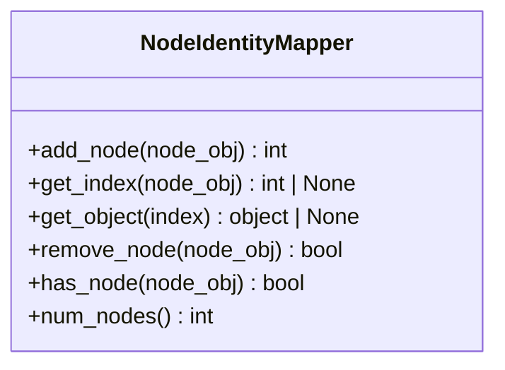
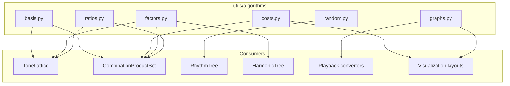

# Utils — Shared Utilities

`klotho.utils` provides pure-math algorithms, data-structure helpers,
and the playback subsystem.  The playback layer is documented
separately in [07_PLAYBACK.md](07_PLAYBACK.md); this document covers
the algorithms and data-structure modules.

---

## Module Map

```
utils/
├── __init__.py
├── algorithms/
│   ├── __init__.py
│   ├── basis.py           # basis matrices, change of basis, prime ↔ generator coords
│   ├── costs.py           # cost matrices, minimum-cost paths
│   ├── factors.py         # normalization, prime factorization, lattice vectors
│   ├── graphs.py          # graph traversals (TSP, random walks, DFS, Dijkstra)
│   ├── lists.py           # list manipulation utilities
│   ├── random.py          # diverse_sample (quasi-random)
│   └── ratios.py          # superparticular checks, prime validation
├── data_structures/
│   ├── __init__.py
│   ├── dictionaries.py    # SafeDict (case-insensitive, immutable-ish)
│   ├── enums.py           # shared enumerations
│   ├── node_mapping.py    # NodeIdentityMapper (object ↔ int ID)
│   └── 8th-octave.json    # 8th-octave pitch data
└── playback/              # (see 07_PLAYBACK.md)
    └── …
```

---

## 1. Algorithms

### 1.1 `basis.py` — Basis Matrices and Coordinate Transforms

Supports the mathematics behind `ToneLattice` and `CPS` coordinate
systems.

| Function | Description |
|---|---|
| `monzo_from_ratio(ratio, primes)` | Ratio → prime-exponent (monzo) vector |
| `ratio_from_monzo(monzo, primes)` | Monzo vector → `Fraction` ratio |
| `basis_matrix(primes, generators)` | Build a basis matrix from primes and generator ratios |
| `is_unimodular(matrix)` | Check if basis matrix has determinant ±1 |
| `change_of_basis(coords, from_basis, to_basis)` | Transform coordinates between bases |
| `prime_to_generator_coords(prime_coords, generators)` | Prime-exponent vector → generator coordinates |
| `generator_to_prime_coords(gen_coords, generators)` | Generator coordinates → prime-exponent vector |
| `ratio_from_prime_coords(coords)` | Prime-exponent vector → `Fraction` ratio |
| `ratio_from_generator_coords(coords, generators)` | Generator coordinates → `Fraction` ratio |

**Dependencies:** `numpy`, `sympy` (for prime tests)

### 1.2 `costs.py` — Cost Matrices and Paths

Used for pitch-distance calculations and optimal ordering.

| Function | Description |
|---|---|
| `cost_matrix(items, cost_function)` | Build a symmetric cost matrix from a pairwise cost function (returns matrix + item list) |

(Path-finding over a cost structure lives in `graphs.py` —
`minimum_cost_path` there operates on a `Graph`, not a raw matrix.)

**Dependencies:** `numpy`, `scipy.spatial.distance`

### 1.3 `factors.py` — Numeric Factorization and Normalization

Core numeric operations used throughout chronos and tonos.

| Function | Description |
|---|---|
| `to_factors(value)` | Prime factorization of an int/Fraction (dict of prime → exponent) |
| `from_factors(factors)` | Reconstruct a `Fraction` from prime factors |
| `nth_prime(prime)` | 1-based **index** of a given prime in the prime sequence (inverse lookup) |
| `factors_to_lattice_vector(factors, vector_size=None)` | Prime factors → exponent vector |
| `ratio_to_coordinate(ratio, …)` | `Fraction` → prime-exponent coordinate |
| `ratios_to_coordinates(ratios, …)` | Batch version |

(`normalize_sum` and `invert` live in `lists.py`, not here — see 1.5.)

**Dependencies:** `sympy` (prime generation)

### 1.4 `graphs.py` — Graph Traversal Algorithms

Algorithms for traversing weighted graphs, used for pitch-space
navigation and compositional path-finding.

| Function | Description |
|---|---|
| `greedy_tsp(G, source=None)` | Greedy traveling salesman approximation |
| `minimum_cost_path(G, traversal_func, …)` | Lowest-cost path under a traversal strategy |
| `greedy_random_walk(G, source, steps=10, weight='weight')` | Random walk biased toward low-cost edges |
| `probabilistic_random_walk(G, source, steps=10, …)` | Stochastic walk with temperature |
| `deterministic_greedy_walk(G, source, steps=10, …)` | Always choose cheapest unvisited neighbor |
| `prim_order_traversal(G, source, weight='weight')` | MST-ordered traversal |
| `greedy_nearest_unvisited(G, source, weight='weight')` | Visit nearest unvisited node repeatedly |
| `dijkstra_order_traversal(G, source, weight='weight')` | Nodes in Dijkstra distance order |
| `weighted_dfs_traversal(G, source, weight='weight')` | DFS preferring lower-weight edges |

**Dependencies:** `networkx` (graph algorithms)

### 1.5 `lists.py` — List Utilities

General-purpose list manipulation functions used across subpackages:

| Function | Description |
|---|---|
| `normalize_sum(data)` | Scale a list so its values sum to 1 |
| `invert(data)` | Structural inversion of a value list |

### 1.6 `random.py` — Diverse Subset Sampling

| Function | Description |
|---|---|
| `diverse_sample(elements, num_samples, subset_size, **kwargs)` | Select `num_samples` maximally diverse **subsets** of size `subset_size` |

Uses distance-based selection to ensure sampled subsets are
well-spread across the combinatorial space.

### 1.7 `ratios.py` — Ratio Validation

| Function | Description |
|---|---|
| `is_superparticular(ratio)` | Check if a ratio is of the form (n+1)/n |
| `superparticular_base(ratio)` | Extract the base *n* from a superparticular ratio |
| `validate_primes(primes)` | Validate a list of primes (returns the cleaned list) |

---

## 2. Data Structures

### 2.1 `dictionaries.py` — SafeDict

A dictionary subclass used by `Instrument` for parameter storage:

- **Fixed key set** — keys are established at construction; adding or
  deleting keys afterwards raises (values remain updatable).
- Optional **alias resolution** — alternative names map onto canonical
  keys (`aliases={...}` at construction).

### 2.2 `enums.py` — Shared Enumerations

Common enumeration types used across subpackages.

### 2.3 `node_mapping.py` — NodeIdentityMapper

Bidirectional mapping between arbitrary Python objects and integer
indices, used when bridging between RustworkX (which requires integer
node IDs) and external representations.



A general-purpose helper for bridging object-keyed and integer-keyed
node addressing.  (Note: `Graph.from_networkx()` currently uses an
inline dict rather than this class.)

### 2.4 `8th-octave.json`

A JSON data file containing pitch-frequency mappings for the 8th
octave, used as reference data for frequency conversion utilities.

---

## 3. Algorithm Usage Map

Where each algorithm module is consumed:



---

## 4. External Dependency Usage

| Module | Dependencies Used |
|---|---|
| `basis.py` | `numpy`, `sympy` |
| `costs.py` | `numpy`, `scipy.spatial.distance` |
| `factors.py` | `sympy` |
| `graphs.py` | `networkx` |
| `random.py` | `numpy` |
| `node_mapping.py` | *(stdlib only)* |
| `dictionaries.py` | *(stdlib only)* |
