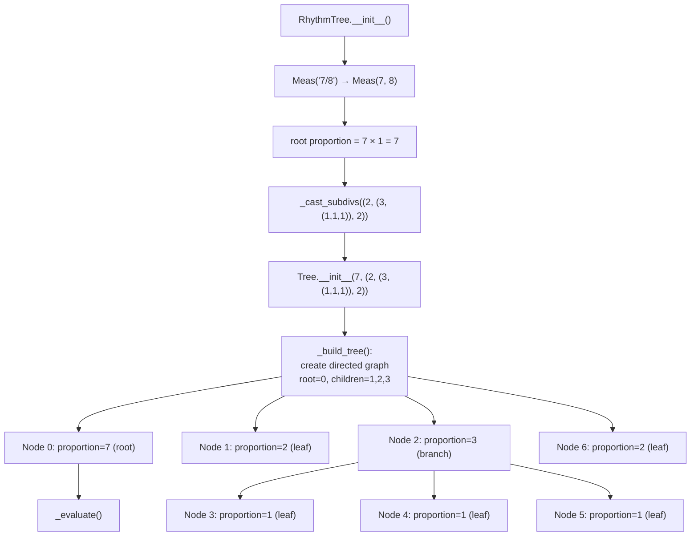
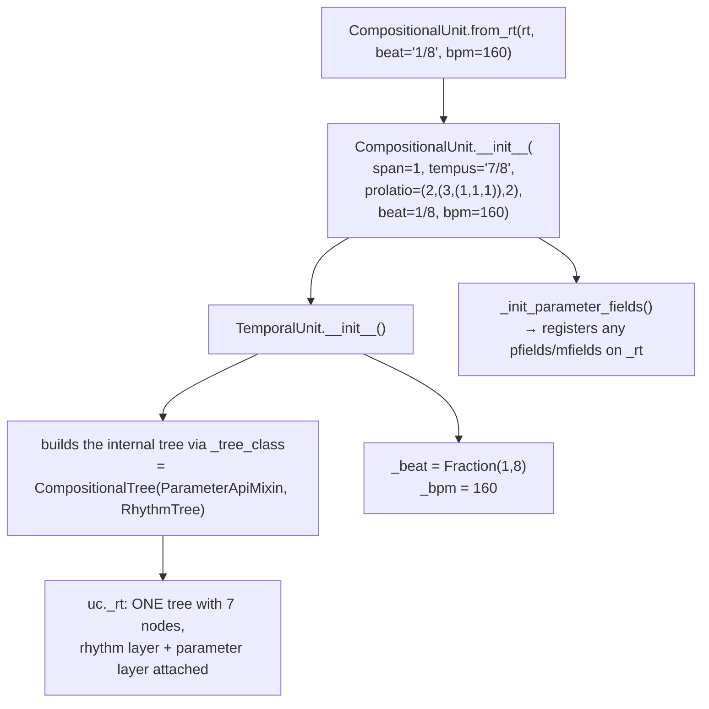
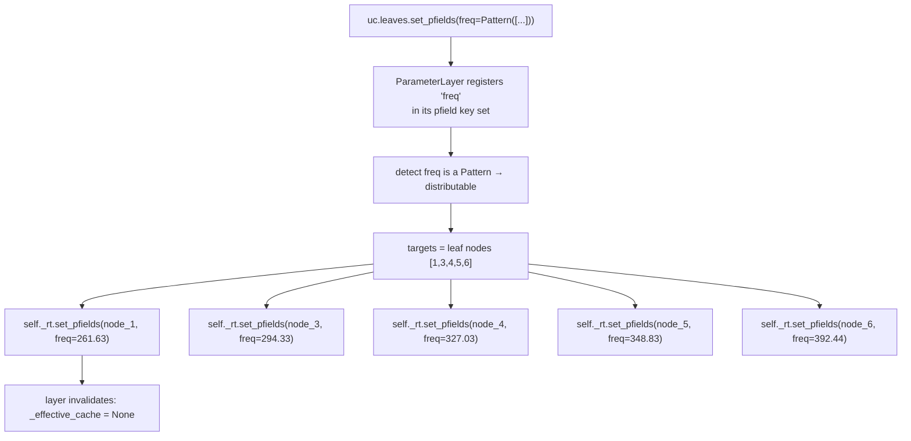
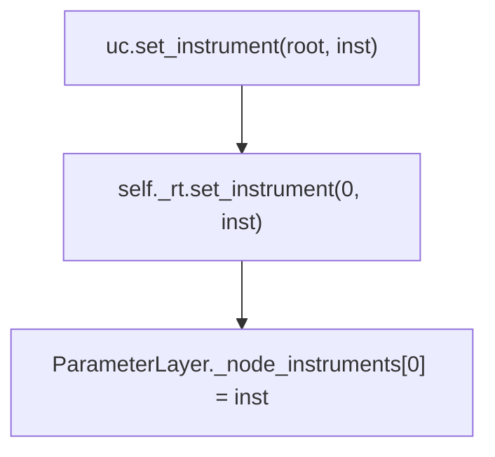
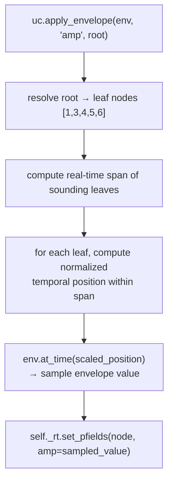
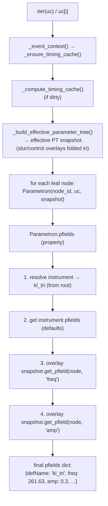
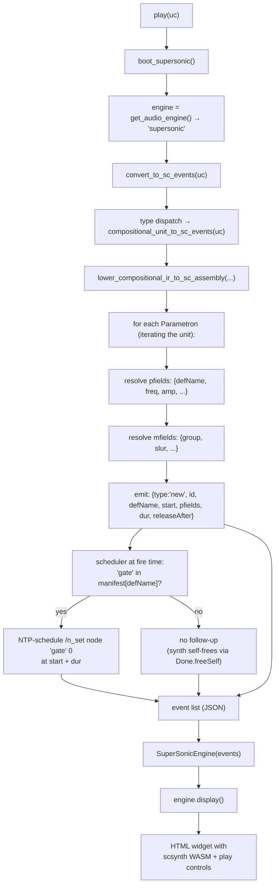
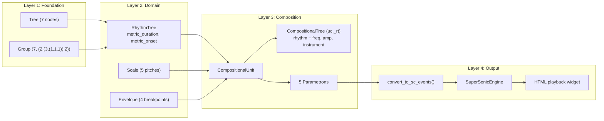

# End-to-End Walkthrough

This document traces a single composition through every layer of
Klotho — from raw rhythm definition to audible playback — showing
exactly which classes are instantiated, what data is computed at each
step, and how the layers connect.

---

## The Goal

We will build a short musical phrase: a 7/8 measure with a custom
subdivision, bind it to a tempo, assign pitches from a just-intonation
scale, apply a dynamic envelope, and play it through the SuperSonic
engine.

```python
from klotho.chronos import RhythmTree, TemporalUnit
from klotho.thetos import CompositionalUnit, SynthDefInstrument
from klotho.tonos import Scale
from klotho.dynatos import Envelope
from klotho.topos import Pattern
from klotho import play
```

---

## Step 1: Define the Rhythm (`RhythmTree`)

```python
rt = RhythmTree(
    span=1,
    meas='7/8',
    subdivisions=(2, (3, (1, 1, 1)), 2)
)
```

### What Happens Internally



#### Tree Structure

```
        7  (root, node 0)
       /|\
      2  3  2    (nodes 1, 2, 6)
        /|\
       1  1  1   (nodes 3, 4, 5)
```

Node ids are assigned as the builder walks the nested tuple, so the
branch's children (3, 4, 5) are numbered before the final top-level
leaf (6).

#### `_evaluate()` — Single-Pass DFS

Starting from the root (proportion = 7, metric_duration = 7/8):

| Node | Proportion | Divisor | Metric Duration | Metric Onset |
|---|---|---|---|---|
| 0 (root) | 7 | — | 7/8 | 0 |
| 1 (leaf) | 2 | 2+3+2=7 | 2/7 × 7/8 = **1/4** | **0** |
| 2 (branch) | 3 | 7 | 3/7 × 7/8 = **3/8** | 1/4 |
| 3 (leaf) | 1 | 1+1+1=3 | 1/3 × 3/8 = **1/8** | **1/4** |
| 4 (leaf) | 1 | 3 | **1/8** | **3/8** |
| 5 (leaf) | 1 | 3 | **1/8** | **1/2** |
| 6 (leaf) | 2 | 7 | 2/7 × 7/8 = **1/4** | **5/8** |

After `_evaluate()`, each node in the RustworkX graph has:
- `proportion` (the integer weight — mutable)
- `tied` (bool — mutable)
- `metric_duration` (Fraction — derived)
- `metric_onset` (Fraction — derived)

#### Verify

```python
rt.durations  # (Fraction(1,4), Fraction(1,8), Fraction(1,8), Fraction(1,8), Fraction(1,4))
rt.onsets     # (Fraction(0,1), Fraction(1,4), Fraction(3,8), Fraction(1,2), Fraction(5,8))
rt.leaf_nodes # (1, 3, 4, 5, 6)
```

---

## Step 2: Bind to Tempo (`CompositionalUnit`)

We skip the intermediate `TemporalUnit` step and go directly to
`CompositionalUnit`, which extends `TemporalUnit`:

```python
uc = CompositionalUnit.from_rt(rt, beat='1/8', bpm=160)
```

### What Happens Internally



#### Real-Time Conversion (Lazy)

Real-time values are computed on first access via
`_ensure_timing_cache()` → `_compute_timing_cache()`:

```
beat_dur = 60 / bpm = 60 / 160 = 0.375 s per eighth note
```

For each node:
```
real_duration = beat_duration(metric_duration, bpm=160, beat_ratio=1/8)
real_onset = beat_duration(metric_onset, bpm=160, beat_ratio=1/8) + offset
```

| Leaf | Metric Duration | Metric Onset | Real Duration (s) | Real Onset (s) |
|---|---|---|---|---|
| 1 | 1/4 | 0 | 0.750 | 0.000 |
| 3 | 1/8 | 1/4 | 0.375 | 0.750 |
| 4 | 1/8 | 3/8 | 0.375 | 1.125 |
| 5 | 1/8 | 1/2 | 0.375 | 1.500 |
| 6 | 1/4 | 5/8 | 0.750 | 1.875 |

Total duration: **2.625 seconds**.

#### The Fused Tree

At this point `uc._rt` is a `CompositionalTree` — a single 7-node
topology carrying both rhythm data (via its `RhythmLayer`) and, so
far, no parameter overrides (its `ParameterLayer` is empty, waiting
for pfields, mfields, and instruments).  There is no separate
`ParameterTree` to keep in sync; `uc.pt` is a derived snapshot when
you ask for it.

---

## Step 3: Assign Pitches

```python
scale = Scale(["1/1", "9/8", "5/4", "4/3", "3/2"]).root("C4")

pitches = Pattern([float(p.freq) for p in scale.pitches])
# [261.63, 294.33, 327.03, 348.83, 392.44]  — C4 D4 E4 F4 G4 (just)

uc.leaves.set_pfields(freq=pitches)
```

(Pfield values that reach the playback layer must be plain numbers —
the SC event validator rejects `klotho.types` unit wrappers, so
unwrap with `float()` when sourcing pitches from typed objects.)

The API is `set_pfields(node, **kwargs)` where the target is a node or
list of nodes; the leaves selector (`uc.leaves.set_pfields(...)`)
targets every sounding leaf.  `Pattern` and callable values are
evaluated **once per target node** — so targeting the leaves cycles
the pattern across them.  (Targeting a single node like `uc.root`
would evaluate the pattern once and let the single value inherit to
all descendants.)

### What Happens Internally



Each value is stored as an override on the specific leaf node of the
fused tree.  The layer's `_effective_cache` is invalidated and will be
rebuilt lazily on the next read.

---

## Step 4: Assign an Instrument

```python
inst = SynthDefInstrument.from_manifest('kl_tri')
uc.set_instrument(uc.root, inst)
```

### What Happens Internally



Because the instrument is set at the **root**, it is inherited by
all descendants via `_resolve_governing_instrument_node()` — which
walks up the ancestor chain until it finds a node with an instrument.

---

## Step 5: Apply a Dynamic Envelope

```python
env = Envelope([0.3, 1.0, 0.6, 0.2], times=[0.1, 0.6, 0.3], curve=-2)
uc.apply_envelope(env, pfields='amp', node=uc.root)
```

The full signature is
`apply_envelope(envelope, pfields, node, offset=0, take=None, scope="span", control=False, endpoint=True)`.

### What Happens Internally



| Leaf | Normalized Position | Envelope Value |
|---|---|---|
| 1 | 0.000 | 0.300 |
| 3 | 0.286 | 0.786 |
| 4 | 0.429 | 0.692 |
| 5 | 0.571 | 0.633 |
| 6 | 0.714 | 0.558 |

These amplitude values are written as `'amp'` pfields on each
leaf node.

---

## Step 6: Read the Events

The `.events` property returns a pandas `DataFrame`.  To access
individual `Parametron` objects (which carry the full resolution
logic), iterate the unit directly or use `uc.nodes`:

```python
for p in uc:                       # iterates Parametron objects (leaf nodes)
    print(f"t={p.start:.3f}s  dur={p.duration:.3f}s  "
          f"freq={p.get_pfield('freq')}  amp={p.get_pfield('amp'):.3f}")

uc.events                          # returns a DataFrame summary
```

### What Happens Internally



Each `Parametron` lazily resolves its parameter values through a
three-level lookup:

1. **Instrument defaults** — base pfields from the resolved instrument.
2. **Inherited values** — propagated from ancestors in the snapshot.
3. **Node overrides** — set directly on this node.

Node overrides win over inherited values, which win over instrument
defaults.

> **Note:** `uc.events` returns a `DataFrame` with columns for
> temporal data and pfield dicts.  For programmatic access to resolved
> parameters, use `uc[i]` or `uc.nodes[node_id]` to get `Parametron`
> objects.

---

## Step 7: Play It

```python
play(uc)
```

### What Happens Internally



#### Final SC Event Payload (simplified)

```json
[
  {"type":"new", "id":"a1…", "defName":"kl_tri", "start":0.000, "pfields":{"freq":261.63,"amp":0.300}, "dur":0.750, "releaseAfter":true},
  {"type":"new", "id":"b2…", "defName":"kl_tri", "start":0.750, "pfields":{"freq":294.33,"amp":0.786}, "dur":0.375, "releaseAfter":true},
  {"type":"new", "id":"c3…", "defName":"kl_tri", "start":1.125, "pfields":{"freq":327.03,"amp":0.692}, "dur":0.375, "releaseAfter":true},
  {"type":"new", "id":"d4…", "defName":"kl_tri", "start":1.500, "pfields":{"freq":348.83,"amp":0.633}, "dur":0.375, "releaseAfter":true},
  {"type":"new", "id":"e5…", "defName":"kl_tri", "start":1.875, "pfields":{"freq":392.44,"amp":0.558}, "dur":0.750, "releaseAfter":true}
]
```

This JSON is embedded in an HTML widget and scheduled on the
SuperSonic timeline.  The browser's Web Audio API (via scsynth WASM)
synthesizes the audio.

---

## Layer Summary



---

## Key Takeaways

1. **Data flows downward through layers** — no layer reaches up to
   modify a layer above it.

2. **Computation is lazy** — real-time timing values are not computed
   until first access (`_ensure_timing_cache`).  Effective parameter
   values are not resolved until a `Parametron` is read.

3. **One topology carries everything** — the fused
   `CompositionalTree` holds rhythm and parameters on the same nodes
   via attached layers, providing O(1) parameter lookup with automatic
   inheritance and nothing to synchronize.  (Standalone
   `ParameterTree`s and `uc.pt` snapshots still clone a topology via
   `from_tree_structure`.)

4. **Instruments are resolved by walking up** — setting an instrument
   at the root means every leaf inherits it; setting one on a specific
   branch overrides just that subtree.

5. **The event payload is the handoff point** — once `Parametron`
   data is serialized into a JSON event list, the playback engine is
   completely decoupled from the composition objects.
