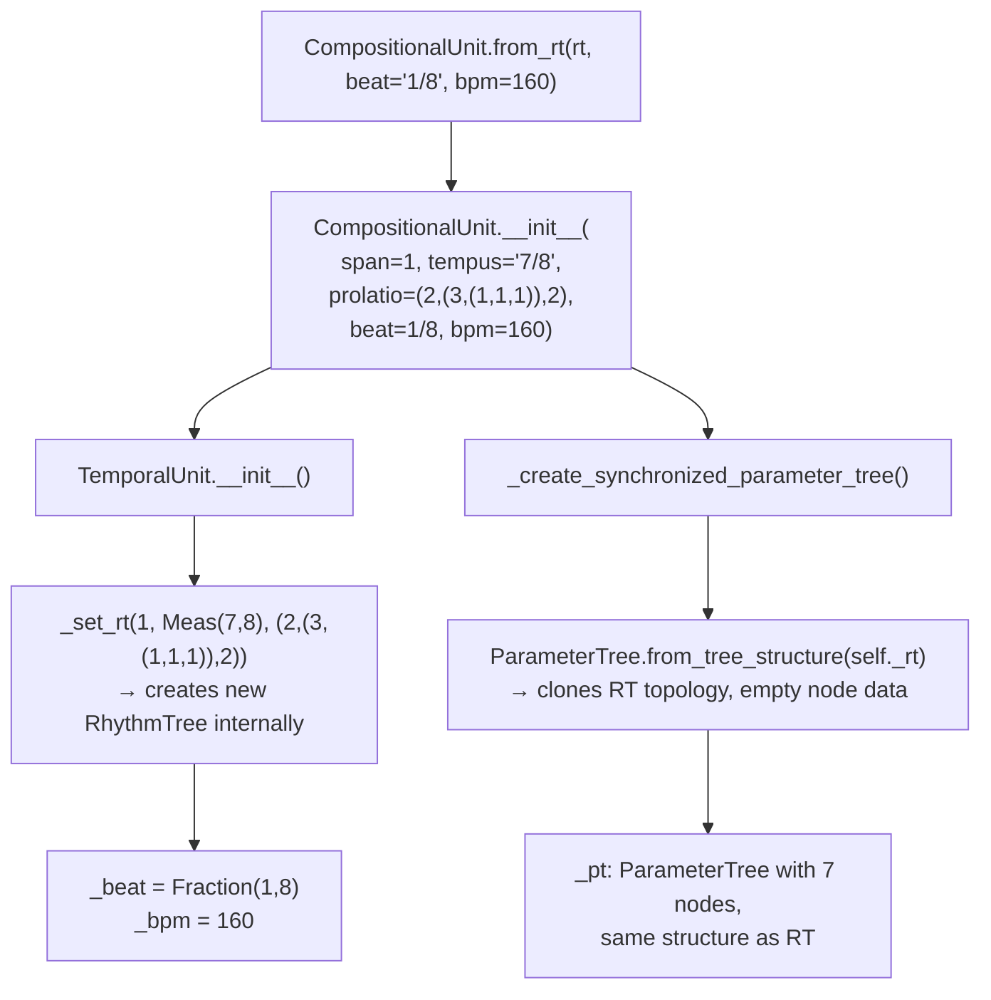
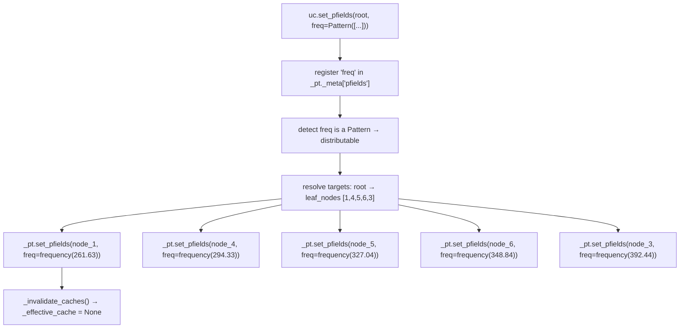
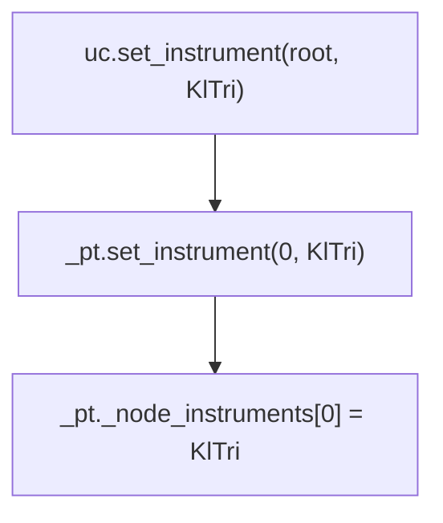
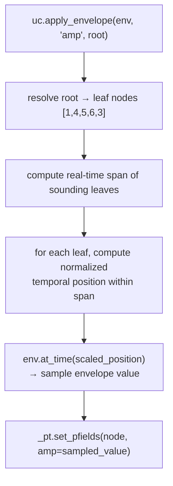
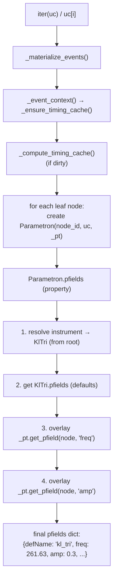
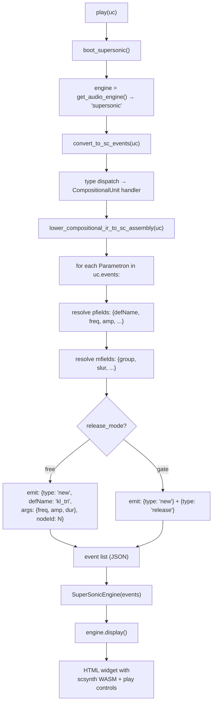
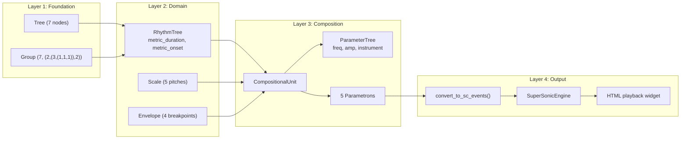

# End-to-End Walkthrough

This document traces a single composition through every layer of
Klotho — from raw rhythm definition to audible playback — showing
exactly which classes are instantiated, what data is computed at each
step, and how the layers connect.

---

## The Goal

We will build a short musical phrase: a 7/8 measure with a custom
subdivision, bind it to a tempo, assign pitches from a just-intonation
scale, apply a dynamic envelope, and play it through the SuperSonic
engine.

```python
from klotho.chronos import RhythmTree, TemporalUnit
from klotho.thetos import CompositionalUnit, SynthDefInstrument
from klotho.tonos import Scale
from klotho.dynatos import Envelope
from klotho.topos import Pattern
from klotho.types import frequency
from klotho import play
```

---

## Step 1: Define the Rhythm (`RhythmTree`)

```python
rt = RhythmTree(
    span=1,
    meas='7/8',
    subdivisions=(2, (3, (1, 1, 1)), 2)
)
```

### What Happens Internally


#### Tree Structure

```
        7  (root, node 0)
       /|\
      2  3  2    (nodes 1, 2, 3)
        /|\
       1  1  1   (nodes 4, 5, 6)
```

#### `_evaluate()` — Single-Pass DFS

Starting from the root (proportion = 7, metric_duration = 7/8):

| Node | Proportion | Divisor | Metric Duration | Metric Onset |
|---|---|---|---|---|
| 0 (root) | 7 | — | 7/8 | — |
| 1 (leaf) | 2 | 2+3+2=7 | 2/7 × 7/8 = **1/4** | **0** |
| 2 (branch) | 3 | 7 | 3/7 × 7/8 = **3/8** | — |
| 4 (leaf) | 1 | 1+1+1=3 | 1/3 × 3/8 = **1/8** | **1/4** |
| 5 (leaf) | 1 | 3 | **1/8** | **3/8** |
| 6 (leaf) | 1 | 3 | **1/8** | **1/2** |
| 3 (leaf) | 2 | 7 | 2/7 × 7/8 = **1/4** | **5/8** |

After `_evaluate()`, each node in the RustworkX graph has:
- `proportion` (the integer weight — mutable)
- `metric_duration` (Fraction — derived)
- `metric_onset` (Fraction — derived, leaves only)

#### Verify

```python
rt.durations  # (Fraction(1,4), Fraction(1,8), Fraction(1,8), Fraction(1,8), Fraction(1,4))
rt.onsets     # (Fraction(0,1), Fraction(1,4), Fraction(3,8), Fraction(1,2), Fraction(5,8))
rt.leaf_nodes # [1, 4, 5, 6, 3]
```

---

## Step 2: Bind to Tempo (`CompositionalUnit`)

We skip the intermediate `TemporalUnit` step and go directly to
`CompositionalUnit`, which extends `TemporalUnit`:

```python
uc = CompositionalUnit.from_rt(rt, beat='1/8', bpm=160)
```

### What Happens Internally



#### Real-Time Conversion (Lazy)

Real-time values are computed on first access via
`_ensure_timing_cache()` → `_compute_timing_cache()`:

```
beat_dur = 60 / bpm = 60 / 160 = 0.375 s per eighth note
```

For each node:
```
real_duration = beat_duration(metric_duration, bpm=160, beat_ratio=1/8)
real_onset = beat_duration(metric_onset, bpm=160, beat_ratio=1/8) + offset
```

| Leaf | Metric Duration | Metric Onset | Real Duration (s) | Real Onset (s) |
|---|---|---|---|---|
| 1 | 1/4 | 0 | 0.750 | 0.000 |
| 4 | 1/8 | 1/4 | 0.375 | 0.750 |
| 5 | 1/8 | 3/8 | 0.375 | 1.125 |
| 6 | 1/8 | 1/2 | 0.375 | 1.500 |
| 3 | 1/4 | 5/8 | 0.750 | 1.875 |

Total duration: **2.625 seconds**.

#### The Synchronized ParameterTree

At this point, `uc._pt` exists with the same 7-node topology as the
RT but contains no parameter data — it's an empty shell waiting for
pfields, mfields, and instruments.

---

## Step 3: Assign Pitches

```python
scale = Scale(["1/1", "9/8", "5/4", "4/3", "3/2"])

pitches = Pattern([
    frequency(261.63),              # C4
    frequency(261.63 * 9/8),        # D4 (just)
    frequency(261.63 * 5/4),        # E4 (just)
    frequency(261.63 * 4/3),        # F4 (just)
    frequency(261.63 * 3/2),        # G4 (just)
])

uc.set_pfields(uc.root, freq=pitches)
```

The actual API is `set_pfields(node, **kwargs)` — the first argument
is a target node (or list of nodes), and parameter names are passed
as keyword arguments.  When the target is a branch node, the values
are distributed across its subtree leaves.  `Pattern` and callable
values are evaluated once per leaf.

### What Happens Internally



Each value is stored as an override on the specific leaf node.
The `_effective_cache` is invalidated and will be rebuilt on next
read.

---

## Step 4: Assign an Instrument

```python
inst = SynthDefInstrument.KlTri
uc.set_instrument(uc.root, inst)
```

### What Happens Internally



Because the instrument is set at the **root**, it is inherited by
all descendants via `_resolve_governing_instrument_node()` — which
walks up the ancestor chain until it finds a node with an instrument.

---

## Step 5: Apply a Dynamic Envelope

```python
env = Envelope([0.3, 1.0, 0.6, 0.2], times=[0.1, 0.6, 0.3], curve=-2)
uc.apply_envelope(env, pfields='amp', node=uc.root)
```

The full signature is
`apply_envelope(envelope, pfields, node, offset=0, take=None, mode="span", endpoint=True)`.

### What Happens Internally



| Leaf | Normalized Position | Envelope Value |
|---|---|---|
| 1 | 0.000 | 0.300 |
| 4 | 0.286 | 0.907 |
| 5 | 0.429 | 0.986 |
| 6 | 0.571 | 0.852 |
| 3 | 0.714 | 0.534 |

These amplitude values are written as `'amp'` pfields on each
leaf node.

---

## Step 6: Read the Events

The `.events` property returns a pandas `DataFrame`.  To access
individual `Parametron` objects (which carry the full resolution
logic), iterate the unit directly or use `uc.nodes`:

```python
for p in uc:                       # iterates Parametron objects (leaf nodes)
    print(f"t={p.start:.3f}s  dur={p.duration:.3f}s  "
          f"freq={p.get_pfield('freq')}  amp={p.get_pfield('amp'):.3f}")

uc.events                          # returns a DataFrame summary
```

### What Happens Internally



Each `Parametron` lazily resolves its parameter values through a
three-level lookup:

1. **Instrument defaults** — base pfields from `KlTri`.
2. **ParameterTree inherited values** — propagated from ancestors.
3. **ParameterTree node overrides** — set directly on this node.

Node overrides win over inherited values, which win over instrument
defaults.

> **Note:** `uc.events` returns a `DataFrame` with columns for
> temporal data and pfield dicts.  For programmatic access to resolved
> parameters, use `uc[i]` or `uc.nodes[node_id]` to get `Parametron`
> objects.

---

## Step 7: Play It

```python
play(uc)
```

### What Happens Internally



#### Final SC Event Payload (simplified)

```json
[
  {"type":"new", "time":0.000, "defName":"kl_tri", "args":{"freq":261.63,"amp":0.300,"dur":0.750}, "nodeId":1000},
  {"type":"new", "time":0.750, "defName":"kl_tri", "args":{"freq":294.33,"amp":0.907,"dur":0.375}, "nodeId":1001},
  {"type":"new", "time":1.125, "defName":"kl_tri", "args":{"freq":327.04,"amp":0.986,"dur":0.375}, "nodeId":1002},
  {"type":"new", "time":1.500, "defName":"kl_tri", "args":{"freq":348.84,"amp":0.852,"dur":0.375}, "nodeId":1003},
  {"type":"new", "time":1.875, "defName":"kl_tri", "args":{"freq":392.44,"amp":0.534,"dur":0.750}, "nodeId":1004}
]
```

This JSON is embedded in an HTML widget and scheduled on the
SuperSonic timeline.  The browser's Web Audio API (via scsynth WASM)
synthesizes the audio.

---

## Layer Summary



---

## Key Takeaways

1. **Data flows downward through layers** — no layer reaches up to
   modify a layer above it.

2. **Computation is lazy** — real-time timing values are not computed
   until first access (`_ensure_timing_cache`).  Effective parameter
   values are not resolved until a `Parametron` is read.

3. **The ParameterTree is the bridge** — it clones the RhythmTree's
   topology and provides O(1) parameter lookup with automatic
   inheritance.

4. **Instruments are resolved by walking up** — setting an instrument
   at the root means every leaf inherits it; setting one on a specific
   branch overrides just that subtree.

5. **The event payload is the handoff point** — once `Parametron`
   data is serialized into a JSON event list, the playback engine is
   completely decoupled from the composition objects.
