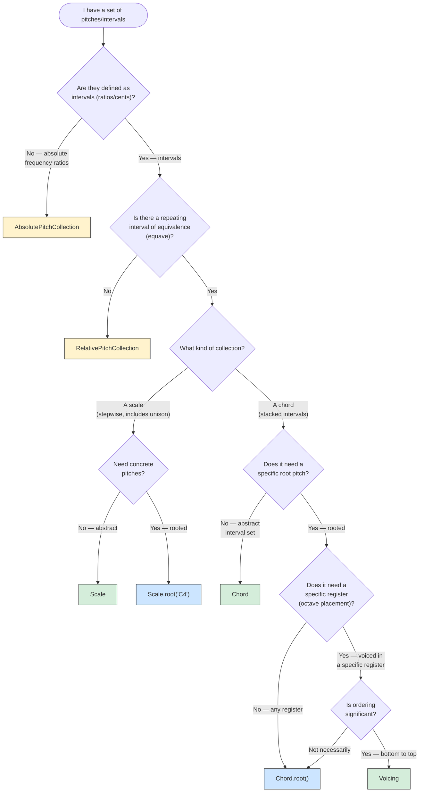
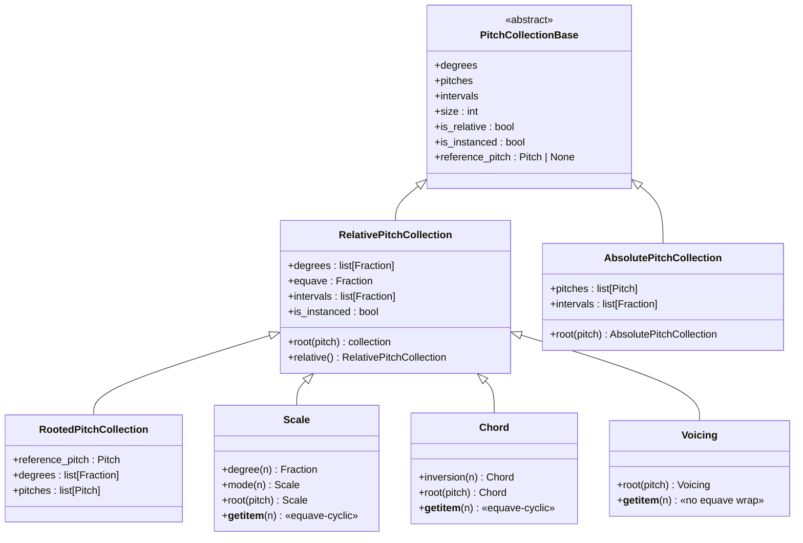
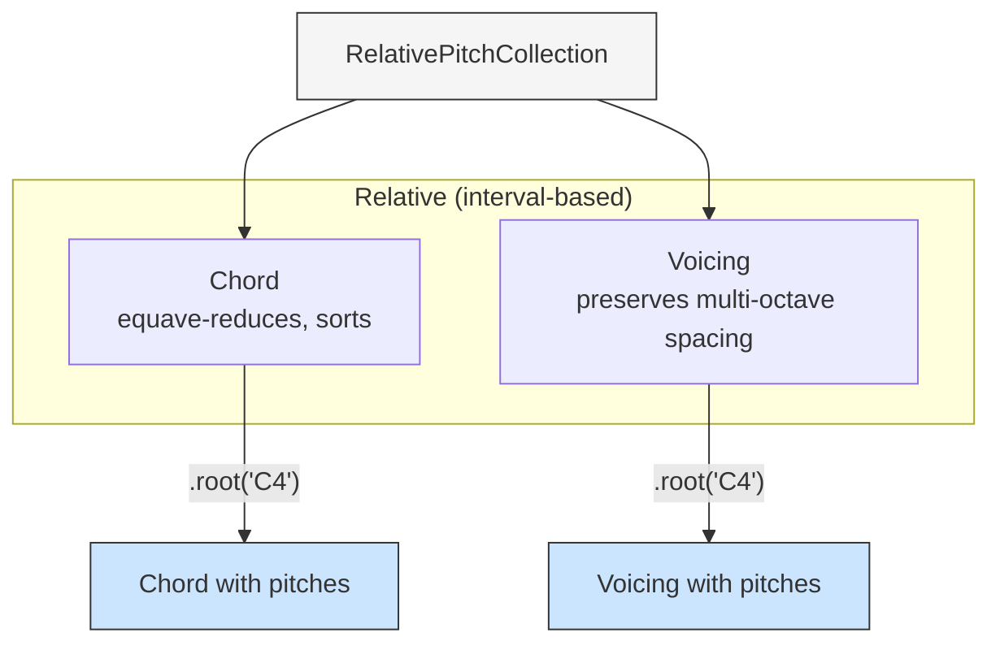
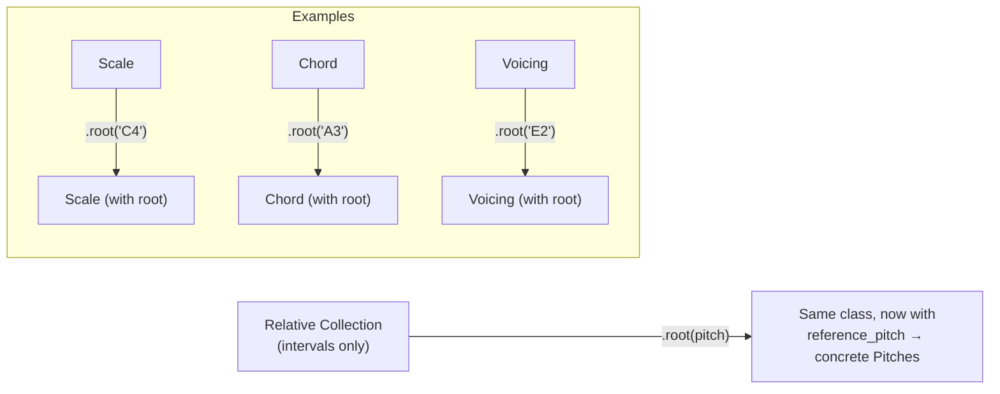
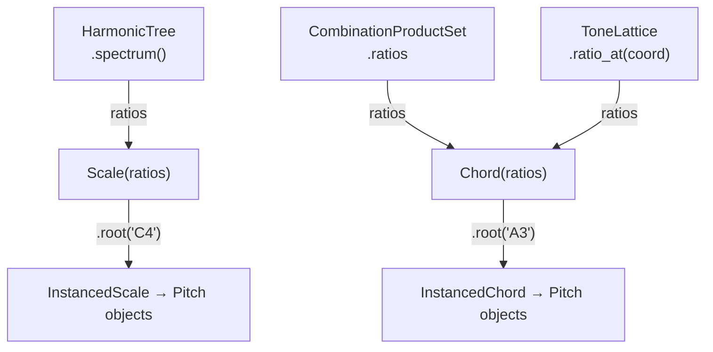

# Pitch Collections — Decision Guide

The `tonos.pitch` and `tonos.chords` / `tonos.scales` modules provide
a hierarchy of pitch-collection classes.  Choosing the right one
depends on three questions: *how is it defined?*, *does it have a
root?*, and *does it need to be placed in a register?*

This guide is a companion to [03_TONOS.md](03_TONOS.md), focused
on practical selection rather than internal architecture.

---

## 1. Decision Tree



---

## 2. Quick Reference Table

| Class | Defined by | Has root? | Has equave? | Register-placed? | Use case |
|---|---|---|---|---|---|
| `PitchCollectionBase` | *(abstract)* | — | — | — | Base interface |
| `RelativePitchCollection` | Interval ratios | Via `.root()` | Optional | No | Abstract interval set |
| `AbsolutePitchCollection` | Absolute ratios | Via `.root()` | Optional | No | Fixed frequency ratios |
| `RootedPitchCollection` | Root + intervals | Yes | Yes | No | Rooted interval set |
| `Scale` | Intervals | Via `.root()` | Yes | No | Repeating scale pattern |
| `Chord` | Intervals | Via `.root()` | Yes | No | Abstract chord quality |
| `Voicing` | Intervals + register | Via `.root()` | Yes | Yes | Specific pitch placement |
| `ChordSequence` | List of chords | — | — | — | Progression container |
| `Contour` | Direction integers | — | — | — | Pitch motion pattern |

---

## 3. The Inheritance Hierarchy



### Design Philosophy

`Scale`, `Chord`, and `Voicing` are **not** subclasses of each
other — they are all direct subclasses of `RelativePitchCollection`
that enforce different constraints on the same interval-based
foundation.  You can build the equivalent of a Scale or Chord "from
scratch" using a raw `RelativePitchCollection` — the named classes
exist as conveniences that enforce particular invariants
(unison enforcement, equave reduction, etc.).

---

## 4. Relative vs Absolute vs Rooted

### Relative (`RelativePitchCollection`, `Scale`, `Chord`)

Defined by **intervals** (frequency ratios or cents).  No concrete
pitches until a root is applied.

```python
scale = Scale(["1/1", "9/8", "5/4", "4/3", "3/2", "5/3", "15/8"])
scale.degrees   # [Fraction(1,1), Fraction(9,8), …]
scale.pitches   # None — no root assigned

c_scale = scale.root("C4")  # → InstancedScale at C4
c_scale.pitches  # [Pitch(C4), Pitch(D4+4¢), Pitch(E4-14¢), …]
```

### Absolute (`AbsolutePitchCollection`)

Defined by **fixed frequency ratios** — the pitches are absolute,
not relative to any root.

### Rooted (`RootedPitchCollection`, `InstancedScale`, `InstancedChord`)

A relative collection **bound to a specific root pitch**.  Produces
concrete `Pitch` objects with Hz values.

---

## 5. Scale vs Chord

Both `Scale` and `Chord` extend `RelativePitchCollection` with
equave-cyclic indexing (`EquaveCyclicMixin`), but differ in semantics:

| Property | Scale | Chord |
|---|---|---|
| Unison required | Yes — `1/1` or `0¢` always present | No |
| Sorted | Yes (ascending) | Yes (ascending) |
| Deduplicated | Yes | Yes |
| Equave-reduced | Yes | Yes |
| Cyclic indexing | `scale[7]` wraps into next equave | `chord[3]` wraps into next equave |
| `.mode(n)` | Yes — rotates to *n*-th degree | No |
| `.inversion(n)` | No | Yes — inverts chord voicing |

---

## 6. Chord vs Voicing

Both represent "simultaneous pitches" but come from the same branch of
the hierarchy (`RelativePitchCollection`) with different constraints:



| Class | Inherits from | What it models | Example |
|---|---|---|---|
| `Chord` | `RelativePitchCollection` | Interval set, equave-reduced | `Chord(["1/1", "5/4", "3/2"])` |
| `Voicing` | `RelativePitchCollection` | Multi-octave interval set, no equave reduction | `Voicing(["1/2", "1/1", "3/2", "5/2"])` |

**When to use each:**

- **`Chord`** — you're working with interval relationships within
  one equave and don't yet need concrete pitches.
- **`Voicing`** — you need intervals that span multiple octaves
  without equave folding.

---

## 7. The Instancing Pattern

"Instancing" converts a relative collection to concrete pitches by
calling `.root(pitch)`.  This returns a **new instance of the same
class** with its `reference_pitch` set:



> **Note:** `InstancedScale`, `InstancedChord`, and `InstancedVoicing`
> are **type aliases** (`InstancedScale = Scale`, etc.), not separate
> classes.  A "rooted Scale" and an "InstancedScale" are the same
> object.

An instanced collection computes each pitch as
`root_freq × degree_ratio`, producing `Pitch` objects with
frequency, pitch class, octave, and cents-offset data.

---

## 8. Equave-Cyclic Indexing

Both `Scale` and `Chord` (and their subclasses) support cyclic
indexing that wraps through equaves:

```python
scale = Scale(["1/1", "9/8", "5/4", "4/3", "3/2", "5/3", "15/8"])
# 7 degrees (0–6)

scale[0]   # Fraction(1, 1)     — unison
scale[6]   # Fraction(15, 8)    — major seventh
scale[7]   # Fraction(2, 1)     — octave (wraps: 1/1 × 2/1)
scale[14]  # Fraction(4, 1)     — two octaves up
scale[-1]  # Fraction(15, 16)   — major seventh below unison
```

This is controlled by `EquaveCyclicMixin`, which computes:
```
octave_shift = index // len(degrees)
degree = index % len(degrees)
result = degrees[degree] × equave^octave_shift
```

---

## 9. ChordSequence

A container for temporal chord progressions:

```python
seq = ChordSequence([
    Chord(["1/1", "5/4", "3/2"]),
    Chord(["1/1", "6/5", "3/2"]),
    Chord(["1/1", "5/4", "3/2", "7/4"]),
])

seq.transpose(Fraction(3, 2))  # transpose all chords by a fifth
```

Used by the playback system to generate arpeggiated or block-chord
events.

---

## 10. Contour

Not a pitch collection, but a pitch-*motion* descriptor:

```python
contour = Contour((1, 1, -1, 0, 1))  # up, up, down, same, up
```

Contours can be applied to a sequence of pitches to shape melodic
direction independently of specific pitch content.

---

## 11. Relationship to Tonal Systems

Pitch collections and tonal systems (`HarmonicTree`, `ToneLattice`,
`CPS`) interact at the ratio level:



A typical workflow: generate ratios from a tonal system, wrap them
in a `Scale` or `Chord`, then instance with a root pitch for playback.
