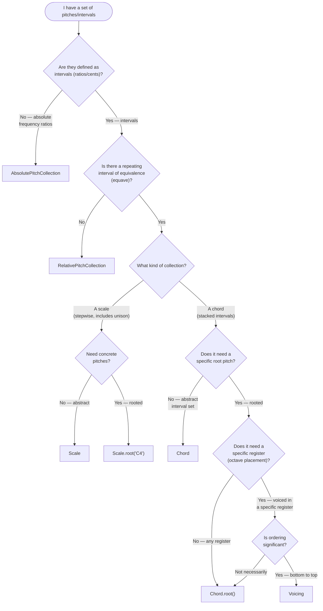
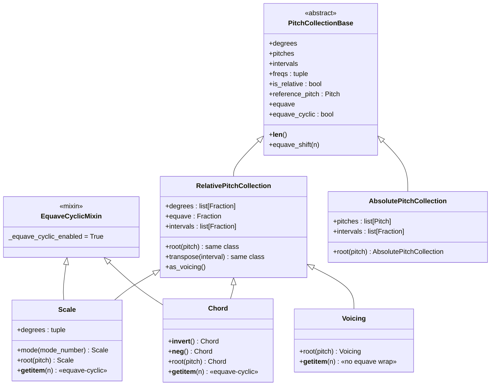
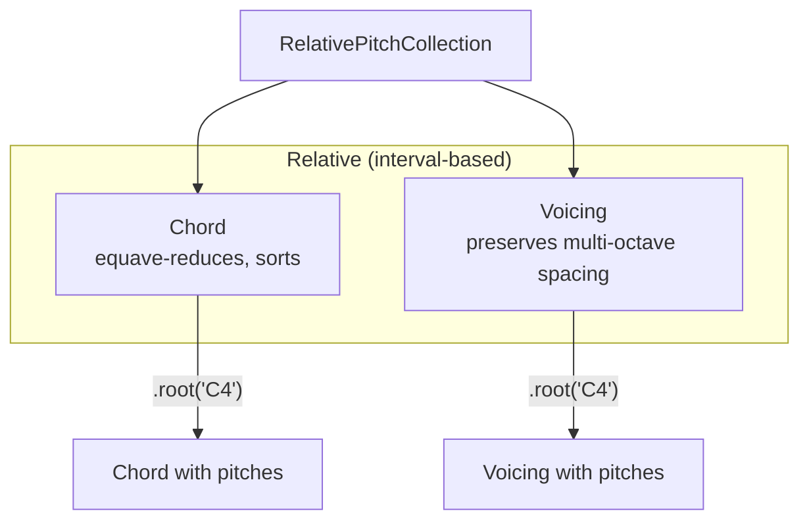
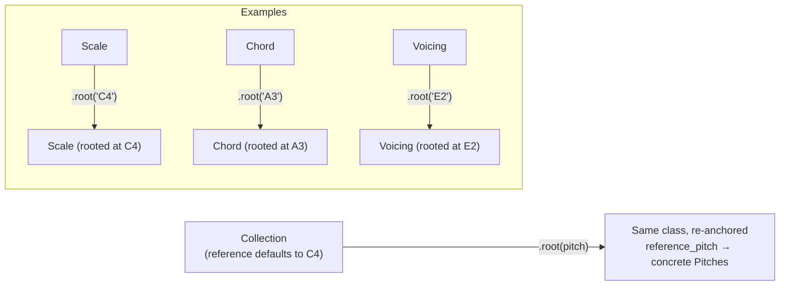
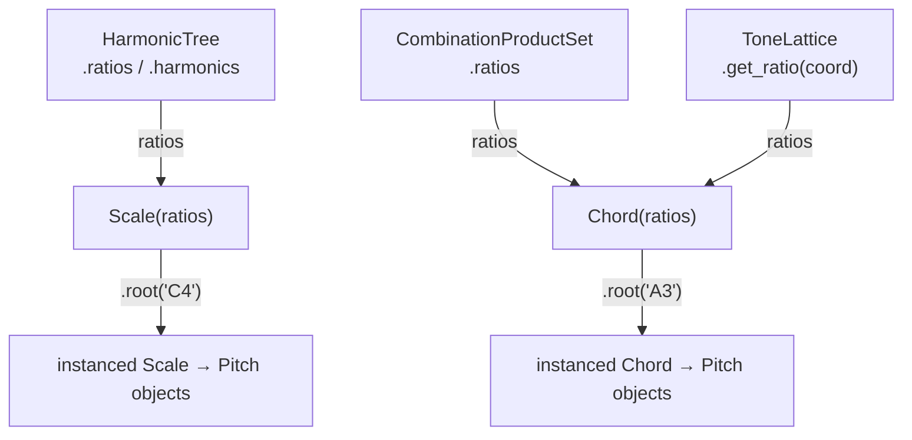

# Pitch Collections — Decision Guide

The `tonos.pitch` and `tonos.chords` / `tonos.scales` modules provide
a hierarchy of pitch-collection classes.  Choosing the right one
depends on three questions: *how is it defined?*, *does it have a
root?*, and *does it need to be placed in a register?*

This guide is a companion to [03_TONOS.md](03_TONOS.md), focused
on practical selection rather than internal architecture.

---

## 1. Decision Tree



---

## 2. Quick Reference Table

| Class | Defined by | Root | Has equave? | Register-placed? | Use case |
|---|---|---|---|---|---|
| `PitchCollectionBase` | *(abstract)* | — | — | — | Base interface |
| `RelativePitchCollection` | Interval ratios | Default C4; re-root via `.root()` | Optional | No | Abstract interval set |
| `AbsolutePitchCollection` | Concrete pitches | Default C4; re-root via `.root()` | Optional | Yes | Fixed pitches |
| `Scale` | Intervals | Default C4; re-root via `.root()` | Yes | No | Repeating scale pattern |
| `Chord` | Intervals | Default C4; re-root via `.root()` | Yes | No | Abstract chord quality |
| `Voicing` | Intervals + register | Default C4; re-root via `.root()` | Yes | Yes | Specific pitch placement |
| `ChordSequence` | List of chords | — | — | — | Progression container |
| `Contour` | Scale-degree indices | — | — | — | Pitch motion pattern |

---

## 3. The Inheritance Hierarchy



### Design Philosophy

`Scale`, `Chord`, and `Voicing` are **not** subclasses of each
other — they are all direct subclasses of `RelativePitchCollection`
that enforce different constraints on the same interval-based
foundation.  You can build the equivalent of a Scale or Chord "from
scratch" using a raw `RelativePitchCollection` — the named classes
exist as conveniences that enforce particular invariants
(unison enforcement, equave reduction, etc.).

---

## 4. Relative vs Absolute

### Relative (`RelativePitchCollection`, `Scale`, `Chord`, `Voicing`)

Defined by **intervals** (frequency ratios or cents), anchored to a
reference pitch that **defaults to C4** — concrete pitches are always
available; `.root(pitch)` re-anchors:

```python
scale = Scale(["1/1", "9/8", "5/4", "4/3", "3/2", "5/3", "15/8"])
scale.degrees          # [Fraction(1,1), Fraction(9,8), …]
scale.reference_pitch  # Pitch(C4, 261.63 Hz) — the default
scale.pitches          # [Pitch(C4), Pitch(D4+3.91¢), …]

a_scale = scale.root("A4")   # → Scale re-anchored at A4
a_scale.pitches              # [Pitch(A4, 440 Hz), …]
```

### Absolute (`AbsolutePitchCollection`)

Defined by **concrete pitches** (Pitch objects, MIDI numbers, or
frequencies) rather than intervals; `degrees` are the pitches
themselves.

---

## 5. Scale vs Chord

Both `Scale` and `Chord` extend `RelativePitchCollection` with
equave-cyclic indexing (`EquaveCyclicMixin`), but differ in semantics:

| Property | Scale | Chord |
|---|---|---|
| Unison required | Yes — `1/1` or `0¢` always present | No |
| Sorted | Yes (ascending) | Yes (ascending) |
| Deduplicated | Yes | Yes |
| Equave-reduced | Yes | Yes |
| Cyclic indexing | `scale[7]` wraps into next equave | `chord[3]` wraps into next equave |
| `.mode(n)` | Yes — rotates to *n*-th degree | No |
| Inversion | No | Yes — via `~chord` / `-chord` operators |

---

## 6. Chord vs Voicing

Both represent "simultaneous pitches" but come from the same branch of
the hierarchy (`RelativePitchCollection`) with different constraints:



| Class | Inherits from | What it models | Example |
|---|---|---|---|
| `Chord` | `RelativePitchCollection` | Interval set, equave-reduced | `Chord(["1/1", "5/4", "3/2"])` |
| `Voicing` | `RelativePitchCollection` | Multi-octave interval set, no equave reduction | `Voicing(["1/2", "1/1", "3/2", "5/2"])` |

**When to use each:**

- **`Chord`** — you're working with interval relationships within
  one equave and don't yet need concrete pitches.
- **`Voicing`** — you need intervals that span multiple octaves
  without equave folding.

---

## 7. The Rooting Pattern

`.root(pitch)` re-anchors a collection, returning a **new instance of
the same class** (`RelativePitchCollection` included) with its
`reference_pitch` set.  Collections can also be constructed with an
explicit root by passing `reference_pitch=` to the constructor; when
none is given, the reference resolves to **C4**.



> **Note:** the former `RootedPitchCollection` class and the
> `InstancedScale` / `InstancedChord` / `InstancedVoicing` aliases no
> longer exist — rooting never changes the class.

A rooted collection computes each pitch as
`root_freq × degree_ratio`, producing `Pitch` objects with
frequency, pitch class, octave, and cents-offset data.

---

## 8. Equave-Cyclic Indexing

Both `Scale` and `Chord` (and their subclasses) support cyclic
indexing that wraps through equaves:

```python
scale = Scale(["1/1", "9/8", "5/4", "4/3", "3/2", "5/3", "15/8"])
# 7 degrees (0–6); indexing yields Pitch objects at the reference (C4)

scale[0]   # Pitch(C4)             — unison
scale[6]   # Pitch(B4 −11.73¢)     — major seventh
scale[7]   # Pitch(C5)             — octave (wraps: 1/1 × 2/1)
scale[14]  # Pitch(C6)             — two octaves up
scale[-1]  # Pitch(B3 −11.73¢)     — major seventh below unison
```

This is controlled by `EquaveCyclicMixin`, which computes:
```
octave_shift = index // len(degrees)
degree = index % len(degrees)
result = degrees[degree] × equave^octave_shift
```

---

## 9. ChordSequence

A thin ordered container for chord progressions — it supports
`len()`, indexing, and iteration (there are no bulk-transform methods
like `transpose`; operate on the member chords):

```python
seq = ChordSequence([
    Chord(["1/1", "5/4", "3/2"]),
    Chord(["1/1", "6/5", "3/2"]),
    Chord(["1/1", "5/4", "3/2", "7/4"]),
])

seq[0]        # first Chord
len(seq)      # 3
```

Used by the playback system to generate arpeggiated or block-chord
events.

---

## 10. Contour

Not a pitch collection, but a pitch-*motion* descriptor: an immutable
sequence of **scale-degree indices** (`.values`) used to index into
pitch collections:

```python
contour = Contour([6, 2, 4, 0])       # degree indices, not up/down flags

scale = Scale(["1/1", "9/8", "5/4", "4/3", "3/2"]).root("C4")
melody = [scale[i] for i in contour.values]
```

Contours support element-wise arithmetic (`contour + 1`,
`contour * 2`, contour + contour), transformations (`invert`,
`retrograde`, `rotate`), `Contour.concat`, and `Contour.outer` —
the Cartesian sum ("chord multiplication" in the Boulez sense).

---

## 11. Relationship to Tonal Systems

Pitch collections and tonal systems (`HarmonicTree`, `ToneLattice`,
`CPS`) interact at the ratio level:



A typical workflow: generate ratios from a tonal system, wrap them
in a `Scale` or `Chord`, then instance with a root pitch for playback.
