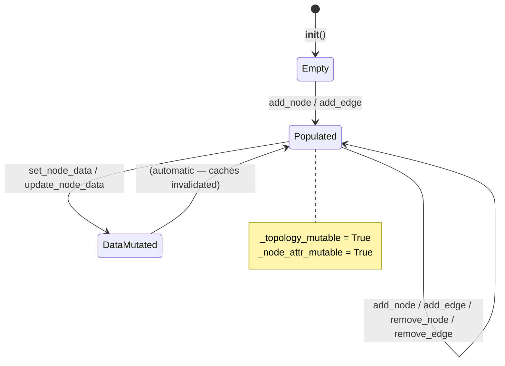
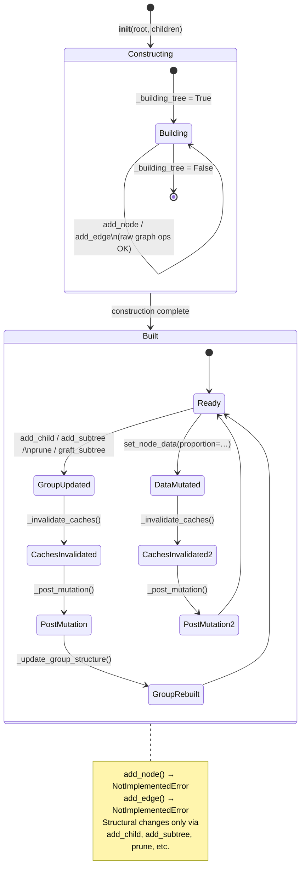
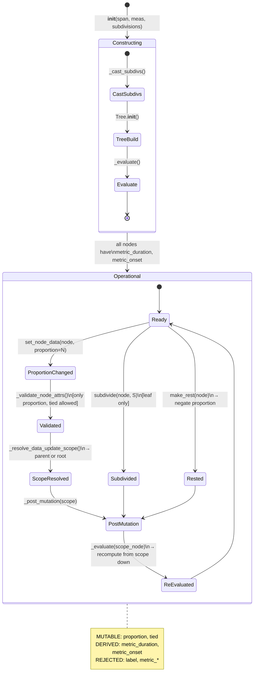
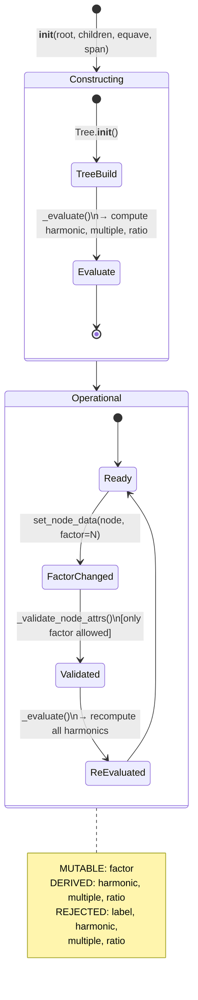
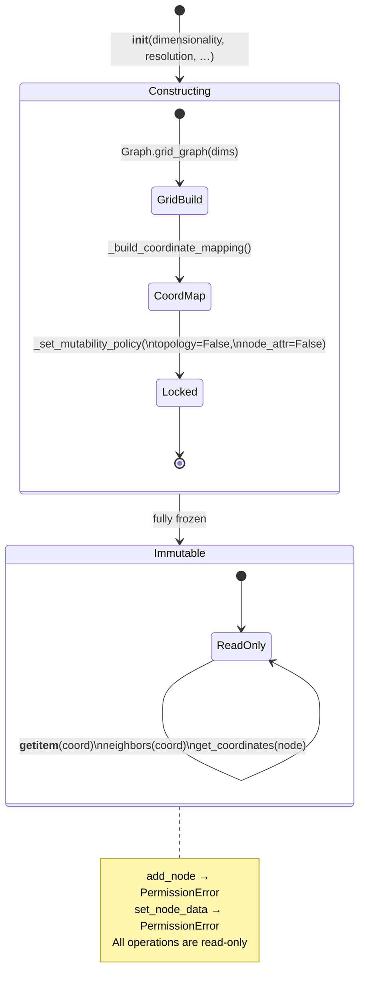
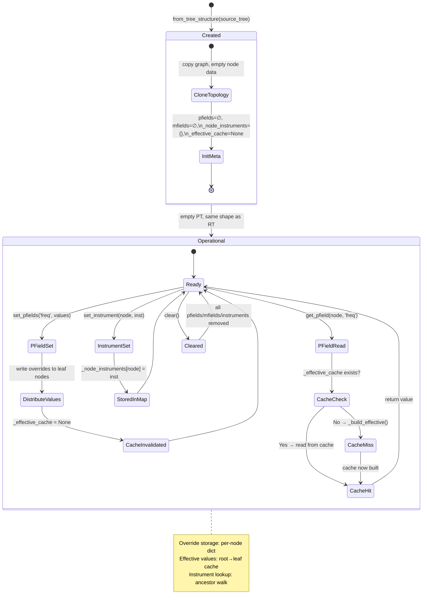
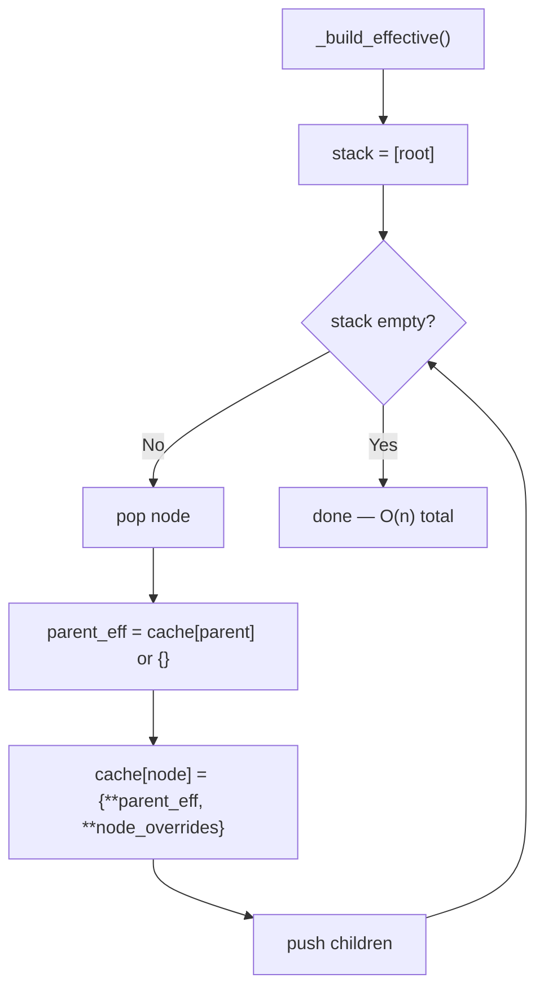
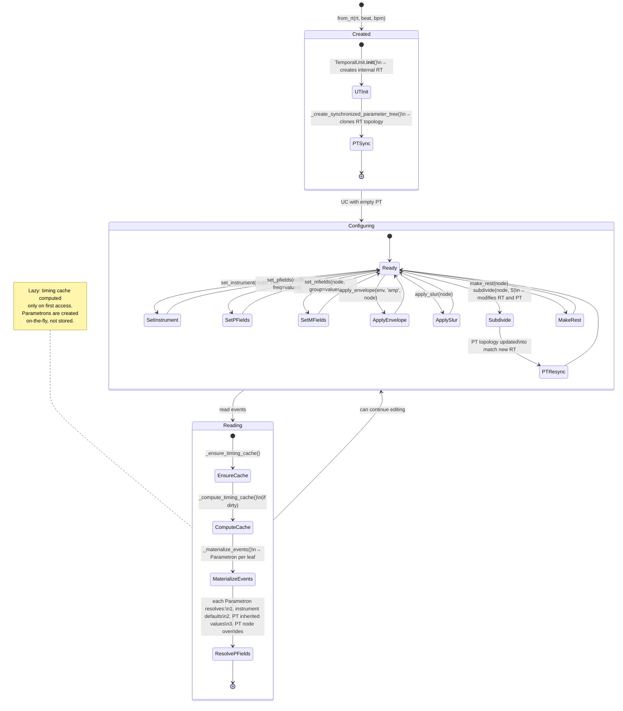
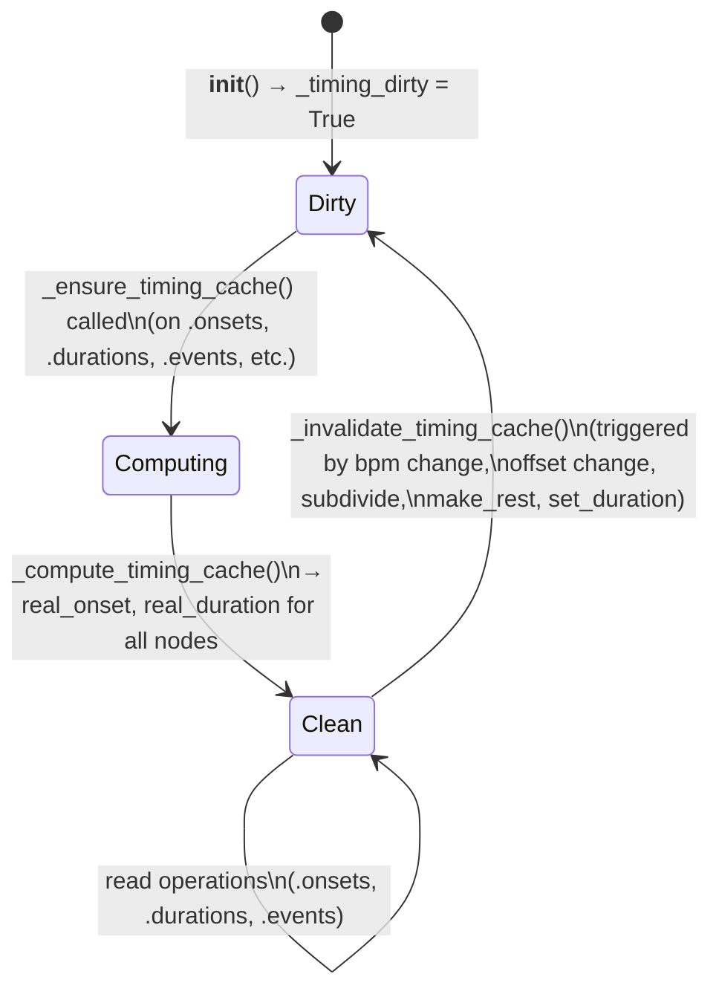
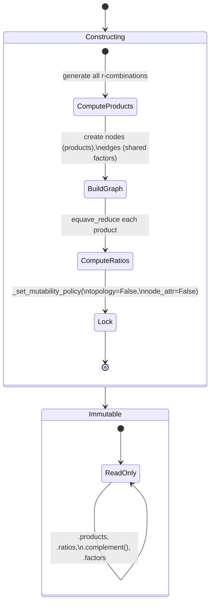

# Lifecycle and Mutation State Diagrams

This document describes the lifecycle states of the major Klotho
objects — when they are mutable, what triggers recomputation, and
what the valid operation sequences are.

---

## 1. Graph Lifecycle

`Graph` is the simplest lifecycle.  It starts mutable and stays
mutable unless a subclass explicitly locks it.



---

## 2. Tree Lifecycle

`Tree` has a two-phase lifecycle: **construction** (where the
underlying graph is built from tuple notation) and **operational**
(where only the structural API is allowed).



### Key Points

- During `_building_tree = True`, raw `add_node`/`add_edge` are
  allowed.
- After construction, raw graph mutation raises `NotImplementedError`.
- Every structural or data mutation triggers `_post_mutation()`, which
  calls `_update_group_structure()` and then `_after_post_mutation()`
  (the subclass hook).

---

## 3. RhythmTree Lifecycle

`RhythmTree` extends the `Tree` lifecycle with an `_evaluate()` step
that computes derived metric fields.



### Scoped Recomputation

When a single proportion changes, `_resolve_data_update_scope()`
returns the **parent** of the changed node (not the root).
`_evaluate(parent)` then only recomputes the subtree from that parent
down, avoiding a full-tree re-evaluation.

---

## 4. HarmonicTree Lifecycle

Structurally identical to `RhythmTree`, but with `factor` instead
of `proportion` and multiplicative evaluation instead of proportional.



---

## 5. Lattice / ToneLattice Lifecycle

Lattices are **immutable after construction** — both topology and
node data are locked.



### ToneLattice

Same as `Lattice` but with additional ratio computation at each
coordinate.  Also fully immutable.

### ParameterField

Extends `Lattice` but **relaxes node-attribute mutability**:
```python
_set_mutability_policy(topology_mutable=False, node_attr_mutable=True)
```
Topology is frozen, but field values at coordinates can be written.

---

## 6. ParameterTree Lifecycle

`ParameterTree` has the most complex lifecycle because it manages
both the tree structure and an effective-value cache with inheritance.



### Effective Cache Rebuild



---

## 7. CompositionalUnit Lifecycle

The central composition object, combining `TemporalUnit` (RT + tempo)
with `ParameterTree`.



### PT ↔ RT Synchronization

When `subdivide()` or structural mutations occur on the UC:

1. The RT is modified (new nodes added).
2. The PT is rebuilt via `_create_synchronized_parameter_tree()` or
   updated to match the new RT topology.
3. Previously set pfields/mfields on surviving nodes are preserved.

---

## 8. TemporalUnit Timing Cache Lifecycle

The timing cache within `TemporalUnit` (and `CompositionalUnit`) has
its own mini-lifecycle:



### What Triggers Invalidation

| Operation | Invalidates timing? |
|---|---|
| `set_duration(dur)` | Yes (changes bpm) |
| `make_rest(node)` | Yes |
| `subdivide(node, S)` | Yes |
| `offset = new_val` | Yes |
| `set_pfields(…)` | No |
| `set_instrument(…)` | No |
| `apply_envelope(…)` | No (reads timing, doesn't change it) |

---

## 9. CombinationProductSet / MasterSet Lifecycle

Like `Lattice`, CPS objects are fully immutable after construction:



---

## 10. Summary Table

| Object | Construction | Post-construction topology | Post-construction node data | Derived field recomputation |
|---|---|---|---|---|
| `Graph` | `__init__` or factory | Mutable | Mutable | Manual |
| `Tree` | Tuple notation | Via structural API only | Mutable (`_node_value_attr`) | `_post_mutation` → `_after_post_mutation` |
| `RhythmTree` | span + meas + subdivs | Via structural API only | `proportion`, `tied` only | `_evaluate(scope_node)` |
| `HarmonicTree` | root + children + equave | Via structural API only | `factor` only | `_evaluate()` |
| `ParameterTree` | `from_tree_structure` | Via structural API only | Any pfield/mfield | `_build_effective()` (lazy) |
| `Lattice` | dims + resolution | **Frozen** | **Frozen** | N/A |
| `ToneLattice` | generators + resolution | **Frozen** | **Frozen** | N/A |
| `ParameterField` | lattice + function | **Frozen** | Mutable (field values) | On write |
| `CPS` / `MasterSet` | factors + r | **Frozen** | **Frozen** | N/A |
| `TemporalUnit` | tempus + prolatio + bpm | Delegates to RT | Delegates to RT | `_compute_timing_cache()` (lazy) |
| `CompositionalUnit` | from_rt / from_ut | Delegates to RT + PT | via set_pfields, set_instrument | Timing: lazy cache; Params: effective cache |
