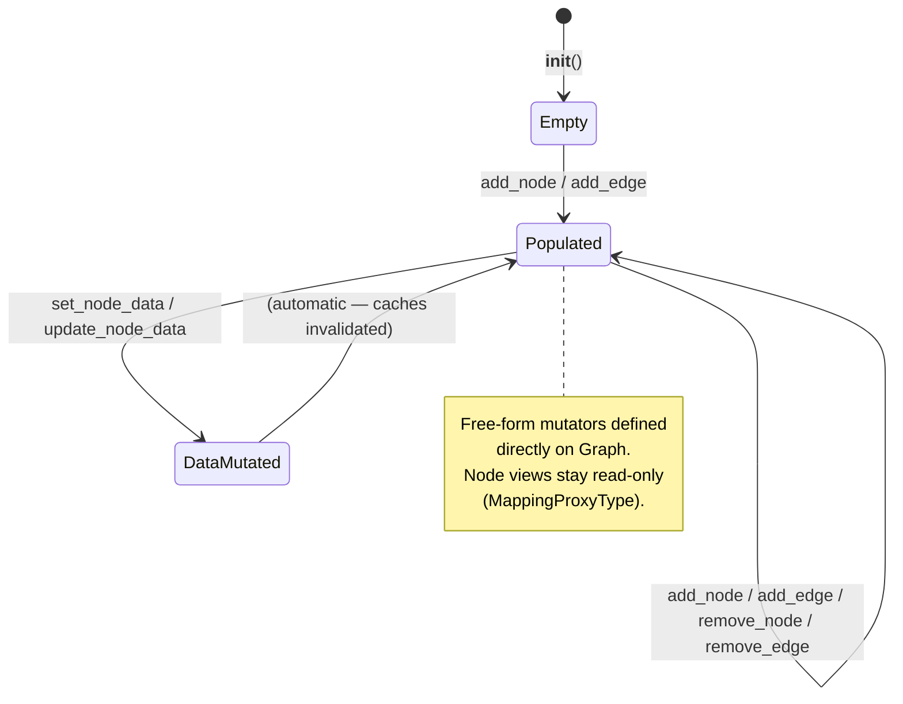
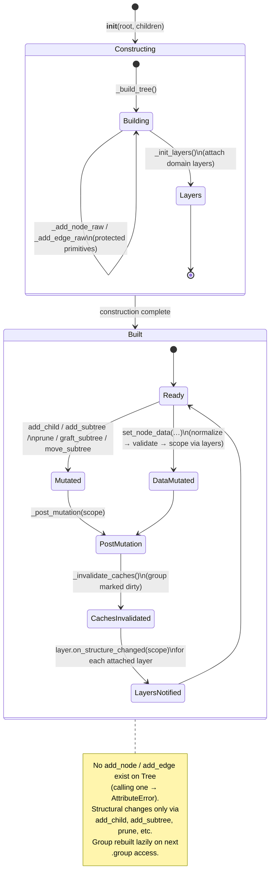
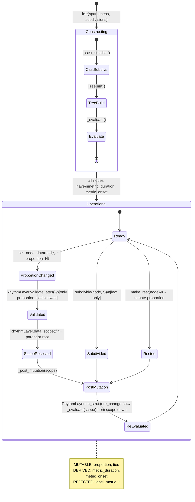
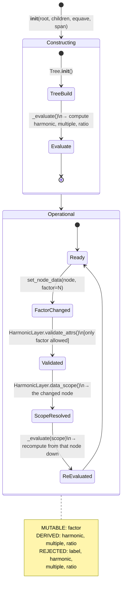
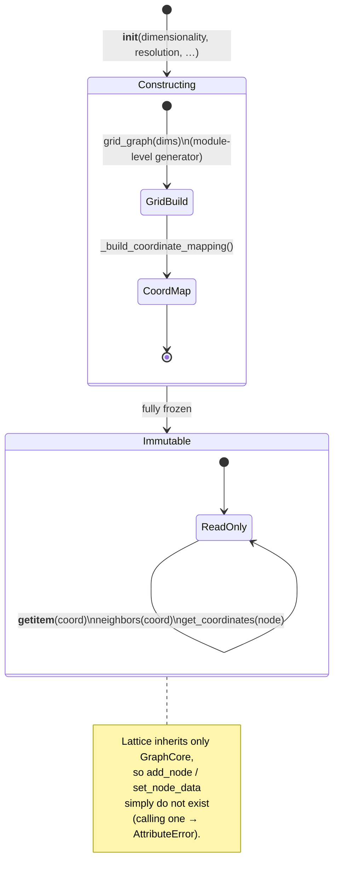
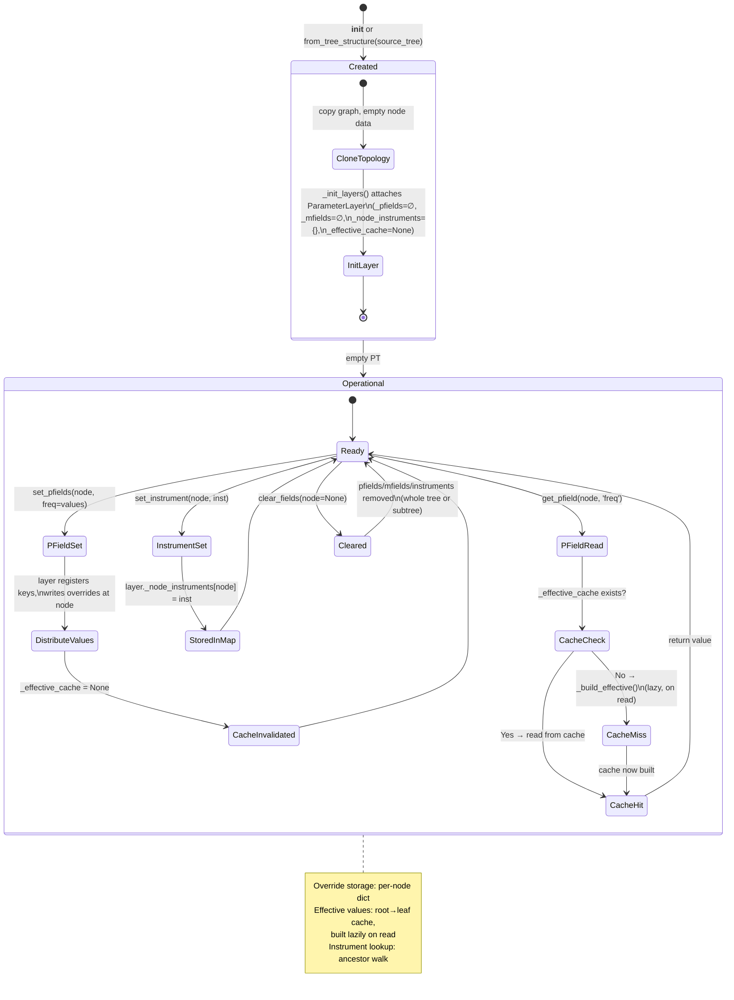
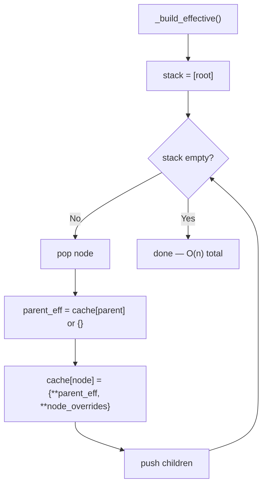
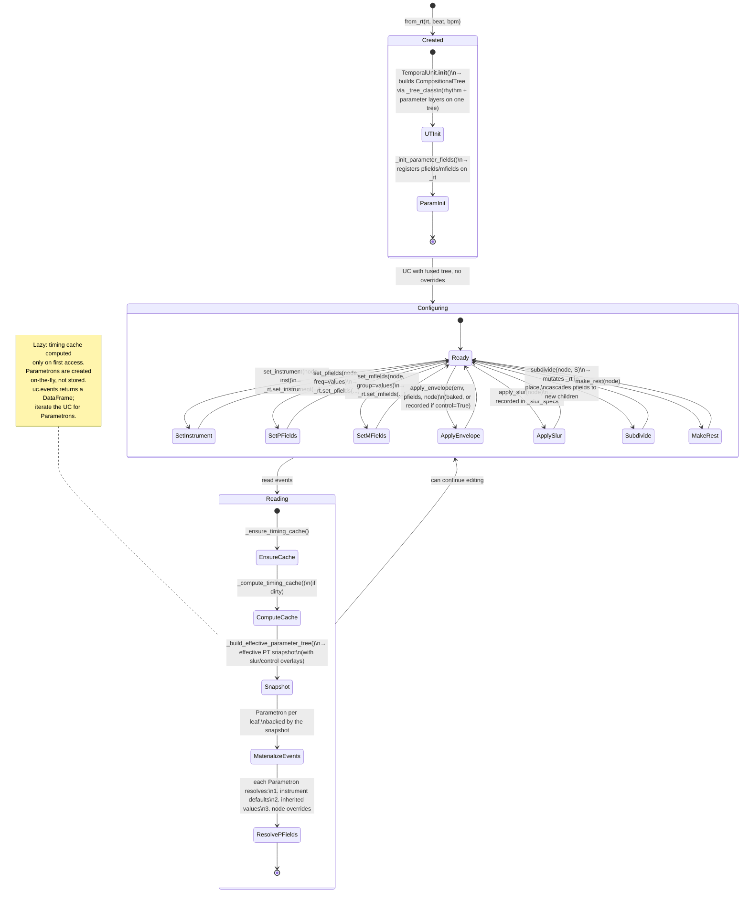
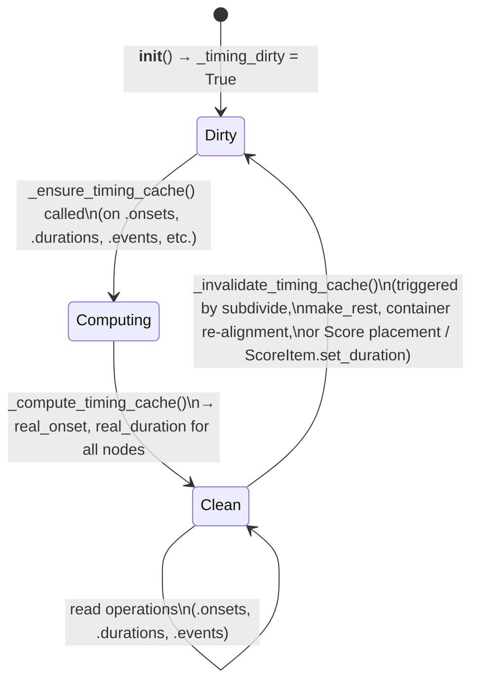
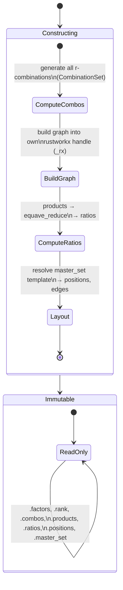

# Lifecycle and Mutation State Diagrams

This document describes the lifecycle states of the major Klotho
objects — when they are mutable, what triggers recomputation, and
what the valid operation sequences are.

---

## 1. Graph Lifecycle

`Graph` is the simplest lifecycle.  It starts mutable and stays
mutable — mutability is a property of the class, not a runtime flag.
(The read-only base `GraphCore` never enters the mutable states at
all: classes that inherit only `GraphCore` are frozen by construction
because they expose no mutators.)

---

## 2. Tree Lifecycle

`Tree` has a two-phase lifecycle: **construction** (where the
underlying graph is built from tuple notation) and **operational**
(where only the structural API is allowed).

### Key Points

- Construction writes through the protected `GraphCore` primitives
  (`_add_node_raw` / `_add_edge_raw`); there is never a public
  `add_node`/`add_edge` on `Tree`.
- Domain layers are attached at the end of construction via the
  `_init_layers` hook.
- Every structural or data mutation ends in `_post_mutation(scope)`,
  which invalidates caches (marking the `Group` representation dirty
  for lazy rebuild) and notifies every attached layer via
  `on_structure_changed`.

---

## 3. RhythmTree Lifecycle

`RhythmTree` extends the `Tree` lifecycle with an `_evaluate()` step
that computes derived metric fields.

### Scoped Recomputation

When a single proportion changes, `RhythmLayer.data_scope()` returns
the **parent** of the changed node (not the root).  The layer's
`on_structure_changed` then re-runs `_evaluate(parent)`, recomputing
only the subtree from that parent down and avoiding a full-tree
re-evaluation.

---

## 4. HarmonicTree Lifecycle

Structurally identical to `RhythmTree`, but with `factor` instead
of `proportion` and multiplicative evaluation instead of proportional.

---

## 5. Lattice / ToneLattice Lifecycle

Lattices are **immutable after construction** — both topology and
node data are locked.

There is no "lock" step — immutability is structural.  `Lattice`
inherits only the read-only `GraphCore`, so once construction finishes
(via the protected raw primitives) there is no public API left that
could change it.

### ToneLattice

Same as `Lattice` but with additional ratio computation at each
coordinate.  Also fully immutable.

### ParameterField

Extends `Lattice` and adds its **own sanctioned writer** for field
values (`set_field_value` at coordinates).  Topology remains frozen —
`ParameterField` defines no structural mutators — but field data at
coordinates can be written through that method.

---

## 6. ParameterTree Lifecycle

`ParameterTree` has the most complex lifecycle because it manages
both the tree structure and an effective-value cache with inheritance.
All parameter state (registered pfield/mfield key sets, per-node
instrument bindings, effective-value cache) lives on the attached
`ParameterLayer`; the public API is provided by `ParameterApiMixin`.

### Effective Cache Rebuild

---

## 7. CompositionalUnit Lifecycle

The central composition object.  `CompositionalUnit` sets
`_tree_class = CompositionalTree`, so the single tree built by
`TemporalUnit.__init__` (`uc._rt`) carries **both** a rhythm layer and
a parameter layer on one topology.  There is no mirrored
`ParameterTree` — `uc.pt` is a derived snapshot.

### The Fused Tree (no PT ↔ RT sync)

There is nothing to synchronize: rhythm and parameters live on the
same `CompositionalTree` (`uc._rt`).

- `uc.rt` returns a **copy** of the rhythm view; `uc.pt` returns an
  effective `ParameterTree` **snapshot** (node ids preserved, built by
  `_extract_parameter_tree` / `_build_effective_parameter_tree`).
- `subdivide(node, S)` mutates `_rt` in place; the parent's pfields
  cascade to the new children automatically.
- UC-level overlays (`_slur_specs`, control envelopes) are stored on
  the unit and folded into the effective snapshot at read time.
- `clear_parameters(node=None)` clears overrides, instruments, slurs,
  and envelopes for the whole unit or a subtree.

---

## 8. TemporalUnit Timing Cache Lifecycle

The timing cache within `TemporalUnit` (and `CompositionalUnit`) has
its own mini-lifecycle:

### What Triggers Invalidation

| Operation | Invalidates timing? |
|---|---|
| `ScoreItem.set_duration(dur)` | Yes (scales owned unit's bpm) |
| `ScoreItem.stretch(factor)` | Yes (scales owned unit's bpm) |
| `make_rest(node)` | Yes |
| `subdivide(node, S)` | Yes |
| Score placement (``add(at=)`` / ``after=`` / ``before=``) | Yes |
| Container re-alignment (``_set_offsets``, ``_align_rows``) | Yes |
| `set_pfields(…)` | No |
| `set_instrument(…)` | No |
| `apply_envelope(…)` | No (reads timing, doesn't change it) |

Outside a :class:`~klotho.thetos.composition.score.Score`, a temporal
unit's time is immutable: there is no public offset setter and no
``set_duration`` method.  All time mutation is mediated by
:class:`~klotho.thetos.composition.score.ScoreItem`.

---

## 9. CombinationProductSet / MasterSet Lifecycle

Like `Lattice`, CPS objects are fully immutable after construction.
`CombinationProductSet` extends `CombinationSet(GraphCore)` — the
object **is** the graph, and immutability comes from exposing no
mutators (`MasterSet` is a separate layout template, not a graph
class).

---

## 10. Summary Table

| Object | Construction | Post-construction topology | Post-construction node data | Derived field recomputation |
|---|---|---|---|---|
| `Graph` | `__init__` or factory | Mutable | Mutable | Manual |
| `Tree` | Tuple notation | Via structural API only | Via layer-validated setters | `_post_mutation` → layer `on_structure_changed` |
| `RhythmTree` | span + meas + subdivs | Via structural API only | `proportion`, `tied` only | `RhythmLayer` → `_evaluate(scope)` |
| `HarmonicTree` | root + children + equave | Via structural API only | `factor` only | `HarmonicLayer` → `_evaluate(scope)` |
| `ParameterTree` | `__init__` / `from_tree_structure` | Via structural API only | Any pfield/mfield | `ParameterLayer._build_effective()` (lazy) |
| `Lattice` | dims + resolution | **Frozen** | **Frozen** | N/A |
| `ToneLattice` | generators + resolution | **Frozen** | **Frozen** | N/A |
| `ParameterField` | lattice + function | **Frozen** | Mutable (field values) | On write |
| `CombinationSet` / `CPS` | factors + r | **Frozen** | **Frozen** | N/A |
| `TemporalUnit` | tempus + prolatio + bpm | Delegates to RT | Delegates to RT | `_compute_timing_cache()` (lazy) |
| `CompositionalUnit` | from_rt / from_ut | Delegates to fused `CompositionalTree` (`_rt`) | via set_pfields, set_instrument | Timing: lazy cache; Params: effective snapshot |
