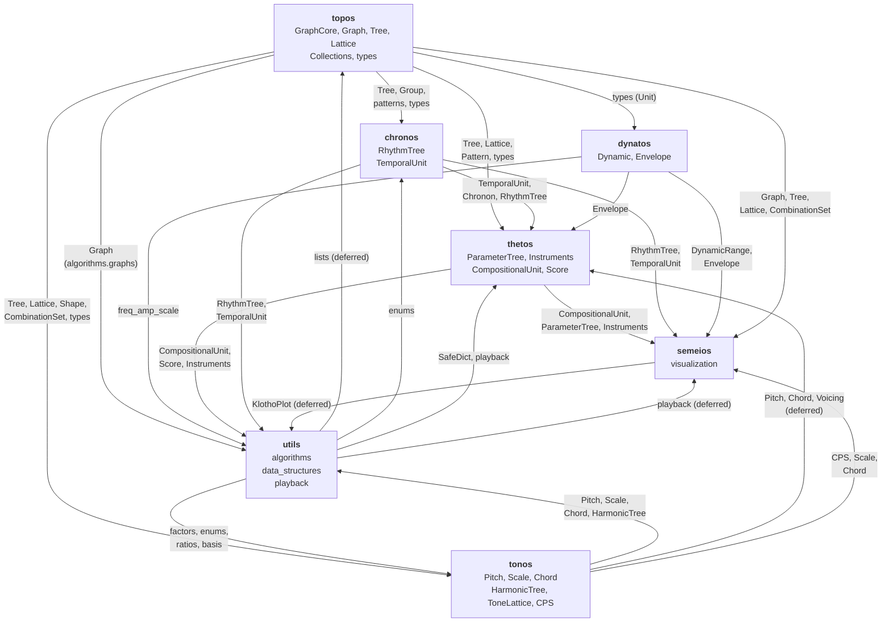
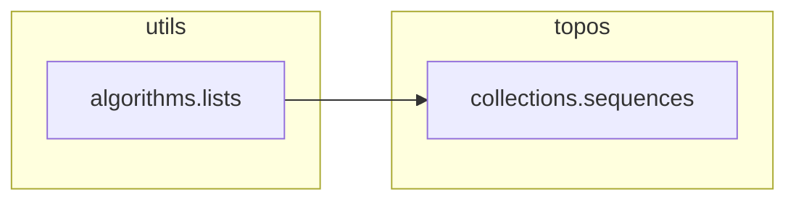
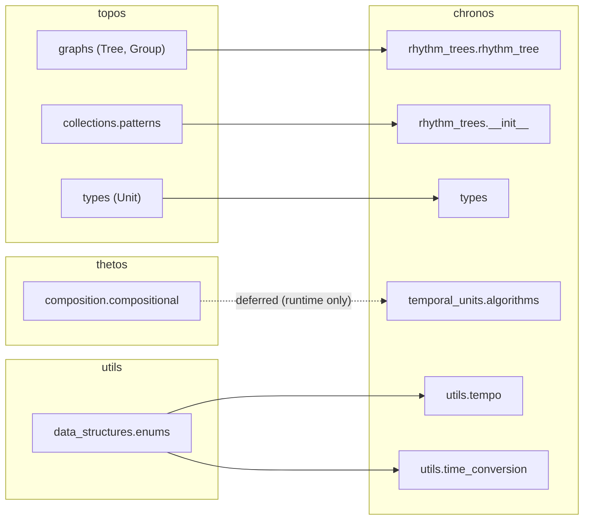
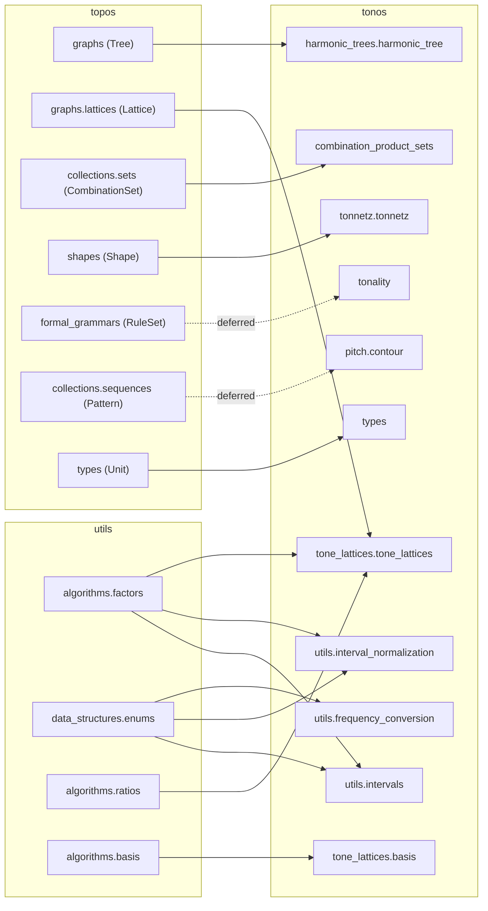
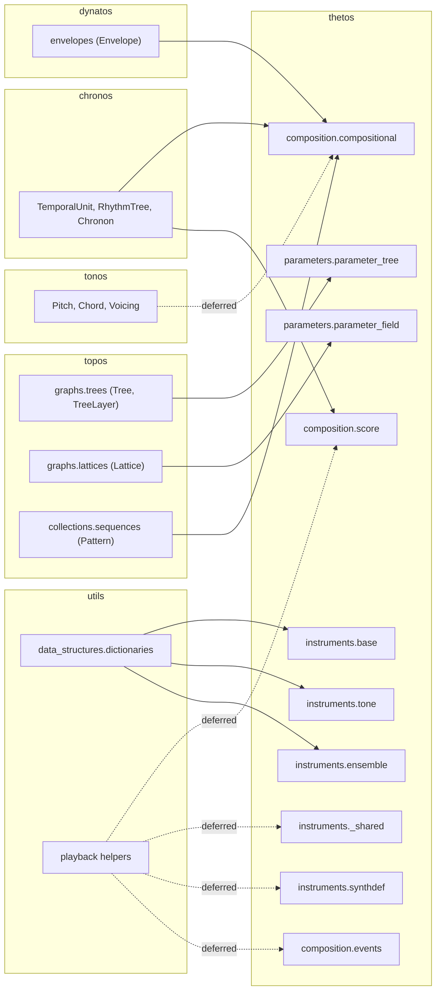
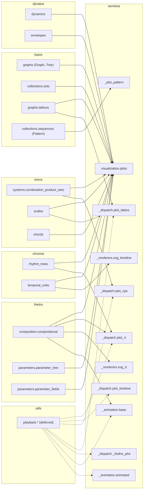
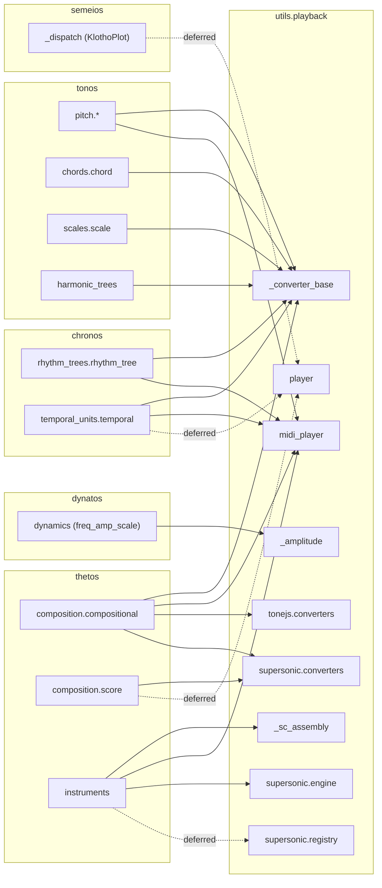

# Import Dependency Graph

This document maps the actual `import` and `from … import`
relationships between Klotho's subpackages and modules.  It is based
on an AST scan of all cross-subpackage imports in the codebase at
version 10.11.0 (intra-subpackage imports are omitted for clarity;
deferred function-body imports are counted and marked).

---

## 1. Subpackage-Level Overview



### Reading the Arrows

An arrow **A → B** means "B imports from A."  For example,
`TOPOS → CHRONOS` means chronos imports from topos.

---

## 2. Dependency Counts

How many files in each subpackage import from each other (AST scan at
10.11.0; cells count importer files, includes deferred function-body
imports):

| Imported by ↓ / Imports from → | topos | chronos | tonos | dynatos | thetos | semeios | utils |
|---|---|---|---|---|---|---|---|
| **topos** | — | | | | | | 1² |
| **chronos** | 3 | — | | | 1¹ | | 2 |
| **tonos** | 7 | | — | | | | 5 |
| **dynatos** | 1³ | | | — | | | |
| **thetos** | 5 | 2 | 1¹ | 1 | — | | 7 |
| **semeios** | 3 | 3 | 3 | 1 | 4 | — | 8² |
| **utils** | 1 | 5 | 4 | 1 | 8 | 1¹ | — |

¹ Deferred (function-body) imports that break would-be cycles — see §6.  
² Mostly deferred imports of playback helpers from inside plot/animation functions.  
³ `dynatos/types.py` imports the `Unit` base from `topos.types`.

Growth since the 10.1.1 scan: tonos←topos 4→7 (`contour.py`,
`tonality.py`, `tonnetz.py`), thetos←utils 4→7 (`events.py`,
`ensemble.py`, `synthdef.py`), thetos←tonos 0→1 (deferred, in
`compositional.py`), semeios←chronos 2→3 (`svg_timeline.py`),
utils←chronos 4→5 (`player.py`).

---

## 3. Leaf Dependencies (Imported by Many, Import Few)

These modules are foundational — they are imported by many others
but have few or no cross-subpackage imports themselves:

| Module | Imported by | Imports from |
|---|---|---|
| `topos.graphs.core` (GraphCore) | everything graph-shaped, via `topos.graphs` | *(none cross-pkg)* |
| `topos.graphs.graphs` (Graph) | `semeios.visualization.plots`, `utils.algorithms.graphs` (direct); most consumers use subclasses instead | *(none cross-pkg)* |
| `topos.graphs.trees` (Tree, layers) | chronos, tonos, thetos | topos.graphs only |
| `topos.graphs.lattices` (Lattice) | tonos, thetos, semeios | topos.graphs only |
| `topos.graphs.generators` | topos (Lattice, CombinationSet build via `grid_graph`/`complete_graph`) | topos.graphs only |
| `topos.types` (Unit) | chronos, tonos, dynatos, thetos (their `types.py` modules) | *(none cross-pkg)* |
| `utils.data_structures.enums` | chronos, tonos | *(none cross-pkg)* |
| `utils.data_structures.dictionaries` (SafeDict) | thetos | *(none cross-pkg)* |
| `utils.algorithms.factors` / `basis` / `ratios` | tonos | *(none cross-pkg)* |
| `dynatos.dynamics.dynamics` | thetos, semeios, utils | *(none cross-pkg)* |
| `dynatos.envelopes.envelopes` | thetos, semeios | *(none cross-pkg)* |

**dynatos is almost entirely leaf** — its only cross-package import is
the `Unit` base class from `topos.types` (in `dynatos/types.py`).

---

## 4. Hub Modules (High Fan-In + Fan-Out)

These modules have the most cross-subpackage connections:

### `semeios/visualization/plots.py`

**Fan-in:** 0 (entry point)  
**Fan-out:** ~17 cross-package imports across 5 subpackages

Imports from: `topos.graphs` (Graph, Tree), `topos.collections.sets`
(CombinationSet, PartitionSet), `topos.collections.sequences`
(Pattern), `topos.graphs.lattices`,
`thetos.parameters.parameter_fields`,
`thetos.parameters.parameter_tree`, `thetos.composition.compositional`,
`chronos.rhythm_trees`, `chronos.temporal_units`,
`tonos.systems.combination_product_sets` (CPS, MasterSet),
`tonos.scales`, `tonos.chords`, `dynatos.dynamics`,
`dynatos.envelopes`

This is expected — the plot dispatcher must know about every
plottable type.

### `utils/playback/_converter_base.py`

**Fan-out:** 9 cross-package imports

Imports from: `tonos` (Pitch), `tonos.pitch.pitch_collections`,
`tonos.chords.chord`, `tonos.scales.scale`,
`tonos.systems.harmonic_trees` (Spectrum, HarmonicTree),
`chronos.rhythm_trees.rhythm_tree`,
`chronos.temporal_units.temporal`,
`thetos.composition.compositional`

Also expected — the converter must handle every playable type.

### `thetos/composition/compositional.py`

**Fan-out:** 5 cross-package targets  
**Fan-in:** ~9 external files — the most-imported module

Imports from: `chronos` (TemporalUnit, RhythmTree, Chronon, selector
types), `dynatos.envelopes` (Envelope), `topos.collections.sequences`
(Pattern), `tonos` (Pitch/Chord/Voicing, deferred), plus intra-thetos
`parameters` and `instruments`

Imported by: semeios (`plots.py`, `plot_rt.py`, `svg_rt.py`,
`_animation/base.py`), utils playback (`_converter_base.py`,
`midi_player.py`, `tonejs/converters.py`, `supersonic/converters.py`),
and chronos (`temporal_units/algorithms.py`, deferred)

### `thetos/composition/score.py`

A newer cross-package hub: imports chronos temporal types plus
`compositional`, and (deferred) utils playback helpers.  Consumed by
`utils/playback/player.py` for score-aware SuperSonic playback.

---

## 5. Module-Level Detail

### `topos` imports



topos is nearly self-contained — only one file (`sequences.py`)
imports from utils.

### `chronos` imports



### `tonos` imports



(`CombinationProductSet` no longer imports `Graph` — it builds on
`CombinationSet(GraphCore)`.)

### `thetos` imports



(`thetos/types.py` is intentionally empty — typed units live in the
domain packages and are aggregated by the top-level `klotho.types`.)

### `semeios` imports



(The former `notelists/` subtree is gone — SuperCollider output now
lives entirely in `utils.playback`.)

### `utils.playback` imports



---

## 6. Circular / Near-Circular Dependencies

There is one quasi-circular import:

```
chronos.temporal_units.algorithms → thetos.composition.compositional
thetos.composition.compositional → chronos (TemporalUnit, RhythmTree, Chronon)
```

This is **not** a Python import cycle at the module level — it works
because:

1. `thetos.composition.compositional` imports from `chronos` at
   module load time (top-level import).
2. `chronos.temporal_units.algorithms` imports `CompositionalUnit`
   inside a function body (deferred/runtime import), not at module
   load time.

There is also a structural cycle between `utils.playback.player`
and `semeios.visualization._dispatch` (KlothoPlot), resolved the
same way — the import in `player.py` is inside the function body.
The same deferred-import pattern appears throughout: semeios dispatch
and animation modules defer their playback imports; `score.py`,
`events.py`, `instruments/_shared.py`, and `instruments/synthdef.py`
defer their utils imports; `supersonic/registry.py` defers its thetos
import; and `compositional.py` defers its tonos imports.

---

## 7. Architectural Observations

1. **topos and dynatos are (near-)leaves** — topos's single outgoing
   import is a deferred `utils.algorithms.lists` helper, and dynatos
   only pulls the `Unit` base from `topos.types`.  Both are safe
   foundations.

2. **semeios and utils.playback are the heaviest consumers** — they
   need to know about every domain type for dispatch, which is
   inherent to their role.

3. **thetos.composition.compositional is the most-imported module** —
   it is referenced by semeios (3 files), utils.playback (4 files),
   and chronos (1 file, deferred).  `score.py` is emerging as a
   second hub alongside it.  This reflects thetos's central role as
   the composition bridge.

4. **utils is split-brained** — `utils.algorithms` and
   `utils.data_structures` are low-level leaf dependencies (imported
   by topos, chronos, tonos, thetos), while `utils.playback` is a
   high-level consumer (imports from chronos, tonos, thetos, dynatos,
   semeios).  These two halves of utils have very different dependency
   profiles.

5. **No subpackage is an island** — every subpackage has at least one
   outgoing cross-package import, reflecting the integrated design of
   the toolkit.
