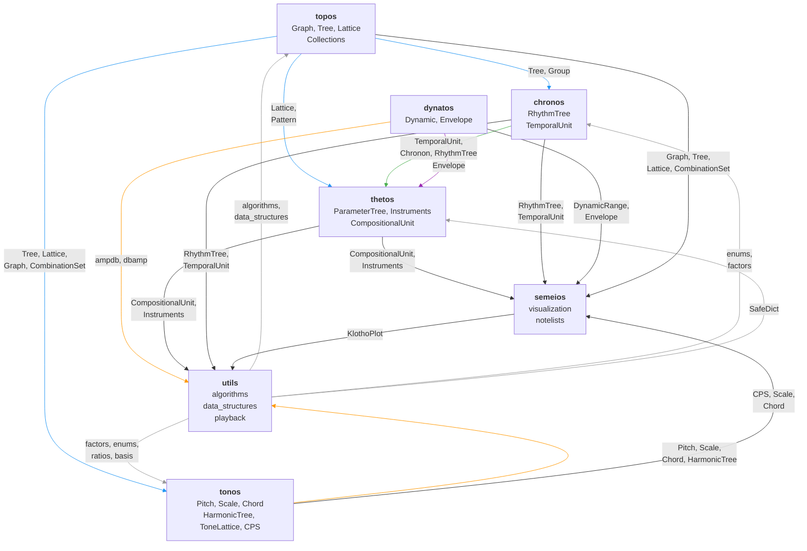
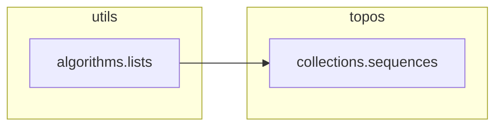
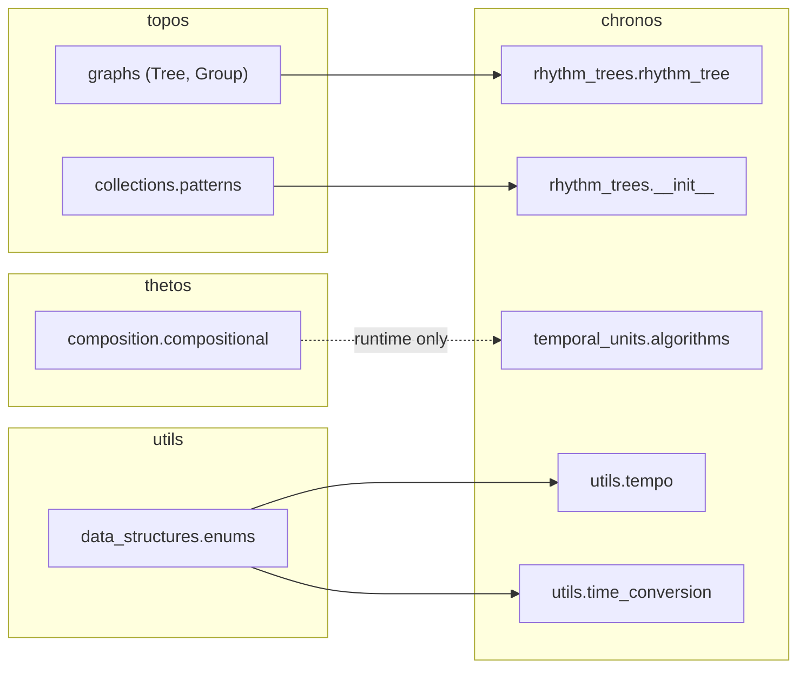
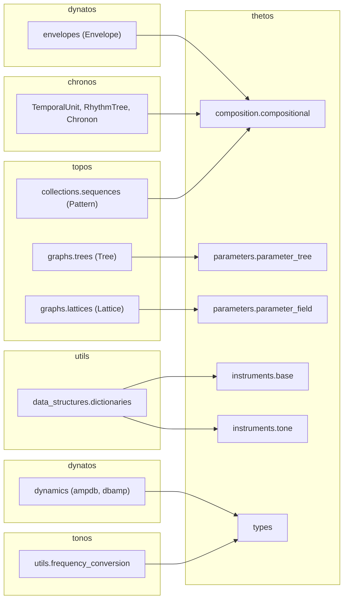
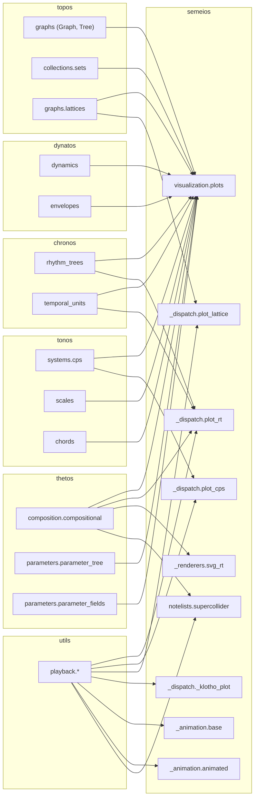
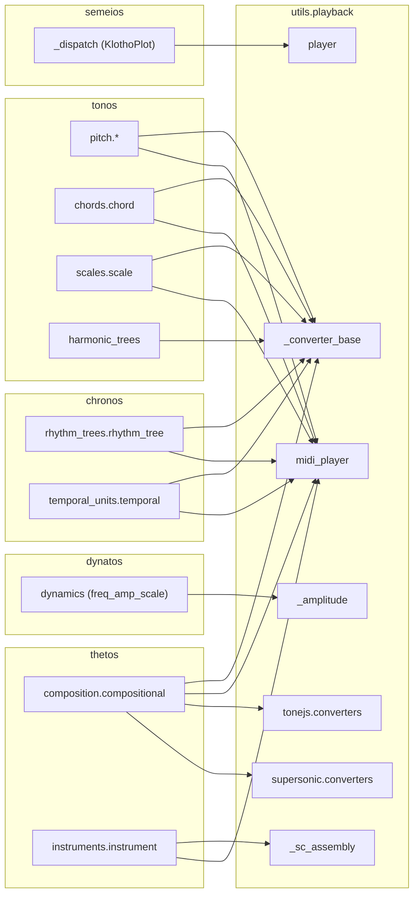

# Import Dependency Graph

This document maps the actual `import` and `from … import`
relationships between Klotho's subpackages and modules.  It is based
on a scan of all cross-subpackage imports in the codebase (intra-
subpackage imports are omitted for clarity).

---

## 1. Subpackage-Level Overview



### Reading the Arrows

An arrow **A → B** means "B imports from A."  For example,
`TOPOS → CHRONOS` means chronos imports from topos.

---

## 2. Dependency Counts

How many files in each subpackage import from each other:

| Imported by ↓ / Imports from → | topos | chronos | tonos | dynatos | thetos | semeios | utils |
|---|---|---|---|---|---|---|---|
| **topos** | — | | | | | | 1 |
| **chronos** | 2 | — | | | 1¹ | | 2 |
| **tonos** | 3 | | — | | | | 6 |
| **dynatos** | | | | — | | | |
| **thetos** | 1 | 1 | | 1 | — | | 2 |
| **semeios** | 4 | 3 | 2 | 1 | 4 | — | 5 |
| **utils** | | 4 | 5 | 1 | 4 | 1 | — |

¹ Circular: `chronos.temporal_units.algorithms` imports
`CompositionalUnit` from thetos. This is a runtime import for
type checking, not a structural dependency.

---

## 3. Leaf Dependencies (Imported by Many, Import Few)

These modules are foundational — they are imported by many others
but have few or no cross-subpackage imports themselves:

| Module | Imported by | Imports from |
|---|---|---|
| `topos.graphs.graphs` (Graph) | chronos, tonos, thetos, semeios | *(none cross-pkg)* |
| `topos.graphs.trees.trees` (Tree) | chronos, tonos, thetos | topos.graphs only |
| `topos.graphs.lattices.lattices` (Lattice) | tonos, thetos, semeios | topos.graphs only |
| `utils.data_structures.enums` | chronos, tonos | *(none cross-pkg)* |
| `utils.data_structures.dictionaries` (SafeDict) | thetos | *(none cross-pkg)* |
| `utils.algorithms.factors` | tonos (3 files) | *(none cross-pkg)* |
| `dynatos.dynamics.dynamics` | thetos, semeios, utils | *(none cross-pkg)* |
| `dynatos.envelopes.envelopes` | thetos, semeios | *(none cross-pkg)* |

**dynatos is entirely leaf** — it imports nothing from other Klotho
subpackages.

---

## 4. Hub Modules (High Fan-In + Fan-Out)

These modules have the most cross-subpackage connections:

### `semeios/visualization/plots.py`

**Fan-in:** 0 (entry point)  
**Fan-out:** 12 cross-package imports

Imports from: `topos.graphs`, `topos.collections.sets`,
`topos.graphs.lattices`, `thetos.parameters.parameter_fields`,
`thetos.parameters.parameter_tree`, `thetos.composition.compositional`,
`chronos.rhythm_trees`, `chronos.temporal_units`,
`tonos.systems.combination_product_sets`, `tonos.scales`,
`tonos.chords`, `dynatos.dynamics`, `dynatos.envelopes`

This is expected — the plot dispatcher must know about every
plottable type.

### `utils/playback/_converter_base.py`

**Fan-out:** 8 cross-package imports

Imports from: `tonos.pitch.pitch_collections`, `tonos.chords.chord`,
`tonos.scales.scale`, `tonos.systems.harmonic_trees`,
`chronos.rhythm_trees.rhythm_tree`,
`chronos.temporal_units.temporal`,
`thetos.composition.compositional`

Also expected — the converter must handle every playable type.

### `thetos/composition/compositional.py`

**Fan-out:** 4 cross-package imports  
**Fan-in:** 6 (semeios: 4, utils: 4, chronos: 1 — most imported
module)

Imports from: `chronos` (TemporalUnit, RhythmTree, Chronon),
`dynatos.envelopes` (Envelope), `topos.collections.sequences`
(Pattern), `thetos.parameters` (ParameterTree),
`thetos.instruments` (Instrument)

Imported by: semeios (plots, renderers, notelists), utils (all
playback converters, SC assembly, MIDI player)

---

## 5. Module-Level Detail

### `topos` imports



topos is nearly self-contained — only one file (`sequences.py`)
imports from utils.

### `chronos` imports



### `tonos` imports

```mermaid
flowchart LR
    subgraph tonos
        ht["harmonic_trees.harmonic_tree"]
        tl["tone_lattices.tone_lattices"]
        cps["combination_product_sets.cps"]
        t_freq["utils.frequency_conversion"]
        t_norm["utils.interval_normalization"]
        t_intv["utils.intervals"]
    end

    subgraph topos
        tree["graphs (Tree)"]
        lattice["graphs.lattices (Lattice)"]
        combset["collections (CombinationSet)"]
        graph["graphs (Graph)"]
    end

    subgraph utils
        factors["algorithms.factors"]
        enums["data_structures.enums"]
        ratios["algorithms.ratios"]
        basis["algorithms.basis"]
    end

    tree --> ht
    lattice --> tl
    combset --> cps
    graph --> cps
    factors --> tl
    factors --> t_norm
    factors --> t_intv
    enums --> t_freq
    enums --> t_norm
    enums --> t_intv
    ratios --> tl
    basis --> tl
```

### `thetos` imports



### `semeios` imports



### `utils.playback` imports



---

## 6. Circular / Near-Circular Dependencies

There is one quasi-circular import:

```
chronos.temporal_units.algorithms → thetos.composition.compositional
thetos.composition.compositional → chronos (TemporalUnit, RhythmTree, Chronon)
```

This is **not** a Python import cycle at the module level — it works
because:

1. `thetos.composition.compositional` imports from `chronos` at
   module load time (top-level import).
2. `chronos.temporal_units.algorithms` imports `CompositionalUnit`
   inside a function body (deferred/runtime import), not at module
   load time.

There is also a structural cycle between `utils.playback.player`
and `semeios.visualization._dispatch` (KlothoPlot), resolved the
same way — the import in `player.py` is inside the function body.

---

## 7. Architectural Observations

1. **topos and dynatos are true leaves** — they have no or minimal
   outgoing cross-package imports, making them safe foundations.

2. **semeios and utils.playback are the heaviest consumers** — they
   need to know about every domain type for dispatch, which is
   inherent to their role.

3. **thetos.composition.compositional is the most-imported module** —
   it is referenced by semeios (4 files), utils.playback (4+ files),
   and even chronos (1 file).  This reflects its central role as the
   composition bridge.

4. **utils is split-brained** — `utils.algorithms` and
   `utils.data_structures` are low-level leaf dependencies (imported
   by topos, chronos, tonos, thetos), while `utils.playback` is a
   high-level consumer (imports from chronos, tonos, thetos, dynatos,
   semeios).  These two halves of utils have very different dependency
   profiles.

5. **No subpackage is an island** — every subpackage (except dynatos)
   has at least one outgoing cross-package import, reflecting the
   integrated design of the toolkit.
