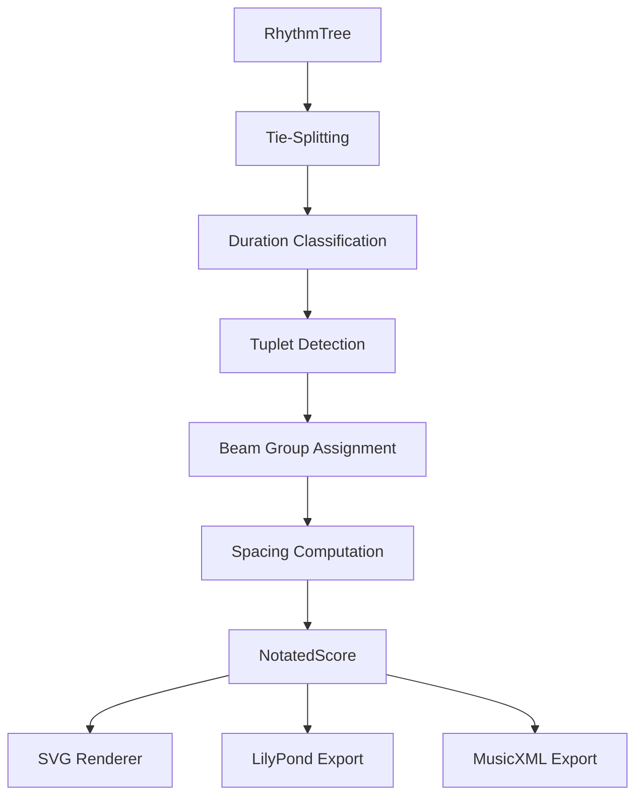

# Klotho Notation Pipeline: Technical Specification

## Document Purpose

This document is a complete technical specification for implementing two major features in the Klotho Python library: **grace notes** in the RhythmTree system and a **notation/engraving pipeline** capable of producing conventional Western music notation from RhythmTree and TemporalUnit objects. It is written for an AI coding assistant (Cursor) that has full access to both the Klotho source code and a local clone of the OpenMusic source code at `https://github.com/openmusic-project/openmusic.git`.

The document assumes familiarity with Klotho's existing codebase, particularly the `RhythmTree`, `Meas`, `TemporalUnit`, `Tree`, and `Group` classes. It does not propose Python code directly — it specifies algorithms, data structures, architectural decisions, and references to OpenMusic source files that should guide implementation.

---

## Table of Contents

1. [Grace Notes in the RhythmTree](#1-grace-notes-in-the-rhythmtree)
2. [Tie-Splitting: Duration Correction for Engraving](#2-tie-splitting-duration-correction-for-engraving)
3. [The Notation Pipeline: Architecture](#3-the-notation-pipeline-architecture)
4. [Duration Classification](#4-duration-classification)
5. [Tuplet Detection and Context Resolution](#5-tuplet-detection-and-context-resolution)
6. [Beam Group Assignment](#6-beam-group-assignment)
7. [Spacing Algorithms: Three Modes](#7-spacing-algorithms-three-modes)
8. [Rendering Backend: SVG with SMuFL](#8-rendering-backend-svg-with-smufl)
9. [OpenMusic Source File Reference](#9-openmusic-source-file-reference)
10. [Implementation Order and Dependencies](#10-implementation-order-and-dependencies)

---

## 1. Grace Notes in the RhythmTree

### 1.1 Overview

Grace notes are notes with zero formal duration that borrow performance time from an adjacent "anchor" note. In the RhythmTree formalism, they are represented by a leaf value of `0` in the subdivisions tuple. This convention was introduced in OM# (the successor to OpenMusic 6) by Jean Bresson and the IRCAM Music Representations team. In OM6, grace notes were not part of the RT data structure at all — they were attached to chord objects externally after tree parsing. The OM# formalism is more elegant and is what Klotho should adopt.

### 1.2 Formal Semantics

A `0` may appear **only as a leaf** in the subdivisions (the S part of a `(D, S)` pair). A D value of `0` is invalid and must remain rejected, because D is the proportional weight of a group node and appears in the denominator of the stretch factor equation `stretch × D / Σ|subdivisions|`. A D of zero would cause division by zero.

When computing the sum of absolute proportions for a group, the zero contributes nothing:

```
S = (1, 0, 1, 1)
Σ|S| = |1| + |0| + |1| + |1| = 3
```

Each non-zero leaf gets its expected share of the parent duration. The zero-valued leaf gets `0/3 × parent_dur = 0`. The grace note does not steal time from its siblings at the RT evaluation level. The proportional durations of the non-zero leaves are computed as though the zero were absent.

The grace note's `metric_onset` equals the `metric_onset` of the next non-zero sibling (the "anchor" note). Both share the same temporal position in the formal representation. The grace note's `metric_duration` is exactly `Fraction(0)`.

### 1.3 Anchor Resolution

The relationship between a grace note and its anchor is determined by position within the S list:

**Before-grace (appoggiatura-type):** A `0` that precedes a non-zero sibling. This is the common case. Example: `(0, 1, 1, 1)` — the grace note precedes the first sounding note.

**After-grace:** A `0` that follows all non-zero siblings with no non-zero sibling after it. Example: `(1, 1, 1, 0)` — the grace note follows the last sounding note.

**Consecutive grace notes:** Multiple `0`s in sequence share the same anchor. Example: `(0, 0, 0, 1, 1)` — three grace notes all anchor to the first sounding note.

**Degenerate case:** A group containing only `0` values, e.g., `(0, 0, 0)`. This has no anchor and no total duration. Klotho should reject this as invalid during validation.

### 1.4 Changes Required in Klotho's RhythmTree

The following modifications are needed in `klotho/chronos/rhythm_trees/rhythm_tree.py`:

**1.4.1 Validation (`_validate_s_form`):** Currently rejects zero with `if s == 0: raise ValueError(...)`. This check must be relaxed to allow zero as a leaf value, while still requiring that at least one non-zero value exists in each S tuple. The validation rule becomes: "Each S tuple must contain at least one non-zero leaf (directly or within nested subgroups)."

**1.4.2 Evaluation (`_evaluate` / `_process_child`):** The critical code path is:

```python
ratio = Fraction(s, div) * parent_ratio
```

When `s = 0`, `Fraction(0, div)` produces `Fraction(0)`, which is mathematically correct. The `metric_duration` of the grace note should be set to `Fraction(0)`. The `metric_onset` should equal the current value of `leaf_onset_acc` (which is the same onset as the next note, since no time has elapsed). The accumulator `leaf_onset_acc` must NOT be advanced after processing a grace note.

Additionally, the node should be annotated with a `'grace': True` flag in the graph data so that downstream consumers can identify grace notes without checking for zero duration.

**1.4.3 The `div` computation:** In the existing `_process_subtree`, the divisor `div` is computed as:

```python
div = int(sum(abs(self[c].get('proportion', 1)) * ... for c in children))
```

When a child has proportion `0`, `abs(0)` is `0`, so the sum is unaffected. This is correct behavior — no change needed here.

**1.4.4 Rest interaction:** A negative zero (`-0`) in Python is `0` (since `int(-0) == 0`). Grace notes cannot be rests — a grace rest is musically meaningless. If a grace note needs to be "silent," it should simply be omitted from the tree. The validation should ensure that `0` is treated as a sounding event, never as a rest.

**1.4.5 Tie interaction:** A float `0.0` would mean "a tied grace note," which is also meaningless. The validation should reject `0.0` as a leaf value. Only integer `0` is valid for grace notes.

### 1.5 Changes Required in TemporalUnit

In `klotho/chronos/temporal_units/temporal.py`:

**1.5.1 Timing cache (`_compute_timing_cache`):** Grace notes with `metric_duration = 0` will produce `real_duration = 0` when passed through `beat_duration()`. This is correct for the formal representation. The `Chronon` object for a grace note will report `duration = 0` and `start = <anchor_onset>`.

**1.5.2 Playback borrowing (new functionality):** A separate function (not a modification to `_compute_timing_cache`) should compute playback-adjusted timings. This function takes the list of leaf events and a `grace_dur` parameter (a small duration in seconds, e.g., 0.08) and returns adjusted onsets and durations:

```
FUNCTION compute_playback_times(leaves, grace_dur=0.08):
    result = copy of leaves with playback_onset and playback_duration fields
    
    i = 0
    WHILE i < len(leaves):
        # Collect consecutive grace notes
        grace_cluster = []
        WHILE i < len(leaves) AND leaves[i].metric_duration == 0:
            grace_cluster.append(leaves[i])
            i += 1
        
        IF grace_cluster is not empty AND i < len(leaves):
            # Before-grace: borrow from the anchor (the next non-zero note)
            anchor = leaves[i]
            total_borrow = len(grace_cluster) * grace_dur
            
            # Clamp: never borrow more than half the anchor's duration
            total_borrow = min(total_borrow, abs(anchor.real_duration) * 0.5)
            per_grace = total_borrow / len(grace_cluster)
            
            FOR j, grace IN enumerate(grace_cluster):
                grace.playback_onset = anchor.real_onset - (len(grace_cluster) - j) * per_grace
                grace.playback_duration = per_grace
            
            anchor.playback_onset = anchor.real_onset
            anchor.playback_duration = anchor.real_duration - total_borrow
            i += 1
        
        ELSE IF grace_cluster is not empty AND i >= len(leaves):
            # After-grace: borrow from the previous non-zero note
            # Walk backward to find the last non-grace note
            prev_idx = find_last_non_grace(result, len(leaves) - len(grace_cluster) - 1)
            IF prev_idx is not None:
                prev = result[prev_idx]
                total_borrow = len(grace_cluster) * grace_dur
                total_borrow = min(total_borrow, abs(prev.playback_duration) * 0.5)
                per_grace = total_borrow / len(grace_cluster)
                
                prev.playback_duration -= total_borrow
                base_onset = prev.playback_onset + prev.playback_duration
                
                FOR j, grace IN enumerate(grace_cluster):
                    grace.playback_onset = base_onset + j * per_grace
                    grace.playback_duration = per_grace
        
        ELSE:
            # Normal non-grace note
            leaves[i].playback_onset = leaves[i].real_onset
            leaves[i].playback_duration = leaves[i].real_duration
            i += 1
    
    RETURN result
```

This should be a standalone function in something like `klotho/chronos/rhythm_trees/algorithms.py` or a new `klotho/chronos/notation/` module, not a method on `TemporalUnit`. It consumes Chronon-like objects and returns modified copies.

### 1.6 Nested Grace Notes

A grace note can appear inside a subdivided group:

```
((2, (0, 1, 1)), (1, (1, 1)))
```

Here the `0` is inside the first subgroup. The algorithm handles this naturally because the recursive `_evaluate` processes each group independently. The `0` in the first subgroup gets `metric_duration = 0` and `metric_onset` equal to the first sounding note in that subgroup. The second subgroup is unaffected.

The playback borrowing algorithm operates on the flattened leaf sequence, so nested grace notes are treated identically to top-level ones — the algorithm doesn't need to know about nesting depth.

### 1.7 OM# Source Reference

The OM# grace note implementation is in the `cac-t-u-s/om-sharp` repository (NOT the `openmusic-project/openmusic` repository, which is OM6 and does not support grace notes in the RT). Key files:

- `src/packages/score/score-objects/voice.lisp` — Voice initialization that handles `0` in the tree
- `src/packages/score/score-objects/chord-seq.lisp` — Grace note playback timing

In the OM6 repository that you have cloned (`openmusic-project/openmusic`), grace notes are handled externally to the RT. You will find grace note rendering in the graphical editor code but NOT in the RT parsing code. The RT parser in OM6 (`OPENMUSIC/code/projects/musicproject/functions/trees.lisp`) does not accept `0` values.

---

## 2. Tie-Splitting: Duration Correction for Engraving

### 2.1 The Problem

Not every rational duration produced by an RT can be written as a single note in conventional notation. A note can only be engraved if its duration is a power-of-two fraction of the whole note (possibly dotted). The set of engravable single-note durations is:

```
Base:   1, 1/2, 1/4, 1/8, 1/16, 1/32, 1/64, 1/128
Dotted: 3/2, 3/4, 3/8, 3/16, 3/32, 3/64, 3/128
        (base × 3/2 for single dot)
Double-dotted: 7/4, 7/8, 7/16, 7/32, 7/64, 7/128
        (base × 7/4 for double dot)
```

Any duration not in this set must be split into multiple tied notes. For example, a duration of `5/8` (five eighth notes) cannot be a single note — it must become a tied pair such as `1/2 + 1/8` (half note tied to an eighth note), or `1/4 + 3/8` (quarter tied to dotted quarter), etc.

Additionally, even when a duration IS engravable as a single note, it may need to be split if it **crosses a beat boundary**. In 4/4 time, a half note starting on beat 2 technically fits within the measure, but conventional engraving often requires it to be written as two tied quarter notes (quarter on beat 2 + quarter on beat 3) to preserve the visual midpoint of the bar. The rules for this vary by style and are partially configurable.

### 2.2 The Algorithm: Greedy Power-of-Two Decomposition

The core algorithm decomposes a rational duration into a minimal sequence of engravable durations:

```
FUNCTION split_duration(dur: Fraction) -> list[Fraction]:
    # dur is a positive Fraction representing a note duration in whole notes
    
    result = []
    remaining = dur
    
    WHILE remaining > 0:
        # Try double-dotted: base × 7/4
        FOR base IN [1, 1/2, 1/4, 1/8, 1/16, 1/32, 1/64, 1/128]:
            dd = base * Fraction(7, 4)
            IF dd <= remaining AND dd > 0:
                candidate_dd = dd
                BREAK
        
        # Try single-dotted: base × 3/2
        FOR base IN [1, 1/2, 1/4, 1/8, 1/16, 1/32, 1/64, 1/128]:
            d = base * Fraction(3, 2)
            IF d <= remaining AND d > 0:
                candidate_d = d
                BREAK
        
        # Try undotted: base
        FOR base IN [1, 1/2, 1/4, 1/8, 1/16, 1/32, 1/64, 1/128]:
            IF base <= remaining:
                candidate_base = base
                BREAK
        
        # Choose the largest engravable duration that fits
        best = max(candidate_dd, candidate_d, candidate_base)
        result.append(best)
        remaining -= best
    
    RETURN result
```

However, this simple greedy approach doesn't account for beat boundaries. The full algorithm needs additional context.

### 2.3 Beat-Boundary Aware Splitting

This is where things get interesting. The algorithm needs to know the metric position of each note within its measure. Given a time signature and a note's onset within the measure, the algorithm determines which beat boundaries the note's duration crosses and splits accordingly.

The beat structure depends on the time signature. In 4/4 time, the primary boundary is the half-bar (beat 3, at onset 1/2 of the measure). A note that starts before beat 3 and ends after beat 3 must be split at beat 3. Secondary boundaries are the quarter-note beats. In 6/8 time, the primary boundary is between the two dotted-quarter groups (at onset 3/8 of the measure).

```
FUNCTION split_at_boundaries(dur: Fraction, onset: Fraction, time_sig: Meas) -> list[Fraction]:
    boundaries = compute_beat_boundaries(time_sig)
    # boundaries is a sorted list of Fraction positions within the measure
    # e.g., for 4/4: [1/4, 1/2, 3/4] (quarter-note beats)
    # The half-bar boundary 1/2 is "primary" in 4/4
    
    note_end = onset + dur
    segments = []
    current_start = onset
    
    FOR boundary IN boundaries:
        IF current_start < boundary < note_end:
            # This note crosses this boundary — split here
            segment_dur = boundary - current_start
            segments.append(segment_dur)
            current_start = boundary
    
    # Final segment
    segments.append(note_end - current_start)
    
    # Now each segment is within a single beat span, but may still
    # need further splitting if it's not an engravable duration
    result = []
    FOR seg IN segments:
        result.extend(split_duration(seg))
    
    RETURN result
```

### 2.4 Where This Fits in the Pipeline

Tie-splitting is a **pre-notation transformation**. It takes an RT (or the flat duration/onset sequence from an RT) and produces a modified sequence where each leaf duration is engravable. The original tree structure is preserved for beaming and tuplet detection — the splitting only affects leaf durations and may introduce additional leaves (the tied continuations).

The output is not a new RhythmTree (that would destroy the group structure). Instead, it's an annotation layer: each original leaf maps to one or more "engraving segments," where all segments after the first are marked as tied.

```
STRUCTURE EngravingLeaf:
    original_node_id: int          # Reference back to the RT node
    duration: Fraction              # Engravable duration
    onset: Fraction                 # Metric onset
    is_continuation_tie: bool       # True if this is a tied continuation of the previous segment
    note_type: NoteType             # whole, half, quarter, eighth, etc.
    dots: int                       # 0, 1, or 2
    is_rest: bool
    is_grace: bool
```

### 2.5 Tuplet Context and Tie-Splitting

Inside a tuplet, the effective durations are not simple power-of-two fractions. A quarter-note triplet has a leaf duration of `1/6` (one-third of a half note), which is NOT an engravable duration in isolation. However, within the tuplet context, the note IS written as a quarter note — the tuplet bracket redefines what "quarter note" means locally. The tuplet ratio `3:2` tells the reader "these three quarter notes occupy the time of two."

This means tie-splitting must be **tuplet-aware**. Inside a tuplet group, the "engravable" durations are the standard set divided by the tuplet ratio. A 3:2 quarter-note triplet has "engravable" durations of `{1/6, 1/12, 1/24, ...}` — the standard set scaled by `2/3`. Tie-splitting within a tuplet group should use these scaled values.

Practically, this means: when processing leaves inside a tuplet group, first determine the tuplet's scaling factor (the ratio `normal/actual`, e.g., `2/3` for a 3:2 tuplet), then apply the standard splitting algorithm using scaled engravable durations, then notate the resulting durations as if they were the unscaled values (because the tuplet bracket handles the scaling visually).

### 2.6 OM Source Reference

The tie-splitting logic in OpenMusic is distributed across several files:

- `OPENMUSIC/code/projects/musicproject/functions/trees.lisp` — `reducetree` function performs tree simplification including tie normalization
- `OPENMUSIC/code/projects/musicproject/functions/true-durations.lisp` — Computes "true" (sounding) durations from a tree, resolving ties
- `OPENMUSIC/code/projects/musicproject/container/scoreobject.lisp` — The `Qvalue`/`extent` mechanism inherently represents only engravable durations (Qvalue is always a power of 2)

The key insight from OM is that the `Qvalue` system sidesteps much of the tie-splitting problem by construction: since Qvalue is always a power of 2, and extent is an integer, every `extent/Qvalue` ratio is already a multiple of a power-of-two base. The splitting arises only when converting from proportional durations (which can be arbitrary rationals) to the Qvalue system. Klotho uses `Fraction` directly, so the splitting must be explicit.

---

## 3. The Notation Pipeline: Architecture

### 3.1 Architectural Overview

Klotho follows a "lean functional" philosophy. The notation pipeline should be a set of functions, not a class hierarchy. The core function accepts a `RhythmTree` (or `TemporalUnit`) and returns a `NotatedScore` data structure containing all information needed for rendering.



### 3.2 Data Flow

The pipeline transforms an RT through a sequence of annotation passes. Each pass adds information without modifying the original RT:

**Pass 1 — Tie-Splitting:** Input: RT leaf durations and onsets. Output: a list of `EngravingLeaf` objects where each original leaf may have been split into tied segments.

**Pass 2 — Duration Classification:** Input: `EngravingLeaf` list with durations. Output: each leaf annotated with `note_type` (whole, half, quarter, eighth, 16th, 32nd, 64th, 128th) and `dots` (0, 1, 2).

**Pass 3 — Tuplet Detection:** Input: RT tree structure. Output: each internal node annotated with an optional `TupletContext` (actual count, normal count, note type inside bracket).

**Pass 4 — Beam Group Assignment:** Input: RT tree structure + classified durations. Output: each leaf annotated with `beam_level` (0 = no beam, 1 = eighth, 2 = sixteenth, etc.) and a `beam_group_id` linking it to its parent group node.

**Pass 5 — Spacing:** Input: all annotations from previous passes + a spacing mode parameter. Output: each leaf annotated with an `x_position` in abstract units.

**Pass 6 — Vertical Layout:** Input: pitch data (if available) + staff configuration. Output: each leaf annotated with a `y_position`.

### 3.3 The NotatedScore Data Structure

The output of the pipeline is a flat list of notation elements plus hierarchical metadata. The design should be a simple dataclass or named tuple:

```
STRUCTURE NotatedMeasure:
    time_signature: Meas
    elements: list[NotatedElement]
    tuplet_brackets: list[TupletBracket]
    beam_groups: list[BeamGroup]
    barline_x: float

STRUCTURE NotatedElement:
    x: float                        # Horizontal position in abstract units
    y: float                        # Vertical position (staff line offset)
    note_type: NoteType             # whole, half, quarter, eighth, ...
    dots: int                       # 0, 1, 2
    is_rest: bool
    is_grace: bool
    is_tied_to_next: bool           # Visual tie to the following element
    is_continuation_tie: bool       # This element is the "back half" of a tie
    stem_direction: up | down
    beam_level: int                 # 0 = no beam
    beam_group_id: int              # ID of the enclosing beam group
    original_node_id: int           # Back-reference to the RT node
    pitch: optional[int]            # Midicents if available, else None

STRUCTURE TupletBracket:
    actual: int                     # e.g., 3 in "3:2"
    normal: int                     # e.g., 2 in "3:2"
    x_start: float
    x_end: float
    y: float                        # Position above/below the staff
    group_node_id: int              # RT node that generated this tuplet

STRUCTURE BeamGroup:
    elements: list[int]             # Indices into the elements list
    max_beam_level: int
    group_node_id: int              # RT node that defines this group
```

### 3.4 The Top-Level Function Signature

```
FUNCTION notate(
    source: RhythmTree | TemporalUnit,
    spacing_mode: 'proportional' | 'traditional' | 'hybrid' = 'hybrid',
    beat_boundary_splits: bool = True,
    max_dots: int = 2,
    staff_config: StaffConfig = default_treble,
    pitches: optional[list[int]] = None
) -> NotatedScore
```

This function orchestrates all passes and returns the complete notation data structure.

---

## 4. Duration Classification

### 4.1 The Engravable Duration Table

Standard Western notation uses durations that are powers of two, optionally extended by dots:

| Note Type | Base Duration (in whole notes) | Dotted (×3/2) | Double-dotted (×7/4) |
|-----------|-------------------------------|---------------|---------------------|
| whole     | 1/1                           | 3/2           | 7/4                 |
| half      | 1/2                           | 3/4           | 7/8                 |
| quarter   | 1/4                           | 3/8           | 7/16                |
| eighth    | 1/8                           | 3/16          | 7/32                |
| 16th      | 1/16                          | 3/32          | 7/64                |
| 32nd      | 1/32                          | 3/64          | 7/128               |
| 64th      | 1/64                          | 3/128         | 7/256               |
| 128th     | 1/128                         | 3/256         | 7/512               |

### 4.2 Classification Algorithm

```
FUNCTION classify_duration(dur: Fraction, max_dots: int = 2) -> (NoteType, int) | None:
    # dur must be positive
    dur = abs(dur)
    
    bases = [
        (NoteType.WHOLE,   Fraction(1, 1)),
        (NoteType.HALF,    Fraction(1, 2)),
        (NoteType.QUARTER, Fraction(1, 4)),
        (NoteType.EIGHTH,  Fraction(1, 8)),
        (NoteType.N16TH,   Fraction(1, 16)),
        (NoteType.N32ND,   Fraction(1, 32)),
        (NoteType.N64TH,   Fraction(1, 64)),
        (NoteType.N128TH,  Fraction(1, 128)),
    ]
    
    dot_multipliers = [
        (0, Fraction(1, 1)),     # no dot
        (1, Fraction(3, 2)),     # single dot
        (2, Fraction(7, 4)),     # double dot
    ]
    
    FOR (note_type, base) IN bases:
        FOR (n_dots, multiplier) IN dot_multipliers:
            IF n_dots > max_dots:
                CONTINUE
            IF dur == base * multiplier:
                RETURN (note_type, n_dots)
    
    RETURN None  # Not directly engravable; needs tie-splitting or tuplet context
```

### 4.3 Tuplet-Contextual Classification

When a leaf is inside a tuplet group, the classification must account for the tuplet's scaling. A leaf with `metric_duration = 1/6` inside a 3:2 tuplet on the half-note level should classify as `(QUARTER, 0)` — because within the tuplet, each leaf notionally represents a quarter note (the tuplet bracket tells the reader these three quarters fill the time of two).

The tuplet scaling factor is `normal / actual`. For a 3:2 tuplet, this is `2/3`. The leaf's "notated duration" is its `metric_duration` divided by this scaling factor:

```
notated_dur = metric_duration / (normal / actual) = metric_duration * actual / normal
```

For `metric_duration = 1/6` in a 3:2 tuplet: `notated_dur = (1/6) * (3/2) = 1/4`, which is a quarter note. The classification function receives this adjusted duration.

However, the scaling factor must be computed carefully for nested tuplets. If a leaf is inside a 3:2 tuplet that is itself inside a 5:4 tuplet, the total scaling factor is the product of all ancestor tuplet factors:

```
total_scale = product of (normal_i / actual_i) for each ancestor tuplet group
notated_dur = metric_duration / total_scale
```

---

## 5. Tuplet Detection and Context Resolution

### 5.1 The Algorithm

For each internal (non-leaf) node in the RT, determine whether it creates a tuplet context:

```
FUNCTION detect_tuplet(node_id, rt: RhythmTree) -> TupletContext | None:
    children = rt.successors(node_id)
    N = len(children)
    
    IF N <= 1:
        RETURN None  # No subdivision, no tuplet
    
    # Find the largest power of 2 ≤ N
    M = 1
    WHILE M * 2 <= N:
        M = M * 2
    
    IF N == M:
        RETURN None  # Binary subdivision, no tuplet
    
    RETURN TupletContext(actual=N, normal=M)
```

### 5.2 Tuplet Ratio Semantics: N:M

The tuplet ratio `N:M` means "N notes in the time normally occupied by M notes of the same type." The note type inside the bracket is determined by what M subdivisions of the parent duration would be.

Example: parent duration is a half note (1/2). M = 2 means two subdivisions of a half note, which are quarter notes. So a 3:2 tuplet on a half note contains three notes written as quarter notes. A 5:4 tuplet on a half note contains five notes written as eighth notes (because 4 subdivisions of a half note are eighth notes).

The note type determination:

```
FUNCTION tuplet_inner_note_type(parent_dur: Fraction, M: int) -> NoteType:
    inner_dur = parent_dur / M
    result = classify_duration(inner_dur)
    IF result is not None:
        RETURN result.note_type
    # If inner_dur isn't engravable, it means we have a nested tuplet situation
    # The inner type defaults to the closest power-of-two subdivision
    RETURN classify_duration(nearest_power_of_2(inner_dur)).note_type
```

### 5.3 Why 5:4 ≠ 10:8

As discussed in the conversation, these are NOT equivalent notations even though they can produce the same durations. The tree structure determines which one appears:

- A flat 10-child group → 10:8 bracket, notes written as the M=8 subdivision type
- A 5-child group where each child is subdivided into 2 → 5:4 bracket with each "note" split into two sub-notes

The RT tree encodes this distinction explicitly. A `(D, (1,1,1,1,1,1,1,1,1,1))` is 10:8. A `(D, ((1,(1,1)), (1,(1,1)), (1,(1,1)), (1,(1,1)), (1,(1,1))))` is 5:4 with internal subdivisions.

Klotho's tree structure preserves this distinction already. The tuplet detection algorithm operates per-node, so nested groups produce nested tuplets automatically.

### 5.4 Special Case: N = 6

Six children give 6:4 (since the largest power of 2 ≤ 6 is 4). This is technically correct but musically unusual. Composers typically write this as either two 3:2 groups or as compound meter (6/8-type). OM's `reducetree` can optionally factor 6:4 into 2×3:2, but the base algorithm does not do this automatically.

For Klotho, the recommendation is to implement the base algorithm faithfully (6:4 when the tree says 6 children), and provide optional tree restructuring functions that can factor flat groups into nested ones. These would live in `klotho/chronos/rhythm_trees/algorithms.py` as pure tree-to-tree transformations.

---

## 6. Beam Group Assignment

### 6.1 The Principle

In OM, **the RT tree structure directly determines beaming groups**. Each internal node in the RT defines a beaming group for its leaf descendants. Notes within the same group are beamed together; notes in different groups are not beamed across the group boundary.

This is one of the most elegant aspects of the RT formalism: the composer's grouping intent is encoded in the tree structure itself.

### 6.2 The Algorithm

```
FUNCTION assign_beams(rt: RhythmTree) -> dict[int, BeamInfo]:
    beam_info = {}
    
    FUNCTION process_group(node_id, depth):
        children = rt.successors(node_id)
        IF len(children) == 0:
            # Leaf node
            dur = abs(rt[node_id]['metric_duration'])
            note_type = classify_duration(dur)  # accounting for tuplet context
            beam_level = beam_count_for_type(note_type.note_type) IF note_type ELSE 0
            beam_info[node_id] = BeamInfo(
                beam_level=beam_level,
                beam_group_id=rt.parent(node_id),  # The parent group defines the beaming
                is_first_in_group=(node_id == children_of_parent[0]),
                is_last_in_group=(node_id == children_of_parent[-1])
            )
        ELSE:
            FOR child IN children:
                process_group(child, depth + 1)
    
    process_group(rt.root, 0)
    RETURN beam_info


FUNCTION beam_count_for_type(note_type: NoteType) -> int:
    # Beam count = how many beams/flags a note of this type gets
    MATCH note_type:
        CASE WHOLE | HALF | QUARTER:  RETURN 0
        CASE EIGHTH:                  RETURN 1
        CASE N16TH:                   RETURN 2
        CASE N32ND:                   RETURN 3
        CASE N64TH:                   RETURN 4
        CASE N128TH:                  RETURN 5
```

### 6.3 Broken Secondary Beams

When notes within a beam group have different beam levels (e.g., an eighth note followed by a sixteenth note), the secondary beam (the one that only the sixteenth has) is "broken" — it appears as a short stub rather than connecting to the adjacent note. The rule is:

- Primary beams (level 1) connect all notes in the group
- Secondary beams (level 2+) connect only between adjacent notes that both have at least that beam level
- If a note has more beams than its neighbor, the excess beams appear as stubs extending toward the nearest note with matching beam level

This is purely a rendering concern and doesn't affect the beam assignment algorithm.

### 6.4 Rests and Beaming

Rests within a beam group break the beam. If a group contains `(note, rest, note)`, the beam does not cross the rest. Each sub-segment of consecutive non-rest notes within the group gets its own beam. Grace notes (duration 0) are beamed with their anchor note.

---

## 7. Spacing Algorithms: Three Modes

### 7.1 Mode 1: Proportional Spacing

The simplest mode. Every note's horizontal position is directly proportional to its temporal position within the measure.

```
FUNCTION proportional_spacing(elements: list[NotatedElement], scale: float = 400.0):
    FOR elem IN elements:
        elem.x = float(elem.onset) * scale
```

The `scale` parameter controls how many abstract units one whole note occupies. With `scale = 400`, a whole note measure is 400 units wide, a half note occupies 200, a quarter 100, etc.

This mode is useful for contemporary music, electroacoustic scores, and any situation where the visual time-space relationship should be preserved. It produces uneven spacing for music with mixed note values — fast passages are cramped and slow passages are spread out.

### 7.2 Mode 2: Traditional (Rhythmic) Spacing

This mode follows conventional engraving rules where spacing is based on note values but not linearly proportional. The relationship between duration and space is approximately logarithmic.

The standard heuristic (derived from Elaine Gould's "Behind Bars" and the Finale/LilyPond spacing models) is:

```
FUNCTION traditional_spacing(elements: list[NotatedElement], base_width: float = 40.0):
    x = 0
    FOR i, elem IN enumerate(elements):
        elem.x = x
        
        # Space after this note depends on its duration
        dur_ratio = float(abs(elem.duration))  # as fraction of whole note
        
        IF dur_ratio > 0:
            # Logarithmic spacing: space = base_width × (1 + log2(dur_ratio / min_dur))
            # where min_dur is the smallest note value in the score
            space = base_width * (1.0 + max(0, log2(dur_ratio / min_duration_in_score)))
        ELSE:
            # Grace note — minimal space
            space = base_width * 0.3
        
        # Apply minimum spacing based on what's drawn:
        min_space = compute_min_space(elem)  # accounts for noteheads, accidentals, dots
        space = max(space, min_space)
        
        x += space

FUNCTION compute_min_space(elem: NotatedElement) -> float:
    base = NOTEHEAD_WIDTH  # ~12 units for a standard notehead
    IF elem.dots > 0:
        base += DOT_WIDTH * elem.dots  # ~6 units per dot
    IF elem.has_accidental:
        base += ACCIDENTAL_WIDTH  # ~10 units
    RETURN base + INTER_NOTE_PADDING  # ~4 units padding
```

### 7.3 Mode 3: Hybrid (Pseudo-Proportional) Spacing

This is OM's default behavior and the recommended default for Klotho. The base spacing is proportional, but a second pass enforces minimum distances to prevent collisions.

```
FUNCTION hybrid_spacing(
    elements: list[NotatedElement], 
    scale: float = 400.0,
    min_spacing_factor: float = 1.0
):
    # First pass: proportional placement
    FOR elem IN elements:
        elem.x = float(elem.onset) * scale
    
    # Second pass: enforce minimum distances (left-to-right sweep)
    FOR i IN range(1, len(elements)):
        min_x = elements[i-1].x + compute_min_space(elements[i-1]) * min_spacing_factor
        IF elements[i].x < min_x:
            elements[i].x = min_x
    
    # Optional third pass: distribute excess space
    # If the total width exceeds the expected proportional width,
    # compress by scaling all positions proportionally.
    # If total width is less, no adjustment needed (the proportional
    # base already gave enough room).
    total_width = elements[-1].x + compute_min_space(elements[-1])
    expected_width = scale  # one whole note's worth
    IF total_width > expected_width * 1.2:  # significant overflow
        compression = expected_width / total_width
        FOR elem IN elements:
            elem.x *= compression
```

### 7.4 Polyphonic Spacing (TemporalBlock)

When multiple voices are stacked vertically (as in a `TemporalBlock`), coincident onsets across voices must align vertically. The algorithm:

1. Collect all unique onset times across all voices
2. For each onset time, find the widest spacing requirement among all voices at that onset
3. Use that widest requirement as the spacing for all voices at that onset

```
FUNCTION polyphonic_spacing(voices: list[list[NotatedElement]], mode: str):
    # Step 1: Collect all unique onsets
    all_onsets = sorted(set(elem.onset for voice in voices for elem in voice))
    
    # Step 2: For each onset, compute the needed space
    onset_space = {}
    FOR onset IN all_onsets:
        max_space = 0
        FOR voice IN voices:
            elems_at_onset = [e for e in voice if e.onset == onset]
            FOR elem IN elems_at_onset:
                max_space = max(max_space, compute_min_space(elem))
        onset_space[onset] = max_space
    
    # Step 3: Assign x positions based on accumulated spaces
    x = 0
    onset_x = {}
    prev_onset = None
    FOR onset IN all_onsets:
        IF prev_onset is not None:
            IF mode == 'proportional':
                x += float(onset - prev_onset) * scale
            ELIF mode == 'traditional':
                x += onset_space[prev_onset]
            ELIF mode == 'hybrid':
                prop_x = float(onset - prev_onset) * scale
                x += max(prop_x, onset_space[prev_onset])
        onset_x[onset] = x
        prev_onset = onset
    
    # Step 4: Apply to all voices
    FOR voice IN voices:
        FOR elem IN voice:
            elem.x = onset_x[elem.onset]
```

---

## 8. Rendering Backend: SVG with SMuFL

### 8.1 Font Choice

The notation pipeline should target **SMuFL** (Standard Music Font Layout) compliant fonts. SMuFL defines a standardized mapping of music notation glyphs to Unicode code points in the Private Use Area (U+E000–U+F8FF). The reference font is **Bravura**, available under the SIL Open Font License from `https://github.com/steinbergmedia/bravura`.

Other SMuFL-compliant fonts include Petaluma (handwritten style), Leland (MuseScore's default), and Sebastian (LilyPond-inspired). Any of these can be used interchangeably since they share the same code point mappings.

Key SMuFL code points for notation:

| Glyph | Code Point | Description |
|-------|-----------|-------------|
| U+E0A4 | 𝅘𝅥 | Quarter notehead (filled) |
| U+E0A3 | 𝅗𝅥 | Half notehead (open) |
| U+E0A2 | 𝅝 | Whole notehead (open, wider) |
| U+E1D5 | | Augmentation dot |
| U+E4E0–E4FF | | Rest glyphs (whole through 128th) |
| U+E050 | 𝄞 | G clef |
| U+E062 | 𝄢 | F clef |
| U+E080–E08F | | Time signature digits |
| U+E240 | ♮ | Natural accidental |
| U+E260 | ♭ | Flat accidental |
| U+E262 | ♯ | Sharp accidental |

The complete SMuFL specification is at `https://w3c.github.io/smufl/latest/`. The metadata file `bravura_metadata.json` (distributed with Bravura) contains precise glyph metrics (bounding boxes, anchors, stem attachment points) that the renderer needs.

### 8.2 SVG Output Structure

Each notated measure produces an SVG group (`<g>` element) containing:

- Staff lines: 5 horizontal `<line>` elements
- Barlines: Vertical `<line>` elements at measure boundaries
- Clef: A `<text>` element using the SMuFL code point, positioned at the start of the first measure
- Time signature: `<text>` elements for numerator and denominator
- Notes/rests: `<text>` elements for noteheads/rest glyphs + `<line>` elements for stems + `<rect>` or `<polygon>` elements for beams + `<path>` elements for ties/slurs
- Tuplet brackets: `<line>` + `<text>` elements
- Ledger lines: Short `<line>` elements above/below the staff

### 8.3 What Klotho Should NOT Do

The Klotho notation pipeline should NOT attempt to be a complete engraving system. It should produce SVG output sufficient for proof-reading, score inspection, and visual feedback during composition. It should NOT try to compete with LilyPond, Verovio, or professional engraving tools. Complex layout problems like multi-page scores, automatic page breaks, complex multi-voice collision avoidance, and text underlay are out of scope.

The pipeline SHOULD produce clean, correct, readable notation for single-line rhythmic structures (the primary use case for RhythmTree visualization), with optional pitch data. Multi-staff rendering via TemporalBlock is a stretch goal.

### 8.4 Export Pathways

In addition to SVG, the `NotatedScore` data structure can be serialized to:

**LilyPond:** Convert each `NotatedElement` to LilyPond duration syntax (`c'4.` for a dotted quarter C, `r8` for an eighth rest) and each `TupletBracket` to `\tuplet 3/2 { ... }`. This is a straightforward string-building exercise once the notation data is computed. LilyPond handles its own spacing and engraving.

**MusicXML:** Convert to MusicXML's `<note>`, `<duration>`, `<type>`, `<dot/>`, `<time-modification>`, `<tie>`, `<beam>` elements. MusicXML uses absolute `<duration>` values relative to a `<divisions>` setting (divisions per quarter note). The conversion from Klotho's Fraction-based durations to MusicXML's integer divisions is: `mxml_duration = int(metric_duration * divisions * 4)` where `divisions` is chosen as the LCM of all duration denominators in the score.

---

## 9. OpenMusic Source File Reference

The following files in the cloned OpenMusic repository (`openmusic-project/openmusic`) are relevant for understanding the algorithms described in this document. Note that this is the OM6 codebase; grace notes (section 1) are NOT implemented here — for that, see the OM# repository at `cac-t-u-s/om-sharp`.

### 9.1 Core RT Data Structure and Parsing

| File | Contents |
|------|----------|
| `OPENMUSIC/code/projects/musicproject/container/scoreobject.lisp` | `simple-container` and `container` base classes with `Qvalue`, `extent`, `offset`, `QTempo` slots |
| `OPENMUSIC/code/projects/musicproject/container/voice.lisp` | `voice` class — 6 inputs (self, tree, chords, tempo, legato, ties); the `initialize-instance` method is where the RT is parsed into the container hierarchy |
| `OPENMUSIC/code/projects/musicproject/container/measure.lisp` | `measure` class |
| `OPENMUSIC/code/projects/musicproject/container/group.lisp` | `group` class — represents tuplets and beamed groups |
| `OPENMUSIC/code/projects/musicproject/container/chord.lisp` | `chord` class |
| `OPENMUSIC/code/projects/musicproject/container/note.lisp` | `note` class with midic, vel, dur, chan, port, tie slots |

### 9.2 RT Algorithms and Transformations

| File | Contents |
|------|----------|
| `OPENMUSIC/code/projects/musicproject/functions/trees.lisp` | **Primary RT operations**: `reducetree` (simplify/reduce), `tree2ratio` (flatten to ratios), `mktree` (build from proportions), `pulsemaker`, `maketreegroups` |
| `OPENMUSIC/code/projects/musicproject/functions/true-durations.lisp` | `true-durations` — computes sounding durations resolving ties |
| `OPENMUSIC/code/projects/musicproject/functions/quantify.lisp` | `omquantify` — quantize continuous durations into an RT |
| `OPENMUSIC/code/projects/musicproject/functions/conversions.lisp` | Pitch/duration conversion utilities |

### 9.3 Notation Rendering

| File | Contents |
|------|----------|
| `OPENMUSIC/code/projects/musicproject/editor/scoreeditor/` | Directory containing the entire score editor and rendering system |
| Files within `scoreeditor/` prefixed with `grap-` | The parallel graphical object hierarchy: `grap-voice`, `grap-measure`, `grap-group`, `grap-chord`, `grap-note`, `grap-rest` |
| `OPENMUSIC/code/projects/musicproject/editor/scoreeditor/scoretools.lisp` | Score rendering utilities including spacing calculations |

### 9.4 Import/Export

| File | Contents |
|------|----------|
| `OPENMUSIC/code/projects/musicproject/import-export/export-mxml.lisp` | MusicXML export — the `export-musicxml` function; study this for the Qvalue-to-MusicXML-type mapping |
| `OPENMUSIC/code/projects/musicproject/import-export/import-mxml-new.lisp` | MusicXML import (2018 rewrite) |

### 9.5 Font Resources

| Path | Contents |
|------|----------|
| `OPENMUSIC/resources/fonts/omicron.ttf` | Clefs, time signatures, accidentals |
| `OPENMUSIC/resources/fonts/omheads.ttf` | Notehead variants |
| `OPENMUSIC/resources/fonts/omsign.ttf` | Dynamics, ornaments |
| `OPENMUSIC/resources/fonts/omextra.ttf` | Microtonal accidentals |

These fonts are OM6-specific and NOT recommended for Klotho. Use SMuFL/Bravura instead.

---

## 10. Implementation Order and Dependencies

The following order minimizes blocking dependencies and allows incremental testing:

### Phase 1: Grace Notes

1. Modify `_validate_s_form` in `rhythm_tree.py` to accept `0` as a valid leaf value (with the constraint that at least one non-zero leaf exists per group)
2. Verify that `_evaluate` handles `0` correctly (it should already work — test with `Fraction(0, N)`)
3. Add `'grace': True` annotation to zero-duration nodes during `_evaluate`
4. Add test cases for grace note RTs
5. Implement `compute_playback_times` as a standalone function

### Phase 2: Duration Classification and Tie-Splitting

1. Implement the `classify_duration` function
2. Implement `split_duration` (greedy power-of-two decomposition)
3. Implement `compute_beat_boundaries` for common time signatures
4. Implement `split_at_boundaries` (beat-boundary aware splitting)
5. Define the `EngravingLeaf` data structure
6. Implement the tie-splitting pass that converts RT leaf data into `EngravingLeaf` lists

### Phase 3: Tuplet Detection and Beam Assignment

1. Implement `detect_tuplet` per-node function
2. Implement tuplet context propagation (for nested tuplets)
3. Implement `tuplet_inner_note_type` for determining the note type inside brackets
4. Implement `assign_beams` using the RT tree structure
5. Implement `beam_count_for_type`
6. Test with nested tuplet cases (e.g., triplet inside quintuplet)

### Phase 4: Spacing

1. Implement `proportional_spacing`
2. Implement `compute_min_space` (glyph-width estimation)
3. Implement `traditional_spacing` with logarithmic scaling
4. Implement `hybrid_spacing` with minimum-distance enforcement
5. Implement `polyphonic_spacing` for TemporalBlock alignment

### Phase 5: SVG Rendering

1. Set up SMuFL font loading and glyph metrics parsing from `bravura_metadata.json`
2. Implement staff line drawing
3. Implement notehead rendering (filled, open, whole)
4. Implement stem drawing (with direction logic)
5. Implement beam drawing
6. Implement rest glyph rendering
7. Implement tuplet bracket drawing
8. Implement tie/dot rendering
9. Implement barline and time signature rendering
10. Implement clef rendering

### Phase 6: Export (Optional)

1. Implement LilyPond text export from `NotatedScore`
2. Implement MusicXML XML export from `NotatedScore`

---

## Appendix A: The Stretch Factor Equation

The fundamental equation that converts proportional RT values to actual durations:

```
leaf_duration = |proportion| × (parent_duration / Σ|sibling_proportions|)
```

Or equivalently, with a propagating stretch factor:

```
stretch_at_root = measure_duration  (determined by time signature)
stretch_at_group = parent_stretch × D / Σ|children_proportions|
leaf_duration = |proportion| × stretch_at_parent / Σ|sibling_proportions|
```

Klotho's `_evaluate` method computes this as:

```python
ratio = Fraction(s, div) * parent_ratio
```

where `div = Σ|sibling_proportions|` and `parent_ratio` is the parent's metric_duration.

## Appendix B: Engravable Duration Quick Reference

All durations expressible as a single note (with up to 2 dots), as Fraction values:

```
Undotted:       1, 1/2, 1/4, 1/8, 1/16, 1/32, 1/64, 1/128
Single-dotted:  3/2, 3/4, 3/8, 3/16, 3/32, 3/64, 3/128, 3/256
Double-dotted:  7/4, 7/8, 7/16, 7/32, 7/64, 7/128, 7/256, 7/512
```

Any Fraction-valued duration not in this set requires tie-splitting before it can be engraved.

## Appendix C: Tuplet Ratio Quick Reference

| N children | Largest power of 2 ≤ N (M) | Tuplet ratio | Common name |
|-----------|---------------------------|-------------|-------------|
| 2         | 2                         | (none)      | Binary      |
| 3         | 2                         | 3:2         | Triplet     |
| 4         | 4                         | (none)      | Binary      |
| 5         | 4                         | 5:4         | Quintuplet  |
| 6         | 4                         | 6:4         | Sextuplet   |
| 7         | 4                         | 7:4         | Septuplet   |
| 8         | 8                         | (none)      | Binary      |
| 9         | 8                         | 9:8         | —           |
| 10        | 8                         | 10:8        | —           |
| 11        | 8                         | 11:8        | —           |
| 12        | 8                         | 12:8        | —           |
| 13        | 8                         | 13:8        | —           |
| 14        | 8                         | 14:8        | —           |
| 15        | 8                         | 15:8        | —           |
| 16        | 16                        | (none)      | Binary      |
